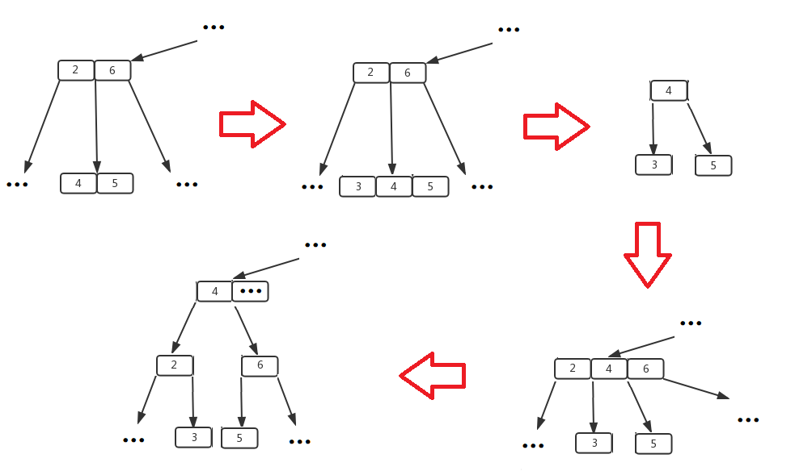
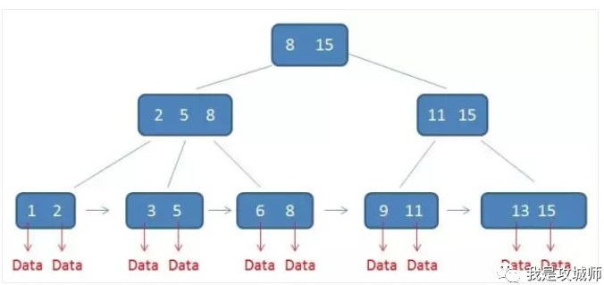

阅读此文章前，最好先了解一下二叉搜索树和AVL树的相关知识：[二叉搜索树及AVL_ZergWang's Blog-CSDN博客](https://blog.csdn.net/Zerg_Wang/article/details/121383939)
 

# B树
## 定义与性质
B数是一种多路平衡搜索树，常用于数据库及文件系统中。B数的阶用于表示树中每个节点最多能拥有多少个子节点。下图展示了一棵4阶B树，意味着每个节点最多可有4个子节点，并存储最多3个元素。m可根据实际需要而调整，但一般m>2。

一棵标准的m阶B树有如下性质（也就是说，如果遵循B树的插入和删除规则，自然就能构造出一个有如下性质的B树）：

1. 如果根节点不是叶节点，那么该根节点至少有两个子节点。

2. 除了根节点和叶节点外，其他节点最少有m/2（向上取整）个子节点（这一性质缓解了各节点的子节点数量不平衡的问题，可以让每个节点的子节点数量不至于太多，从而为后续的插入、删除操作留有余地，避免反复触发平衡操作；也不至于太少，从而降低了树的高度）。

3. 所有的叶节点都在同一层。

4. 若某节点有k（k<=m）个子节点，则该节点从左到右按升序存储k-1个元素（元素不能重复）。对于树中任意节点中的任意元素，该元素左子树中的所有元素均小于当前元素，右子树中所有元素均大于当前元素。若某一子树夹在父节点某两个元素a、b之间，则该子树中所有元素均大于a小于b。

## 遍历
B树的遍历与AVL树一样，从最左侧子节点开始，从左到右依次递归，元素按访问顺序排列会得到一个升序序列。
## 查找
B树的查找与AVL树略有不同。由于B树每个节点按顺序存有多个元素，因此在遍历查找的过程中，在每个节点处需要进行二分查找，如果在当前节点没找到对应元素，则从最接近的元素处的子节点继续深入递归查找下去。
## 插入
对于一棵m阶B树，当插入元素时，首先查找该元素是否存在，若不存在，则将其插入到对应的叶节点中。然后检查该叶节点。如果叶节点中元素数量达到m个，则执行分裂操作：叶节点中的最中间的元素（假设该元素为mid）被挑选出来单独构成一个节点，然后原叶节点中mid左侧的元素构成mid的左子树，mid右侧的元素构成mid的右子树。然后将mid并入到到原叶节点的父节点中。

举个例子，假设在以下3阶B树中插入节点3：

插入后叶节点中元素数量超过2个，需要分裂，因此选择中间元素4单独构成一个节点，然后4左侧的3单独构成了节点4的左子树，4右侧的5单独构成节点4的右子树，然后将4所在节点整个并入到父节点中。

分裂操作是需要向上递归完成的。因为分裂操作会向父节点增加新的元素，如果父节点中元素数量也超过上限，则需要递归继续执行分裂操作，直到某个节点能多容纳一个元素。如果递归到根节点仍需要执行分裂操作，则会生成一个新的根节点，B树高度加1。

## 删除
太复杂了，先略过。
  

# B+树
## 定义与性质
B+树是B树的变种，相比B树更加适合数据库与文件系统。目前数据库使用最广泛的也是B+树。一棵m阶的B+树，其节点最多能存储m个元素（而不是B树的m-1个），每个元素对应着一个子节点。B+树的性质如下所述：

1. 如果根节点不是叶节点，那么该根节点至少有两个子节点。

2. 除根节点外，每个节点至少有m/2（向上取整）个子节点。

3. B+树的节点存储的元素分成索引和数据两种类型，非叶节点中所有元素都存储索引（一般为数据的key值）。而叶节点上的都存储数据。另外，非叶节点上的索引必定是子树中某叶节点数据的key值。

4. 叶节点中的元素都会有对应的指针指向相邻的元素。由于所有叶节点处在同一高度，因此叶节点所有元素会构成一个双向链表。

## 查找
B+树的查找方法与B树基本一致，如果在查找过程中发现索引值与目标值一致，则说明目标存在，而且是当前索引对应的子树中的最值。除此之外，其他目标的查找结果要到叶节点才能知晓。

## 遍历
B+树的遍历更简单。由于数据都在叶节点上，因此先沿着最左边节点一路递归找到树中的最小数据，然后从该数据开始向右遍历链表即可遍历所有数据。

## 插入
B+树的插入与B树类似，在对应叶节点插入新元素后，如果叶节点元素数量超过m个，则元素对半分裂到两个叶节点中，这两个叶节对应的父节点中的索引元素也会多一个，而且索引值分别变成这两个叶节点元素中的最值（要么都是最大值，要么都是最小值）。如果索引所在的节点中，元素数量也超过m个了，则继续向上分裂。

## 删除
太复杂了，先略过。

  

# B树与B+树的优势
## B树的优势
磁盘读写效率远低于内存，但是磁盘每次读写的空间单位远大于内存。另外，根据“局部性原理”，当某个数据被使用时，与该数据逻辑相近的数据也大概率会被使用。因此，对于存储在磁盘中的数据，我们应尽量降低读写（也就是寻址）的次数，并尽量将逻辑上相近的数据存储在一起，方便在读写时一次性处理完。而B树满足上述要求：
- B树形状上更为扁平，树的高度较低，因此节点访问次数少，处理数据时磁盘读写次数也会更少。
- B树中每个节点都存储了多个逻辑上相近的数据，这些数据一般都是存储在同一个或者相近的磁盘单位中，较少的读写次数即可处理掉这些数据。

因此，B树适用于数据库和文件系统这种基于磁盘数据的管理系统。

## B+树的优势
B+树作为B树的改进版，更加适合数据库和文件系统：
- B+树的非叶节点只有索引没有数据，因此这种节点相比B树可以存储更多的索引，从而进一步降低树的高度，减少磁盘读写次数。
- 叶节点中的相邻数据构成了双向链表，因此访问某个数据的相邻数据无需从根节点重新递归查找，进一步提高访问效率。
  

# 参考资料及部分图片出处
[深入理解什么是B树？](https://cloud.tencent.com/developer/article/1425604)

[B树、B+树详解 ](https://www.cnblogs.com/lianzhilei/p/11250589.html)

[深入理解什么是B+树](https://cloud.tencent.com/developer/article/1425602?from=article.detail.1425604)

[B树 - OI Wiki](https://oi-wiki.org/ds/b-tree/)

[B+树 - OI Wiki](https://oi-wiki.org/ds/bplus-tree/)