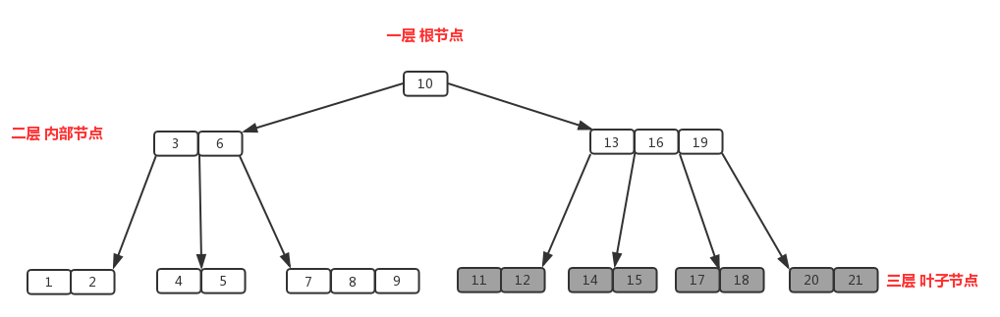

阅读此文章前，最好先了解一下二叉搜索树和AVL树的相关知识：[二叉搜索树及AVL_ZergWang's Blog-CSDN博客](https://blog.csdn.net/Zerg_Wang/article/details/121383939)
 

# B树
一种多路平衡搜索树，常用于数据库及文件系统中。

图片出处：[B树、B+树详解 - Assassinの - 博客园](https://www.cnblogs.com/lianzhilei/p/11250589.html)

#### 定义
- B树的阶m：每个节点最多能有m个子节点。如图是一棵4阶B树。m可根据实际需要而调整，但一般m>2。
- 除了第一次插入外，根节点应至少有2个子节点。
- 除了根节点和叶节点外，其他节点最少有m/2（向上取整）个子节点。
- 所有的叶节点都在同一层。
- 若某节点有k个子节点，则该节点从左到右按升序存储k-1个关键码。

可以看出，对于树中任一节点中的任一关键码，该码左侧的子树中存储的关键码均比该码小，右侧子树中所有码均比该码大。若某一子树夹在父节点某两个关键码a、b中间，则该子树中所有码均小于b且大于a。
  

# B+树
B+树是B树的变种，相比B树查询效率更快更稳定。B+树性质与B树差不多，但有以下不同：

- 非叶节点不保存任何数据，只起一个索引的作用。
- 数据都保存在叶节点。所有叶节点按自身关键字顺序链接成双向链表。非叶节点中出现的关键码仅仅是其下一层对应节点中的最大或最小关键码的重复。
- 有些中文博客会提到B树中非叶节点有k个子节点和k-1个关键码，但B+树中有k个关键码。但经本人查阅英文网站及博文发现他们并未提及这一点。本博文暂时以英文网站及维基百科为准。
#### 搜索
搜索操作与普通二叉搜索树类似。不过在进入每个节点进行比较时，二叉搜索树中由于每个节点中仅有一个值，仅需一次比较就能确定要进入左子树还是右子树还是直接返回。但在B+树中，在每个节点中还需进行多次比对，找到合适的区间进入子树。若这个节点中的关键码过多，可能要在该节点中单独进行一次二分查找来确定区间。
#### 插入

#### 删除
  

# B*树
  

# 数据库系统为何要使用B树
  

# 参考资料及部分图片出处
[深入理解什么是B树？](https://cloud.tencent.com/developer/article/1425604)
[B树、B+树详解 ](https://www.cnblogs.com/lianzhilei/p/11250589.html)
[深入理解什么是B+树](https://cloud.tencent.com/developer/article/1425602?from=article.detail.1425604)
