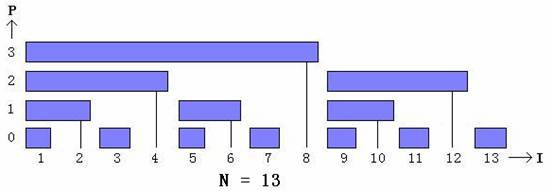

# 题目引入
有一个长度为n的数组，现在我们对这个数组有两种操作：

操作一：将数组的第k位加上x，即a[k]+x。

操作二：将数组的第i位到第j位的这一个区间的所有值加起来。

很明显，操作一的时间复杂度为O(1), 而操作二的时间复杂度为O(n)，如果我们有m次询问的话时间复杂度为O(nm)，这就有可能会超时，那么我们有什么方法来降低时间复杂度呢？

以前我们学过了RMQ，那么我们能不能用RMQ呢？

这个想法很好，但是在这道题上并不适用，因为这个数组中的值是不断变化的，牵一发而动全身，所以动态的数据RMQ也是无能为力的。

当初我们做多重背包问题的时候不就是将背包的数量拆成一个个二进制数，这样就能表示所有的数，那么我们可不可以用这种方法求出值，这样任何一个区间的值我们都可以表示呢？比如说我们求a[1]到a[21]的和，我们可以将它拆成16+4+1，就是我们预处理出a[1]到a[16]的和，a[17]到a[20]的和，以及a[21]，这样我们直接相加就能得出答案。时间复杂度就会大大降低。

没错，树状数组就是这样的一个数组，我们将21转成二进制10101，对于10101，我们从低位到高位找这个二进制数中的“1”，这样我们就能找到3个1，这三个“1”分别是10000、100、1，转换成十进制就是16,4,1,编一个查找一个数中最低位的“1”的函数get_one(x),这样我们就能很方便地得出答案。

有很多种方法来编写这个函数，有一种比较方便的办法就是用位运算：x & -x。
 如图，这就是一个标准的树状数组：


tree[x]放的值是x到get_one(x)的和。

树状数组具有代码简洁、时间复杂度低、空间需求量小的优点，在求部分和的问题中十分重要。

因为我们的例题是动态的，所以当值改变的话，我们就需要维护一次tree数组，那么如何维护呢？

我们改变了第k位的值，那么k之后的值都会被改变。

所以我们要不停地求出get_one(k),加到k上求出下一个值需要改变的位，每位对应增加x.

另外，我们如何求部分和呢？

假设我们求5到13的和，我们就要求出8+4+1，对照上图，也就是求出1-8的和、9到12的和，13到13的和再减去1到4的和以及5到5的和，也就是work(right)-work(x-1).每求完一个位的值就减去get_one(),再加上下一位的值。

以下是程序：
```cpp
#include <fstream>

using namespace std;

ifstream fin("BIT.in");

ofstream fout("BIT.out");

 

int n,m,c[10000];

void init();

void add(int a,int b);

int work(int a);

 

int main()

{

  init();

  return 0;    

}

 

void init()

{

  int a,b;

  char chr;

  fin>>n>>m;

  for (int i=1;i<=m;++i)

   {

     fin>>chr>>a>>b;

     if (chr=='c') add(a,b);            //操作一：改值

              else fout<<work(b)-work(a-1)<<endl;         //操作二：求和

   }     

}

 

void add(int a,int b)

{

  for (;a<=n;a+=a & -a)

   c[a]+=b;         //逐位增加

}

 

int work(int a)

{

  int sum=0;

  for (;a>=1;a-=a & -a)          //逐位累加值

   sum+=c[a];

  return sum; 

}

 
```
后来老师又给我们出了一道练习题：硬币翻转。

有一堆（n个）硬币排成一列，都是反面朝上，每个硬币都有

从1到n的

对应的编号，现在有两种操作：

1.将编号为i到j的硬币反面

2.询问第i位硬币是正面朝上还是反面朝上。如果正面朝上输出1，反面朝上输出0.

我们可以记录每个硬币一共被翻转了多少次，如果翻转的次数是奇数，那么就是正面朝上，如果是偶数，就是反面朝上。

操作一的方法与以前学的线段覆盖问题一样，将c[i]+1，c[j+1]-1，就是翻转开头的地方加1，结尾减1.

具体做法与上题差不多，在此就不多说了，以下是程序：
```cpp
#include <fstream>

using namespace std;

ifstream fin("yingbi.in");

ofstream fout("yingbi.out");

 

int n,m;

int c[1000];

 

void init();

void add(int a,int b);

int work(int x);

 

int main()

{

  init();

  return 0;    

}

 

void init()

{

  fin>>n>>m;

  char chr;

  int a,b;

  for (int i=1;i<=m;++i) 

   {

     fin>>chr;

     if (chr=='T') 

      {

        fin>>a>>b;

        add(a,1);

        add(b+1,-1);           //改值（做法类似线段覆盖）

      } else

      {

        fin>>a;

        fout<<work(a)%2<<endl;          //计算出的值记得要mod 2  

      }

   }     

}

 

int work(int x)

{

  int sum=0;

  for (;x>=1;x-=x & -x)

   sum+=c[x];                                                  //计算值

  return sum;    

}

 

void add(int a,int b)

{

  for (;a<=n;a+=a & -a)                        //更改值

   c[a]+=b;   

}
```