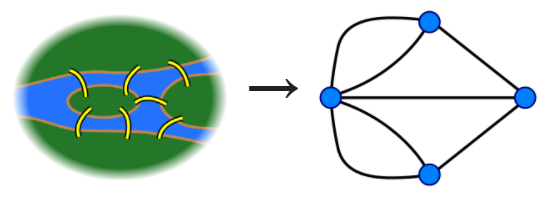
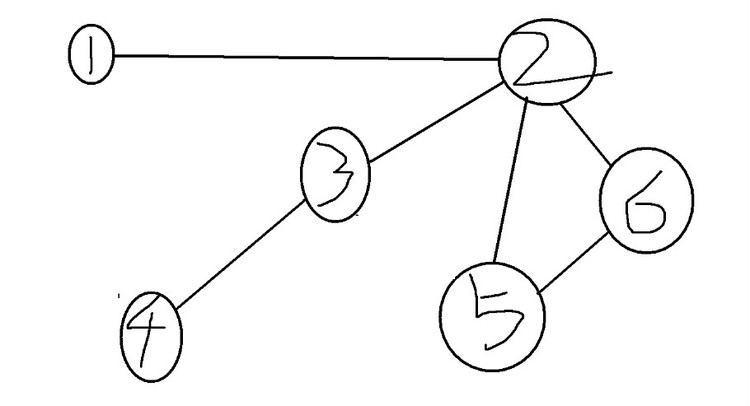
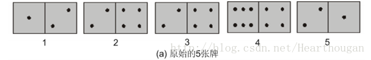
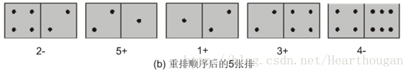

# 前言
#### 问题引入
给出一个有n个节点和m条边的图（可以是无向图也可以是有向图），要求遍历图中所有的边，但每条边只能经过一次。输出符合要求的走法。
#### 证明
该问题最早可追溯到欧拉的七桥问题：对于下图中的七座桥，每座桥只经过一次，如何一次把七座桥都走一遍。

如果将河中间的两地以及两岸这一共四个地方抽象成四个点，那么七桥问题可以转换成如何一笔画完上面的这幅无向图。

欧拉证明：
- **若一幅连通的无向图中，度为奇数的点的数量为0或者2，该无向图可一笔画完**（点的度数等于与该点相连的边数）
- **若一幅连通的有向图中，每个点的出度与入度相等，或者有一个出度比入度大1的点以及一个入度比出度大1的点，那么这个图就可以一笔画完，否则画不完。**（点的出度等于从该点出发指向其他点的边的数量，点的入度等于从其他点出发指向该点的边的数量）

其中，度为奇数的点的数量为2的图存在**欧拉路径（Eulerian path）**（即一笔能画完，但起点和终点不是同一个点）。度为奇数的点的数量为0的图存在**欧拉回路（Eulerian circuit）**（即一笔能画完，起点和终点是同一个点）。

证明过程其实非常简单：
- 对于欧拉回路，假设起点和终点都在点P上。由于从P点出发最终要回到P点，因此P点的度必须为偶数（从P点出去几次就要回到P点几次），P点之外的其他点的度也要为偶数（因为最终不会停留在P以外的点，这些点被进入几次就要离开这些点几次）。

- 对于欧拉路径，假设起点为A，终点为B。则A点的度必为奇数（从A点出去的次数一定会比进入A点的次数多1），B点的度也必为奇数（进入B点的次数一定会比从B点出去的次数多1）。而其他的点的度必为偶数。

由于七桥问题抽象出的无向图中，四个点的度数均为奇数，因此七桥问题无解。

下面介绍两种用于寻找欧拉回路（路径）的算法。
<br/><br/>


# Fleury算法
从符合的点（度为奇数的点或出度比入度大1的点，若图中点度数均为偶数则随机选一点）开始走，对于即将要经过的边进行判断，优先走普通的边，“桥”留到最后再走（桥是一种特殊边，去掉该边后图无法联通）。

由于要对经过的每条边判断是否为桥，该算法效率较低，大约为$O(M^2)$，即与边数的平方相关。下面会详细介绍效率更高的Hierholzer算法。
<br/><br/>

#  Hierholzer算法
又称“圈套圈算法”、“逐步插入回路法”。算法效率约为$O(M)$。

从符合的点开始进行深度优先搜索，将走过的边删除，直到无法行至下一个点时判断，若“一笔画”已完成，则输出答案，否则回退到上一个点找其他边走。

**简单来说，Hierholzer算法和深度优先搜索算法没区别。** 这是由于对于存在欧拉回路（路径）的图，起点和终点以外的所有点度数为偶数，这意味着搜索时能进入一个点必能从这个点再出去。若遇到进入后无法出去的点，则这个点必为欧拉回路（路径）的终点，此时若场上还有些可以“一进一出”的点，则退回前一个点并将该点与终点的边删除，然后把哪些可以“一进一出”的点走完再走到终点即可。

对于答案的输出，可以在每次遇到无法继续前进的点时输出该点。答案则为输出顺序的倒序（若没有规定起点，输出顺序其实也算是一种答案）。在搜索过程中，第一次遇到无法前进的点是终点，当我们回退删边后，退回到的前一个点由于少了一条边的连接，其度数必会发生变化，则在“剩余”的图中它会成为终点，以此类推，搜索完成则得到欧拉回路（路径）。

如图

利用该算法，从1出发，依次到2、3、4。此时无路可走，于是输出4，返回到3。仍然无路可走，输出3，返回到2。发现可走5，依次走5、6。此时无路可走，连续输出6、5，返回到2。还是无路，输出2，返回到1。仍然无路可走，输出1，结束。
输出的顺序是：4 3 6 5 2 1
可见该算法的结果是倒序输出的，因此有多个方案时而题目有要求输出特定的一组就需要注意。
<br/><br/>

# 例题：多米诺骨牌
#### 题目简介
给出n张骨牌，每张骨牌分成上下两半，且各有一个[0, 6]之间的数，然后将这些骨牌横放，使得前一个骨牌的下半部分的数字等于后一个骨牌的上半部分的数字，问给出的n个骨牌应该怎样排，输出方案，骨牌的放置的正反（也就是骨牌上半边朝向左边或者朝向右边）也要输出。


#### 思路
以数值为点，同一张骨牌的两个数值就是一条边上的两个点。
```cpp
#include <iostream>
using namespace std; 

struct card {
   int head, tail;
} allCard[200];

int a[10][10], degree[10], ans[200];
bool f[10], isRev[200];
int ansSize, n;


void dfs(int cur) {    //cur为当前所在的点
    for (int i=0; i<=6; i++)
        if (a[cur][i] >= 1) {
            a[cur][i]--;
            a[i][cur]--; 
            dfs(i);
            for (int j=1; j<=n; j++)
                if ((cur == allCard[j].head && i == allCard[j].tail) || 
                (cur == allCard[j].tail && i == allCard[j].head)) {
                    ansSize++;
                    allCard[j].head=-2;
                    ans[ansSize] = j;
                    isRev[ansSize] = (allCard[j].tail == cur); //判断牌是否翻转
                    break;
                } 
        }
}


int main() {
    cin>>n;
    for (int i=1; i<=n; i++) {
        int x1,x2;
        cin>>x1>>x2;
        allCard[i].head = x1;
        allCard[i].tail = x2;   //用allCard数组记录下所有的牌
        a[x1][x2]++;
        a[x2][x1]++;            //a[x1][x2]存储点x1到点x2之间还有多少条边未使用
        degree[x1]++;
        degree[x2]++;           //统计每个点的度
        f[x1] = f[x2] = 1;      //f[x1]赋值为1说明有边经过点x1
    }

    int start = -1, oddDegree = 0;

    for (int i=0; i<=6; i++)
        if (degree[i]%2 == 1) {   //找出度为奇数的点
            start = i;  
            oddDegree++;
        }

    if (oddDegree!=0 && oddDegree!=2) {
        cout<<"No solution"<<endl;
        return 0;
    }

    if (start == -1)    //如果start==-1说明所有点的度相同且为偶数，此时随意选择一点作为起点 
        for (int i=0; i<=6; i++)
            if (f[i]) {
                start = i; 
                break;
            }

    dfs(start); 

    if (ansSize != n)   //如果使用掉的骨牌数量不等于n，说明有骨牌没用上，意味着图不联通
        cout<<"No solution"<<endl;
    else 
        for (int i=1; i<=ansSize; i++) {
            cout<<ans[i]<<' ';
            cout << (isRev[i] ? '-' : '+') << endl;
        }

    return 0;
}
```
<br/><br/>

# 参考资料
[Seven Bridges of Königsberg](https://en.wikipedia.org/wiki/Seven_Bridges_of_K%C3%B6nigsberg)

[多米诺骨牌(欧拉通路，欧拉通路Test)](https://blog.csdn.net/Hearthougan/article/details/14101419)
