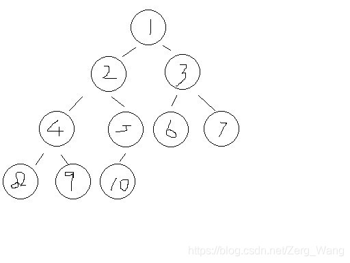
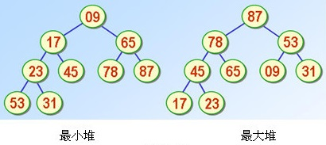
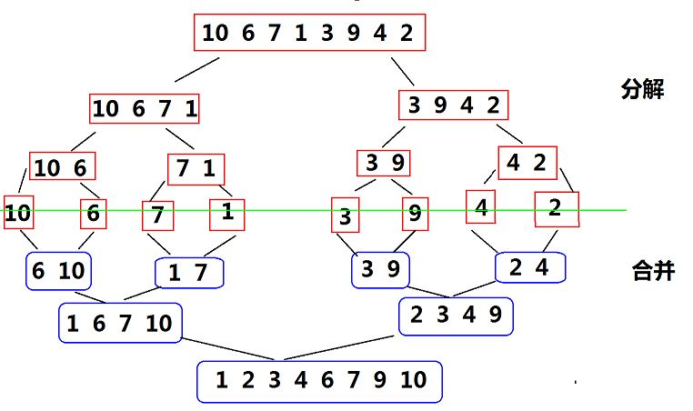
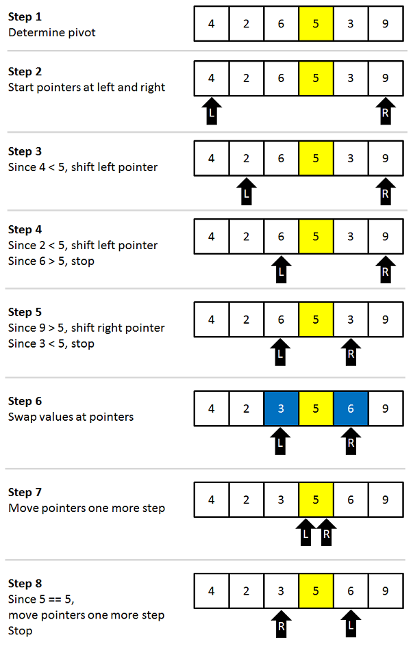
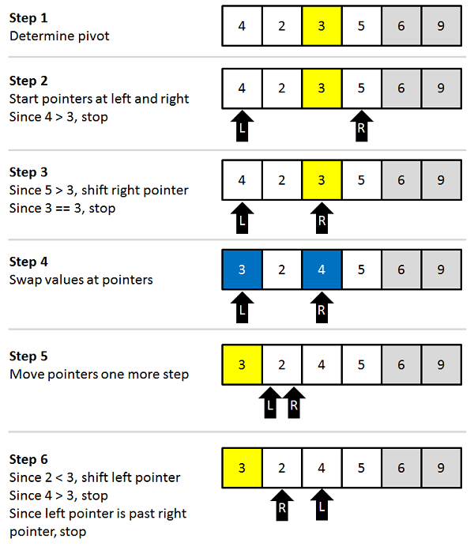

<font color='ff0000'>**以下三个排序算法平均时间复杂度均为$O(N* log_2 N)$**</font>
<br/>

# 堆排序（Heap Sort）
不稳定排序，接下来引入几个概念：
#### 堆
一个如此编号的完全二叉树：

对于任意节点，其左子节点编号为其2倍，右子节点为2倍加1。

#### 最大堆
父节点存储的数永远比左右子节点存储的数都大，如图：

同理，最小堆即：父节点存的数永远比左右子节点存的数都小。

#### 排序步骤
以最大堆为例，也就是降序排序。

首先要构建最大堆：

1.每读入一个数，每个数放置在堆的对应位置（就是它的数组下标）。

2.然而对于这个数，与其父节点比较，大于就交换，越界或交换不了就退出。（相当于把这个数一层层往上提，直到提不动或越界）

3.重复1、2步骤，直到所有数据读入。

 其次要维护最大堆：

1.将根节点（a[1]）存储的数输出。（因为它一定是整个堆中最大的）

2.将堆末（即a[n]）的数移至根节点，同时n--。

3.维护最大堆：将根节点的数与子节点比较，若左右子节点中有比它大的，则与左右子节点中较大的交换，直到无法交换或越界。（相当于把这个数一层层往下拉，直到拉不动或越界）

4.重复1、2、3步骤，直到所有数输出。

#### 代码
```cpp
#include <stdio.h>
#include <iostream>
#include <algorithm>
using namespace std;
#define N 1000007
int a[N], n;
 
void MakeHeap(int t);    //初始化一个最大堆
void KeepHeap(int m);    //维护最大堆
 
int main(){
    scanf("%d", &n);
    for (int i = 1; i <= n; i++){
        scanf("%d", &a[i]);
        MakeHeap(i);
    }
    for (int i = n; i >= 1; i--){
        printf("%d ", a[1]);
        a[1] = a[i];
        KeepHeap(i-1);
    }
    return 0;
}
 
void MakeHeap(int t){
    while (a[t]>a[t/2])
    {
        if (t == 1) return;
        swap(a[t], a[t/2]);
        t = t/2;       
    }
}
 
void KeepHeap(int m){
    int max_son, f, t = 1;
    while (t*2<=m){
        if (t*2 == m){
            if (a[t] < a[t*2]) swap(a[t], a[t*2]);
            return;        //这里要留意一下只有左子节点的特殊情况
        }
 
        if (a[t*2]>a[t*2+1]){
            f = 0;
            max_son = a[t*2];
        } else{
            f = 1;
            max_son = a[t*2+1];
        }
        
        if (a[t] < max_son){
            swap(a[t], a[t*2+f]);
            t = t*2+f;
        } else return;
    }
}
```

<br/><br/>

# 归并排序（Merge Sort）
一般指二路归并排序，是稳定排序，原理如下：

归并排序分为两个过程，一是通过递归不断将数组二分，直到无法再二分进行第二步：合并，具体如图：

二分过程通过递归很好实现，合并过程的详细过程为：

首先要明确两个事实：一是这两个要合并的序列不一定等长（数组总长度不可能总是2的次方），但这并不妨碍合并过程；二是因为通过递归，每个要合并的序列本身已经是有序的了。

合并过程如下：另开一个数组c，存储合并后的有序（这里以降序排序为例）序列，设两个待合并序列为a和b，对a[1]与b[1]进行比较，若a[1]更大，则将a[1]放入c[1]，a、c指针后移。然后比较a[2]与b[1]，较大者放入c[2]并移动指针，以此类推。当a或b中全部数字移入c中，可将另一序列中剩余数字按原顺序一次性移入。最后将数组c中的有序序列移回原数组。

#### 递归写法
```cpp
void Merge_Sort(int lef, int rig){
    if (lef == rig) return;
 
    int b[N];
    int mid = lef + (rig-lef)/2;
    Merge_Sort(lef, mid);
    Merge_Sort(mid+1, rig);
    
    int i = lef;
    int lp = lef;
    int rp = mid+1;
 
    while (i <= rig){
        if (a[lp]<a[rp]){
            b[i] = a[lp];
            lp++;
        } else{
            b[i] = a[rp];
            rp++;
        }
        i++;
 
        if (lp > mid){
            for (int j=i; j <= rig; j++) b[j] = a[rp+j-i];
            break;
        } else
        if (rp > rig){
            for (int j=i; j <= rig; j++) b[j] = a[lp+j-i];
            break;
        }        
    }
 
    for (int j=lef; j <= rig; j++) a[j] = b[j];
}
```
#### 非递归写法
通过上图可知，一开始合并时，每个序列长度为1（仅一个数字），然后当所有长度为1的序列两两合并后，每个待合并序列长度为2，然后是4、8、16……因此，我们可以省去递归二分的过程，直接通过上述规律对相应序列进行合并。代码如下：
```cpp
#include <stdio.h>
#include <iostream>
#include <algorithm>
using namespace std;
 
#define N 1000007
int n, a[N], b[N];
 
void MergeSort();
void JustMerge(int lef, int mid, int rig);
 
int main(){
    scanf("%d", &n);
    for (int i=1; i <= n; i++) scanf("%d", &a[i]);
    MergeSort();
    for (int i=1; i <= n; i++) printf("%d ", a[i]);
    return 0;
}
 
void MergeSort(){
    int step = 1, i = 1;
    while (step < n){
        while (i-1+step*2 <= n){
            JustMerge(i, i-1+step, i-1+step*2);
            i += step*2;
        }
        if (n-i+1 > step) JustMerge(i, i-1+step, n);//后一个序列长度与前一个稍短，也可合并
        //但若剩下的项连一个序列都凑不齐，则不管
        step *= 2;    //step即序列长度
        i = 1;
    }
}
 
void JustMerge(int lef, int mid, int rig){
    if (lef == rig) return;
    
    int i = lef;
    int lp = lef;
    int rp = mid+1;
 
    while (i <= rig){
        if (a[lp]<a[rp]){
            b[i] = a[lp];
            lp++;
        } else{
            b[i] = a[rp];
            rp++;
        }
        i++;
 
        if (lp > mid){
            for (int j=i; j <= rig; j++) b[j] = a[rp+j-i];
            break;
        } else
        if (rp > rig){
            for (int j=i; j <= rig; j++) b[j] = a[lp+j-i];
            break;
        }        
    }
 
    for (int j=lef; j <= rig; j++) a[j] = b[j];
}
```
<br/><br/>


# 快速排序（Quick Sort）
#### 直接调用
在这三个排序算法中最为常用，一般也是最快的，为不稳定排序。

C++自带快速排序，可直接调用：
```cpp
#include <algorithm>
...
sort(a, a+n, cmp);
```
三个参数分别为要排序的数组第一项，数组最后一项，如果数组下标为0到n-1，则按上述代码，若为1到n则为：sort(a+1, a+n+1, cmp);

cmp为用户自己编写的比较函数（以下例子为升序排序，改成i>j为降序）：
```cpp
bool cmp(int i,int j) {
    return i<j;
}
```
#### 原理解析
步骤如下：

1. 对于要排序的区间，先定一个”基准数“k，下面的程序以区间中心的数为k。（可以随机挑选基准数，也可指定区间第一个或最后一个）

2. 从区间末端向前，找到第一个大于等于k的数；同时从区间开头向后，找到第一个小于等于k的数。

3. 将找到的这两个数交换位置，然后从当前位置继续向前（向后）找，重复步骤2，3，直到遍历完整个区间。

4. 遍历完整个区间后，k已经被放置到正确的位置上，在k前面的数都比它小，在k后面的数都比它大，这个时候采用分治策略，对k之前的区间和k之后的区间重复1、2、3、4步。

举个例子，以5为基准数：


<br/>
接下来，以3为基准数：


#### 代码
```cpp
#include <stdio.h>
#include <iostream>
#include <algorithm>
using namespace std;
 
#define N 1000007
int n, a[N];
 
void QuickSort(int lef, int rig){
    if (lef >= rig) return;
    int i = lef, j = rig;
    int mid = a[(i+j)/2];
    while (i<=j){   //这里和下面if处的判断条件中都有等号，虽然i==j的情况下循环和swap没有意义，但仍需要i和j的移动，否则会进入死循环
        while (a[i]<mid) i++;    //这里为了能移动基准数，所以判断条件不能带等号
        while (a[j]>mid) j--;
        if (i<=j) swap(a[i++], a[j--]);     
    }
    QuickSort(i, rig);
    QuickSort(lef, j);
}
 
int main(){
    scanf("%d", &n);
    for (int i=1; i <= n; i++) scanf("%d", &a[i]);
    QuickSort(1, n);
    for (int i=1; i <= n; i++) printf("%d ", a[i]);
    return 0;
}
```
<br/><br/>

# 参考资料及部分图片来源
[归并排序 —— 递归实现 + 非递归实现](https://www.cnblogs.com/jijizhazha/p/6127274.html)

[Quicksort 快速排序算法](https://www.cnblogs.com/chuangweili/articles/5159645.html)
