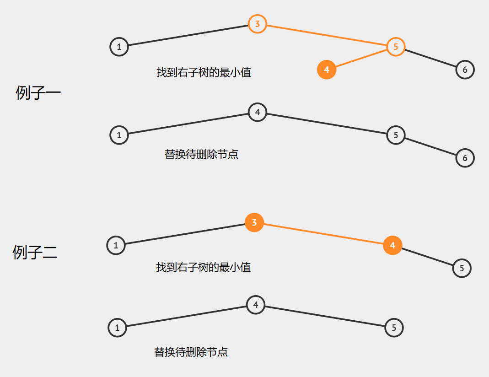

# 二叉搜索树（Binary Search Tree）
## 定义
又称二叉排序树。树中的任一节点的左子树所有节点的值都比该节点小，其右子树所有节点都比该节点大。因此，对该树的中序遍历会得到一个升序序列。二叉搜索树一般不允许有重复元素。

## 搜索及插入节点
若数据以二叉搜索树的方式存储，则搜索数据将会极为方便。根据二分法的思想，每次搜索时从根节点出发，令要搜索的数据与节点比较大小从而进入左或右子树，直到找到数据。时间复杂度为$O(log_2 N)$，其中$N$为节点数量，即时间复杂度约等于树的深度。
节点的插入本质上也是一个搜索过程，通过不断比较找到合适的空节点位置插入数据，因此每次插入操作都是往树中插入一个叶节点。插入操作的时间复杂度与搜索操作一样。

## 删除节点
删除分为以下几种情况：

- 待删除的是叶节点

    无影响，直接删。

- 待删除的节点只有左子树或只有右子树

    令其左子树或右子树直接上位（往上提一层），取代被删除节点的位置。
    

-  被删除的节点左右子树都有

    在待删除的节点的左子树中找到最大值的节点，或者在右子树中找到最小值的节点，令找到的节点替换待删除节点。假设待删除节点为A，要寻找的最值节点为B，将A的值换成B的，然后删除B即可。由于B原先为最值，因此它不可能同时拥有左右子树，由此将删除操作简化成之前提到的两种情况（删叶节点或删有单个子树的节点）。举个例子（3为待删除节点）

  

# 平衡二叉搜索树（Self-balancing Binary Search Tree）
## 前言
如果我们以4、0、3、1、2的顺序插入节点到一棵二叉搜索树，可能会形成如下这种极端情况：
        

按照定义这也是一棵二叉搜索树，但已经退化成了链表。对该树进行搜索的时间复杂度为$O(N)$。究其原因，该树没有充分利用各层的左右节点，从而增加了树的深度，形成了以上这种“不平衡”的树型结构。同样是以上这组数据，其实可以形成如下这种“平衡”的搜索树：

## 定义
简单来说，平衡二叉搜索树的算法就是尽可能地构建一棵完全二叉搜索树，令节点搜索、插入、删除的平均时间复杂度和最坏时间复杂度都控制在$O(log_2 N)$内。
  

# AVL树
一种平衡二叉搜索树。AVL树得名自其发明者Georgy Adelson-Velsky和Evgenii Landis。他们在1962年的论文《An algorithm for the organization of information》中公开了这一数据结构。

** 对于AVL树中的任一节点，其左右两子树的高度的差别均不大于1。**

## 平衡因子（Balance Factor）
AVL树中任一节点的平衡因子等于其左子树高度减去右子树高度。AVL树中所有节点的平衡因子只能是1，0，-1这三种值。下面将使用“BF”表示平衡因子。

## 插入节点
AVL树中的节点插入操作与普通二叉搜索树相同，但操作完成后会多一步“平衡”操作。在讲具体的平衡操作前，首先要理解以下两条规则：

1. 对于任一可以被插入子节点的节点R，对R插入一个左子节点会使R的BF+1；对R插入一个右子节点会使R的BF-1。

 

2. 对于任一节点X：

- 若BF从±1变成0，X自身高度不变，也不影响其父节点R的BF和高度。
 
- 若BF从0变成±1，X自身高度+1，此时若X为R的左子节点，R的BF+1，否则R的BF-1。
 
- 若BF变成±2，X自身高度+1，开始平衡操作。

每插入一个新节点，都要进行一次平衡操作。我们从新插入的节点开始一路溯源（也就是一直往上找祖节点），并按照上述规则对相关节点的BF进行更改，若更改后的BF变成了2或-2，则要进行平衡操作。

下图展示了执行一次插入操作的流程：

一共有4种不同的平衡操作，下面一一介绍：

### LL

如图，红色数字表示对应节点的BF，三角形可以表示一个节点，也可以是树或者是NULL（下文均称为“子树”）。当出现某节点（②）的BF为1且其父节点（③）的BF为2的情况，就需要开始平衡操作：

1.  将③及其右子树D顺时针旋转，使③成为②的右子树。

2.  使②原来的右子树C成为③的左子树C。

3.  ②替代③成为R的子树。

4.  ②高度不变，BF置为0；③的高度-2，BF置为0。其他所有节点BF和高度不变。

由于平衡前子树C在③的左子树下，其所有元素均比③小，因此平衡时C可直接成为③的左子树。

平衡前各节点高度有：C=①-1，D=②-2，又因为②-①=1，因此C=D，③的BF等于0。由于平衡前后②的右子树多加了③这一层，因此②的BF从1变为0，高度不变。

R原来的子树为③，在插入新节点后子树③高度+1，但平衡后R的此子树变为以②为根，相当于这整棵子树删去了③这一层，抵消掉了因新节点加入带来的高度变化，因此R的高度和BF保持不变。

### RR

如图，当出现某节点（②）的BF为-1且其父节点（①）的BF为-2的情况，就需要开始平衡操作：

1.  将①及其左子树A逆时针旋转，使①成为②的左子树。

2.  使②原来的左子树B成为①的右子树。

3.  ②替代①成为R的子树。

4.  ②高度不变，BF置为0；①的高度-2，BF置为0。其他所有节点BF和高度不变。

其他证明过程略。

### LR

如图，当出现某节点（①）的BF为-1且其父节点（③）的BF为2的情况，就需要开始平衡操作：

1.  将①及其左子树A逆时针旋转，使①成为②的左子树，②原来的左子树B成为①的右子树。

2.  将③及其右子树D顺时针旋转，使③成为②的右子树，②原来的右子树C成为③的左子树。

3.  ②替代③成为R的子树。

4.  ①的高度-1，BF由②原来BF确定；②的高度+1，BF置为0。③高度-2，BF由②原来BF确定。

平衡前各节点高度有：A=②-1，D=①-2，又因为①=②+1，因此A=D。

若平衡前②的BF为0，则A、B、C、D高度全部相同，①、②、③的BF为0。
若平衡前②的BF为1，则高度上有A=B=D=C+1，①、②的BF为0，③的BF为-1。
若平衡前②的BF为-1，则高度上有A=C=D=B+1，③、②的BF为0，①的BF为1。

插入新节点前③的BF为1，R以③为根的子树高度为D+2。平衡后R以②为根的子树高度为max(A, B, C, D)+2，又因为D的高度必为这四棵子树的最大值，②=D+2。因此插入前和平衡后R的这支子树高度没有变化，R的高度和BF不变。

### RL

如图，当出现某节点（③）的BF为1且其父节点（①）的BF为-2的情况，就需要开始平衡操作：

1.  将①及其左子树A逆时针旋转，使①成为②的左子树，②原来的左子树B成为①的右子树。

2.  将③及其右子树D顺时针旋转，使③成为②的右子树，②原来的右子树C成为③的左子树。

3.  ②替代①成为R的子树。

4.  ①的高度-2，BF由②原来BF确定；②的高度+1，BF置为0。③高度-1，BF由②原来BF确定。

证明过程略。

## 删除节点
AVL树的删除操作与普通二叉搜索树一样，但同样要多一步平衡操作。

 
 红色为被删除节点，三角形代表的为一个节点或者一棵子树或者NULL。下文一般以子树代称。

无论红色节点是不是叶节点，删除它并不会影响Son的BF和高度，同样Bro也不会受影响。删除只会影响Father、R以及再往上递归找到了的父节点。

所以，删除节点的三种情况可以统一为上图所示的一种情况。

在讲删除的平衡操作前，同样要理解以下两条规则：

1. 对于任一可以被删除子节点的节点R，对R删去一个左子节点会使R的BF-1；对R删去一个右子节点会使R的BF+1。
 

2. 对于任一节点X：

- 若BF从0变成±1，X自身高度不变，也不影响其父节点R的BF和高度。 
 

- 若BF从±1变成0，X自身高度-1；此时若X为R的左子节点，R的BF-1，否则R的BF+1。
 

- 若BF变成±2，X自身高度不变，开始平衡操作。

下图为一次删除操作的流程图：

**注意：插入一个节点，最多执行一次平衡操作即可，但删除一个节点可能要执行多次平衡操作。**

共有六种不同的平衡操作，但本文将总结成4种：

### R0/R1
如图所示，对③的右子树D中的某节点执行删除，导致③失衡，此时③的左子树①的BF有-1,0,1三种情况，这就对应了R-1、R0、R1三种平衡操作。由于①的BF为0和1时的操作是一样的，这里就将这两种平衡操作一起解释。

 操作流程如下：

1. 将③及其右子树D顺时针旋转，使其成为①的右子树，①原来的右子树②成为③的左子树。

2. ①接替③成为R的子树。

3. 根据①原来的BF修改①、③平衡后的BF值及高度。

平衡前各节点高度有：D=①-2，由于①>D，因此③=①+1=A+2。

若平衡前①的BF为0，则有A=②，②=①-1，则②=D+1。平衡后③的BF为1，③=②+1=A+1，③的高度-1。①的BF变为-1，高度+1。

若平衡前①的BF为1，则有A=②+1，②=①-2，则有②=D。平衡后③的BF为0，③=②+1=A，③的高度-2，①的BF变为0，高度不变。

平衡前R以③为根的子树高度为A+2，平衡后R以①为根的子树高度为A+2或A+1，整棵子树的高度可能变化，因此会影响R的BF及高度，因此往上递归过程中可能还需要多次平衡操作。

### R-1

对③的右子树D中的某节点执行删除，导致③失衡，此时③的左子树①的BF为-1，此种平衡操作与LR型操作一致，操作流程和证明略。

删除D中节点前，R以③为根的子树高度为A+3，平衡操作后R以②为根的子树高度为A+2。R的这棵子树高度有变化，R自身高度和BF可能都要变。因此在本次平衡操作后往上递归的过程中可能还需多次平衡操作。

### L0/L-1
其实是R0/R1的镜像操作。 对①的左子树A中的某节点执行删除，导致①失衡，若其右子树③的BF为-1或0，则需要进行L0/L-1型平衡操作。

操作流程如下：

1. 将①及其左子树A逆时针旋转，使其成为③的左子树，③原来的左子树②成为①的右子树。

2. ③接替①成为R的子树。

3. 根据③原来的BF修改①、③平衡后的BF值及高度。

若平衡前③的BF为0，平衡后①的BF变成-1，高度-1。③的BF变成1，高度+1。

若平衡前③的BF为-1，平衡后①的BF变成0，高度-2。③的BF变成0，高度不变。

### L1

对①的左子树A中的某节点执行删除，导致①失衡，若其右子树③的BF为1，此种平衡操作与RL型操作一致，操作流程和证明略。

  

# 参考资料及部分图片出处

[数据结构（二）：二叉搜索树（Binary Search Tree）](https://www.jianshu.com/p/ff4b93b088eb)

[AVL tree](https://en.wikipedia.org/wiki/AVL_tree)

[详细图文——二分搜索树_带翅膀的猫的博客-CSDN博客](https://blog.csdn.net/qq_25343557/article/details/84330095)

[详细图文——AVL树_带翅膀的猫的博客-CSDN博客_avl树](https://blog.csdn.net/qq_25343557/article/details/89110319)

[Deletion in AVL Tree - javatpoint](https://www.javatpoint.com/deletion-in-avl-tree)

[数据结构和算法动态可视化](https://visualgo.net/zh/bst)