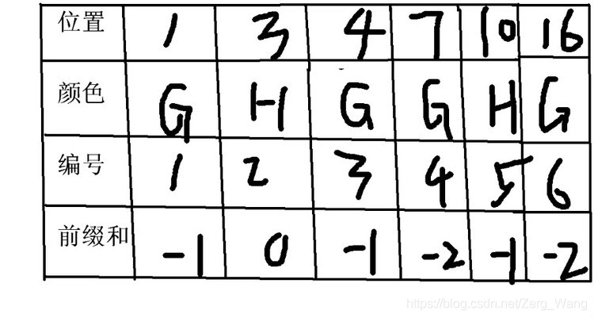
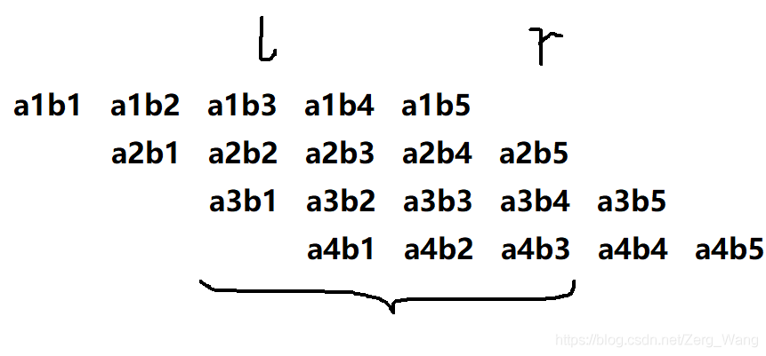

# 例题一
前缀和是一种比较高效的预处理方法，首先用一道例题引入前缀和，介绍其基本概念：

给出一个有n个数的数列a（n<=100000），然后给出m次查询（m<=100000），每次查询给出的l与r（l<=r），查询数列区间l到r的所有数之和。

显然，枚举累加的时间复杂度为$O(n×m)$，绝对超时了，而通过前缀和的预处理（$O(n)$），之后的每次查询都是$O(1)$了。

做法如下：
- 预处理：新建数组f，从a的第一项开始累加，令f[k] = a[1] + a[2] + ... + a[k]
- 查询：对于每次查询给出的l和r，答案即为f[r] - f[l] + a[l]

 <br/> <br/>

# 例题二
给出n（n<=100000）头牛的坐标与颜色（颜色为G或H），现要从中选出坐标连续的一群牛，要求这群牛要么颜色一致，要么两种颜色的数量相等，问满足上述条件的牛群中，最大坐标差是多少。

首先自然是对输入数据按坐标排序，使得数组下标相邻的牛在位置上也相邻，方便后续处理。

得到颜色一致的连续牛群的最大坐标差不难，但颜色相等应该如何处理呢?这里就用到了前缀和，可以为每种颜色赋一个值，颜色G为-1，颜色H为1，然后累加，令f[k] = a[1] + a[2] + ... + a[k]，即前面k头牛中，颜色H的比颜色G的多f[k]头，如果f[l] 与 f[r] 相等，则表示从第l+1到r的这群牛中两种颜色数量相等。

接下来要找满足条件的l和r，如果枚举l和r来找，时间复杂度为$O(n^2)$，明显超时了。实际上，我们可以新开数组b，用于记录f数组中每个值第一次出现的位置。假设 f[l] 的值为 3484，那我们令b [3484] = l，这样我们如果再次遇到 f[r] = 3484，则可以通过 b[3484]找到l，直接得到区间的 l 和 r 。这样时间复杂度可以降为 $O(n)$。
```cpp
#include <stdio.h>
#include <algorithm>
using namespace std;
 
struct data {int pos, color;};
data a[100005];
int f[100005], n, ans;
int b[200005];
 
bool cmp(data a, data b){
    return a.pos < b.pos;
}
 
int main(){
    scanf("%d", &n);
    for (int i = 1; i <= n; i++){
        scanf("%d", &a[i].pos);
        char ch;
        scanf("%c", &ch);
        a[i].color = (ch == 'G' ? -1 : 1); //初始化
    }
    sort(a+1, a+n+1, cmp);
    for (int i=1; i <= n; i++) 
    	f[i] = f[i-1]+a[i].color; //生成前缀和列表
 
    int now=2;              //找颜色一致的牛群
    data k=a[1];
    while (now<=n+1){
        if (a[now].color == k.color) 
            now++; 
        else{
            ans = max(ans, a[now-1].pos - k.pos);
            k = a[now];         
        }
    }
 
    for (int i=1;i<=n;i++){    //找两种颜色数量相同的牛群
        if (b[f[i]+100000]==0) 
            b[f[i]+100000] = i; 
        else
            ans = max(ans,a[i].pos - a[1+b[f[i]+100000]].pos);
        //因为有负数的出现而c++数组坐标是从0开始的，因此每个前缀和列表中的值加上100000
    }
    printf("%d\n", ans);
    return 0;
}
```
<br/><br/>

# 例题三
来自CSU2173：Use FFT，题目描述：

翻译一下，就是给出两个多项式a和b各项的系数，然后令c=a×b，然后给出l和r，问c的从l到r项的系数之和mod10^9 + 7是多少。

思路：其实看一下下面这图，找下规律：

答案其实就是a1×(b3+b4+b5) + a2×(b2+b3+b4+b5) + a3×(b1+b2+b3+b4) + a4×(b1+b2+b3)，如果对b进行了前缀和处理，括号中的数值仅需O(1)的时间即可求出，然后再分别乘以对应a中的项即可。

代码如下：
```cpp
#include <stdio.h>
#include <cmath>
#include <algorithm>
#include <cstring>
#define MOD 1000000007
using namespace std;
long long a[500005],b[500005],n,m,lef,rig;
int main(){
    while (~scanf("%lld%lld%lld%lld",&n,&m,&lef,&rig)){
        n++;m++;
        memset(a,0,sizeof(a));
        memset(b,0,sizeof(b));
        for (int i=0;i<n;i++) scanf("%lld",&a[i]);
        scanf("%lld",&b[0]);
        for (int i=1;i<m;i++){
            scanf("%lld",&b[i]);
            b[i]+=b[i-1];    //前缀和处理
        }	
        long long hig,low,ans=0;
        for (int i=0;i<=min(rig,n-1);i++){
            if (lef-i>=m) continue;
            if (rig-i>=m) hig=b[m-1]; else hig=b[rig-i];
            if (i>=lef) low=0;else low=b[lef-i-1];
            ans=(ans+(a[i]*((hig-low)%MOD))%MOD)%MOD;
        }
        printf("%lld\n",ans);
	}
	return 0;
}
```
