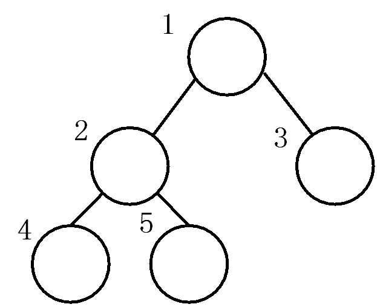
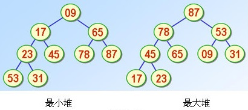
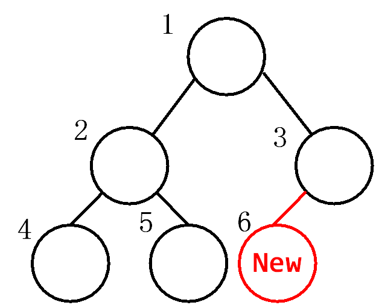

# 堆排序（Heap Sort）
不稳定排序，接下来引入几个概念：
#### 堆
按“从上到下，从左到右”规则编号的完全二叉树：

对于任意节点，其左子节点编号为其2倍，右子节点为2倍加1。因此，可使用普通一维数组来存储堆。数组下标对应节点编号。

#### 最大堆
父节点存储的数永远比左右子节点存储的数都大，如图：

同理，最小堆即：父节点存的数永远比左右子节点存的数都小。

#### 排序步骤
**堆排序的过程，其实就是维护堆的过程。**

假设对n个元素进行降序排序（也就是维护最大堆）为例：

**首先往堆中插入元素：**

1. 堆恒为完全二叉树。因此，每个新元素应按照“从上到下，从左到右”的规则，插入到堆最底层的左侧。换句话说，第i个新元素应插入到堆第i个节点处。



2. 对于新节点，将其值与父节点比较，若大于就与父节点交换值，向上递归执行，直至越界或其值小于父节点。（相当于把该元素一层层往上提，直到提不动或越界）

3. 重复1、2步骤，直到插入所有元素。

**然后从堆中删除元素：**

1. 将根节点（即编号为1的节点）存储的元素输出。（因为它一定是整个堆中最大的）

2. 将堆末节点（即编号为n的节点）移至根节点。

3. 将根节点的元素与子节点比较，若左右子节点中有比它大的，则与左右子节点中较大的交换，向下递归，直到无法交换或越界。（相当于把根节点元素一层层往下拉，直到拉不动或越界）

4. 重复1、2、3步骤，直到所有数输出。

#### 代码
```cpp
void Insert(int *a, int pos) {
    int t = pos;
    while (t>1 && a[t]>a[t/2]) {
        Swap(&a[t], &a[t/2], sizeof(int));
        t = t/2;       
    }
}
 
void Delete(int *a, int pos){
    a[1] = a[pos];
    int t = 1;
    bool isRight = 0;
    while (t*2 < pos){ //当左子节点存在，就能继续执行
        isRight = t*2+1 < pos && a[t*2]<a[t*2+1];
        //当t*2+1>=pos时，说明右子节点不存在
        if (a[t] < a[t*2+isRight]){
            Swap(&a[t], &a[t*2+isRight], sizeof(int));
            t = t*2 + isRight;
        } 
        else 
            return;
    }
}

int main() {
    int n;
    scanf("%d", &n);
    int a[n+1];

    for (int i=1; i<=n; i++) {
        scanf("%d", &a[i]);
        Insert(a, i);
    }

    for (int i=n; i>=1; i--) {
        printf("%d ", a[1]);
        Delete(a, i);
    }
        
    return 0;
}
```

<br/><br/>

# 优先队列
#### 性质与应用

和普通队列相比，优先队列仅在出队（pop）操作上不同。优先队列每次出队，都是将队列中的最值弹出，而不是最先进入队列的值。这一性质与最大（小）堆是一致的。因此，优先队列一般通过最大（小）堆来实现。

优先队列一般用于解决找出数组中第k大的元素这类问题。假设数组中共有n个元素，现在要找出第k大的元素，只需要维护一个仅能包含k个元素的最小堆即可。最小堆的根节点即为数组第k大的元素。时间复杂度$O(N\times \log K)$

#### LeetCode 973
题目链接：https://leetcode.com/problems/k-closest-points-to-origin/

在平面直角坐标系中，给出n个点的坐标，输出与坐标原点欧氏距离最近的k个点。假设某点坐标为$(x_i, y_i)$，它与坐标原点的欧式距离为$\sqrt(x_i^2 + y_i^2)$

维护一个最大堆，堆中的k个元素即为答案。
```cpp
typedef struct {
    int idx, dis;
} Node;

void swap(Node* x, Node* y) {
    int dis = x->dis;
    x->dis = y->dis;
    y->dis = dis;
    int idx = x->idx;
    x->idx = y->idx;
    y->idx = idx;
}

void Insert(Node *a, int dis, int idx, int pos) {
    a[pos].dis = dis;
    a[pos].idx = idx;
    int t = pos;
    while (t>1 && a[t].dis>a[t/2].dis) {
        swap(&a[t], &a[t/2]);
        t = t/2;       
    }
}

void Delete(Node *a, int dis, int idx, int k){
    a[1].dis = dis;
    a[1].idx = idx;
    int t = 1, maxSon;
    bool isRight;

    while (t*2 <= k){ 
        if (t*2+1 > k || a[t*2].dis>a[t*2+1].dis){ 
            isRight = 0; 
            maxSon = a[t*2].dis;
        } else{
            isRight = 1;
            maxSon = a[t*2+1].dis;
        }
        
        if (a[t].dis < maxSon){
            swap(&a[t], &a[t*2+isRight]);
            t = t*2 + isRight;
        } 
        else 
            return;
    }
}

int** kClosest(int** p, int n, int* pointsColSize, int k, int* returnSize, int** returnColumnSizes){
    *returnSize = k;
    *returnColumnSizes = (int*)malloc(k*sizeof(int));
    int **ans = (int**)malloc(k*sizeof(int*));
    Node heap[k+1];

    for (int i=0; i<n; i++) {
        int dis = p[i][0]*p[i][0] + p[i][1]*p[i][1];
        if (i<k)    
        //堆未满时，直接将新元素持续插入堆中
            Insert(heap, dis, i, i+1);
        else if (dis<heap[1].dis) 
        //堆满了之后，只把比根节点小的元素插入堆中，替换根节点
            Delete(heap, dis, i, k);
    }

    for (int i=1; i<=k; i++) {
        (*returnColumnSizes)[i-1] = 2;
        ans[i-1] = p[heap[i].idx];
    }
    
    return ans;
}
```
#### LeetCode 215
题目链接：https://leetcode.com/problems/kth-largest-element-in-an-array/

裸题，返回数组中第k大的数。维护一个大小为k的最小堆即可，最后返回堆顶元素。
```cpp
int findKthLargest(int* a, int n, int k){
    int heap[k+1], t;
    for (int i=0; i<n; i++) 
        if (i<k) {
            t = i+1;
            heap[t] = a[i];
            while (t>1 && heap[t]<heap[t/2]) {
                swap(&heap[t], &heap[t/2]);
                t = t/2;       
            }
        } 
        else if (a[i] > heap[1]) {
            heap[1] = a[i];
            bool isRight = 0;
            t = 1;
            while (t*2 <= k){ 
                if (t*2+1 > k || heap[t*2]<heap[t*2+1])
                    isRight = 0; 
                else 
                    isRight = 1;                
                
                if (heap[t] > heap[t*2+isRight]){
                    swap(&heap[t], &heap[t*2+isRight]);
                    t = t*2 + isRight;
                } 
                else 
                    break;
            }
        }
    return heap[1];
}
```
