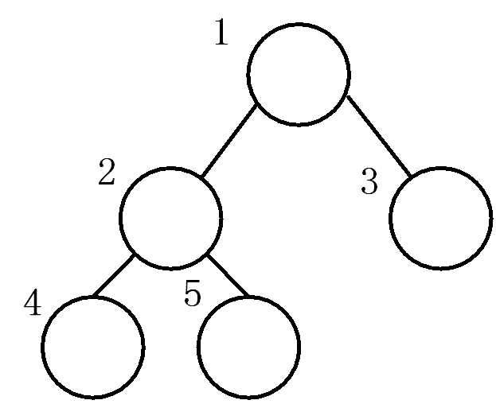

# 堆的定义（heap）
堆是一种按“从上到下，从左到右”规则编号的完全二叉树：

对于任意节点，其左子节点编号为其2倍，右子节点为2倍加1。因此，可使用普通一维数组来存储堆。数组下标对应节点编号。

堆一般用于处理有序序列，一般我们说堆，指的是最大堆或最小堆：

- 最大堆：父节点存储的数永远比左右子节点存储的数都大，如图：

- 最小堆：父节点存的数永远比左右子节点存的数都小。

因此，以下堆的操作与应用，都是基于最大/最小堆进行说明。
<br/><br/>

# 堆的维护
以最大堆为例。
## 往堆中插入元素：

1. 堆恒为完全二叉树。因此，每个新元素应按照“从上到下，从左到右”的规则，插入到堆最底层的左侧。换句话说，第i个新元素应插入到堆第i个节点处。

2. 对于新节点，将其值与父节点比较，若大于父节点，则交换值，向上递归执行，直至越界或其值小于父节点。（相当于把该元素一层层往上提，直到提不动或越界）


## 从堆中删除元素：
以最大堆为例。

1. 将堆末节点（即编号为n的节点）的值覆盖掉被删除节点的值。

2. 从被删除节点开始，与子节点比较，若左右子节点中有比它大的，则与左右子节点中较大的交换，向下递归执行此交换，直到无法交换或越界。（相当于把堆末节点的值放到被删除节点的位置，然后一层层往下拉，直到拉不动或越界）
<br/><br/>

# 堆的应用
## 堆排序
一种不稳定排序，时间复杂度$O(logN)$。构造最小堆即可实现升序排序，构造最大堆即可实现降序排序。排序过程即为维护堆的过程。下面以降序排序为例（构造最大堆），构造完成后，堆的根节点恒为最大值，因此输出根节点后删除之，并维护最大堆，重复以上“输出-删除-维护”操作，直到所有节点输出完毕。
```cpp
void Insert(int *a, int pos, int val) {
    a[pos] = val;
    int t = pos;
    while (t>1 && a[t]>a[t/2]) {
        Swap(&a[t], &a[t/2], sizeof(int));
        t = t/2;       
    }
}
 
void Delete(int *a, int pos){
    a[1] = a[pos];
    int t = 1;
    bool isRight = 0;
    while (t*2 < pos){ //当左子节点存在，就能继续执行
        isRight = t*2+1 < pos && a[t*2]<a[t*2+1];
        //当t*2+1>=pos时，说明右子节点不存在
        if (a[t] < a[t*2+isRight]){
            Swap(&a[t], &a[t*2+isRight], sizeof(int));
            t = t*2 + isRight;
        } 
        else 
            return;
    }
}

int main() {
    int n, t;
    scanf("%d", &n);
    int a[n+1];

    for (int i=1; i<=n; i++) {
        scanf("%d", &t);
        Insert(a, i, t);
    }

    for (int i=n; i>=1; i--) {
        printf("%d ", a[1]);
        Delete(a, i);
    }
        
    return 0;
}
```


## 优先队列

和普通队列相比，优先队列仅在出队（pop）操作上不同。优先队列每次出队，都是将队列中的最值弹出，而不是最先进入队列的值。这一性质与最大（小）堆是一致的。因此，优先队列一般通过最大（小）堆来实现。

优先队列一般用于解决找出数组中第k大的元素这类问题。假设数组中共有n个元素，现在要找出第k大的元素，只需要维护一个仅能包含k个元素的最小堆即可。最小堆的根节点即为数组第k大的元素。时间复杂度$O(N\times \log K)$

例题： [LeetCode 973](https://leetcode.com/problems/k-closest-points-to-origin/)

在平面直角坐标系中，给出n个点的坐标，输出与坐标原点欧氏距离最近的k个点。假设某点坐标为$(x_i, y_i)$，它与坐标原点的欧式距离为$\sqrt(x_i^2 + y_i^2)$

维护一个最大堆，堆中的k个元素即为答案。
```cpp
typedef struct {
    int idx, dis;
} Node;


void Insert(Node *a, int dis, int idx, int pos) {
    a[pos].dis = dis;
    a[pos].idx = idx;
    int t = pos;
    while (t>1 && a[t].dis>a[t/2].dis) {
        Swap(&a[t], &a[t/2], sizeof(int));
        t = t/2;       
    }
}

void Delete(Node *a, int dis, int idx, int k){
    a[1].dis = dis;
    a[1].idx = idx;
    int t = 1, maxSon;
    bool isRight;

    while (t*2 <= k){ 
        if (t*2+1 > k || a[t*2].dis>a[t*2+1].dis){ 
            isRight = 0; 
            maxSon = a[t*2].dis;
        } else{
            isRight = 1;
            maxSon = a[t*2+1].dis;
        }
        
        if (a[t].dis < maxSon){
            Swap(&a[t], &a[t*2+isRight], sizeof(int));
            t = t*2 + isRight;
        } 
        else 
            return;
    }
}

int** kClosest(int** p, int n, int* pointsColSize, int k, int* returnSize, int** returnColumnSizes){
    *returnSize = k;
    *returnColumnSizes = (int*)malloc(k*sizeof(int));
    int **ans = (int**)malloc(k*sizeof(int*));
    Node heap[k+1];

    for (int i=0; i<n; i++) {
        int dis = p[i][0]*p[i][0] + p[i][1]*p[i][1];
        if (i<k)    
        //堆未满时，直接将新元素持续插入堆中
            Insert(heap, dis, i, i+1);
        else if (dis<heap[1].dis) 
        //堆满了之后，只把比根节点小的元素插入堆中，替换根节点
            Delete(heap, dis, i, k);
    }

    for (int i=1; i<=k; i++) {
        (*returnColumnSizes)[i-1] = 2;
        ans[i-1] = p[heap[i].idx];
    }
    
    return ans;
}
```
<br/><br/>

# 其他堆相关题目
## LeetCode 295
题目链接：https://leetcode.com/problems/find-median-from-data-stream/description/

设计一个类，用于维护一个有序序列，并能在$O(log N)$时间内实现插入新值和查询序列的中位数。

要在$O(log N)$内实现插入，只能采用树型数据结构，二叉搜索树和堆均可实现。但由于堆的根节点是最值，利用这一性质可以更加方便地查询序列中位数：

序列的维护通过两个堆（左堆，右堆）以及一个变量med实现。其中，左堆为最大堆，存储序列中所有比med小的值；右堆为最小堆，存储序列中所有比med大的值，med存储序列的中位数。当有新元素加入序列，此时若序列长度为偶数，则将新元素与中位数分别加入左右两堆，此时中位数即为左堆根节点和右堆根节点的平均值，med设为NULL；当新元素加入序列后，序列长度为奇数，则根据新元素的值来确定med的值，令新元素为med，或者加入左堆或右堆，令原来的根节点为med。

```cpp
#define NONE 9999999
#define LEFT 0
#define RIGHT 1

typedef struct {
    int lef[25005]; // max heap 
    int rig[25005]; // min heap
    int n;   //the number of nums in min heap, which is always equal to the number of nums in max heap
    int med;
} MedianFinder;


bool CmpHeapNode(bool isRight, int x, int y) {
    if (isRight) 
        return x < y;
    else 
        return x > y;
}


void Insert(MedianFinder* obj, bool isRight, int val) {
    int *p = isRight ? obj->rig : obj->lef; 
    int now = obj->n;

    p[now] = val;  // insert
    while (now>1 && CmpHeapNode(isRight, p[now], p[now/2])) {  // adjust the position of the inserted num
        Swap(&p[now], &p[now/2], sizeof(int));
        now /= 2;       
    }
}


void Replace(MedianFinder* obj, bool isRight, int val) {
    int *p = isRight ? obj->rig : obj->lef; 
    p[1] = val;  // replace
    int now = 1;
    bool isRightSon = 0;
    while (now*2 <= obj->n){
        isRightSon = now*2+1 <= obj->n && CmpHeapNode(isRight, p[now*2+1], p[now*2]);
        //when now*2+1 >= n, it means the right son does not exist.
        if (CmpHeapNode(isRight, p[now*2+isRightSon], p[now])){
            Swap(&p[now], &p[now*2+isRightSon], sizeof(int));
            now = now*2 + isRightSon;
        } 
        else 
            return;
    }
}


MedianFinder* medianFinderCreate() {
    MedianFinder* obj = (MedianFinder*)malloc(sizeof(MedianFinder));
    obj->n = 0;
    obj->med = NONE;
    return obj;
}


void medianFinderAddNum(MedianFinder* obj, int num) {
    if (obj->med != NONE) {    // now there are 2K+1 nums in obj
        obj->n++;
        if (num >= obj->med) {
            Insert(obj, RIGHT, num);
            Insert(obj, LEFT, obj->med);
        }
        else {
            Insert(obj, LEFT, num);
            Insert(obj, RIGHT, obj->med);
        }
        obj->med = NONE;
    }
    else {                  // now there are 2K nums in obj  
        if (!obj->n) {      // now there are  0 nums in obj
            obj->med = num;   
            return;
        }

        if (num < obj->lef[1]) {
            obj->med = obj->lef[1];
            Replace(obj, LEFT, num);
        }
        else if (num > obj->rig[1]) {
            obj->med = obj->rig[1];
            Replace(obj, RIGHT, num);
        }
        else 
            obj->med = num;
    }
}


double medianFinderFindMedian(MedianFinder* obj) {
    if (obj->med != NONE) 
        return obj->med;
    else     
        return (obj->lef[1] + obj->rig[1])/2.0;
}


void medianFinderFree(MedianFinder* obj) {
    free(obj);
}
```
<br/>

## LeetCode 502
题目链接：https://leetcode.com/problems/ipo/

假设公司初始价值为w。现在给出n个项目，第i个项目会给公司增加价值profits[i]，但需要公司至少有capital[i]的价值才能做。求通过做最多k个不同项目（k<n）后，公司的最高能达到多少价值。n最多为$10^5$。


基本思路：在所有capital[i]小于等于当前公司价值的项目中，选择profits[i]最大的项目去做，做完后更新公司价值，重复以上步骤。考虑到n的范围，在所有项目中找出合适的项目， 以及在合适的项目中选择profits[i]最大的项目，这两步均需在$O(logN)$内实现。因此可考虑使用最大堆，首先将项目按capital[i]升序排序，“在所有项目中找出合适的项目”即将合适项目插入堆中。“在合适项目中找profits[i]最大的项目”即输出堆的根节点。

以下代码中Insert、Delete函数与堆排序代码的一致。

```cpp
int Cmp(const void * a, const void * b) {
    int *x = (int*)a;   
    int *y = (int*)b ;
    return x[1] - y[1]; 
}

int findMaximizedCapital(int k, int w, int* profits, int n, int* capital, int capitalSize){
    int a[n][2];
    for (int i=0; i<n; i++) {
        a[i][0] = profits[i];
        a[i][1] = capital[i];
    }

    qsort(a, n, sizeof(a[0]), Cmp);
    
    int heap[n+1], m = 0, i = 0;  // m为堆中元素数量
    while (k--) {
        while (i < n && w >= a[i][1]) 
            Insert(heap, ++m, a[i++][0]);
        
        if (m) {
            w += heap[1];
            Delete(heap, m--);
        }
        else 
            return w;
    }
    
    return w;
}
```
<br/><br/>

## LeetCode 2462
题目链接：https://leetcode.com/problems/total-cost-to-hire-k-workers/

给出n个候选人的工资，现在要从中进行k轮招聘，每轮仅雇佣1个人。在每轮招聘中，仅从前cand个人和后cand个人中选择工资最低的人，若有多个人均为最低工资，选择序号最小的。问k轮招聘后最低花销是多少。

分别维护两个最小堆，lef堆存储前cand个人的序号和工资，rig堆存储后cand个人的序号和工资。每轮招聘选中了人后，判断这个选中的人是否在lef堆或rig堆中，如果在则更新对应的堆。

```cpp
class Solution {
public:
    typedef struct node {
        int val, pos;
    } node;


    void Insert(node *a, int insertPos, int val, int pos) {
        a[insertPos].val = val;
        a[insertPos].pos = pos;
        int t = insertPos;
        while (t>1 && (a[t].val < a[t/2].val || (a[t].val == a[t/2].val && a[t].pos < a[t/2].pos))) {
            swap(a[t], a[t/2]);
            t = t/2;       
        }
    }
    
    
    void Adjust(node *a, int n) {
        int t = 1;
        bool isRight = 0;
        while (t*2 <= n) { 
            isRight = t*2+1 <= n && (a[t*2].val > a[t*2+1].val || (a[t*2].val == a[t*2+1].val && a[t*2].pos > a[t*2+1].pos));

            if (a[t].val > a[t*2+isRight].val || (a[t].val == a[t*2+isRight].val && a[t].pos > a[t*2+isRight].pos)){
                swap(a[t], a[t*2+isRight]);
                t = t*2 + isRight;
            } 
            else 
                return;
        }
    }


    long long totalCost(vector<int>& costs, int k, int candidates) {
        node lef[candidates+1], rig[candidates+1];
        memset(lef, 0, sizeof(lef));
        memset(rig, 0, sizeof(rig));

        int n = costs.size();
        int lefP = candidates, lefN = candidates;
        int rigP = n - candidates - 1, rigN = candidates;
        bool isUsed[n];
        memset(isUsed, 0, sizeof(isUsed));

        for (int i=0; i<candidates; ++i) {
            Insert(lef, i+1, costs[i], i);
            Insert(rig, i+1, costs[n-i-1], n-i-1);
        }

        long long ans = 0;
        while (k--) {
            int usedNodeIdx = 0;
            if (lef[1].val < rig[1].val || (lef[1].val == rig[1].val && lef[1].pos < rig[1].pos)) 
                usedNodeIdx = lef[1].pos;
            else 
                usedNodeIdx = rig[1].pos;
            
            //cout<< costs[usedNodeIdx] << endl;
            ans += costs[usedNodeIdx];
            isUsed[usedNodeIdx] = 1;
            
            if (lef[1].pos == usedNodeIdx) {
                while (lefP < n && isUsed[lefP])
                    ++lefP;

                if (lefP < n) {
                    lef[1].pos = lefP;
                    lef[1].val = costs[lefP];
                    ++lefP;
                }     
                else {
                    lef[1].pos = lef[lefN].pos;
                    lef[1].val = lef[lefN].val;
                    --lefN;
                }
                Adjust(lef, lefN);
            }
                
            if (rig[1].pos == usedNodeIdx) {
                while (rigP >= 0 && isUsed[rigP])
                    --rigP;
                
                if (rigP >= 0) {
                    rig[1].pos = rigP;
                    rig[1].val = costs[rigP];
                    --rigP;
                }
                else {
                    rig[1].pos = rig[rigN].pos;
                    rig[1].val = rig[rigN].val;
                    --rigN;
                }
                Adjust(rig, rigN);
            }
        }

        return ans;
    }
};
```
