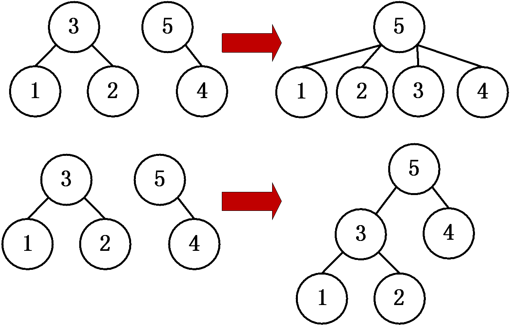
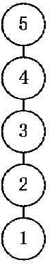

# 引入
并查集（disjoint-set data structure，或union–find data structure）是一种树型数据结构，用于处理互相不相交的集合中元素的查询与合并。

举个例子，现在有n个相互独立的点和m条线，首先读入n和m，接下来m行每行读入x,y，代表点x与点y相连。这些点通过线相互连接，可能构成一张或多张图，最后问共构成几张互不连通的无向图或者任意两节点是否连通。

样例读入：

- 5    3

- 1    3

- 3    2 

- 4    5

由样例读入可得，1、2、3构成一张图，4、5构成一张图，共有2张互不连通的无向图。

初步的思路是利用数组来完成计算：当x、y连通时，将f[x]、f[y]均赋值为y（或x）。最后遍历数组，有多少个不同的值代表了有多少个互不连通的无向图。
<br/><br/>

# 并查集
当然，上述的算法效率太低。以上面的输入为例。假设f[1]、f[2]、f[3]均赋值为3，f[4]、f[5]均赋值为5，此时若有新的一组输入为2 4，那可能需要把数组中所有值为3的元素再度更新为5，每次合并新节点到树中的时间复杂度为$O(n)$。

本质上来说，并查集算法就是一个构建树的过程。f[x] = y其实就是将y作为x的父节点。以上面的输入为例，f[1]、f[2]、f[3]均赋值为3，即构建了一棵根节点为3，叶节点为1和2的树。同理f[4]、f[5]均赋值为5构建了一棵根节点为5，叶节点为4的树。此时对于新的一组输入 2 4，其实只需要f[3]赋值为5即可：



图片上部展示的是原有的较为低效的处理方法，下部展示的是并查集处理方法。

因此，对于新的一组输入，可以对相关节点进行递归来找到其根节点，然后将另一节点合并到根节点上。而对于任意两节点是否连通的查询，则可通过递归找二者的根节点，并判断二者根节点是否一致来判断。
<br/><br/>

# 优化
## 路径压缩
再来看这样一组输入：
- 5 4
- 1 2
- 1 3
- 1 4
- 1 5

按照上述算法，会得到这样一棵树：



按照前文所述的优化算法可高效合并节点，但此法构造出的树深度过大，查询两个节点是否连通时效率过低。
实际上，在递归找根节点的同时中，将沿途的所有节点都指向根节点：
```cpp
int FindRoot(int x) {
    if (x == f[x]) 
        return x;
    return f[x] = FindRoot(f[x]);
}
```
按此方法构造出的树深度更低，查询效率大大提高。

## 按秩合并 

简单来说，就是在合并节点时进行判断，是将小树合并到大树里，还是将大树合并到小树里。举个例子，现在要合并以7为根的树和单个节点8，那么是将7为根的树合并到8里面呢？还是将8合并到7为根的树中呢？


显然，前者将整个树的深度加大了，影响了所有节点的查询效率。

对此，按秩合并的思路，就是在合并节点时对两节点进行判断，将秩小的树合并到秩大的树中。

对于“树的秩”或者“树的大小”的定义，网上的教程并不统一。若以树的深度为判断依据，则按秩合并的优化方法不可和路径压缩一同使用。这是因为在寻找待合并节点的根节点过程中会通过本次递归的次数或者之前递归时的记录来判断树的深度，但在递归的过程中，路径压缩会改变树的深度，从而导致得到的结果不准确。

因此，可以考虑使用树的节点个数来判断树的大小。对于以R为根的树，可另开数组a，a[R]存储以R为根树中节点数量。在合并时通过数组a判断树大小并对a相应元素加和即可。
<br/><br/>

# 相关题目
## LeetCode 547
题目链接：https://leetcode.com/problems/number-of-provinces/

给出n个点，编号0到n-1。并给出二维数组isConnected，isConnected[i][j]如果为1表示点i和j相连，问互不连通的无向图（集合）个数。

做法：以树的节点数作为判断树大小的依据进行合并，同时进行路径压缩。

```cpp
int FindRoot(int* f, int x) {
    return (x == f[x] ? x : (f[x] = FindRoot(f, f[x])));
}

int findCircleNum(int** isConnected, int n, int* isConnectedColSize){
    int ans[n], f[n], num[n];//num[i]存储节点i所在树的节点数量
    int answer = 0;
    for (int i=0; i<n; i++) {
        f[i] = i;
        num[i] = 1;
        ans[i] = 0;
    }
    
    for (int i=0; i<n; i++)
        for (int j=0; j<i; j++) 
            if (isConnected[i][j]) {
                int r1 = FindRoot(f, i);
                int r2 = FindRoot(f, j);
                if (r1 != r2) 
                    if (num[r1] > num[r2]) {
                        num[r1] += num[r2];
                        f[r2] = r1; 
                    }
                    else {
                        num[r2] += num[r1];
                        f[r1] = r2; 
                    }
                           
            }

    for (int i=0; i<n; i++) {
        int t = FindRoot(f, f[i]);
        if (!ans[t]) {
            answer++;
            ans[t] = 1;
        }
    }
    
    return answer;
}
```
程序运行时间为34ms。如果不对树的大小进行判断，仅使用路径压缩，运行时间在44ms。
<br/>

## LeetCode 1202
题目链接：https://leetcode.com/problems/smallest-string-with-swaps/

给出一个仅由小写字母构成的字符串s（长度最大为10^5），并给出n对索引，每对索引[i, j]表示s中第i位的字符和第j位的字符可以互换。互换次数不限。求出通过这n对索引进行互换后，字典序最小的字符串。

每对索引[i, j]表示s[i]和s[j]相互连通，以此构建出并查集。互相连通的位置上的字符均可在这些位置上任意排列。因此，将这些字符按从小到大的顺序由前往后逐个位置填充即可。

逐步优化：
1. 由于字符串仅由小写字母构成，对于相同连通位置上的这些字符，可以直接通过计数排序确定大小顺序，进而逐位置填充。
<br/>
2. 并查集构建完成后，对于任一位置i，如何得知哪些位置与其相互连通？枚举每个位置并查看是否与i有相同根节点即可，时间复杂度为$O(N)$，若对所有位置都枚举一遍，$O(N^2)$绝对超时。
<br/>
3. 用空间换时间。对于任一位置i，均通过一个数组存储与i连通的所有位置信息。对于每个位置，将其存储到其根节点对应的数组中即可。但由于字符串长度为10\^5，开辟这10\^5个数组需要的空间太大。
<br/>
1. 实际上对于任一位置i，不需要在其根节点对应的数组处存储位置信息，仅需存储与其连通的位置上的字符的种类和数量即可。这样一来，对字符串s的从前到后的遍历时，若任一位置i属于某个集合，则直接从该集合（即i的根节点对应的数组）中取出最小的字符填充进去即可。

```cpp
#define N 100005
int f[N];

int FindRoot(int x) {
    return x == f[x] ? x : (f[x] = FindRoot(f[x]));
}

char * smallestStringWithSwaps(char * s, int** pairs, int n, int* pn){
    int len = strlen(s);
    int num[len], chars[len][26];
    //chars[r]存储根节点为r的集合中字符的种类和数量
    memset(chars, 0, sizeof(chars));
    for (int i=0; i<len; i++) {
        f[i] = i;
        num[i] = 1;
    }

    for (int i=0; i<n; i++) {
        int r1 = FindRoot(pairs[i][0]);
        int r2 = FindRoot(pairs[i][1]);
        if (r1 != r2) 
            if (num[r1] > num[r2]) {
                num[r1] += num[r2];
                f[r2] = r1; 
            }
            else {
                num[r2] += num[r1];
                f[r1] = r2; 
            }                 
    }
    //以树的节点数作为判断树大小的依据进行合并，同时进行路径压缩

    for (int i=0; i<len; i++) 
        chars[f[i]][s[i]-'a']++;    //统计集合中字符的种类和数量
   
    for (int i=0; i<len; i++) {
        int r = f[i], start = 0;
        while (!chars[r][start])    //从小到大填充字符
            start++;
        s[i] = start + 'a';
        chars[r][start]--;         
    }

    return s;
}
```

<br/>


## LeetCode 684
题目链接：https://leetcode.com/problems/redundant-connection/

给出了n条边来连接n个点，但由于连接n个点最少仅需要n-1条边，因此有一条边是冗余的，找出这条冗余的边。如果答案不唯一，将输入中最靠后的冗余边输出。

思路：对每条边进行检验，若当前边的两端点无共同祖先，说明当前边连通了这两点，因此是非冗余边。反之为冗余边。为了保证在答案不唯一时将靠后输入的边作为冗余边输出，直接正序检验输入的所有边即可，这样一来，靠前输入的边都会被视为构建树的关键边，最后输入的边自然就会被视为冗余边。
```cpp
int FindRoot(int* f, int x) {
    return (x == f[x] ? x : (f[x] = FindRoot(f, f[x])));
}


int* findRedundantConnection(int** e, int n, int* edgesColSize, int* returnSize){
    *returnSize = 2;
    int* ans = (int*)malloc(2*sizeof(int));
    int f[n+1], num[n+1];
    for (int i=1; i<=n; i++) {
        f[i] = i;
        num[i] = 1;
    }
        
    for (int i=0; i<n; i++) {
        int r1 = FindRoot(f, e[i][0]);
        int r2 = FindRoot(f, e[i][1]);
        if (r1 != r2) {
            if (num[r1] > num[r2]) {
                num[r1] += num[r2];
                f[r2] = r1; 
            }
            else {
                num[r2] += num[r1];
                f[r1] = r2; 
            }
        }
        else {
            ans[0] = e[i][0];
            ans[1] = e[i][1];
            return ans;
        }
    }
    
    return ans;
}
```
<br/>

## LeetCode 990
题目链接：https://leetcode.com/problems/satisfiability-of-equality-equations/

给出n个等式或不等式，每条式子均只有4个字符组成，第一位和第四位为两个小写字母，中间两位为“==”或“!=”，表示两字母相等或不相等。如果这n条式子可以同时成立，返回true，否则返回false。

思路：先根据所有的等式构造出并查集，然后再处理所有的不等式，若不等式中的两字母在同一集合中，则返回false。
```cpp
int FindRoot(int* f, int x) {
    return x == f[x] ? x : (f[x] = FindRoot(f, f[x]));
}

bool equationsPossible(char ** s, int n){
    int f[26];
    for (int i=0; i<26; i++)
        f[i] = i;

    for (int i=0; i<n; i++) 
        if (s[i][1] == '=') {
            int r1 = FindRoot(f, s[i][0] - 'a');
            int r2 = FindRoot(f, s[i][3] - 'a');
            if (r1 != r2) 
                f[r1] = r2;
        }

    for (int i=0; i<n; i++) 
        if (s[i][1] == '!') {
            int r1 = FindRoot(f, s[i][0] - 'a');
            int r2 = FindRoot(f, s[i][3] - 'a');
            if (r1 == r2) 
                return 0;
        }
    return 1;
}

```
<br/>

## LeetCode 1319
题目链接：https://leetcode.com/problems/number-of-operations-to-make-network-connected/

有n台电脑，编号0到n-1，一条网线可以连接两台电脑，电脑可通过这些网线直接或间接地与其他电脑联通。在不增加新网线的情况下，可以任意移动这些网线，令它们连接任意两台电脑，现在给出这些网线的连接信息，问最少移动多少根网线，能让所有电脑相互连接。若无法做到输出-1。

如果要联通所有n台电脑，则最少需要n-1根网线，因此判断下网线数量即可解决输出为-1的情况。

使用并查集找出互不连通的无向图的个数，无向图的个数减去1即为需要移动的网线数。
```cpp
int FindRoot(int* f, int x) {
    return (x == f[x] ? x : (f[x] = FindRoot(f, f[x])));
}

int makeConnected(int n, int** connections, int connectionsSize, int* connectionsColSize){
    if (connectionsSize < n-1)
        return -1;

    int f[n], num[n], answer = 0;
    bool ans[n];
    memset(ans, 0, sizeof(ans));
    for (int i=0; i<n; i++) {
        f[i] = i;
        num[i] = 1;
    }        

    for (int i=0; i<connectionsSize; i++) {
        int r1 = FindRoot(f, connections[i][0]);
        int r2 = FindRoot(f, connections[i][1]);
        if (r1 != r2) 
            if (num[r1] > num[r2]) {
                num[r1] += num[r2];
                f[r2] = r1; 
            }
            else {
                num[r2] += num[r1];
                f[r1] = r2; 
            }  
    }

    for (int i=0; i<n; i++) {
        int t = FindRoot(f, f[i]);
        if (!ans[t]) {
            answer++;
            ans[t] = 1;
        }
    }

    return answer-1;
}
```
<br/>

## LeetCode 1562
题目链接：https://leetcode.com/problems/find-latest-group-of-size-m/

有一个含n个数的数组，每个数一开始被置为0。接下来的n步，每一步都会将数组中的某个数置为1。假如经过第i步操作后，数组中存在连续m个1构成的子数组，则输出i。若有多个符合的答案，返回步数靠后的答案。

使用并查集算法，连续的“1”会被归到同一个集合。在某一步中，数组中的某个数$a[i]$被置为1，此时对该数的前一位和后一位进行判断，如果前一位或后一位也为1，则可以将$a[i]$合并到前面或后面的集合中。合并时采用按秩合并可以记录每个集合中“1”的数量，等于m则记录该答案。

使用变量sum记录数组中满足条件的子数组数量。假设第i步操作后没有构成符合条件的子数组，但sum仍大于0的话，说明之前形成的子数组在第i步没有被影响，则一样需要记录答案i。
```cpp


int FindRoot(int* f, int x) {
    return (x == f[x] ? x : (f[x] = FindRoot(f, f[x])));
}

int findLatestStep(int* a, int n, int m){
    int f[n+2];
    int num[n+2];
    int sum = 0; // 统计当前数组中，连续m个1的子数组数量
    bool b[n+2]; 
    memset(b, 0, sizeof(b));
    //b为被操作的数组，一开始所有元素置为0
    for (int i=0; i<=n+1; i++) {
        f[i] = i;
        num[i] = 1;
    }

    int ans = -1, last = -1;
    for (int i=0; i<n; i++) {
        int now = a[i];
        b[now] = 1;
        if (b[now-1]) {
            int r = FindRoot(f, now-1);
            if (num[r]==m)
                sum--; //破坏了原来符合条件的子数组，sum减一
            num[r] += 1;
            f[now] = r; 
        }
        if (b[now+1]) {
            int r1 = FindRoot(f, now);
            int r2 = FindRoot(f, now+1);
            if (num[r2]==m)
                sum--;//破坏了原来符合条件的子数组，sum减一
            if (r1 != r2) 
                if (num[r1] > num[r2]) {
                    num[r1] += num[r2];
                    f[r2] = r1; 
                }
                else {
                    num[r2] += num[r1];
                    f[r1] = r2; 
                }
        }

        if (num[FindRoot(f, now)] == m) 
            sum++; //形成了符合条件的子数组，sum加一

        if (sum)
            ans = i+1;
    }

    return ans;
}
```
<br/><br/>

# 参考资料及部分图片出处
[算法学习笔记(1) : 并查集](https://zhuanlan.zhihu.com/p/93647900)
