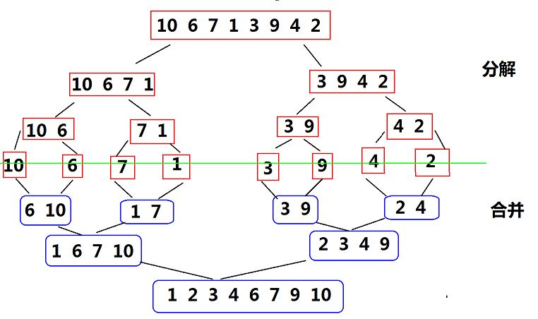

# 归并排序（Merge Sort）
一般指二路归并排序，是稳定排序，原理如下：

归并排序分为两个过程，一是通过递归不断将数组二分，直到无法再二分进行第二步：合并，具体如图：

二分过程通过递归很好实现，合并过程的详细过程为：

首先要明确两个事实：一是这两个要合并的序列不一定等长（数组总长度不可能总是2的次方），但这并不妨碍合并过程；二是因为通过递归，每个要合并的序列本身已经是有序的了。

合并过程如下：另开一个数组c，存储合并后的有序（这里以降序排序为例）序列，设两个待合并序列为a和b，对a[1]与b[1]进行比较，若a[1]更大，则将a[1]放入c[1]，a、c指针后移。然后比较a[2]与b[1]，较大者放入c[2]并移动指针，以此类推。当a或b中全部数字移入c中，可将另一序列中剩余数字按原顺序一次性移入。最后将数组c中的有序序列移回原数组。

## 递归写法
```cpp
//lef为前一个序列的首坐标，rig为后一个序列的首坐标
void JustMerge(int* a, int n, int lef, int rig, int step){
    int b[step*2], len = 0; 
    int i = lef, j = rig;
    int m = n<rig+step ? n : rig+step; 
    //当后一个序列的长度不足step时，防止越界
    while (i<rig && j<m){
        if (a[i]<a[j]) 
            b[len++] = a[i++];
        else 
            b[len++] = a[j++];
    }

    while (i<rig)
        b[len++] = a[i++];
    while (j<m)
        b[len++] = a[j++];    
 
    for (int k=lef; k<m; k++) 
        a[k] = b[k-lef];
}

//指定排序范围：从a的第i项到第j项
void MergeSort(int *a, int n, int i, int j){
    if (i == j) return; 
    int mid = i + (j-i)/2;
    MergeSort(a, n, i, mid);
    MergeSort(a, n, mid+1, j);    
    JustMerge(a, n, i, mid+1, mid+1-i);
}
```
## 非递归写法
通过上图可知，一开始合并时，每个序列长度为1（仅一个数字），然后当所有长度为1的序列两两合并后，每个待合并序列长度为2，然后是4、8、16……因此，我们可以省去递归二分的过程，直接通过上述规律定相应数组下标进行合并。
```cpp
void MergeSort(int *a, int n) {
    int step = 1, lef, rig; 
    //lef为前一个序列的首坐标，rig为后一个序列的首坐标
    while (step < n){
        lef = 0;
        while (lef<n) {
            rig = lef + step;
            if (rig>=n)
                break;
            JustMerge(a, n, lef, rig, step);
            lef = rig + step;
        }
        step *= 2;
    }
}
```
<br/><br/>

# 参考资料及部分图片来源
[归并排序 —— 递归实现 + 非递归实现](https://www.cnblogs.com/jijizhazha/p/6127274.html)
