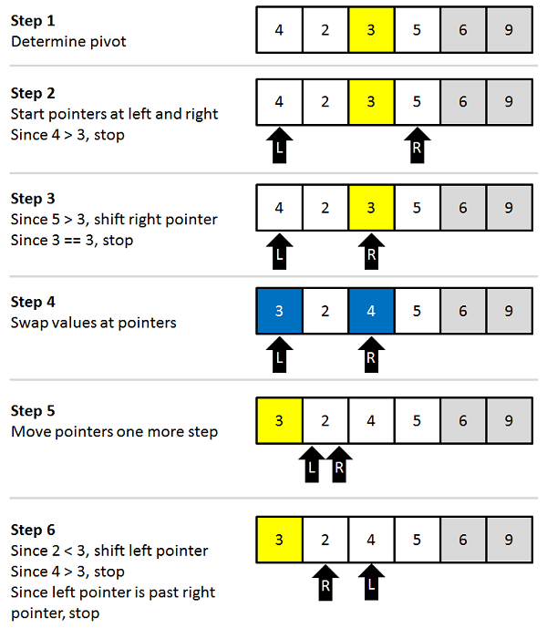

# 快速排序（Quick Sort）
#### 原理解析
步骤如下：

1. 对于要排序的区间，先定一个”基准数“k，下面的程序以区间中心的数为k。（可以随机挑选基准数，也可指定区间第一个或最后一个）

2. 从区间末端向前，找到第一个大于等于k的数；同时从区间开头向后，找到第一个小于等于k的数。

3. 将找到的这两个数交换位置，然后从当前位置继续向前（向后）找，重复步骤2，3，直到遍历完整个区间。

4. 遍历完整个区间后，k已经被放置到正确的位置上，在k前面的数都比它小，在k后面的数都比它大，这个时候采用分治策略，对k之前的区间和k之后的区间重复1、2、3、4步。

举个例子，以5为基准数：


<br/>
接下来，以3为基准数：


#### 代码
```cpp
void QuickSort(int* a, int lef, int rig){
    if (lef >= rig) return;
    int i = lef, j = rig;
    int mid = a[(i+j)/2];
    while (i<=j){   //这里和下面if处的判断条件中都有等号，虽然i==j的情况下循环和swap没有意义，但仍需要i和j的移动，否则会进入死循环
        while (a[i]<mid) i++;    //这里为了能移动基准数，所以判断条件不能带等号
        while (a[j]>mid) j--;
        if (i<=j) swap(a[i++], a[j--]);     
    }
    QuickSort(a, i, rig);
    QuickSort(a, lef, j);
}
```
<br/><br/>

# 参考资料及部分图片来源
[Quicksort 快速排序算法](https://www.cnblogs.com/chuangweili/articles/5159645.html)
