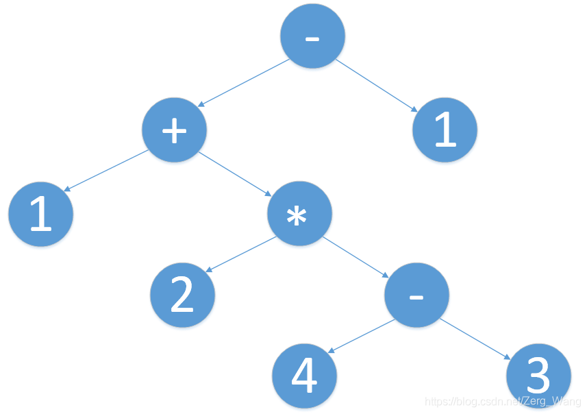

# 单调栈

如果要频繁对栈中元素取最值，可考虑在普通栈之外再开一个单调栈（栈中元素单调，且栈顶元素一定是最值）。单调栈的操作与普通栈同步。假设需要频繁取栈中的最小值，则每次有新元素入栈时，若新元素小于单调栈的栈顶，则新元素同时入单调栈。栈顶元素出栈时，若该元素与单调栈栈顶元素相等，则两栈同时pop。

[LeetCode 155](https://leetcode.com/problems/min-stack/)：设计一个栈，可分别在$O(1)$时间内完成入栈、出栈、获得栈顶元素以及获得栈中最小值的操作。

```cpp
typedef struct {
    int s[30000], min[30000];
    int n, m;
} MinStack;

MinStack* minStackCreate() {
    MinStack* obj = (MinStack*)malloc(sizeof(MinStack));
    obj->n = obj->m = 0;
    return obj;
}

void minStackPush(MinStack* obj, int val) {
    obj->s[obj->n++] = val;
    if (!obj->m || val <= obj->min[obj->m-1]) 
        obj->min[obj->m++] = val;
}

void minStackPop(MinStack* obj) {
    if (!obj->n)
        return;
    obj->n--;
    if (obj->s[obj->n] == obj->min[obj->m-1])
        obj->m--;
}

int minStackTop(MinStack* obj) {
    return obj->s[obj->n-1];
}

int minStackGetMin(MinStack* obj) {
    return obj->min[obj->m-1];
}

void minStackFree(MinStack* obj) {
    free(obj);
}
```
<br/><br/>

# 利用栈实现简易计算器
#### 思路
输入数学表达式，输出结果。其中符号支持加减乘除、乘方及括号，数字支持小数及负数。

开两个数组，一个数组为符号栈，一个数组为数字栈。字符串读入表达式并逐位处理，有数字就截取下来存入数字栈，运算符号截下来存入符号栈，若发现当前符号优先级小于等于前一个符号的优先级，就要把前面那部分的值计算出来，例如3*2+2，*的优先级高于+，所以先算3*2再算6+2。

如果遇到左括号直接进入符号栈，遇到了右括号就把右括号前的所有表达式的值计算出来，直到遇见左括号。
#### 代码
```cpp
#include <cmath>
#include <string>
#include <stdio.h>
#include <iostream>
#include <cstring>
using namespace std;

#define MAXN 5000 
char c[MAXN], oper[MAXN];
double number[MAXN];
int operNum, numNum, p;


int GetPriority(int n){//返回当前符号优先级，括号最大，乘除、乘方其次，最后是加减
    if (oper[n] == '+' || oper[n] == '-') 
        return 0;
    if (oper[n] == '*' || oper[n] == '/' || oper[n] == '^') 
        return 1;
    return 2;
}

void Calc(){
    double res = 1;
    double a2 = number[numNum--];
    double a1 = number[numNum];    
    char handle = oper[--operNum];
    oper[operNum] = oper[operNum + 1];    
    if (handle == '+') res = a1 + a2;
    if (handle == '-') res = a1 - a2;
    if (handle == '*') res = a1 * a2;
    if (handle == '/') res = a1 * 1.0 / a2;
    if (handle == '^') {
        for (int i = 0;i < abs(a2); i++) 
            res = res * a1;
        if (a2<0) res = 1.0 / res;//注意幂为负数的情况
    }
    number[numNum] = res;
}
 
void GetNumber(){//提取数字，注意小数点的处理
    int n = 1, start_p = p;
    char c_num[MAXN];    
    while ((c[p] <= '9' && c[p] >= '0') || c[p] == '.') {    
        n++;
        p++;
    }
    strncpy(c_num, c+start_p, n);
    sscanf(c_num, "%lf", &number[++numNum]);
    if (c[start_p-1] == '-' && (c[start_p-2] == '(' || start_p == 1)){
        number[numNum] = -number[numNum];
        operNum--;
    }//若直接输入负数（特征是负号前为左括号），不可把负号处理为运算符
}
 
void GetOperator(){//提取符号
    oper[++operNum] = c[p];
    while (operNum > 1 && oper[operNum-1] != '(' && GetPriority(operNum) <= GetPriority(operNum-1)) 
        Calc(); 
}

int main(){
    scanf("%s", &c);

    while (p < strlen(c)){
        if (c[p] >= '0' && c[p] <= '9') 
            GetNumber();
        if (c[p] == '+' || c[p] == '-' || c[p] == '*' || c[p] == '/' || c[p] == '^')
            GetOperator();
        if (c[p] == '(') oper[++operNum] = '(';
        if (c[p] == ')'){
            oper[++operNum] = ')';
            while (operNum > 1 && oper[operNum-1] != '(')
                Calc();
            operNum -= 2;
        }
        p++;
    }

    oper[++operNum] = ')';
    while (operNum > 1) 
        Calc();    
    printf("%lf", number[1]);
    return 0;
}
```


#### 更高端的实现方法
对于表达式1+2×(4-3)-1，我们可以将其以二叉树的形式进行表达，如下图：

叶节点为数字，非叶节点为操作符，优先级越低的操作符深度越低，同优先级后执行的操作会放在更靠近根的地方。（例如1+2-3，-后执行，为根节点）

通过上图可知，1+2×4-3-1其实是该二叉树的中序遍历，其实就是我们所习惯的表达式去掉括号了而已。我们所习惯的这种带括号的表达式称为中缀表达式。虽然中序遍历没有括号，但括号内的内容是会被连续访问的。如上图，4-3作为优先级最高的操作，处于树的最深处，遍历时是会作为一个整体进行遍历的，不会访问到其他节点。

若对这样的二叉树进行先序遍历及后序遍历，可分别得到前缀表达式与后缀表达式（又称逆波兰表达式）：-+1*2-431以及1243-*+1-。这两类就没有括号。不同于人类，计算机对后缀或前缀表达式的逻辑会有更为便捷的处理，以后缀表达式为例：从左至右扫描后缀表达式，遇到数字直接进栈，遇到操作符，将操作符前的两个数字出栈，并运算，结果入栈，直到栈空，以上图举个实际的例子：

- 首先，1、2、4、3依次入栈。
- 其次，读到-，弹出栈中最外的两个数字4和3，与-运算得到1，1入栈，此时栈中为1、2、1。
- 再次，读到*，弹出栈最外的两个数2和1，运算得到2并压入栈，此时栈中为1、2。
- 复次，读到+，弹出1和2，运算后压入3，此时栈中只有3一个数字。
- 最后，遇到1，进栈，再读到-，执行3-1得到2入栈，结束，最后结果为2。

[LeetCode 150](https://leetcode.com/problems/evaluate-reverse-polish-notation/)题目内容与上述类似，给出后缀表达式s，计算出表达式的结果，代码如下：
```cpp
int evalRPN(char ** s, int n){
    int num[5000];
    int size = 0;
    for (int i=0; i<n; i++) 
        if ((s[i][0]>='0' && s[i][0]<='9') || strlen(s[i])>1) 
            sscanf(s[i], "%d", &num[size++]);
        else {
            int x = num[size-2];
            int y = num[size-1];
            if (s[i][0] == '+')
                x = x+y;
            if (s[i][0] == '-')
                x = x-y;
            if (s[i][0] == '*')
                x = x*y;
            if (s[i][0] == '/')
                x = x/y;
            size--;
            num[size-1] = x;
        }
    return num[0];
}
```

若要将中缀表达式转换为树，可通过对表达式进行检索，找到优先级最低且后执行的一个操作符，然后将该操作符左侧表达式作为左子树，右侧表达式作为右子树，并对两子树递归进行上述处理，从而构建出表达式树，然后后缀遍历即可。

若要将中缀表达式直接转换为后缀表达式，思路其实和本文开头程序思路差不多，这里就不再赘述。
