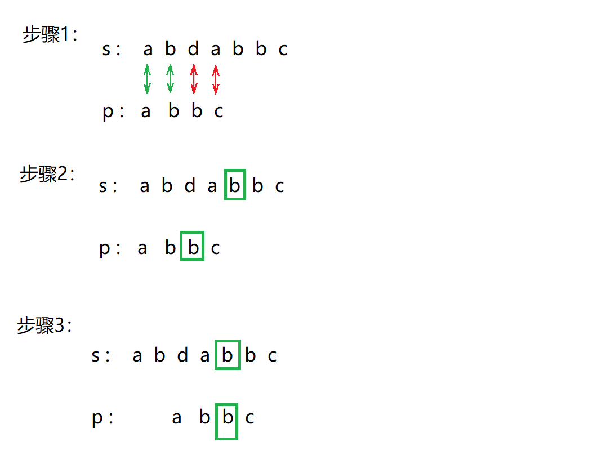
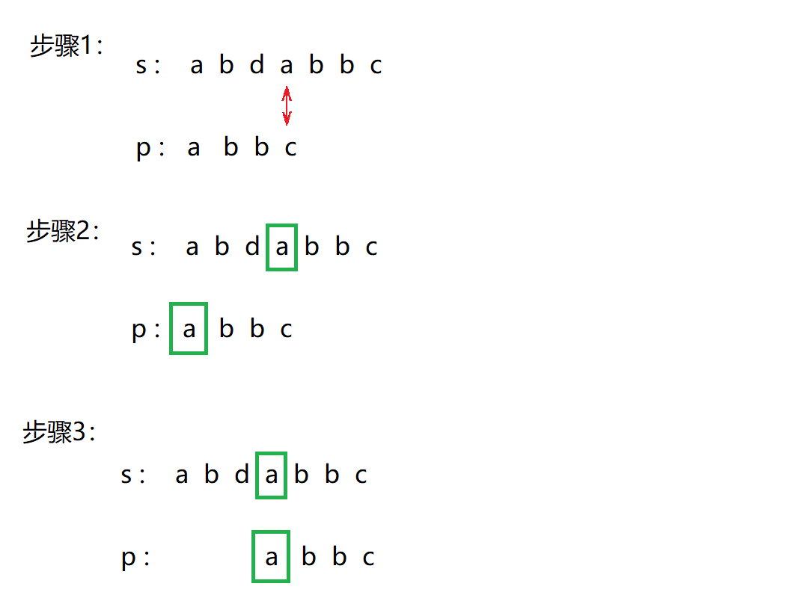

# Quick Search算法
## 算法简介
Quick Search算法属于Sunday算法的一种。Sunday算法由Daniel M Sunday在1990年提出。论文原文：[A VERV FAST SU6STRINC SEARCH ALGORITHM](https://dl.acm.org/doi/pdf/10.1145/79173.79184)

在论文中，作者提出了三个不同的算法：Quick Search算法、Maximal Shift算法以及Optimal Mismatch算法。作者证明了这三种算法效率均优于Boyer-Moore算法。其中，Optimal Mismatch略微好于前两者。但在原理及应用上，Quick Search最为简单。

Quick Search可以被视为一种简化的Boyer-Moore算法。该算法仅使用Boyer-Moore中的“坏字符”规则。此外，与Boyer-Moore算法不同，Quick Search在匹配字符串时是按从头到尾的顺序匹配的。

在下面的描述中，字符串s为目标串（主串、被匹配串）,长度为n；字符串p被称为模式串（子串、匹配串），长度为m。
## 算法步骤

首先将字符串s与p头部对齐，开始以下步骤：
   
1. 从p的头部至尾部开始逐一与s匹配

2. 若匹配成功返回对应位置。若匹配失败，则聚焦到s与p匹配范围外的第一个字符（图中绿色框）。
   
3. 由于绿色框中的字符是b，因此向右移动p，令p中最后一个字符“b”与绿色框对齐，如果p中不存在字符“b”，则将整个p向后移动m+1位。完成后重复步骤1、2、3。




以上匹配操作的时间复杂度为$O(n)$。为了快速获知任意字符在p中最后出现的位置，在执行以上匹配之前需要进行预处理：

基于字符串p构造一个数组a，数组长度等于字符串中所有可能出现的字符数（一般为256），字符对应的数组元素为该字符在p中最后出现的位置与字符串末端的距离+1，举个例子，字符串p为“abc”,则a['a'] = 3,  a['b'] = 2,  a['c'] = 1。其他未出现的字符对应的数组元素则统一赋值为p的长度+1。预处理操作的时间复杂度为$O(m)$

在匹配过程中，对于s中的任意一个字符char，通过a[char]即可得到p向后移动的位数。

## 代码
```cpp
#define ALLCHAR 256

int QuickSearch(char* s, char *p) {
    int n = strlen(s), m = strlen(p);
    int a[ALLCHAR];
    for (int i=0; i<ALLCHAR; ++i)   //初始化数组a
        a[i] = m + 1;
    for (int i=0; i<m; ++i)         //预处理
        a[p[i]] = m - i; 
    
    int now = 0;
    while (now <= n - m) {
        if (memcmp(p, s + now, m) == 0)
            return now;
        now += a[s[now + m]];            
    }

    return -1;
}
```
<br/><br/>

# Horspool算法
## 算法简介
Horspool同样是简化版的Boyer-Moore算法。该算法仅使用“坏字符”规则，字符串匹配时与Boyer-Moore算法一样，按从尾到头的顺序。
## 算法步骤
首先将字符串s与p头部对齐，开始以下步骤：
   
1. 从p的尾部至头部开始逐一与s匹配

2. 若匹配成功返回对应位置。若匹配失败，则聚焦到s与p匹配范围内的最后一个字符（图中绿色框），从下图中可知该字符为a。
3. 向右移动p，令p中除最后一位外最后出现的绿框字符（也就是“a”）与s中的绿框字符对齐，如果p中不存在对应的绿框字符，则将整个p向后移动m位。回到步骤1，重复步骤1、2、3。



同理，在执行以上匹配操作前需要预处理：基于字符串p构造一个数组a，数组长度等于字符串中所有可能出现的字符数（一般为256）,字符对应的数组元素为该字符在p中除最后一位外，最后出现的位置与字符串末端的距离，举个例子，字符串p为“abc”,则a['a'] = 2,  a['b'] = 1,  a['c'] = 3。其他未出现的字符对应的数组元素则统一赋值为p的长度。
## 代码
```cpp
#define ALLCHAR 256

int Horspool(char *s, char *p) {
    int n = strlen(s), m = strlen(p);
    int a[ALLCHAR];
    
    for (int i=0; i<ALLCHAR; ++i)
        a[i] = m;
    for (int i=0; i<m-1; ++i)
        a[p[i]] = m-i-1;

    int now = 0;
    while (now <= n-m) {
        if (p[m-1]==s[now+m-1] && memcmp(p, s+now, m-1)==0)
            return now;
        now += a[s[now+m-1]];
    }
    return -1;
}
```
<br/><br/>

# 参考资料
[EXACT STRING MATCHING ALGORITHMS](http://www-igm.univ-mlv.fr/~lecroq/string/index.html)

[Quick Search algorithm](http://www-igm.univ-mlv.fr/~lecroq/string/node19.html#SECTION00190)

[A VERV FAST SU6STRINC SEARCH ALGORITHM](https://dl.acm.org/doi/pdf/10.1145/79173.79184)

[Horspool algorithm](http://www-igm.univ-mlv.fr/~lecroq/string/node18.html#SECTION00180)