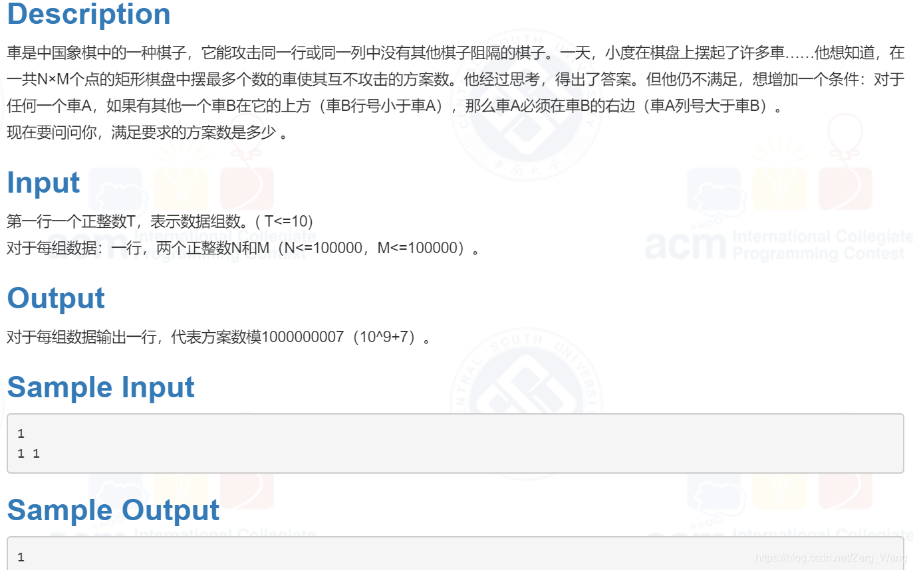

# 筛法求质数时间空间双优化
思路来源：MoreWindows的博客，原文地址：http://blog.csdn.net/morewindows/article/details/7347459

#### 时间优化

在利用质数筛除合数的时候，我们发现大量合数会被重复筛去（以合数10为例，作为2的倍数会被筛一次，作为5的倍数又会被筛一次），因此思路就是尽量减少对合数的重复访问与筛选。

算法步骤如下：

首先，每个合数都有一个最小质因数，例如18的最小质因数是2，630的最小质因数是7。这样一来，可以令每个合数仅作为其最小质因数的倍数时被筛去，即可完全避免合数的重复访问：
```cpp         
for (int i=2; i<=n; i++) {        //求n以内的质数
    if (!f[i]) prime[primeN++]=i; //找到质数，加入质数表
    for (int j=0;(j<primeN) && (i*prime[j]<=n);j++) {  //从小到大枚举质数
        f[i*prime[j]] = 1;
        if (i%prime[j]==0) break;
    } 
}
```
这里解释一下break语句。
设合数 p = i * prime[j+1]。当 i 为 prime[j] 的倍数时，p 必有质因数 prime[j]。由于 prime[j] 必定比 prime[j+1]小，p 之后必定会作为prime[j]的倍数被筛掉，因此不必重复访问，直接break。
举个例子，当 i = 6, prime[j] = 2，prime[j+1] = 3时，12被筛去，如果不break，18会作为3的倍数被筛掉。但18也是2的倍数，当 i = 9时18必定会被筛去。

#### 空间优化
如果使用一个bool数组来标记每个数是否为质数，这意味着对于每个数的判断都需要一个字节，即8位的空间。实际上，8位二进制数完全可以为8个数进行标记。这样一来空间消耗可减少到原来的1/8。同理，一个int型变量（4字节，32位）即可为32个数作标记。

**筛法求质数终极版：**
```cpp
#include <stdio.h>
#include <stdlib.h>
#define MAXN 1000005
int prime[MAXN / 10], n, primeN;
 
int GetPrime(int n, int *prime) {//返回n以内质数的个数
    int primeN = 0;
    int f[n / 8 + 1];
    memset(prime, sizeof(prime), 0);
    memset(f, sizeof(f), 0);

    for (int i = 2; i <= n; i++) {
        if (!(f[i/32] & (1 << (i % 32)))) 
            prime[primeN++] = i;         
        for (int j = 0; (j < primeN) && (i * prime[j] <= n); j++) {
            int t = i * prime[j];
            f[t / 32] |= (1 << (t % 32));
            if (t == 0) break;
        }  
    }
    return primeN;
}
 
int main() {
    scanf("%d",&n);
    primeN = GetPrime(n, prime);
    for (int i = 0; i < primeN; i++) printf("%d ", prime[i]);
}
```
<br/><br/>

# 组合数算法优化
#### 引入
先看一道题：



其实就是求组合数$C_n^m = \frac{n!}{m!(n-m)!}$ 。但如果按原公式计算，不仅超时，而且突破了int范围。

实际上，由上面的公式可知计算时会有大量的重复计算，且分子分母会约掉很多的数。因此，可考虑将所有的阶乘分解，然后分子分母上下相消，达到优化的目的。

更进一步的思路：我们可以将阶乘结果视为质因数的乘积，然后只需知道阶乘结果中包含的质因数各有多少个即可，再结合取模运算规则(a * b) % p = (a % p * b % p) % p，一边累乘一边mod，就能避免超过int范围。

#### 代码
```cpp
#include <math.h>
#include <stdio.h>
#include <stdlib.h>

#define MOD 1000000007
int t, n, m, sum, total, prime[10000];
unsigned long long ans;
int Calc(int r,int p); //计算 r! 中包含了多少个质因数p
int GetPrime(int n, int *prime)
int main() {
    sum = GetPrime(100000, prime); 
    //求出100000以内的所有质数，保存在数组p中
    scanf("%d", &t);
    while (t--) {
        ans = 1;
        scanf("%d%d", &n, &m);
        if (m>n) {  //交换两数，保证n>=m
            n ^= m;
            m ^= n;  
            n ^= m;
        }
        for (int i=0; i<sum; i++) {
            total = Calc(n,prime[i]) - Calc(n-m,prime[i]) - Calc(m,prime[i]);
            for (int j=0; j<total; j++) ans=ans*prime[i] % MOD;
        }
        printf("%lld\n", ans % MOD); 
    }
    return 0;
}

int Calc(int r,int p) {
    if (r < p) return 0;
    return Calc(r / p, p) + r / p;
}
```

#### 函数Calc详解

当 $r <p$ 时，显然 $r!$ 无法分解出因数 $p$ 。

当 $r \geq p$ 时，$r!$ 中每隔 $p$ 个数就会出现一个 $p$ 的倍数。但当 $r \geq p^2$时，在这些 $p$ 的倍数中，每隔 $p^2$ 个数会出现一个  $p^2$ 的倍数。一旦出现一个 $p^2$ 的倍数，质因数的数量要加2。同理， 当 $r \geq p^3$ 时每隔 $p^3$ 个数会出现一个 $p^3$ 的倍数，同时质因数的数量要加3……

由于  $p$ 的倍数每隔 $p$ 出现一次，其数量为 $r/p$（向下取整）。$p^2$ 的倍数每隔 $p^2$ 出现一次，其数量为 $r/p^2$（向下取整）。$p^3$ 的倍数每隔 $p^3$ 出现一次，其数量为 $r/p^3$（向下取整），以此类推。则质因数 $p$ 的数量为 $r/p + r/p^2 + r/p^3 + ...$

在统计 $p$ 的倍数的数量时，$p^2$ 的倍数也被算到里面了，因此在计算质因数 $p$ 的数量时，$r/p^2$ 项不需要乘以2。同理，在统计 $p$ 的倍数以及$p^2$ 的倍数的数量时，$p^3$ 的倍数均被算到里面了，因此在计算质因数 $p$ 的数量时，$r/p^3$ 项也不需要乘以3，以此类推。