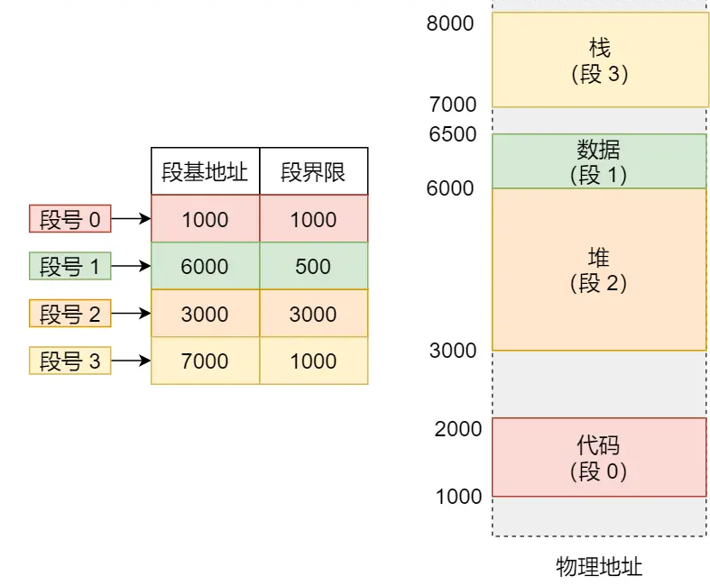
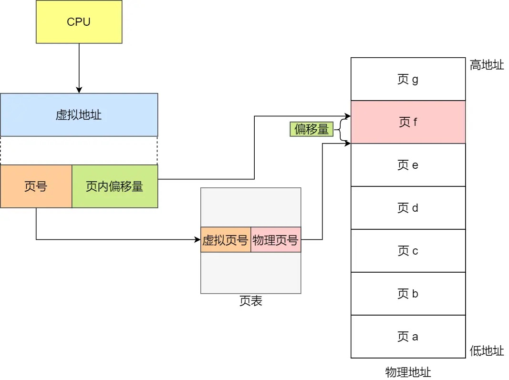
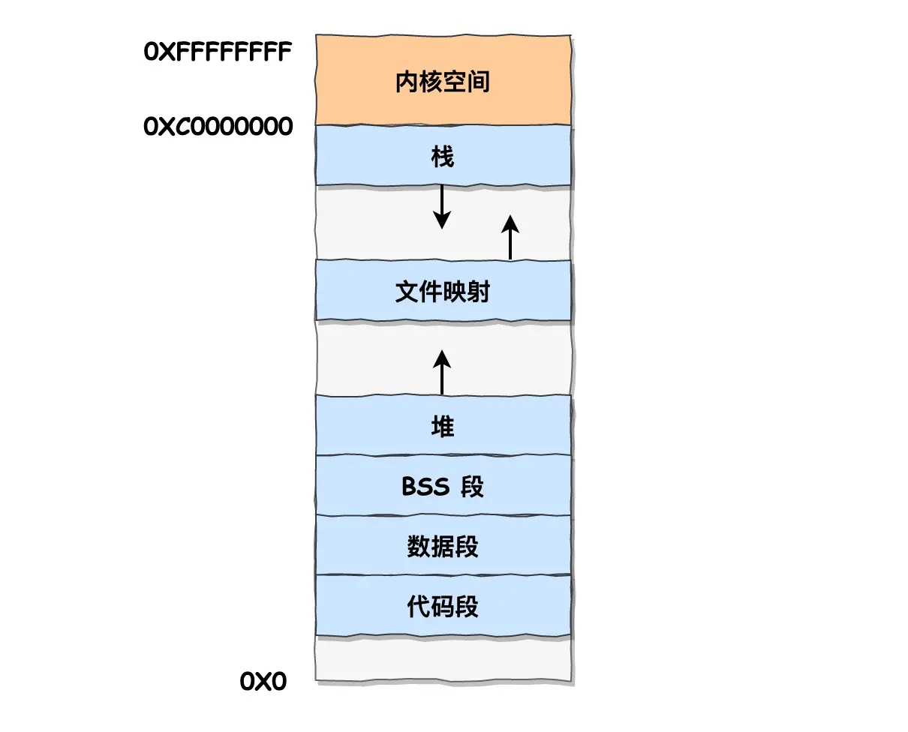

# 虚拟内存与物理内存

多个进程对同一物理内存地址进行修改可能导致无法预料的错误。对此，操作系统使用虚拟内存技术，每个虚拟内存地址与实际上的物理内存地址作映射。每个进程被相互隔离开，在自己分配到的虚拟内存中操作。

操作系统通过内存管理单元（MMU）来管理虚拟内存以及两种内存之间的映射关系。具体管理方式有分段、分页、段页三种。

# 内存分段
简单来说，就是将内存分成多个段，每个段使用“段基地址”（段的起始地址）以及“段界限”（段的长度）两个值来描述。所有的段的信息被存储在段表中。每个进程都有自己对应的段表，不同段表对应不同的物理内存区域，从而隔离开每个进程，防止多个进程操作同一物理内存地址。

如图，左侧即为段表，描述了4个段的信息。这4个段在物理地址中按右侧方式排列。

进程在操作虚拟内存时，通过段号和偏移量来描述虚拟内存地址。假设进程操作段号为2，偏移量为100的虚拟内存，MMU会根据段表，找到段号2的段基地址（3000），然后操作地址3000+100=3100的物理内存。

内存分段会导致外部内存碎片的问题。例如：

| 物理内存 |
| --| 
| 进程1：100MB |
| 进程2：50MB |
| 进程3：100MB |
| 空闲：10 MB |

假设此时进程2结束，释放了50MB，现在空闲内存达到了60MB，但由于这两块空闲内存并不连续，因此无法一次性分配60MB内存给其他进程。

对此，可使用交换内存（即Swap内存）将部分物理内存转移到硬盘中，再从硬盘转移到紧贴在已使用的物理内存的地方，来整合零碎的闲置内存。但由于硬盘读写效率远低于内存，所以这一过程非常影响效率。

# 内存分页
## 简介

在内存分页机制中，物理内存中每个连续的4KB内存空间被称为一“页”。物理内存中每个页的信息被存储在页表中。进程通过虚拟页号和偏移量来访问虚拟内存。而MMU通过页表，找到虚拟页号对应的物理页号的起始地址，然后基于该地址加上偏移量后得到物理地址，再操作对应的物理内存。

由于页在物理内存上是连续划分且逐个分配给进程，因此不会存在外部碎片问题。另外，如果需要与外部硬盘交换数据，由于单个页仅4KB，硬盘读写速度也会比较快。然而，由于单个页最小为4KB。如果进程需要的内存空间小于4KB，也只能分配一个完整的页给进程。因此内存分页会带来内部碎片问题。

## 缺页与换页
每个进程都有其自己的页表。对于32位的Linux系统，每个进程一开始会分配4GB的虚拟内存空间和一个空白的页表（32位系统中，单个指针占用32bit，可以指向最多2^32个地址，即4GB的内存空间）。但是该进程的内存空间仅仅是逻辑上的，实际上并没有分配那么多空间。当进程需要某些使用某些内存空间时（此时进程会访问某些虚拟页号），但页表上并没有对应的物理页号，此时发生了缺页异常，操作系统此时会在物理内存中分配一个空闲的页给该进程，并更新页表，令该物理页与虚拟页形成映射。

当进程访问的虚拟页号在页表中找不到对应的物理页号时会发生缺页。如果此时物理内存中还有空闲的页，则会分配一个空闲页给进程，并更新页表。若没有空闲页了，就会产生换页操作。

换页操作通过交换内存（即Swap内存）进行，将进程内存空间中某个页的数据暂时写到硬盘上（该过程称为“换出”），这样内存就有空间加载进程当前需要访问的页。以后如果需要硬盘上的页的数据，再从硬盘上加载回来（该过程称为“换入”）。

那么，当需要换页时，如何决定把哪些页的数据写到硬盘上呢？这涉及到页面置换算法。

## 页面置换算法

- 最近最久未使用的置换算法（Least Recent Used，LRU）：将该进程占用的所有页中，最长时间没读写过的页换出到硬盘上。

- 先进先出置换算法（First In First Out，FIFO）：把进程占用最久（也就是最早分配给内存）的页换出到硬盘上。

- 最不经常使用算法（Least Frequently Used，LFU）：一段时间内进程访问最少次数最少的页会被换出到硬盘上。

- 时钟置换算法（CLOCK，又称最近未用算法(Not Recently Used，NRU)：进程内存空间中的页使用环形链表存储，每个页还会增添一个标志位。如果访问内存中的某个页，该页的标志位设为1，然后指针前移。如果发生换页，则从指针开始逐个遍历，如果指向的页标志位为1，则设为0；若指向的页标志位为0，则将该页换出，指针前移。

- 最佳置换算法(Optimal，OPT)：假设我事先知道进程未来依次要访问那些页，当发生缺页时，就可以将进程未来最长时间都不访问的页换出。该算法只是一种理想算法，无法实现。因为无法事先得知进程未来要访问哪些页。因此该算法用于和前面所述算法进行比较。

## 多级页表

32位的Linux系统会给每个进程分配4GB的虚拟内存空间，一个页的大小为4KB，也就是说单个进程最多可以拥有2^20个页。假设页表一项记录需要4字节，那需要为每个页表预留4MB的内存空间。考虑到每个进程都有自己的页表，所有页表的存储会耗费巨大的内存空间。

对此，可以考虑使用多级页表。一级页表有2^10项，其中每项指向一张二级页表。二级页表也有2^10项，用于虚拟页和物理页的映射。由于大部分情况下，进程不会使用完其全部的4GB内存，因此某些二级页表中对应的页都没被使用。在这种情况下，该二级页表就无需生成，从而节省内存空间。

## 快表（TLB）
对于64位系统，可能会用到四级页表。这样一来，通过虚拟页查找物理页，要依次查找一级页表、二级页表、三级页表、四级页表，总计通过4次查找才能找到物理页，内存访问到延迟就增大了。

对此，CPU芯片中加入了一个叫TLB的缓存（又称为页表缓存、快表）。进程最常访问的页会存储在快表中。当进程需要访问某些页时，会先访问快表，如果没找到再通过多级页表去查询。

# Linux内存布局
为了兼容Intel CPU的设计，Linux系统实际使用段页来管理内存。系统会分配一个4GB的虚拟内存段给每个进程，这4GB又分为1GB的内核空间（当进程在内核态时才能访问）和3GB的用户空间（进程在内核态或用户态均可访问）。在用户空间中，Linux系统使用分页来管理内存。因此对于进程而言，仅需虚拟页号和偏移量即可定位虚拟内存。

每个进程虽然分配了4GB的虚拟内存，但其中的内核空间是所有进程共享的，因此每个进程最多占用其3GB的用户空间，下图为用户空间的主要构成：

- 代码段（.text段）主要存储了二进制的可执行文件。C/C++中的各种函数（普通函数、类的静态与非静态成员函数、main等）都会被编译成可执行代码存储在此。代码段的内存分配完成后就处于只读状态，不允许对其内部数据作修改。

- 数据段实际上又可以分成.data段和.rodata段。前者存储已初始化的静态变量和全局变量；后者存储不允许修改的常量，如全局常量、字符串常量、虚函数表等。

- BSS段（.bss段）存储未初始化的静态变量和全局变量（初始化为0的全局变量视为未初始化，也会存在此处）；如果之后在代码中对这些变量赋值了，它们也不会移动到数据段中。

- 文件映射段存储动态库、共享内存等；

- 堆从低地址向上存储动态分配内存的变量；

- 栈存储自动分配的临时变量，而且是唯一从高地址向低地址方向分配内存的段。

值得注意的是，在代码段下面还留有空白，这一段一般为不可访问的保留区。在C/C++中将不使用的指针设为NULL（0）一般就指向这一块地址，从而防止一些潜在的bug。

# 参考资料
[小林coding - 图解系统介绍](https://xiaolincoding.com/os/)