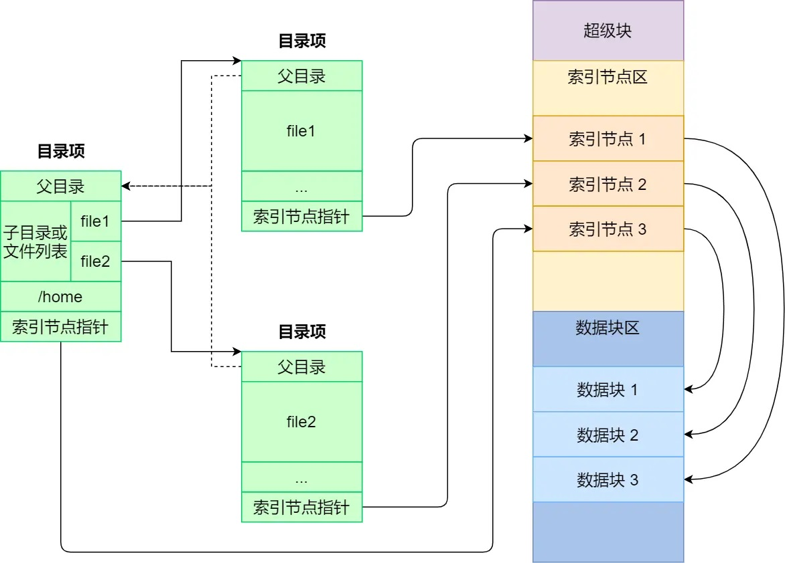
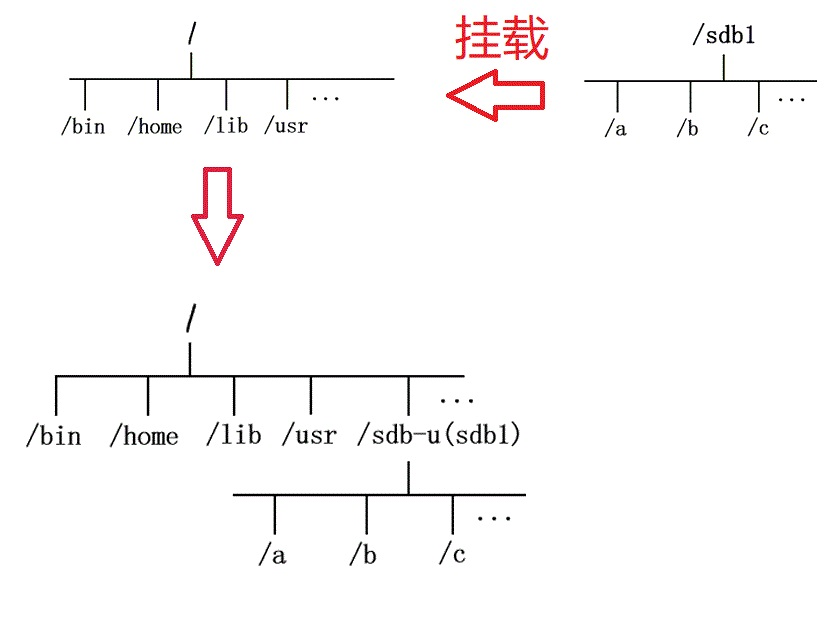
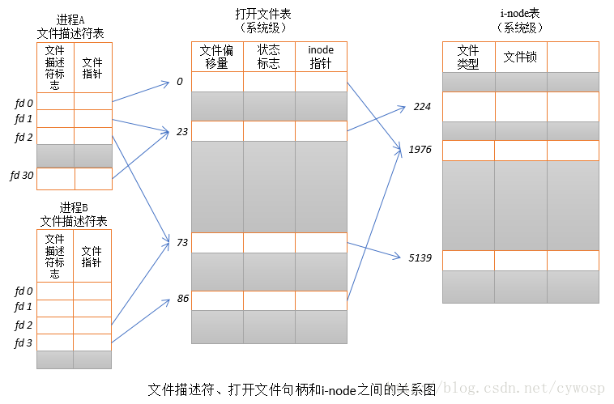

# 文件系统
操作系统通过文件系统来管理磁盘上的数据。文件系统管理的基本单位就是文件。

## 文件构成
Linux中一切都是文件。不仅仅是狭义的磁盘数据，目录、管道、Socket等都是文件。

在Linux中，每个文件除了本身的数据，还会有两个数据结构存储文件的信息：索引节点（index node，简称为inode）和目录项（directory entry，简称为dentry）。

索引节点是文件的唯一标识，记录了文件的元信息，如inode编号、文件大小、访问权限、创建时间、修改时间、文件数据在磁盘的位置等。索引节点同样存储在磁盘中。

目录项记录了对应文件的文件名、索引节点在磁盘中的位置、以及对应文件的父目录及子目录的信息。目录项存储在内存中。每个文件至少有一个目录项，如果有多个目录项，不同目录项可以记录不同的文件名。基于此特性，每个文件对应的inode是唯一的，但可以有多个文件名。

目录和目录项并不是一个东西。目录本身也是文件，但目录项是记录文件信息的数据结构。所有文件的目录项可构成一套完成的目录系统。
### 目录文件
普通文件的数据块中存储的是文件本身的二进制数据。但是目录文件的数据块会被分成两部分，第一部分以表格形式存储其他文件的目录项信息（inode号、文件类型、文件名等）。第二部分是一个哈希表。在访问该目录下的某个文件时，操作系统会计算要访问的文件名的哈希值，并以该哈希值为索引去取哈希表中对应的值，从而快速获知要访问的文件是否存在以及文件的信息。

假设```/home/zerg/```目录下存储两个文件1.txt和2.avi。对于目录文件zerg，其数据块第一部分大致内容为：

| inode | 文件类型 | 文件名 | 
| -- | -- | -- |
| 114 | 目录 | . |
| 514| 目录 | .. |
| 1919 | 普通文件| 1.txt|
| 810  | 普通文件| 2.avi|

一般第一项存储的是目录本身的目录项信息，第二项存储父目录的目录项信息。


### 文件链接
链接是一种特殊类型的文件，它们一般依附于其他文件存在，作为其他文件的“别名”或“快捷方式”，本身不存储数据。

#### 硬链接
硬链接文件的inode和其依附的文件一致。可通过访问硬链接来访问到其依附的文件，因此硬链接可以作为快捷方式使用。

例如，一个文件存储的文件较深```/a/b/c/d.txt```，我们可以使用ln命令，在浅层目录中创建一个该文件的硬链接dlink：

```ln /a/b/c/d.txt /dlink```

硬链接以及我们在命令行的目录结构中看到的文件名，都是一个个目录项，同一文件的多个目录项对应的文件名可以不相同，但无论通过哪个目录项都是可以实际访问到文件的数据。每个文件的inode中有一个链接数，用于存储该文件对应的硬链接个数。该值一般等于目录项的个数。使用```ls -l```命令，在文件的权限描述信息后会显示文件的链接数。

创建硬链接后，对应文件的链接数会加1。同理删除硬链接，对应文件的链接数会减1。如果链接数减为0，这个文件在会真正被删除（此时对应的硬盘数据块会被标记为空闲，如果有新的文件数据覆盖掉，则d.txt的数据才完全遗失掉）。

硬链接不能跨文件系统使用，也不能对目录文件创建硬链接（因为这可能导致目录循环的问题。例如，假设某目录名为b，路径为```/a/b```。如果对该目录创建硬链接d，路径为```/a/b/c/d```，这样一来，c的子目录同时也是其父目录，这会导致一些递归遍历子目录的命令陷入死循环。

#### 软链接
软链接又称符号链接，有自己独立的文件inode，但软链接文件的数据存储的是另一个文件的路径。

软链接可以跨文件系统使用，也可以为目录文件创建软链接。递归遍历子目录的命令会忽略软链接，不会去遍历软链接对应存储的地址。对此，软链接可以存储一个虚假路径。


## 虚拟文件系统
硬盘中存储的是文件，U盘中存储的是文件，内存中存储的也是文件……不同的数据存储设备特性不同，其内部的文件系统也不一致。例如，硬盘常见的文件系统有FAT、NTFS、ExFAT等；内存的文件系统有tmpfs、ramfs等（这些内存文件系统将内存中的数据模拟成硬盘文件，让用户能像访问磁盘文件一样访问内存的数据）。

为了统一不同文件系统并提供给用户统一的接口，Linux在用户层与文件系统层引入了中间层，该中间层即虚拟文件系统（Virtual File System，简称VFS）。

### 磁盘读写特性
磁盘、软盘、U盘等持久的数据存储设备被称为块设备，在Linux中也被视为文件。

磁盘中一次读写的最小单位是一个扇区（512B）。文件系统一次读写的最小单位为逻辑块（也可以称为数据块）。Linux中逻辑块大小为4KB（和分页式内存管理保持一致，等于8个扇区）。

磁盘在格式化后会被分成三个区域：
- 超级块：用来存储文件系统的详细信息，比如块个数、块大小、空闲块等等。
- 索引节点区：存储所有的索引节点。
- 数据块区：用来存储文件或目录的数据。



对于进程而言，文件的读写是逐字节进行的，但是块设备对文件读写是逐块进行的，这一差异就需要文件系统来作为双方的桥梁。因此，当进程从文件读取1字节时，文件系统就从对应数据块取出数据，再返回其中进程所需的部分。当进程向文件写入1字节数据时，文件系统将构建一个修改后的完整数据块，再将完整数据块写入块设备对应位置。

### 文件系统挂载

当需要在Linux中访问某个块设备中的文件时，需要将该块设备的文件系统统一到VFS中，并使用挂载操作将块设备映射到一个目录。之后用户可在VFS中通过访问这个块设备对应的目录，即可访问其中的文件。Linux中使用mount命令挂载，取消挂载使用unmount命令。



如图，假设U盘下中存储的目录结构如下图右侧所示，现在将其挂载到Linux的/sdb-u目录下，之后在/sdb-u目录下即可访问U盘中的文件。

## 文件的使用
进程通过系统调用来打开文件，并通过文件描述符来打开、关闭、读写对应的文件。文件描述符是一个非负整数，其中0、1、2默认为标准输入、标准输出和标准错误。

系统会为每个进程维护一个文件描述符表，这个表的每行使用文件描述符标志（用于描述以什么方式打开文件，只读、只写，还是读写均有）以及文件指针（指向当前文件读写的位置）来描述一个打开的文件，行号即为文件描述符。

除了每个进程自己的文件描述符表，内核还维护了一个打开文件表，用于记录所有进程打开的文件。表的每行记录了文件当前偏移量、文件状态标识、文件访问模式、文件inode信息等。整行记录被称为打开文件句柄（open file handle）。



## 文件存储
文件一般不存储在连续硬盘空间中，这会导致文件长度难以扩展以及产生大量外部碎片。对此，文件的不同部分一般存储不连续的数据块中，按照具体机制可以分成链表存储和索引存储。

### 链表存储
又可分为隐式链表存储和显式链表存储。

隐式链表存储下，文件的每个数据块都是链表的一个元素，数据块末尾会留出空间存储一个指针，指向下一个数据块的地址。

显式链表存储下，内核会在内存中维护一个文件分配表，表中记录了每个数据块对应的下个数据块的编号。每个文件只需额外存储自己的起始数据块编号和末尾数据块编号，用户即可通过文件分配表按顺序访问文件的每个数据块。文件长度改变后，文件分配表也需要相应进行修改。

### 索引存储
文件会额外使用一个数据块（即“索引数据块”）按顺序存储其使用的数据块编号。

如果文件过大，单个索引数据块存储不下文件使用的数据块编号，则索引数据块也可构成链表，索引数据块末尾空间存储指针，指向下一个索引数据块；或者和页式内存存储机制一样，使用多级索引。

### 空闲空间管理
和内存的空闲区管理类似，磁盘的空闲区也可以使用空闲区表或空闲区链表来管理。除上述两种方式外，Linux实际采用了位图的形式来管理空闲区。位图的第n个bit用于表示第n个数据块的空闲情况。为0表示空闲，为1表示已分配。

## 文件IO
### 缓冲式文件IO
进程读写文件需要系统调用，为此需要切换为内核态。由于用户态与内核态之间的切换会带来一定的开销，因此进程读写文件时，希望尽可能少地进行系统调用。而利用标准库进行缓冲（buffer），可以起到减少系统调用的效果，这种IO被称为**缓冲式文件IO**。

每次进程对文件的修改会先存储到标准库分配的缓冲区（一般在进程的用户空间中），当缓冲区满了再执行系统调用（这种称之为全缓冲文件IO），或者遇到换行了再执行系统调用（这种称为行缓冲文件IO）。如果不使用标准库提供的缓冲区，则称为非缓冲式文件IO。


### 直接IO与间接IO
磁盘寻址以及读写的效率要远低于内存，我们希望系统调用尽可能地少地访问磁盘。对此，可以采用间接文件IO的形式，在内核空间上开辟一块缓冲区，该缓冲区称为“页缓存”（page cache）。

系统调用时，对文件的改写内容会暂时存储在页缓存中。当发生以下几种情况时再切实地将页缓存中的数据写入磁盘：
- 页缓存空间不足；
- 页缓存中的数据存储时间过长；
- 其他内存空间不足，需要征用页缓存空间；
- 用户主动调用sync函数，强制将页缓存中的数据写入磁盘；

系统调用时，对文件的读取也会先访问页缓存，如果缓存命中则无需再读取硬盘。如果没有命中，则从硬盘中读取到页缓存，再返回读取结果。下次再访问相同内容即可缓存命中。

如果不使用页缓存机制的IO称之为直接IO。在这种情况下，每次系统调用都会直接访问磁盘。

### 同步IO与异步IO
线程通过系统调用函数read来读取文件时，内核首先要准备好要读取的数据（从磁盘中或者从页缓存中读取），然后将数据从内核空间拷贝到对应的用户空间中。内核的这两个步骤完成了，读取的数据才能被线程进一步处理。

线程调用read函数后被阻塞，直到内核的两步工作完成后才被唤醒，这种称为**阻塞式IO**（BIO）。

线程调用read函数，若内核的第一步工作没有完成，则read会立即返回一个特定的错误码（EWOULDBLOCK），若内核的第一步工作完成，但第二步没完成，线程会被阻塞，这种称为**非阻塞式IO**（NIO）。在非阻塞式IO下，线程想要读取到数据，需要不断调用read轮询，直到阻塞等待数据。一般IO多路复用就是基于非阻塞式IO实现的。

以上的阻塞式IO和非阻塞式IO都属于同步IO，因为调用read()时或多或少，线程都要被阻塞去等待内核完成某个阶段的工作。**异步IO**（AIO）则无需等待任何环节。异步读取文件的函数为aio_read，当线程调用该函数进行异步读取操作时，会立即返回结果，之后线程可以进行其他操作。等到内核完成其两步工作后，会通过信号、软中断或者回调函数等机制通知线程，线程再开始对数据进行处理。
<br/><br/>

# 参考资料
[https://c.biancheng.net/view/2859.html](https://c.biancheng.net/view/2859.html)

[多角度分析为什么 Linux 的硬连接不能指向目录](https://blog.csdn.net/longerzone/article/details/23870297)

[每天进步一点点——Linux中的文件描述符与打开文件之间的关系](https://blog.csdn.net/cywosp/article/details/38965239)