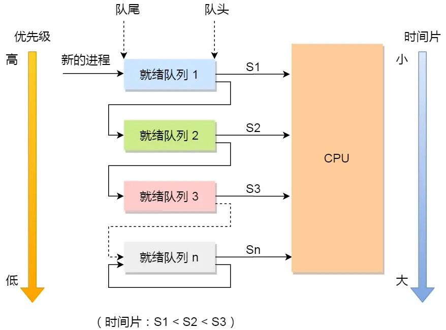
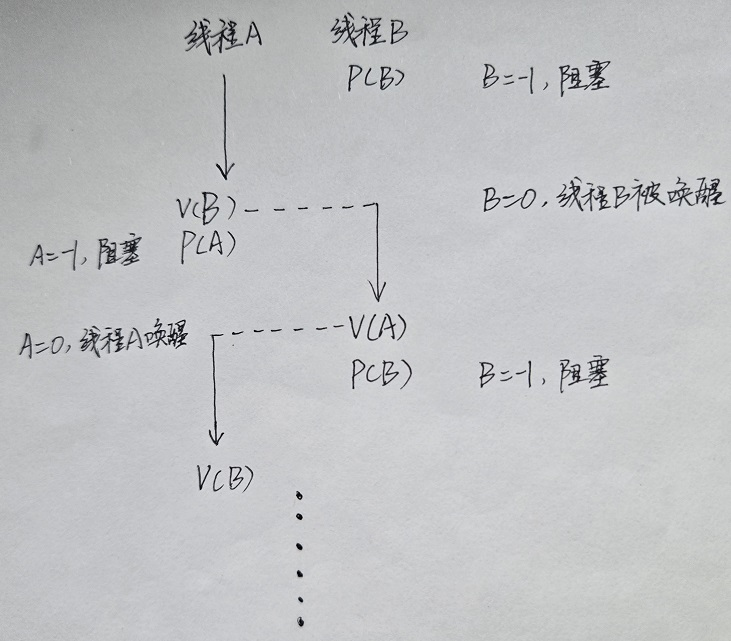

# 进程与线程
## 为何需要线程
多进程并发执行多种指令时，进程切换的开销比较大，而且进程间通信较为复杂。如果让单个进程依次执行这多种指令，则无法实现并发，资源利用率低，如果有需要交互的指令，还会造成极高的延迟。

对此，可以在单个进程中创建多个线程，每个线程负责一种指令。线程间可以并发执行，而且线程切换和线程间通信效率极高。

## 什么是线程
正如上文介绍的，线程（thread）可以看作是一种更细粒度的进程，但线程从属于某个进程。单个进程下可创建多个线程。线程和进程类似，也有创建、就绪、阻塞、运行、结束等状态，状态之间的转换也与进程类似。但需要注意的是，线程崩溃会影响到同进程下的其他线程，进而导致整个进程崩溃。

由于进程是资源（包括内存、打开的文件等）分配的单位，因此操作系统不会为线程再单独分配资源，某个进程下的所有线程会共享其进程的资源，此外，进程会给每个线程分配其其独占的栈和寄存器。

线程的几乎一切操作，效率都要比进程高，开销也更少。线程的创建、终止和切换，对应分配、回收和切换的资源都比进程少，因此效率更快。线程之间由于共享进程的资源，线程间的交互和数据传递效率也更高。


## 线程的实现
主要有三种线程的实现方式：用户线程、内核线程、轻量级线程
### 用户线程（User Thread）

### 内核线程（Kernel Thread）

### 轻量级进程（LightWeight Process）


<br/><br/>

# 线程调度
线程是CPU调度的基本单位。当线程运行完毕，或者因为某些事件阻塞或出错时，操作系统会根据其调度算法从就绪队列中选择另一个线程进入运行状态，这一过程称为线程调度。

## 上下文切换

当调度的两个线程属于同一进程时，会发生线程的上下文切换。如果不属于，还会发生进程的上下文切换。
### 线程的上下文切换
线程自己的寄存器和栈中的数据，称为线程的上下文。同进程下的两个线程切换，仅需要切换这一部分即可，代价要远小于进程的切换。

### 进程的上下文切换
进程在CPU中运行时，依赖CPU寄存器（存储进程运行时需要的数据）、CPU程序计数器（存储正在执行以及将要执行的指令地址）中的数据，这些数据统称为进程的上下文。当发生进程调度时，系统会调用切换原语来进行上下文切换。

## 调度原则
如何选择下一个要运行的线程。不同的调度算法有不同的标准，但基本上需要考虑以下指标：

- CPU利用率：CPU非空闲时间占全部时间的比例。

- 系统吞吐量：即单位时间内CPU完成线程的数量。

- 等待时间：线程在就绪队列中的时间。

- 周转时间：线程的周转时间等于其运行时间、阻塞时间、等待时间的总和（也就是线程从创建到运行完毕的时间）。

- 响应时间：用户提交请求到系统第一次产生响应所花费的时间。对于交互式的线程，响应时间是衡量调度算法好坏的主要标准。

综上，好的调度算法，应该尽量提高CPU利用率和系统吞吐量，降低线程等待时间、周转时间以及响应时间。

## 调度算法
一般分为抢占式算法和非抢占式算法。前者只让线程在CPU中运行一定时段，时段结束后即使线程没运行完也会被移出，调度其他线程运行。后者则会让选中的线程一直运行，直到其阻塞、运行结束或出错，再调度其他线程运行。

### 先来先服务算法（First Come First Serve，FCFS）
非抢占式算法，调度时选择最早进入就绪队列的线程来运行。该算法不利于运行时间短的线程。试想，假设某个线程A运行时间很短，但它排在一个运行时间很长的线程B后面。则线程A的等待时间可能远远长于其运行时间。

### 最短作业优先算法（Shortest Job First，SJF）
非抢占式算法，调度时选择就绪队列中运行时间最短的线程来运行。

那么操作系统是如何得知每个线程的运行时间呢？实际上这个“运行时间”是操作系统根据过去同类型线程执行时间经过加权平均估算出来的。

SJF算法不利于运行时间长的线程，可能会导致其饥饿。

### 最短剩余时间优先算法（Shortest Remaining Time Next，SRTN）
可以看作是抢占式的SJF。当有新的线程加入就绪队列时，就将该新线程的运行时间与正在运行的线程的剩余运行时间进行比较，如果新线程运行时间更短，则进行调度。

### 时间片轮转算法（Round Robin，RR）
抢占式算法。每个线程只能在CPU中运行指定的时间片，时间片用完或者线程提前结束、出错或阻塞，则进行调度。

### 最高优先级算法（Highest Priority First，HPF）
该算法分为抢占式和非抢占式两种版本，但都是从就绪队列中选择优先级最高的线程来运行。线程的优先级在创建时会被确定。但在某些情况下该优先级也会变动（例如，线程在就绪队列中等待的时间越久，其优先级可能会被调高）。


### 多级反馈队列算法（Multilevel Feedback Queue）
抢占式算法。维护多个就绪队列，不同的就绪队列有不同的优先级。当调度时，先调度最高优先级队列中的线程。如果队列为空，则调度次优先级队列中的线程，以此类推。对于同一优先级的就绪队列，其中的线程按先来先服务的原则调度。

处于不同优先级队列的线程，调度时分配的时间片也不同。优先级越高的，时间片越短。当时间片用完时，线程还未执行完，则发生抢占，被抢占的线程会加入到低一优先级的就绪队列中。

对于正在运行的线程，如果比其高优先级的队列中有新的线程，则发生抢占，被抢占的线程重新加入到其同一优先级的队列中。



<br/><br/>


# 线程冲突
## 为何会发生线程冲突
多线程并发执行时，如果多个线程都能读写共享的资源，可能导致不确定性的结果。

例如，假设两个线程并发地对某个共享变量执行加1操作，该操作可以分成从内存中读取该变量、在CPU中加1、将结果写回三个步骤。假设原来变量值为0，如果两线程A、B按以下顺序执行：

线程A读取变量 -> 线程B读取变量 -> 线程A执行加1 -> 线程B执行加1 -> 线程A写回 -> 线程B写回

一般来说变量经过线程A、B执行后值变成2，但按上面的执行顺序，变量值为1。

## 概念解析
临界资源：一次只能被一个线程访问的共享资源被称为临界资源。

临界区（critical section）：访问临界资源的程序被称为临界区。上述对共享变量加1的程序就属于临界区。

竞争：多线程并发执行时，临界区可同时被多个线程执行，例如上述线程A、B的运行方式，这会导致执行结果的不确定性。

互斥：多线程并发执行时，同一时间只能有一个线程执行临界区程序。如果上述线程A、B以互斥方式执行，就能得到正确的结果。

同步：若多个线程在并发执行时相互配合，并一些特殊节点上会相互等待互通消息，而不是各自为战只顾自己的运行，那么称这些线程在同步执行。（与之相对的概念称为“异步”。在异步执行下，线程只按照自己的顺序逐个执行命令，不会阻塞等待其他线程的结果）。

直接制约/间接制约：互斥执行的线程，它们之间的关系称为间接制约关系；同步执行的线程，它们之间称为直接制约关系。

## 如何避免线程冲突
多线程并发执行时，如果能令线程以互斥或同步的形式执行临界区代码，则可避免线程冲突。避免线程冲突，主要通过锁或信号量机制来实现。

### 锁
任何线程在访问共享资源前，会进行加锁操作。如果某个线程成功上锁，则该线程可以访问共享资源，访问结束后再执行解锁操作。若共享资源上面已经有锁，则会加锁失败，线程被阻塞，或持续尝试加锁，直到被唤醒或加锁成功。

锁机制保证了同一时间只能有一个线程访问共享资源，从而保证多线程的互斥执行。
#### 互斥锁与自旋锁
最基本的两种锁，后文提到的读写锁等都是基于互斥锁或自旋锁实现的。互斥锁和自旋锁的区别主要在于加锁失败后线程的处理方式。

互斥锁加锁失败后，会切换成内核态，内核会将线程阻塞。这个阻塞的线程需要等待内核唤醒，然后再访问共享资源。这一过程中，需要两次线程上下文切换（线程阻塞，则该线程会被从CPU中换出到阻塞队列中；线程唤醒后，又会被重新加载进CPU中执行）。

自旋锁加锁失败后，线程会进入“忙等待”状态，反复尝试上锁，直到成功。一般来说，线程上下文切换的开销是比较大的，如果多线程并发的机制并不复杂，当前线程会在较短时间之后上锁成功，一般会采用自旋锁机制，宁愿多等待一会，也尽量避免上下文的切换。

一般来说，单核CPU不会采用自旋锁机制（除非使用抢占式的调度算法），这是由于自旋的线程永远不会放弃当前的CPU，从而导致所有线程都无法执行。

#### 读锁与写锁
如果对共享资源的访问可以区分为读或写两种不同的操作，则可以使用读锁或写锁来控制并发。

当线程以读的形式访问资源时，先检查资源上是否存在锁。如果无锁或只有读锁，则可以访问，并对资源加上自己的读锁，否则阻塞，等待锁释放。读锁允许与其他读锁共存。也就是说，资源允许同一时间有多个线程读资源。

当线程以写的形式访问资源（也就是更改资源）时，同样要检查锁。只有无锁的情况下才可访问资源，并对资源加上写锁。写锁不能与任何锁共存。多个线程应以互斥的形式写资源。

读写锁在实现上，可以分成读优先、写优先、公平读写等三种方式。详情可见后文描述的“读者-写者模型”。

#### 乐观锁与悲观锁
悲观锁基于悲观的思想，它假定多线程同时访问共享资源的概率比较高，很容易产生线程冲突。因此任何线程访问共享资源前必须上锁，访问完毕后再释放。

乐观锁基于乐观的思想，认为多线程同时访问共享资源的概率很低。因此任何线程在访问共享资源期间并不会加锁，访问结束后再检查访问期间是否存在冲突。如果有冲突，则放弃线程访问期间对共享资源的修改。

冲突是否存在，一般可通过对共享资源增加版本号的手段来确定。例如，假设共享资源原来版本号为1.0。线程A、B先后访问该资源，并基于版本号1.0作修改。之后线程B完成访问，共享资源被更新为1.1版本。再之后，线程A完成访问，此时发现已经被更新成1.1，而不是它基于的1.0版本了，则线程A的访问和修改会被丢弃。

互斥锁、自旋锁、读写锁都是悲观锁。乐观锁在文档编辑、git中比较常见。

#### 死锁
##### 死锁的概念与条件
线程A和B都要申请资源1和2，假设线程A先占有了资源1，线程B占有了资源2，此时A需要等待B释放资源2，B需要等待A释放资源1，两个线程互相无限等待下去，就陷入死锁状态。

只有以下四个条件同时成立，才有可能出现死锁：
1. 互斥条件：资源被线程独占且排他地使用。任意时刻一个资源只能给一个线程使用。
2. 不可剥夺条件：线程获得的资源在未使用完毕之前，不可被其他线程剥夺。
3. 请求和保持条件：线程在申请新资源时，对于已有的资源也持续占有。
4. 循环等待条件：例如，线程2在等待线程1释放其占有的资源，线程3等待线程2释放其占有的资源 ... 线程n等待线程1释放其占有的资源

##### 避免死锁
因此，以上四个条件只要令任意一个条件不成立，就能避免死锁。较为简单的方法是通过有序申请资源的方法来破坏循环等待条件。例如，假设线程A和B都要申请资源1和2，则两线程必须按 1 -> 2的顺序申请这两个资源，从而避免线程A占有了资源1，线程B占有资源2陷入死锁的情况。

##### 银行家算法
银行家算法是一种为线程分配资源的算法，在分配过程中可避免死锁的发生。该算法中引入了两个状态：安全状态和不安全状态。安全状态下系统一定不会出现死锁。不安全状态下系统可能会出现死锁。当需要为某个线程分配资源时，该算法会判断为该线程分配资源后系统的状态。如果仍处于安全状态，则允许分配，否则拒绝分配，该线程继续阻塞。


### 信号量
在本人《Linux进程管理》中已经描述了信号量的机制，相比于锁，信号量机制更为复杂，功能也更为完善，可以实现互斥、同步等多种关系。
#### 使用信号量实现互斥
对共享资源设置一个初始值为1的信号量。线程访问共享资源前执行P操作，访问结束后执行V操作。

#### 使用信号量实现同步
假设需要线程A和线程B同步交替运行（也就是按线程A -> 线程B -> 线程A -> 线程B ... 的顺序交替运行），可以设置两个对应的信号量A和B，都初始化为0。

首先先让线程A运行起来，循环执行以下三种操作：对信号量B执行V操作（即V(B)操作）、对信号两A执行P操作（即P(A)操作）、执行自身指令。

线程B循环执行以下三种操作：P(B)、执行自身指令、V(A)操作。

如图所示，两线程可交替运行下去：




一般来说，要实现n个线程的同步，需要至少n个信号量。

#### 生产者-消费者模型
生产者线程用于生产数据，并将数据放入缓冲区中。消费者线程用于使用数据，每次从缓冲区中拿取数据。对此，需要三个信号量来实现生产者-消费者模型：

- 互斥信号量m：初始化为1。用于控制所有线程互斥地访问缓冲区。
- 资源信号量f：初始化为0，用于统计缓冲区中数据的数量。
- 资源信号量e：初始化为n（n表示缓冲区的最大容量）。用于统计缓冲区中剩余的空位。

根据以上三种信号量，可以编写生产者和消费者线程的函数：
```cpp
void Producer() {
    while (1) {
        P(e);      //空位减1
        P(m);
        PutData(); //将生成的数据放到缓冲区中
        V(m);
        V(f);      //数据量加1
    }
}

void Consumer() {
    while (1) {
        P(f);      //空位加1
        P(m);
        GetData(); //从缓冲区中拿取数据
        V(m);
        V(e);      //数据量减1
    } 
}
```

#### 哲学家进餐模型
n位哲学家（线程）围成一个圈，有n把叉子（共享资源），每把叉子放在两个哲学家中间。只要某个哲学家能同时占有其左边和右边的叉子，他就能吃饭。如何通过信号量机制来实现多个哲学家（线程）并发吃饭的问题。

方案一：为每把叉子设置一个初始值为1的信号量，哲学家要占有某个叉子，则对该叉子对应的信号量执行P操作，释放则执行V操作。但该方案容易导致死锁：所有哲学家如果都先占有了其左边的叉子，则所有哲学家都得循环等待右边叉子的释放。

方案二：只为整个餐桌设置一个初始值为1的信号量。当哲学家需要进餐时，对该信号量执行P操作。如果成功则该哲学家占有整个餐桌，所有的叉子都被其占用。该方案可避免死锁，但并发效率太低。

方案三：方案一的改进版。通过破坏循环等待条件来避免死锁。为了避免所有哲学家同时占用其左侧或同时占用其右侧的叉子，可以令偶数编号的哲学家先对左侧叉子作P操作，奇数编号的哲学家先对右侧叉子作P操作。

方案四：使用一个数组记录每个哲学家的状态（正常状态、准备状态、吃饭状态），当某个哲学家需要吃饭时，会进入准备状态，并检查其左右两位哲学家的状态，如果左右两位哲学家都不处于吃饭状态，则当前哲学家变成吃饭状态。吃饭完毕后，该哲学家改变状态，释放其控制的资源，并通知其左右的哲学家。

#### 读者-写者模型
使用信号量机制来实现上文所述的读写锁。

- 读优先：当某个读线程占据资源时，后续的读线程也可以直接读取资源，但后续到来的写线程会被阻塞，直到所有的读线程离开资源后才能执行。如果后续一直有源源不断的读线程，写线程就会饥饿。
- 写优先：当某个写线程占据资源时，后续的写线程在前面的写线程结束后可以依次占据资源，但后续的读线程会被阻塞，直到所有的写线程离开资源后才能执行。如果后续一直有源源不断的写线程，读线程就会饥饿。
- 公平读写：所有线程不论类别，严格按照先来后到的原则，排队依次获取资源，但多个连续的读线程可以一齐访问资源。
- 
<br/><br/>

# 参考信息
[进程、线程基础知识](https://xiaolincoding.com/os/4_process/process_base.html)