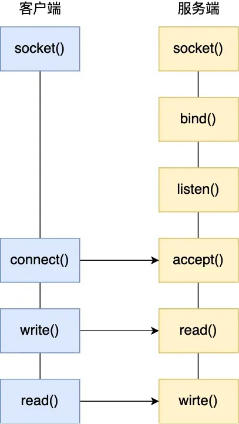

# Socket基础模型
Socket本质上也是一种文件，用于存储通信时使用的协议、端口、IP地址等信息。整个Socket通信机制涉及到了传输层和网络层的操作。本文为以TCP和IPv4协议工作的Socket的通信模型、多路复用机制等的笔记。

## Socket工作流程
要通过Socket进行通信，通信双方（或者称为客户端与服务端）都需要创建一个Socket。Socket创建时需要指定传输层协议（TCP or UDP）、网络层协议（IPv4 or IPv6）。

接下来，服务端需要使用bind()函数，将某个IP地址和端口号绑定到该Socket上（届时，客户端与该IP地址和端口号的通信，将通过这个Socket进行）。然后，服务端调用listen()方法令该Socket进入监听状态。

客户端的Socket建立后，需要使用Connect()函数来与指定IP和端口的服务端进行通信。此时将从客户端开始进行三次握手。服务端对于每个Socket，会维护两个队列：半连接队列和全连接队列。当服务端收到客户端的第一次握手报文后，会将客户端的通信加入到半连接队列中，并进行第二次握手。当服务端接收了客户端的第三次握手报文后，客户端的本次通信信息会从半连接队列移动到全连接队列。

接下来，服务端调用accept()函数，从全连接队列中选择一个通信，来处理对应客户端的需求。然后通信双方开始进行一系列操作……

## Socket并发
对于服务器，我们希望它能同时处理更多的客户端需求。IPv4支持最多2\^32次方个IP地址，端口号最多有2\^16个。因此理论上服务器最多能支持2^\48个连接。然而，考虑到很多IP地址和端口被其他服务占用、文件描述符数量有限（Socket本身是文件，也需要占用文件描述符）以及维持连接需要一定的内存开销，实际上单个服务器最多能支持约10000个并发的Socket连接。

要想并发尽可能多的Socket连接，以往会采用多进程模型和多线程模型。

在多进程模型中，服务端的主进程负责监听。当有新的客户端连接到达时，主进程会fork一个子进程，让该子进程负责与客户端的通信。在这种情况下，有多少个并发的连接，就会存在多少个子进程。该模型较为简单，但是开销极大，效率较低。进程的反复创建与销毁、上下文切换都带来了巨大的开销。

在多线程模型中，服务端的主进程同样负责监听，但会创建线程来负责与客户端的通信。由于线程的创建、销毁、切换的开销相比进程更小，因此多线程模型效率更高。另外，还可采用线程池技术，提前创建若干个线程，这些线程会从全连接队列中选择一个建立通信。

  

# I/O多路复用
上述的Socket并发模型都是一个进程/线程负责一个通信。实际上，客户端的请求并不是时时刻刻都在发生，而且进程/线程处理一次请求的时间非常短，完全可以让单个进程/线程成为“时间管理大师”，同时负责多个Socket的通信，这种技术称为时分多路复用（在Socket通信中一般简称为多路复用）。对此，Linux有select、poll、epoll三个系统调用来实现这种多路复用技术。

## select / poll
select()函数首先将多个已与客户端建立连接的Socket集中放到一个文件描述符集合中，然后将该集合复制到内核空间中。其次，内核会遍历这些Socket，如果其中某个Socket中有IO活动，则将对应Socket作上标记。最后，这个文件描述符集合会被复制回用户空间中，当前进程再遍历这些Socket，再处理有标记的Socket，回应其中的客户端请求。

select机制涉及到两次对Socket的遍历，以及两次复制操作，效率仍然较低，资源开销也比较大。另外，select使用一个长度为1024的bitmap作为文件描述符集合，最多只能同时处理1024个Socket。

poll的机制与select类似，但poll用链表的形式存储文件描述符集合，因此同时处理的Socket数量不受限制。

## epoll
epoll机制使用红黑树和链表来管理和维护多个Socket。epoll涉及到三个函数的调用，下面将一一讲解。

- epoll_create：创建一个epoll对象，返回该对象的文件描述符epfd（后续对Socket的管理都通过该epfd进行）。epoll对象会在内核中初始化一棵空的红黑树，该红黑树的每个节点都对应一个被监管的Socket。此外，epoll对象还会初始化一个就绪链表，该链表存储有新的IO活动的Socket。每次进程只需要处理该链表中的Socket即可处理客户端的新请求。

- epoll_ctl：将需要监视的Socket加入到epoll对象中。新加入的Socket会作为红黑树的一棵节点。同时，内核还会为该Socket在中断处理程序中注册一个回调函数。如果该Socket中有IO活动，回调函数就会被调用，将对应的Socket加入到就绪链表中。

- epoll_wait：调用该函数时会阻塞进程，直到就绪链表非空时唤醒。该函数返回就绪链表中元素的个数。之后，被唤醒的进程就会处理就绪链表中的Socket。

## epoll触发机制
epoll中有两种事件触发机制：边缘触发（edge-triggered, ET）和水平触发（level-triggered，LT）。epoll默认使用水平触发。

边缘触发下，epoll_wait只会唤醒进程一次。水平触发下，只要就绪列表非空（即待处理的客户端请求没被处理完），进程就会被反复唤醒。

一般边缘触发效率更高，因为epoll_wait调用次数更少。但由于边缘触发只会唤醒进程一次。所以在边缘触发下，为了避免错失掉所有的通信请求，进程会循环处理就绪队列中的Socket，如果进程在某个Socket处被阻塞，则无法处理其他Socket了。因此边缘触发一般要搭配非阻塞IO模式使用。

select/poll只有水平触发机制。但select/poll机制下，每次进程被唤醒都需要遍历所有的Socket来找到有IO活动的Socket，再处理对应Socket中的请求。epoll机制下进程唤醒后需处理就绪队列中的Socket即可。当Socket数量越多，epoll的效率优势就更明显。

