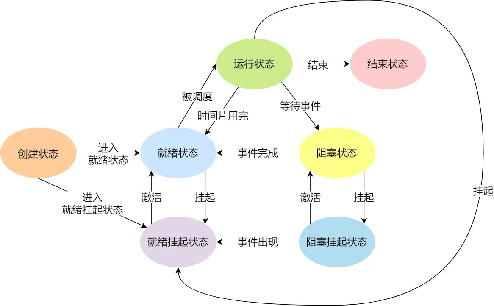
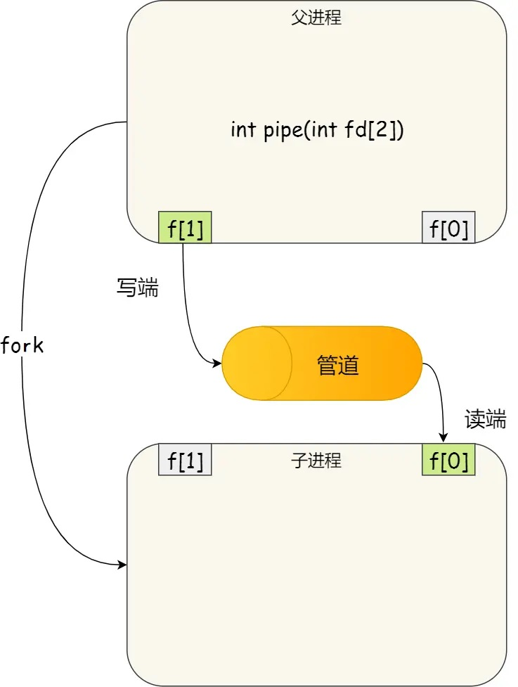
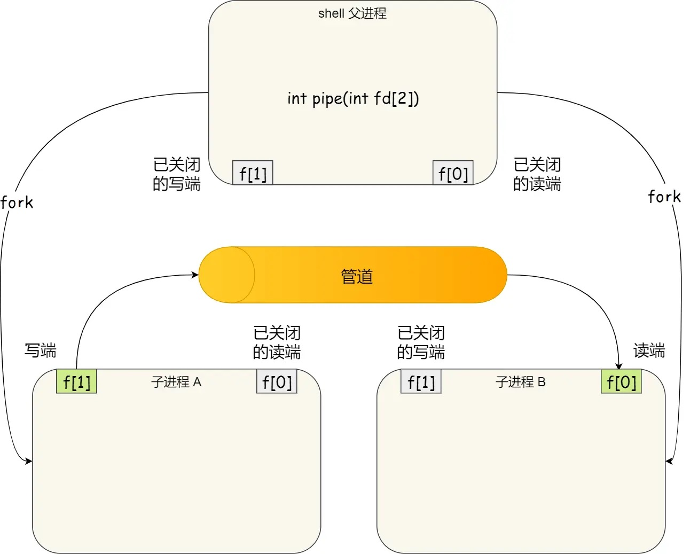

# 什么是进程
## 进程的构造
运行中的程序被称为“进程”（Process）。每个进程中都有一个称为进程控制块（process control block，PCB）的数据结构来描述进程。PCB中包括进程标识符（PID）、用户标识符（进程从属的用户）、进程优先级、进程当前状态、CPU寄存器数据等信息。所有进程的PCB均存储在内存的内核空间中。

## 进程的状态与原语
进程有创建、运行、就绪、阻塞等多种状态，同一时刻进程只能处于其中的某一种状态。

进程的状态会在发生某些事件后切换。进程控制原语（Primitive）用于控制及切换进程的状态，这是一组特殊的程序，其执行具有原子性。

### 创建状态（New）与创建原语
当用户登录、作业调度或用户请求某些系统服务时，操作系统会调用创建原语来创建进程；进程本身也能调用创建原语来创建另一个进程。

创建原语会创建一个处于创建状态的新进程，主要步骤如下：
1. 为新进程分配PID，并申请一个空白的PCB；
2. 为新进程分配相关资源（如虚拟内存空间）；
3. 初始化PCB，将进程相关信息填入其PCB；
4. 将该PCB加入就绪队列。

之后，进程就转变为就绪状态。

### 运行状态（Running）与切换原语
假设进程A占据CPU，CPU在全力处理进程的指令，此时A处于运行状态。当CPU调度时，操作系统会根据调度算法，从就绪队列中选择合适的进程B，并调用切换原语，进行进程的上下文切换：

1. 保存A在CPU中运行时的环境与数据（即A的上下文信息）到A的PCB中；
2. A的状态被改为就绪状态，并加入就绪队列；
3. 将B的上下文信息加载到CPU中，B的状态从就绪态改为运行态。

之后，CPU开始处理进程B。

### 就绪状态（Ready）

可以运行，但由于CPU在处理别的进程而处于的等待状态。所有就绪状态的进程会以链表的形式组织在就绪队列中。处于创建状态的进程在创建原语执行完后会进入就绪状态；阻塞状态的进程在结束其事件后（例如IO结束后），其他进程会发送信息将其“唤醒”（阻塞状态的进程不能自行唤醒）。然后进程转为就绪状态，并从阻塞队列移动到就绪队列。


### 阻塞状态（Blocked），阻塞原语及唤醒原语
进程正在运行，但由于某些事件（例如等待IO）而停止运行。此时操作系统会调用阻塞原语，将该进程转为阻塞状态。阻塞原语的主要步骤为：
1. 找到对应进程的PCB，保存该进程在CPU中运行时的环境与数据（即进程的上下文信息）；
2. 暂停进程的运行，将该进程放入以链表的形式组织的阻塞队列中。

当阻塞进程的事件结束后，调用阻塞原语的主体需调用唤醒原语来唤醒进程。因此，一般来说，这两个原语成对使用。

唤醒原语的主要步骤：
1. 找到对应进程的PCB，将其设置为就绪状态；
2. 将PCB插入就绪队列，等待被调度。

### 挂起状态（Suspend），挂起原语及激活原语
为了防止大量处于就绪或阻塞状态的进程占用物理内存，这些进程有可能会被从内存移动到硬盘中保存，并变成挂起状态。因此挂起状态可分为阻塞挂起状态（进程在硬盘中等待事件处理）以及就绪挂起状态（进程保存在硬盘中，但只要进入内存，就可直接进入就绪队列）。

在Linux中，操作系统会因为内存不足调用挂起原语，用户手动操作（例如ctrl + z或sleep()函数让进程挂起）也会调用挂起原语，令进程进入挂起状态。挂起原语的主要步骤：

1. 找到对应进程的PCB，根据其原有状态，转变为阻塞挂起或就绪挂起状态。
2. 申请外存交换区空间，将进程换出到磁盘上，并将磁盘地址写入PCB。
3. 回收进程的内存空间。

激活原语用于将进程从挂起状态恢复为原有的阻塞状态或就绪状态，主要步骤为：
1. 找到对应进程的PCB，根据其中的磁盘地址确认进程数据在磁盘上的存储位置。
2. 为进程分配内存空间，将进程换入。
3. 更改进程状态，并加入对应的就绪队列或阻塞队列。

### 结束状态（Exit）与撤销原语
进程正常运行完毕、出错或者被用户/父进程强制终止时，撤销原语会被调用，进程进入结束状态。

撤销原语的主要步骤如下：
1. 找到对应进程的PCB，如果该进程正在运行，立刻停止并让CPU调度其他进程；
2. 终止该进程的所有子进程；
3. 将该进程的资源归还给父进程或操作系统；
4. 删除该进程的PCB。

## 进程与作业
作业的概念主要用在批处理系统中。作业（job）是用户需要计算机完成的某项任务，一项作业可能需要一个或多个进程来完成，但一个进程只能属于一个作业。

## 内核态与用户态
CPU指令集是CPU操作软硬件的媒介，每一条汇编语句都对应了一条CPU指令。多条指令就构成了指令集。在Linux中，指令集被划分出两个权限：ring 0和ring 3。其中ring 0权限高，可以使用全部指令集。ring 3权限低，很多能直接操作硬件的指令集（例如硬盘IO、网卡访问、申请内存等）被禁止使用。当CPU能执行ring 0权限下的指令，即处于内核态。若只能执行ring 3下的指令，即处于用户态。

一般情况下CPU处于用户态执行指令。但出现以下情况，则会切换为内核态：

- 系统调用：CPU处理进程的指令时，如果进程通过系统调用来申请操作系统的一些高权限操作，则会切换为内核态。

- 异常：当进程运行时发生错误或某些意外的异常（例如缺页异常），会切换为内核态运行。

- 外部中断：当某些外部硬件设备完成了用户的指令，CPU会中断当前的指令，并转为内核态去处理外部硬件。

<br/><br/>

# 进程与线程
## 为何需要线程
多进程并发执行多种指令时，进程切换的开销比较大，而且进程间通信较为复杂。如果让单个进程依次执行这多种指令，则无法实现并发，资源利用率低，如果有需要交互的指令，还会造成极高的延迟。

对此，可以在单个进程中创建多个线程，每个线程负责一种指令。线程间可以并发执行，而且线程切换和线程间通信效率极高。

## 什么是线程
正如上文介绍的，线程（thread）可以看作是一种更细粒度的进程，但线程从属于某个进程。单个进程下可创建多个线程。线程和进程类似，也有创建、就绪、阻塞、运行、结束等状态，状态之间的转换也与进程类似。但需要注意的是，线程崩溃会影响到同进程下的其他线程，进而导致整个进程崩溃。

由于进程是资源（包括内存、打开的文件等）分配的单位，因此操作系统不会为线程再单独分配资源，某个进程下的所有线程会共享其进程的资源，此外，进程会给每个线程分配其其独占的栈和寄存器。

线程的几乎一切操作，效率都要比进程高，开销也更少。线程的创建、终止和切换，对应分配、回收和切换的资源都比进程少，因此效率更快。线程之间由于共享进程的资源，线程间的交互和数据传递效率也更高。


## 线程的实现
主要有三种线程的实现方式：用户线程、内核线程、轻量级线程
### 用户线程（User Thread）

### 内核线程（Kernel Thread）

### 轻量级进程（LightWeight Process）


<br/><br/>


# 线程调度
线程是CPU调度的基本单位。当线程运行完毕，或者因为某些事件阻塞或出错时，操作系统会根据其调度算法从就绪队列中选择另一个线程进入运行状态，这一过程称为线程调度。

## 上下文切换

当调度的两个线程属于同一进程时，会发生线程的上下文切换。如果不属于，还会发生进程的上下文切换。
### 线程的上下文切换
线程自己的寄存器和栈中的数据，称为线程的上下文。同进程下的两个线程切换，仅需要切换这一部分即可，代价要远小于进程的切换。

### 进程的上下文切换
进程在CPU中运行时，依赖CPU寄存器（存储进程运行时需要的数据）、CPU程序计数器（存储正在执行以及将要执行的指令地址）中的数据，这些数据统称为进程的上下文。当发生进程调度时，系统会调用切换原语来进行上下文切换。

## 调度原则
如何选择下一个要运行的线程。不同的调度算法有不同的标准，但基本上需要考虑以下指标：

- CPU利用率：CPU非空闲时间占全部时间的比例。

- 系统吞吐量：即单位时间内CPU完成线程的数量。

- 等待时间：线程在就绪队列中的时间。

- 周转时间：线程的周转时间等于其运行时间、阻塞时间、等待时间的总和（也就是线程从创建到运行完毕的时间）。

- 响应时间：用户提交请求到系统第一次产生响应所花费的时间。对于交互式的线程，响应时间是衡量调度算法好坏的主要标准。

综上，好的调度算法，应该尽量提高CPU利用率和系统吞吐量，降低线程等待时间、周转时间以及响应时间。

## 调度算法
一般分为抢占式算法和非抢占式算法。前者只让线程在CPU中运行一定时段，时段结束后即使线程没运行完也会被移出，调度其他线程运行。后者则会让选中的线程一直运行，直到其阻塞、运行结束或出错，再调度其他线程运行。

### 先来先服务算法（First Come First Serve，FCFS）
非抢占式算法，调度时选择最早进入就绪队列的线程来运行。该算法不利于运行时间短的线程。试想，假设某个线程A运行时间很短，但它排在一个运行时间很长的线程B后面。则线程A的等待时间可能远远长于其运行时间。

### 最短作业优先算法（Shortest Job First，SJF）
非抢占式算法，调度时选择就绪队列中运行时间最短的线程来运行。

那么操作系统是如何得知每个线程的运行时间呢？实际上这个“运行时间”是操作系统根据过去同类型线程执行时间经过加权平均估算出来的。

SJF算法不利于运行时间长的线程，可能会导致其饥饿。

### 最短剩余时间优先算法（Shortest Remaining Time Next，SRTN）
可以看作是抢占式的SJF。当有新的线程加入就绪队列时，就将该新线程的运行时间与正在运行的线程的剩余运行时间进行比较，如果新线程运行时间更短，则进行调度。

### 时间片轮转算法（Round Robin，RR）
抢占式算法。每个线程只能在CPU中运行指定的时间片，时间片用完或者线程提前结束、出错或阻塞，则进行调度。

### 最高优先级算法（Highest Priority First，HPF）
该算法分为抢占式和非抢占式两种版本，但都是从就绪队列中选择优先级最高的线程来运行。线程的优先级在创建时会被确定。但在某些情况下该优先级也会变动（例如，线程在就绪队列中等待的时间越久，其优先级可能会被调高）。


### 多级反馈队列算法（Multilevel Feedback Queue）
抢占式算法。维护多个就绪队列，不同的就绪队列有不同的优先级。当调度时，先调度最高优先级队列中的线程。如果队列为空，则调度次优先级队列中的线程，以此类推。对于同一优先级的就绪队列，其中的线程按先来先服务的原则调度。


处于不同优先级队列的线程，调度时分配的时间片也不同。优先级越高的，时间片越短。当时间片用完时，线程还未执行完，则发生抢占，被抢占的线程会加入到低优先级的就绪队列中。

对于正在运行的线程，如果比其高优先级的队列中有新的线程，则发生抢占，被抢占的线程重新加入到其同一优先级的队列中。



<br/><br/>

# 进程通信
每个进程会被分配各自独占的虚拟内存空间，该空间无法被其他进程访问。因此，进程间通信或数据交互需要通过以下渠道进行：
## 管道
Linux中的管道可以简单类比成一条连接两个进程的“水管”，数据从进程处出发，从一头流入管道，再从另一头流出，抵达另一个进程，因此管道允许流式的数据传输。
### 匿名管道
Linux命令中的管道符“|”就是一种匿名管道，让前一条指令的结果流入后一条指令。另外，在C语言中可以使用如下函数创建匿名管道：
```cpp
int pipe(int fd[2])
```
其中，```fd[0]```为管道的读取端描述符（相当于管道的“出口”），```fd[1]```为管道的写入端描述符（相当于管道的“入口”），进程通过这两个描述符来进行读写操作。下面是一个使用匿名管道通信的简单例子：
```cpp
#include <iostream>
#include <string>
#include <cstring>
#include <cstdio>
#include <cstdlib>
#include <unistd.h>
#include <sys/wait.h>
#include <sys/types.h>
 
using namespace std;

int main() {  
    int fd[2] = {0};  
    int n = pipe(fd); //父进程建立匿名管道
    pid_t id = fork(); //创建子进程

    if(id == 0) { //子进程
        close(fd[1]); //关闭写端
        char read_buffer[16];
        memset(read_buffer, 0, sizeof(read_buffer));
        ssize_t n = read(fd[0], read_buffer, sizeof(read_buffer)); //从管道读取
        cout << read_buffer << endl;
        close(fd[0]); // 通信完毕，关闭读端
        exit(0);
    }

    //父进程
    close(fd[0]); //关闭读端
    char write_buffer[16] = "Hello Pipe";
    write(fd[1], write_buffer, strlen(write_buffer)); //向管道写入
    pid_t rid = waitpid(id, nullptr, 0); //等待子进程
    close(fd[1]); // 通信完毕，关闭写端
    return 0;
}
```
上述代码的管道通信模式如下图所示：


使用匿名管道，还需要通信的两个进程为父子关系（如上面的代码所示的通信模式），或者两个进程都被同一祖先进程创建，Linux命令中的管道符就采用这一模式，通信前后的两个进程都是Shell创建的：



### 命名管道
在Linux中，用户可以使用mkfifo命令或者C语言中的mkfifo函数来创建命名管道，并手动指定使用该管道通信的进程。

### 两者异同
无论是哪种管道，单个管道只能实现单向的通信，通信的数据都是缓存在内存的内核空间中。

命名管道在Linux中以文件的形式存在，可被多对进程反复调用；而匿名管道只存在于内存中，不存于文件系统中，其生命周期跟随进程，进程结束，匿名管道就消失了。

和匿名管道相比，命名管道可以指定任意两个进程来通信，不要求这两个进程是、有父子关系或创建自同一祖先进程。

## 消息队列
消息队列是存储于内核空间的链表，链表中每一个元素都存储一条信息。进程可以通过消息队列增加新元素的方式来上传信息，也可以从队列中读取元素来下载信息。

和管道相比，消息队列的生命周期跟随内核，只要没有手动释放消息队列或者关闭操作系统，消息队列会一直存在；而且消息队列适合进程间的频繁通信，效率更高。

当然，消息队列也有其不足之处。首先消息队列的通信不一定及时。某个进程上传信息的行为并不会通知其他进程，其他进程要访问消息队列才能得知自己需要的信息是否存在；其次，消息队列中存储的每则信息都有长度限制，不允许过大的数据交互；最后，由于消息队列运行于内核空间，进程从中存取信息都会导致从内核空间到用户空间来回复制数据，这会带来一定的开销。

## 共享内存
在给每个进程分配各自虚拟内存空间时，各自都取出一段相同的虚拟地址，并映射到同一物理内存地址处，这一块内存称为共享内存，这块内存每个进程都可读写，进程可通过该块内存进行通信或数据交互。

## 信号量
当进程使用共享内存通信时，如果多个进程同一时间读写共享内存，可能会造成冲突。而信号量机制可以避免进程竞争共享内存，保证数据的正确性。另外，信号量机制本身也可以在进程间传递“某个共享资源能否被访问”的信息，所以也可以算作一种通信机制。

简单来说，信号量就是一个整型计数器，其初始值表示资源的数量。有两种原子操作可以改变信号量：

- P操作：首先将信号量减1。若相减后结果 < 0，说明资源已耗尽，进程需阻塞等待；若结果 >=0，则表明还有资源可使用，进程可正常继续执行。
- V操作：首先将信号量加1。若相加后结果 <= 0，说明当前还有阻塞等待该资源的进程，则唤醒其中一个进程，让其访问资源；若结果 > 0，则说明没有阻塞等待的进程，无需额外操作。

每个进程在访问共享资源前，会执行P操作。访问资源后会执行V操作，两个操作成对出现。

## 信号
唯一一种异步通信机制，进程收到信号后需要立刻执行对应信号的默认操作或信号处理函数。

硬件或软件都可以给进程发送信号。来自硬件的信号，举个例子，键盘输入的Ctrl + Z会向进程发送SIGTSTP信号，令进程挂起。而来自软件的信号，如```kill -9```命令，会向进程发送SIGKILL信号，让进程立刻结束。

通过```kill -l```可以查看所有的信号，其中常见的有：


## Socket
Socket一般用于跨网络不同主机上进程的通信，也可以用于同主机下不同进程的通信。其主要有三种通信模型：TCP、UDP以及本地进程间通信模型。
<br/><br/>

# 多线程冲突
## 为何会发生多线程冲突
多线程并发执行时，如果多个线程都能读写共享的资源，可能导致不确定性的结果。

例如，假设两个线程并发地对某个共享变量执行加1操作，该操作可以分成从内存中读取该变量、在CPU中加1、将结果写回三个步骤。假设原来变量值为0，如果两线程A、B按以下顺序执行：

线程A读取变量 -> 线程B读取变量 -> 线程A执行加1 -> 线程B执行加1 -> 线程A写回 -> 线程B写回

一般来说变量经过线程A、B执行后值变成2，但按上面的执行顺序，变量值为1。

## 概念解析
临界区（critical section）：可以操作共享资源的代码，例如上述对共享变量加1的代码就属于临界区代码。

竞争：多线程并发执行时，临界区代码可同时被多个线程执行，例如上述线程A、B的运行方式，这会导致执行结果的不确定性。

互斥：多线程并发执行时，同一时间只能有一个线程执行临界区代码。如果上述线程A、B以互斥方式运行，就能得到正确的结果。

同步：进程按顺序逐个执行命令，如果因为某些事件需要等待，则进程会一直等待，直到有事件结束。

异步：进程按顺序逐个执行命令，如果因为某些事件需要等待，则进程会继续执行接下来的命令，并不会等待。


## 实现互斥或同步的机制

### 锁

#### 死锁
##### 死锁产生的必要条件
1. 互斥条件：资源被进程独占且排他地使用。任意时刻一个资源只能给一个进程使用。
2. 不可剥夺条件：进程获得的资源在未使用完毕之前，不可被其他进程剥夺。
3. 请求和保持条件：进程在申请新资源时，对于已有的资源也持续占有。
4. 循环等待条件：例如，进程2在等待进程1释放其占有的资源，进程3等待进程2释放其占有的资源 ... 进程n等待进程1释放其占有的资源

### 信号量


### 


<br/><br/>

# 参考信息
[进程、线程基础知识](https://xiaolincoding.com/os/4_process/process_base.html)

[进程控制以及相关原语的使用（创建，终止，阻塞，唤醒，切换）](https://blog.csdn.net/qq_61888137/article/details/133469291)

[Linux：用户态和内核态的区别？什么时候会从用户态切换到内核态？](https://blog.csdn.net/weixin_42423872/article/details/99997106)

[【Linux】进程间通信——管道（1w5字图文详解，附代码和运行动图）](https://blog.csdn.net/Eristic0618/article/details/141832652)