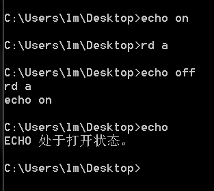
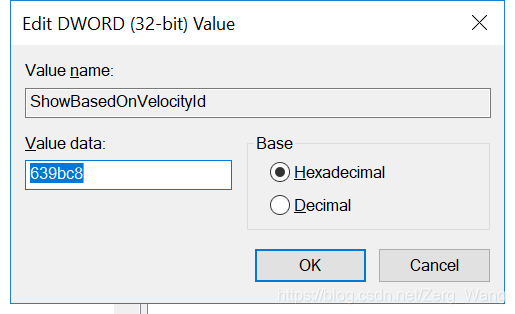

# echo
用于显示消息。
## 开关
通过echo off和echo on来控制每次输入命令的时候当前路径信息（图中为C:\Users\lm\Desktop>）是否显示。


可以看到，在执行echo off后，输入的所有命令前面均不显示当前路径。

直接键入echo可查看echo处于什么状态（on还是off）。

如果要echo off这条信息本身也不显示，则：
```bash
@echo off
```
该命令仅在批处理文件中生效。在控制台中输入不起作用（效果与echo off一样）。
## 消息显示
```bash
echo AnythingYouWannaToSay
```
效果相当于Python中的：
```python
print('AnyThingYouWannaToSay')
```
在cmd中无需加引号，写什么就输出什么。（“echo.”为输出回车）

也可以显示多行消息：（可用&echo一直往后接）
```bash
echo 123 &echo 456
```
输出为：
```bash
123
456
```
歪门邪道（误）：
```bash
echo ^G
```
这个“\^G”是用Ctrl+G打出来的，直接输入"\^G"没用。因此只适用于控制台，写在批处理文件里面没用。

## 文件写入
```bash
echo 123>a.txt
```
在cmd当前路径下创建一个a.txt的文件，并将“123”写入。若文件已存在则将原文件内容删除，替换为“123”。

“\>”后面可指定文件的路径（绝对、相对均可），但要注意目录是否存在，该命令不会帮你将路径上相应的目录一起创建。

可以将内容写入png中，图片无法正常显示，但用记事本打开，会发现有内容“123”。

```bash
echo 123>>a.txt
```
文件不存在时会创建并填充内容“123”，若文件存在，则在原文基础上另起一行补充内容。

一次写入多行数据，其他同上：（括号不能省略）
```bash
(echo 12 &echo 123)>a.txt
```
一次追加多行数据，其他同上：
```bash
(echo 12 &echo 123)>>a.txt
```
<br/><br/>

# 文件管理
## 删除目录
```bash
rd 目录名
```
参数：
/s：递归删除（同时删除目录内的内容）
/q：安静模式（不经询问）

## 复制
推荐使用功能更为强大的xcopy，而不是copy命令。
```bash
xcopy 源路径 目标路径
```
参数：

/y：若有文件覆盖，一律选“是”。

/S： 复制目录和子目录，除了空的。

/E：复制所有目录和子目录，包括空的。 

/I：目标目录不存在时，创建目标目录。

/H：也复制隐藏和系统文件。
<br/><br/>

# 输入参数
一个简单的例子
```bash
@echo off
chcp 65001
set input=
set /p input=请输入字符串:
echo 您输入的字符串是：%input%
pause
```
变量input存储用户从控制台输入的字符串，在后续直接%input%即可调用。当然，该变量名可以设为其他，不一定要用“input”。
<br/><br/>

# 其他
## 任意目录下右键在当前路径打开cmd
参考资料：https://www.cnblogs.com/ssooking/p/8536468.html

打开注册表编辑器（Win+R后regedit），找到如下目录：HKEY_CLASSES_ROOT\Directory\Background\shell\，在Shell下新建key，命名为Open CMD here（名字可自定义，即右键后显示的名字），在此值下新建REG_DWORD类型的值，设置键名为“ShowBasedOnVelocityId”，键值为“639bc8”。

再在Open CMD here下新建key，名为command，其默认string的值为cmd.exe /s /k pushd "%V"。

实际上，按住Shift再右键，即可在当前目录打开PowerShell，这个东西兼容cmd的命令，而且比cmd功能更多。
## 中文无法正常显示
输入chcp，可以查看当前cmd控制台的编码格式。如果是936，编码格式为GBK，若为65001，则为UTF-8的编码格式。

若中文无法正常显示，可用以下命令更改编码格式：
```bash
chcp 65001
```
936和65001两种都切换试试，总有一种能显示中文。
## 使用的字符串或路径含有空格
将整个字符串或路径用双引号引起来即可。

## 清除剪贴板内容
```bash
cmd/c "echo off" | clip
```