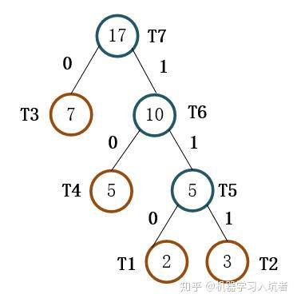

# 信息熵（entropy）
## 计算公式
某长度为$L$个字符的信源中共出现过$n$种符号，假设第$i$种符号在该信源中出现过$k_i$次，则该符号的出现频率$p_i = \frac{k_i}{L}$

各个符号的出现频率为$P = \{p_1, p_2 ... p_n\}$

该信源的信息熵为 $\eta = -\sum_{i=1}^n p_i\log_2 p_i$

该结果表示平均最少可以使用$\eta$ bit来编码该信源中的每个符号，代表了理论上对该信源的无损压缩极限。

## 公式由来

同样是信息，有的信息的信息量大，有的小，那应该使用什么样的标准去衡量一条信息的信息量呢？我们可以说当某事件发生的概率比较低时，该事件的信息量会比较大；而事件发生概率比较高时则其信息量较小。例如，“太阳从东边升起”这句话看起来就是一句废话，信息量约等于0。而“某某明星在你家楼下拍戏”信息量就比较高，因为这件事概率比较低。

对于多个不相关事件，它们共同发生的概率应该是各自概率的乘积，而它们的总共信息量应该是各自信息量之和。因此简单来说，事件的信息量与其概率的对数相关。又由于概率越高，信息量越低。则我们可得对于某事件$x$，其信息量$h(x) = - \log_2 p(x)$，其中$p(x)$为该事件的概率。

类比到信源中，假设该信源中共出现过$n$种符号，第$i$种符号的概率可以简单视为其在该信源中出现的频率$p_i$，该符号的信息量$h(x) = - \log_2 p(x)$。我们对这$n$种符号按其频率作加权平均，就能得出该信源的平均信息量为$\eta = -\sum_{i=1}^n p_i\log_2 p_i$。

在信息压缩中，为了压缩后的信息更简短，我们希望越频繁出现的符号，用更少的bit表示，而越难见到的符号用更多的bit表示。每个符号用多少bit表示与符号的信息量也是相契合的。因此可用上述公式计算出信源中各个符号平均最少使用的bit数。

  

# Run Length Coding (RLC)
连续多个相同字符的数量会被统计出来，然后压缩成"数字+字符"的形式，例如：“AAAABBBAABBBBBCCCCCCCCDABCBAABBBBCCD”会被压缩成“4A3B2A5B8C1D1A1B1C1B2A4B2C1D”。

当连续字符在文本中占比多的时候压缩效果较好。在二进制文件中尤其好。

  

# 哈夫曼（Huffman）编码

1. 首先将信源中的所有字符按出现频率排序（按出现次数也可，不影响顺序），得到一个有序的字符频率列表
2. 取出列表中频率最小的两个字符，将其构造为一对兄弟节点，它们共有的父节点的频率记为这两个字符频率之和，将该父节点的频率放入列表对应位置。
3. 重复第2步，直到列表剩一个元素，此时将剩余元素作为树的根节点，即可得到一棵完整的哈夫曼树
4. 对哈夫曼树中的所有左子节点标记为1，右子节点标记为0（反过来也行，不影响）。某字符的哈夫曼编码即为从根节点到该字符对应节点经过的标记组成的序列。

如图，共有T1、T2、T3、T4四种字符，它们的出现次数分别为2、3、7、5。
首先取出T1、T2构成最下层的两个叶节点，它们的父节点的次数记为2+3=5。

之后重复该过程，直到列表里剩一个元素，然后将所有左子节点标记为1，右子节点标记为0，这样一来T1的哈夫曼编码为110，T2为111，T3为0，T4位10。

由于每个字符对应的节点为叶节点，因此不可能有字符的哈夫曼编码是其他字符的哈夫曼编码的前缀，这一特性提高解码效率。

  

# Arithmetic Coding

运算量大，但是压缩率高（比哈夫曼还高）

  

# 参考资料
[香农信息熵-我们应该如何去欣赏一个公式？](https://zhuanlan.zhihu.com/p/618081814)

[干货！程序员必备——哈夫曼编码](https://zhuanlan.zhihu.com/p/117599375)

[信息熵是什么](https://www.zhihu.com/question/22178202/answer/161732605)