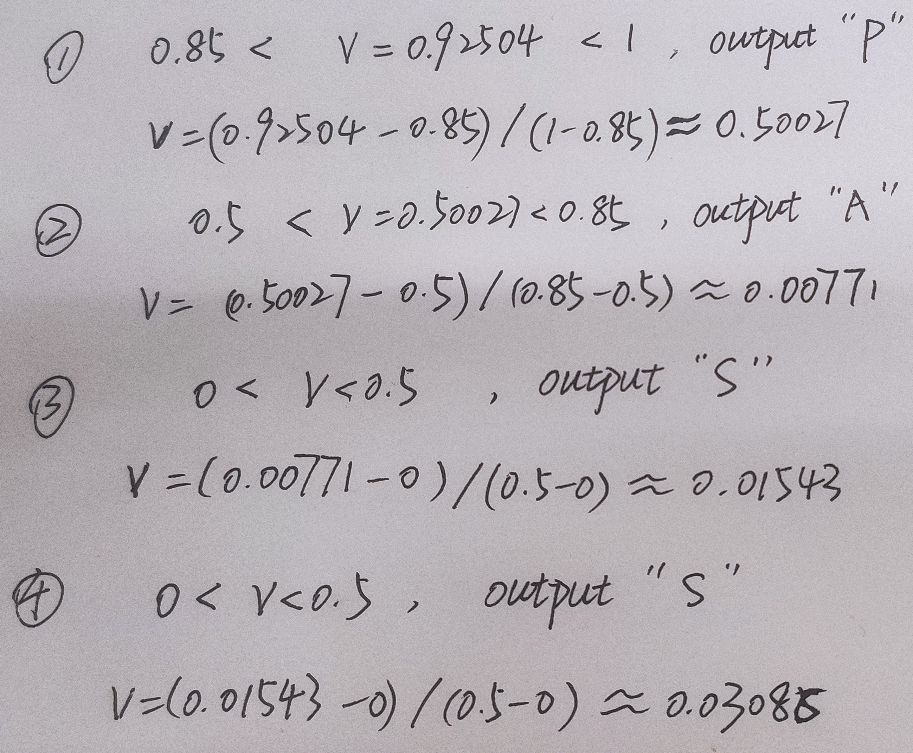

# 信息熵（entropy）
## 计算公式
某长度为$L$个字符的信源中共出现过$n$种符号，假设第$i$种符号在该信源中出现过$k_i$次，则该符号的出现频率$p_i = \frac{k_i}{L}$

各个符号的出现频率为$P = \{p_1, p_2 ... p_n\}$

该信源的信息熵为 $\eta = -\sum_{i=1}^n p_i\log_2 p_i$

该结果表示平均最少可以使用$\eta$ bit来编码该信源中的每个符号，代表了理论上对该信源的无损压缩极限。

## 公式由来

同样是信息，有的信息的信息量大，有的小，那应该使用什么样的标准去衡量一条信息的信息量呢？我们可以说当某事件发生的概率比较低时，该事件的信息量会比较大；而事件发生概率比较高时则其信息量较小。例如，“太阳从东边升起”这句话看起来就是一句废话，信息量约等于0。而“某某明星在你家楼下拍戏”信息量就比较高，因为这件事概率比较低。

对于多个不相关事件，它们共同发生的概率应该是各自概率的乘积，而它们的总共信息量应该是各自信息量之和。因此简单来说，事件的信息量与其概率的对数相关。又由于概率越高，信息量越低。则我们可得对于某事件$x$，其信息量$h(x) = - \log_2 p(x)$，其中$p(x)$为该事件的概率。

类比到信源中，假设该信源中共出现过$n$种符号，第$i$种符号的概率可以简单视为其在该信源中出现的频率$p_i$，该符号的信息量$h(x) = - \log_2 p(x)$。我们对这$n$种符号按其频率作加权平均，就能得出该信源的平均信息量为$\eta = -\sum_{i=1}^n p_i\log_2 p_i$。

在信息压缩中，为了压缩后的信息更简短，我们希望越频繁出现的符号，用更少的bit表示，而越难见到的符号用更多的bit表示。每个符号用多少bit表示与符号的信息量也是相契合的。因此可用上述公式计算出信源中各个符号平均最少使用的bit数。

<br/><br/>

# 信息压缩基本概念
## 无损压缩与有损压缩
无损压缩：原信息被压缩后再解压，还能得到原来的信息；

有损压缩：原信息被压缩后再解压，得不到原来的信息了（部分信息在这一过程中丢失了）。

## 压缩比（Compression ratio）

压缩前信息大小除以压缩后信息大小

## 压缩率（Compression rate）
压缩比的倒数
<br/><br/>

# 无损压缩算法之Run Length Coding (RLC)
连续多个相同字符的数量会被统计出来，然后压缩成"数字+字符"的形式，例如：“AAAABBBAABBBBBCCCCCCCCDABCBAABBBBCCD”会被压缩成“4A3B2A5B8C1D1A1B1C1B2A4B2C1D”。

当连续字符在文本中占比多的时候压缩效果较好。在二进制文件中尤其好。

<br/><br/>


# 无损压缩算法之Variable-Length Coding（VLC）
首先统计出每种字符的出现频次，然后递归执行以下操作：将字符分成两组，每组中的字符出现频次与另一组要尽可能接近，一直执行分组直到每组中仅有一种字符。

例如，假设有如下字符及其出现频次：
|字符 | H| E| L| O|
|-- |--|--|--|--|
|频次|1|1|2|1|

则可以进行如图的三次分组：


得到如图所示二叉树后，从根节点出发，向左子节点的路径标上0，向右子节点的路径标上1，如此可得每个字符的编码。例如L的编码为0，H的为10，E的编码为110。

<br/><br/>


# 无损压缩算法之哈夫曼（Huffman）编码

1. 首先将信源中的所有字符按出现频率排序（按出现次数也可，不影响顺序），得到一个有序的字符频率列表
2. 取出列表中频率最小的两个字符，将其构造为一对兄弟节点，它们共有的父节点的频率记为这两个字符频率之和，将该父节点的频率放入列表对应位置。
3. 重复第2步，直到列表剩一个元素，此时将剩余元素作为树的根节点，即可得到一棵完整的哈夫曼树
4. 从根节点出发，向左子节点的路径标上0，向右子节点的路径标上1（反过来也行，不影响）。某字符的哈夫曼编码即为从根节点到该字符对应节点经过的标记组成的序列。


如图，共有T1、T2、T3、T4四种字符，它们的出现次数分别为2、3、7、5。
首先取出T1、T2构成最下层的两个叶节点，它们的父节点的次数记为2+3=5。

之后重复该过程，直到列表里剩一个元素，然后将所有向左的路径标上0，向右的路径标上1，这样一来T1的哈夫曼编码为110，T2为111，T3为0，T4为10。

由于每个字符对应的节点为叶节点，因此不可能有字符的哈夫曼编码是其他字符的哈夫曼编码的前缀，这一特性能提高解码效率。

哈夫曼算法的平均编码长度非常接近香农公式给出的极限。假设$len$为哈夫曼算法的平均编码长度，有$\eta \leq len \leq \eta+1$。
<br/><br/>

# 无损压缩算法之Arithmetic Coding

运算量大，但是压缩率高（比哈夫曼还高）
## 准备过程

首先计算出信源中各种符号出现的频率，并按照从大到小的顺序排列，并给每个符号按照其频率分配一个区间，假设某信源中共出现“S”、“A”、“P”三种符号，则可以形成这样一张表：

| 符号 | 频率 | 区间 |
|-- | -- | -- |
| S | 0.5  | ```[0, 0.5)``` |
| A | 0.35 | ```[0.5, 0.85)``` |
| P | 0.15 | ```[0.85, 1)```   |

该表在压缩/解压过程中都会使用。

## 压缩过程
和哈夫曼编码不同，Arithmetic Coding不会为每个符号生成对应的二进制码，而是直接对整段信息进行压缩。Arithmetic Coding的压缩实际上是从被压缩信息第一个字符开始，从左到右逐字符处理的过程。

下面以压缩“PASS”这条信息为例讲解压缩过程：

1. 设当前区间r为首字符对应的区间（即```r = [0.85, 1)```)
2. 取得当前区间r的```low=0.85，high=1，range=high-low=0.15```
3. 取信息中的下一个字符，假设该字符的区间为```[n_low, n_high)```
4. 更新当前区间为```r = [low+range*n_low, low+range*n_high)```
5. 重复步骤3，4直到处理完信息中最后一个字符。从当前的r中随意挑一个数字，该数字即为压缩后的信息。


上图为“PASS”这条信息压缩的计算过程。最后我们在```[0.925, 0.938125)```这个区间中随便挑一个数（例如0.92504）作为压缩后的信息值。并把原来信息的长度（即4）一起作为压缩后的信息存储起来。

## 解压过程
解压遵循如下过程：

1. 设当前值v等于压缩后的信息值（即v=0.92504）
2. 查看v处于哪个字符的区间，输出该字符
3. 假设被输出字符对应区间为```[low, high)```且```range=high-low```
4. 令```v=(v-low)/range```
5. 重复步骤2，3，4，直到输出信息的长度等于原信息的长度

如图即为从0.92504还原成“PASS”的计算过程：

<br/><br/>


# 参考资料
[香农信息熵-我们应该如何去欣赏一个公式？](https://zhuanlan.zhihu.com/p/618081814)

[干货！程序员必备——哈夫曼编码](https://zhuanlan.zhihu.com/p/117599375)

[信息熵是什么](https://www.zhihu.com/question/22178202/answer/161732605)