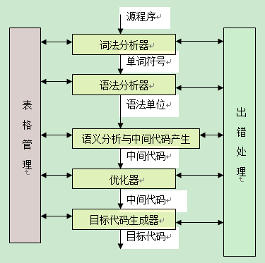
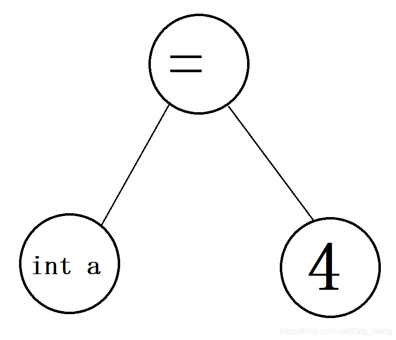

# 编译原理简介
编译的过程，通俗来讲就是 “高级语言的源代码 → 汇编语言 → 机器码” 一步步翻译的过程。


## 词法分析
该步骤用于判断源代码中的字符拼写、符号使用是否正确。拿翻译来类比（比如说英文翻译为机器码），这一步就是判断单词拼写是否正确，标点符号是否合乎规范，以及判断所有单词的词性。
在这一步中，词法分析器将从左向右逐行扫描源程序的字符，识别出各个单词并确定其类型，如关键字、常量、运算符、标识符（即变量名等）、分界符。之后，这些被分好类的单词将统一采用词法单元（token）形式存储。并建立表格进行管理。（这个表格不仅会管理这些单词，也会管理编译各个阶段的一些信息）
## 语法分析
该步骤用于判断源代码中的单词所组成的句子是否合乎语法规范（类似于检查英文中 look forward to doing 而不是 to do啊，过去式有没有加ed啊之类的工作）
在这一步中，语法分析器通过token，构建语法分析树来判断句子语法是否正确。
按我本人的理解（若有错误欢迎指正），每个句子（例如C/C++中，到分号算一个句子）可单独生成一棵语法分析树，其中token作为树的节点，举个例子：int a = 4;
这里token有5个，分别为int、a、=、4、;  （这里只是举例，token实际表示方式不是这样的），那么一般int 和 a 可以合并为一个节点，分号作为分界符可以去掉，生成的语法分析树为：



语法分析后，句子在形式上会被认为是正确的了。

## 语义分析与中间代码生成
在这一步会对句子意义进行解析，类比于翻译，在语法分析阶段，编译器只关心句子形式上的正确，对于“钢琴弹我” 这样的句子，也会被认为是正确的（毕竟主谓宾齐全），但在语义分析阶段这样的句子就会报错。

在这一阶段，语义分析器为检查分析标识符的属性信息，即各类变量的存储位置、作用域、参数等等。在这一阶段，重复的变量名、未声明的变量名、函数返回类型不符、数组下标非整数这类的错误会被发现。

中间代码生成即生成汇编指令。

## 优化及生成目标代码
优化相当于把一些重复的、无意义的指令去除或改写，例如 a = a * 1 这种，还有重复赋值，无意义的循环等操作都会被简化。还有乘法运算会被替代为加法运算也会在此过程中实现。
优化完成即可生成机器可直接识别运行的代码——机器码。
<br/><br/>

# C/C++ 编译过程
编译过程大致分为以下四步：
1. 预处理（预编译）。通过源代码（.c文件）生成 .i 文件。
2. 编译。通过 .i 文件生成 .s 文件。
3. 汇编。通过 .s 文件生成 .o 文件。
4. 链接。链接多个 .o 文件生成可执行文件。
   
## 预处理（preprocessing，预编译）
预处理后生成 .i 后缀的文件。预处理过程主要有以下几种操作：
- 展开头文件：例如源代码hello.cpp中有#include <stdio.h>，则在预编译时会把该头文件中的内容整合到预处理后的文件中。
- 宏替换：通过#define语句，将源代码中的对应内容进行替换。
- 条件编译：处理#ifndef #ifdef #endif 等语句。
- 去掉注释和多余的空白。
  
也就是说，通过预处理，源代码中将不含任何 “#” 开头的句子。同样的，预处理阶段，源代码中只要#开头的句子没写错，其他地方的错误编译器是不管的。
假设我的源代码hello.c为：
```cpp
#include <stdio.h>
int main() {
    printf("Hello World");
    return 0;
}
```
hello.i的内容为：
```cpp
//以上省略883行//
int main(){
  printf("Hello World");
  return 0;
}
```
省略的800多行，全是整合进来的头文件stdio.h。

## 编译（compression）
检查 .i 文件的词法、语法、语义，生成汇编指令，产生 .s 后缀文件。

hello.s长这样：
```cpp
	.file	"hello.c"
	.text
	.section	.rodata
.LC0:
	.string	"Hello World"
	.text
	.globl	main
	.type	main, @function
main:
.LFB0:
	.cfi_startproc
	pushq	%rbp
	.cfi_def_cfa_offset 16
	.cfi_offset 6, -16
	movq	%rsp, %rbp
	.cfi_def_cfa_register 6
	leaq	.LC0(%rip), %rdi
	movl	$0, %eax
	call	printf@PLT
	movl	$0, %eax
	popq	%rbp
	.cfi_def_cfa 7, 8
	ret
	.cfi_endproc
.LFE0:
	.size	main, .-main
	.ident	"GCC: (Ubuntu 7.5.0-3ubuntu1~18.04) 7.5.0"
	.section	.note.GNU-stack,"",@progbits
```

## 汇编（Assembly）
把汇编指令（.s文件）转换成计算机可直接识别的二进制文件（.o文件，也叫中间文件）。

在Linux中，可通过readelf -a hello.o 命令查看该文件内容。

## 链接（Linking）
将一个或者多个 .o 文件联合生成可执行文件，即二进制指令文件。

所有的可执行文件都需要一个入口函数（在c语言这个函数为main），且每个源文件都可能调用到其他源文件中的函数，所以.o目标文件要互相链接，最终生成一个可执行文件。

以C中的printf函数为例，其通过头文件 stdio.h 声明，但 printf 函数的完整定义在文件printf.c 中，编译器为了效率，某个头文件中牵涉到的所有函数会被分别编译成单独模块并最后打包成了一个文件，也就是说，printf.c 和同头文件中的其他一些函数的定义文件，都会被预先编译成一个文件，这个文件就是库。在“链接”这一步中，用户自己的多个 .o 文件会相互链接，同时也会与系统事先编译好的库链接。

在Linux下，可使用“ldd 可执行文件名”命令查看该可执行文件链接的库。

### 静态链接与动态链接：
.o 文件会与库链接。而库分为两种：动态链接库（也叫共享库）和静态链接库，所对应的链接方式即动态链接与静态链接。

静态链接：在链接阶段，静态库与中间文件.o合并生成可执行文件。注意：有n个中间文件使用了某个静态库，则这个库会被一一合并到这些中间文件中。在运行时，硬盘和内存中都会有n份该静态库。linux中，静态链接库后缀为.a，Windows中为.lib（Windows中的MinGW用的是.a）
- 优点：代码装载速度快，执行速度比动态链接略快；程序可移植性强。（因为库被编译进可执行程序中，与运行环境没有关系，因此可以在任何环境中运行）

- 缺点：文件太大，浪费内存和磁盘空间、模块更新困难（每次静态库更新，则文件需重新编译，程序更新、部署会受影响）

动态链接：链接过程推迟到运行时进行。假如有n个中间文件使用了某个动态库，但内存和硬盘中只会有1份该动态库，它被共享给全部调用它的中间文件。因此动态链接库也叫共享库。linux中，动态链接库后缀为.so，Windows中为.dll。
- 优点：可执行文件体积小，节省内存和硬盘空间；开发过程中各个模块更独立，耦合度更小；程序兼容性好（在不同环境不同平台使用对应环境提供的动态库）
- 缺点：运行和装载速度慢；若对应环境中动态库位置、版本等不符，程序会加载失败。

### 显式链接（Explicit Linking）与隐式链接（Implicit Linking）
动态链接的两种方式。

假设程序中某个函数 f 的实现需要动态库 a，显式链接为：代码执行到函数 f 时，动态库 a 才会被加载。

隐式链接（也是多数编译器的默认链接方式）为：在可执行程序生成时，编译器就会检查代码依赖的动态库，并一一加载到该程序的内存空间中。
<br/><br/>

# GNU使用笔记
## GNU简介
GNU即“GNU is Not Unix”的递归缩），一个免费的类UNIX的操作系统，现在已被集成到Linux系统中。该系统中有大量的工具：
| 工具 | 说明 |
| ---  | --- |
| gcc  | GNU C编译器 |
| g++  | GNU C++编译器 |
| ld   | 用于链接目标文件和库文件，创建可执行程序和动态链接库 |
| ar   | 生成、编辑和管理静态链接库 |
| make | 生成器，可根据makefile文件自动编译链接生成可执行程序或库文件 |
| gdb  | 调试器，用于调试可执行程序 |
| ldd  | 查看可执行文件依赖的动态链接库 |

虽然GNU只能用于 Unix/Linux 系统中，但现在也有支持 Windows 的编译工具集：MinGW（Minimalist GNU for Windows）

## makefile简介
makefile文件用于管理项目中代码的编译方式。哪些源文件需要编译、哪些不需要、用什么编译器、按什么标准编译，都通过makefile文件来管理。makefile文件可由一些工具自动生成，例如cmake、Qt的qmake等。

## gcc/g++使用方法
gcc和g++参数基本一致，gcc用于编译C的源代码，g++ 用于编译C++的源代码（实际上gcc可编译C、C++ 和 Object C）。

以下参数区分大小写：
```bash
-ansi
# 只支持ANSI C标准的语法。

-C
# 预处理时不删除注释。

-c
# 后接文件名，激活预处理、编译、汇编三个步骤（如果文件前面几个步骤都执行了，则会自动执行剩下的步骤），默认生成同名的 .o 文件。

-E
# 后接文件名，只激活预处理，默认不生成文件（它会把预处理后的文件输出到控制台，因此需要用-o参数指定）
gcc -E main.c -o main.i

-g
# 将调试信息加载到可执行文件中，方便后续使用gdb调试。

-M
# 在控制台输出源代码文件的关联信息。包含其所依赖的所有源代码。

-O0 、-O1 、-O2 、-O3
# 编译器的优化选项的 4 个级别，-O0 表示没有优化, -O1 为默认值，-O3 优化级别最高。

-o 
# 后接可执行文件名，用于指定编译时生成的可执行文件。若命令中只有-o，表示一步生成可执行文件，即激活预处理、编译、汇编、链接四个步骤并生成可执行文件。（已完成步骤会跳过，因此.c、.i、.s、.o文件均可使用该命令）
gcc main.c -o main.exe

-S
# 后接文件名，只激活预处理和编译（已完成步骤会跳过）。默认生成同名的 .s 文件。

-shared
# 生成动态链接库。

-static
# 链接时禁用动态链接库。

-std
# 指定编译时的遵循的代码标准，例如，要以C99标准编译：
gcc main.c -o main.exe -std=c99

-w
# 不生成任何警告信息。

-Wall
# 生成所有的警告信息。
```
<br/><br/>

# 参考资料
[编译原理入门笔记](https://blog.csdn.net/qq_28098403/article/details/80434645)

[编译原理](https://blog.csdn.net/sundingh/article/details/78714245)

[认识一下Qt用到的开发工具](http://c.biancheng.net/view/3868.html)

[Chapter2：从C/C++的编译原理说起](https://zhuanlan.zhihu.com/p/108187106)

[用gcc编译，c语言程序以及其编译过程](https://zhuanlan.zhihu.com/p/91792897)

[GCC 参数详解](https://www.runoob.com/w3cnote/gcc-parameter-detail.html)
