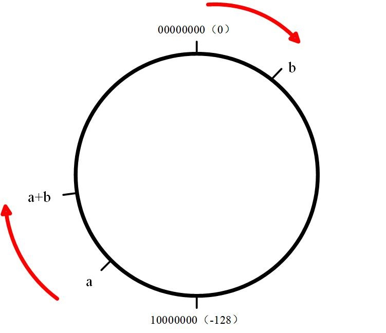
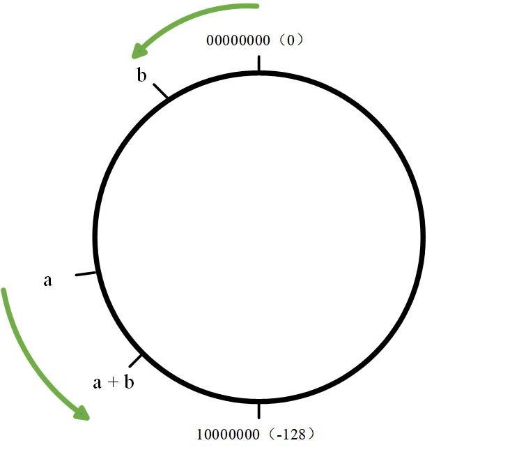

# 四则运算规则
## 整数除法处理
整数除法对于除不尽的结果有如下两种处理方式：
- 向下取整：选择比实际结果小且最接近实际结果的整数。例如```(-7)/2 = -3.5 = -4```。Python采用这种方式。
- 向零取整：截掉实际结果的小数部分。例如```(-7)/2 = -3.5 = -3```。C/C++采用这种方式。

上述处理方式，在除数和被除数都为正数的情况下最终结果是一样的。但如果除数或被除数存在负数，则不同语言的处理结果可能不同。

## 取模运算
取模运算实际是使用```a % b = a - a / b * b```方式进行的。

### 同余式
对于整数a、b、m，若a%m==b%m（即a与b都mod m后有相同的余数），则记：a≡b(mod m)，或记为a≡b(m)。

### 取模运算基本规则
$(a + b) \% p = (a \% p + b \% p) \% p$

$(a \times b) \% p = [(a \% p) \times (b \% p)] \% p$

基于上述两式，如果需要计算累加、累乘的结果对$p$取模，则在计算过程中可以边取模边计算，不影响最终结果：
```cpp
for (int i=0; i<n; ++i)
    ans = (ans + a[i]) % p;
    // ans = ans* (a[i] % p) % p; 该式也成立
```

**注意：对最终结果取模，如果在计算最终结果的过程中出现除法运算，则不可边取模边计算**

### 负数取模
由于不同语言对于整数除法除不尽的结果有不同处理方式，负数取模的结果在不同语言中也会产生偏差。

C/C++对整数除法除不尽的结果向零取整，因此：
```cpp
7 % (-2) = 7 - 7 / (-2) * (-2) = 7 - 6 = 1
(-7) % 2 = (-7) - (-7) / 2 * 2 = -7 + 6 = -1
```
Python对整数除法除不尽的结果向下取整，因此：
```python
7 % (-2) = 7 - 7 / (-2) * (-2) = 7 - 8 = -1
(-7) % 2 = (-7) - (-7) / 2 * 2 = -7 + 8 = 1
```
<br/><br/>

# 求两数平均值的细节
为了防止溢出，应避免使用前面这种算法：
```cpp
int mid = (left+right)/2;           //避免使用
int mid = left + (right-left)/2;    //推荐使用，两者效果完全一样
```
<br/><br/>

# ​浮点型数据存储方法
## 单精度（single）及双精度（double）
单精度（也称为float）占用32bit，1位符号，8位指数，23位尾数。

下面存储方式以C++的float类型为例：

浮点数的存储以2为底数的科学计数法表示，即 a × 2^k 这种形式，且a、2、k均以二进制形式存储。a为尾数，k为指数。

- 符号位：0代表正数，1代表负数。

- 指数：指数位存储的值减去127，才是实际的指数值。举个例子，假设指数位存储的值为01011011，转换成十进制为133，则该float实际表示的数的指数为133-127=6。此外，指数11111111用于表示特殊情况，指数全为1，尾数全为0，用于表示无穷，指数全为1，尾数不为0，用于表示NaN。因此，指数表示范围为-127到127。对应十进制，就是10^(-38) 到 10^38的范围。

- 尾数：实际上，23位的长度可以表示24位尾数，这是因为写成科学计数法后，a的第一位永远是1，例如1. 010011...因此尾数的第一位就被省略掉了。

因此，float所能表示的最大的数，尾数位存储23个1，指数位存储11111110。除了符号位全为1）转换为十进制是（小数点后23个1）：

$1.11111111111111111111111 \times 2^{127}$

$=(1+1/2+1/4+...+1/2^{23})$

$=(2^{23}+2^{22}+2^{21}+...+2^0) \times 2^{-23} \times 2^{127}$

$=(2^{24}-1) \times 2^{127-23}$

$\approx 3.4028 \times 10^{38}$

双精度（double）为1位符号，11位指数，52位尾数。
## 有效位数
对于float，十进制下有效数字有7位，举个例子：
```cpp
float a = 3.000001;
float b = 3;
cout<<a-b;
a = 3.0000001;
cout<<a-b;
```
前者输出9.53674e-007，后者输出0，这是由于float 的精度只能达到小数点后6位（也就是7位有效数字），因此有效数字的第八位会被四舍五入掉（区别：如果将小数赋值给整型，小数部分会被直接舍掉，而不是四舍五入）

double则可以达到15位有效数字的精度。

## 举个例子
8.25转为二进制为1000.01，科学计数法为1.00001×（10×10×10），指数为3，实际存储3+127=130，因此指数位为10000010。

尾数为1.00001，由于尾数第一位永远为1，被省略，所以8.25的尾数部分为00001000000000000000000。
<br/><br/>

# 整型数据存储方法
整型数据以补码的方式存储在内存中。非负数的原码、反码、补码相同，在此不做讨论。

## 负数的存储方法
以byte类型（8位，数据范围-128~127）为例，第1位存储符号，剩余7位存储数据。

负数的原码、反码、补码的符号位均为1。对原码除符号位外的数据按位取反，可得到反码。反码加1可得到补码。以-13为例，其原码为10001101，反码为11110010，补码为11110011。

## 补码的作用
### 补码相比反码可多存储一个数
假设使用反码存储，则-127存储为10000000，-1存储为11111110，11111111就没有对应的数字了。如果使用补码存储，-128存储为10000000。-1存储为11111111，byte类型的数据范围就从-128到127。

### 补码可实现wrap out
整型的值在运算中如果超过范围，会如同时钟一样，越过终点又回到起点。这一特性称为wrap out。例如127 + 1，即01111111 + 1 = 10000000，正好是-128的补码。

二进制运算同样也会wrap out。例如-1 + 1，即11111111 + 1，结果会wrap out成00000000，也就是0的补码。

### 补码便于二进制加法运算
如果使用原码存储，正数加法会得到正确结果，但对于负数加法，例如计算-1 + 2时，10000001 + 00000010 = 10000011，结果变成-3，显然不对。使用原码存储，计算时还需分类讨论，显然过于麻烦。

使用补码存储则无需分类讨论，无论是参与运算的数字是正还是负。假设现在计算 a + b，则计算结果等价于从a开始顺时针移动b与原点的距离：

- 如果b为正数，如图所示，显然结果是正确的。


 
- 如果b为负数，如图所示，由于b在环的左侧，从a开始移动b与原点的距离，也相当于从a开始环绕一圈回到a点后，再逆时针移动绿色段的距离，符合减法的计算直觉，结果也是正确的。

