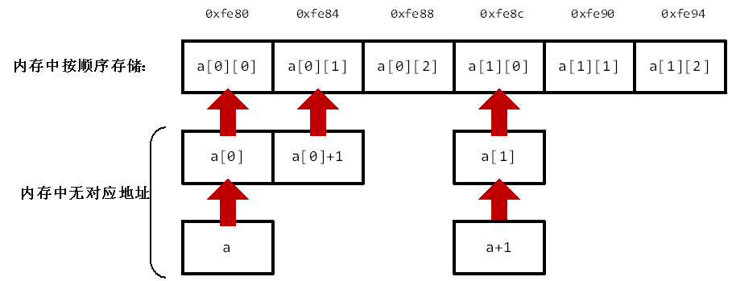

# 常见函数及问题

#### calloc、malloc、realloc与free
malloc用于分配变量所需的内存空间，并返回一个指向它的指针。若申请内存空间失败，则返回NULL。malloc函数仅一个参数size，为要申请的内存大小，以字节为单位。使用的时候一般要进行类型转换。

calloc与malloc返回值相同，但会对申请到的内存置0。有两个参数：待分配内存的元素个数以及每个元素的大小。因此，calloc常用于为数组开辟空间并清零。

对于已经分配到空间的内存，realloc可将该空间的大小重新调整。参数有两个：原内存空间对应的指针以及新内存空间的大小，返回一个新指针，指向重新分配的内存。

free无返回值，参数为待释放内存的指针变量。calloc、malloc、realloc函数申请到的内存可通过free释放。
```cpp
#include <stdlib.h> 
char* p;
int* a;
p = (char*) malloc(4);  
//申请了一个char型指针，分配了4字节的内存空间
a = (int*) calloc(5, sizeof(int)); 
//申请了一个含5个元素的int数组并对数组清零。
p = (char*) realloc(p,10);
//将申请到的4字节内存扩大至10字节
free(p);               //使用完后释放掉p所占内存
free(a);
```
#### 函数返回局部变量
若在函数内部定义了变量且函数返回值为该变量时，编译器一般会提示“function returns address of local variable”。这是因为离开函数后，函数内的局部变量会被注销，因此函数返回值所处内存空间已被占用，可能会产生错误。

解决方法：
- 定义局部变量时使用static修饰。
- 使用malloc为局部变量分配内存并使用free释放。
- 使用new为局部变量分配内存并使用delete释放。

#### 指针运算优先级

最优先：

| 运算符 | 说明     | 结合性   |
| ------ | ----    | -----   |
|   []   | 数组下标 | 左到右  |
|   ()   | 表达式或函数形参表 | 左到右  |
|   . 或 ->   | 结构体成员 | 左到右  |

次优先：

| 运算符 | 说明     | 结合性   |
| ----- | ----    | -----   |
|   *   | 解引用 | 右到左  |
|   &   | 取地址 | 右到左  |
| (类型) | 强制类型转换 | 右到左  |
| sizeof | 取类型大小  | 右到左 |
<br/><br/>

# void与void*

<br/><br/>

# 二级指针的应用
#### 保持在函数中对变量的更改
**在使用函数处理链表等带有指针的复杂数据类型时，为了确保离开函数后对这些变量的更改依然有效，就需要使用二级指针。**
看个例子：
```cpp

void Test(int* q){
    cout<<&q<<endl;    
}
 
int main(){
    int a = 10;
    int* p;
    p = &a;
    cout<<&p<<endl;  
    Test(p);
    cout<<&p<<endl;        
    return 0;
}
```
在进入函数的时候，传入的参数是通过创建一个副本进行传入的。以上面的程序为例，在进入函数后系统另外创建了一个指针变量q，虽然q里面存的值与p一样，但q是一个新的变量，其地址与p是不一样的。

再看个例子：
```cpp
void my_malloc(char **s){  
    *s=(char*)malloc(100);  
}
 
int main(){  
    char *p= NULL;  
    my_malloc(&p);
    //do something
    if(p)
        free(p);  
}  
```
如果不用二级指针，在函数中就是给一个副本指针s分配了空间，离开函数后副本指针s销毁，p从头到尾就没分配到空间，白忙活一场。

#### 作为指针数组的形参

一维数组名是一种特殊的一级指针常量（下文会详细说明），指向的是数组的首元素。由于指针数组的元素均为指针，一维指针数组名指向的就是指针，因此其形参类型为二级指针。

实际上，若指针数组中的每个元素对应存储某个一维数组首元素的地址，那么可以通过二级指针变相实现二维数组的传参。

<br/><br/>

# 结构体指针
#### 链表
结构体指针常用于构建链表，下面的程序展示了如何实现一个简单的单向链表。其中，head_id为头指针，其内部成员n存储链表的节点个数。current_id为遍历或插入节点过程中当前指向的节点。对于任一节点，其成员n为数据域，存储的是该节点的数据，p为指针域，指向该节点的前一个节点。
```cpp
#include <stdio.h>
#include <stdlib.h>
 
struct student_info{
    int n;
    struct student_info *p;
};
 
typedef student_info id;
 
#define Allocate(x) x=(id*)malloc(sizeof(id))
 
 
int main(){
    id *head_id = NULL;
    id *current_id = NULL;
 
    Allocate(head_id);
    Allocate(current_id);
 
    head_id->p = NULL;
    head_id->n = 0;
    current_id->p = head_id;
 
    int num;
    while (scanf("%d", &num) != EOF){
        if (num == -1) break;
        head_id->n++;
        id * new_id = NULL;
        Allocate(new_id);
        new_id->n = num;
        new_id->p = current_id->p;
        current_id->p = new_id;
    }
 
    for (int i=0; i < head_id->n; i++){
        current_id = current_id->p;
        printf("%d ",current_id->n);
        //printf("%d ",current_id->p->n);
        //current_id = current_id->p;
    }
    return 0;
}
```
在结构体指针中访问其成员的两种方法：
```cpp
(*指针变量名).成员名
 
指针变量名->成员名
```
<br/><br/>


# 一维数组名与一级指针
#### 内存分配不同
数组名是一种特殊的一级指针常量，它本身指向数组首元素且不可修改，又由于系统不会分配内存空间给数组名本身，因此，对于数组a和指针p：
```cpp
int a[3] = {1,2,3}; //与p一样，a的类型为int*
int* p = &a[0];
```
以下四项得到的地址是一样的：
```cpp
a, p, &a, &a[0]
```
但由于系统另外分配了内存存储指针p，因此&p与上述地址均不同。

系统没有分配内存空间给数组名，sizeof(a)会得到整个数组的大小：
```cpp
printf("%d\n", sizeof(a));  //输出12 （3*4）
printf("%d\n", sizeof(p));  //输出8（64位系统）
printf("%d\n", sizeof(&a)); //&a表示一个内存地址，输出也为8
```
#### 下标及运算不同
数组名和普通指针均可使用操作符“[]”以及“+”“-”符号（且加减相同的值移动的字节数也相同）。但数组名在符号使用上有一定的限制。
例如，下标不可为负数。a[-1]代表a[0]前一个地址的值。然而该值所处内存空间是未知的，如此取值甚至修改会带来不可预测的问题。

但对于普通指针，若能保持其指向的内容不越界，是可以令下标为负数的：
```cpp
int a[3] = {1, 2, 3};
int* p = &a[2];  
printf("%d\n", p[0]);   //输出3，p[0]与*p等价，与a[2]等价
printf("%d\n", p[-1]);  //输出2
printf("%d\n", p[-2]);  //输出1
}
```
令p指向a[2]，则p[0]指向的就是a[2]，p[-1]即p[0]前一个地址的值，也就是a[1]，以此类推。

同理，a-1指向的内存空间超出了数组范围，但*(p-1)和p[-1]等价。因此对于数组名应谨慎使用“-”运算符。

此外，由于数组名是指针常量，其值不可更改。
#### 数组名退化为普通指针
在使用函数传递数组时，一般将数组名作为参数传入，由于参数一般声明为普通一级指针，而且系统会给参数开辟内存空间，因此在函数内部，数组名与普通指针无异。
<br/><br/>

# 二维数组名与数组指针
二维数组名是一个特殊的数组指针常量，以下面的二维数组为例，数组名的类型为int (*)[3]。
```cpp
int a[2][3] = {1,2,3,4,5,6};
int (*p)[3] = a;
```
#### 内存分配不同


在二维数组中，a指向a[0]，但a[0]、a[1]和一维数组的数组名性质和用法一致。系统对于a、a[0]、a[1]等均未分配内存空间，因此它们最终均指向a[0][0]。

另外，数组指针p中的p[0]、p[1] ... 等与一维数组名的性质与用法一致，一般可将p[0]与a[0]等价，p[1]与a[1]等价……

因此以下10个地址都是&a[0][0]（即0xfe80）。
```cpp
&a, a, *a, a[0], &a[0],
    p, *p, p[0], &p[0], &p[0][0]
```
由于系统给p分配了内存，&p与上述值都不同。

同理，以下11个值都是&a[1][0]（即0xfe8c）。
```cpp
a+1, *(a+1), a[1], &a[1], a[0]+3, 
p+1, *(p+1), p[1], &p[1], p[0]+3, &p[1][0]
```
与前10项的地址差了12个字节（也就是3个int的距离）。

由于没给二维数组名分配内存空间，对其sizeof就得到了整个二维数组的大小：
```cpp
printf("%d\n", sizeof(a));    //输出24（2*3*4）
printf("%d\n", sizeof(a[0])); //输出12（3*4）
printf("%d\n", sizeof(p));    //输出8（64位系统）
printf("%d\n", sizeof(&a));   //输出8
```

**简单来说，数组指针除了有单独的内存地址，其他地方和二维数组名在使用上区别不大……**
<br/>

#### 下标及运算不同

二维数组名和数组指针均可使用“[]”及“+”、“-”符号。下标不可为负以及“-”运算符对二维数组名的限制与一维数组名类似。

此外，二维数组名也是常量，不可更改。


#### 二维数组传参
二维数组名指向的是数组，而不是指针，因此不能将二级指针作为二维数组名的形参。另外，由于二维数组名a指向的a[0]无对应内存地址，本质上还是指向的是a[0][0]的地址，因此，虽然**a可以得到a[0][0]，但：
```cpp
int **b = a; 
printf("%p\n", b);  //输出的是a[0][0]的地址
printf("%d\n", *b); //输出的是a[0][0]，也就是1
printf("%d\n", **b); //错误，对*b解引用，意味着将a[0][0]（也就是1）作为内存地址，取其中的内容，也就是取内存地址0x1中存储的内容。
```
实际上，如果拿到了数组首个元素（即a[0][0]的地址）以及二维数组行、列的数量，通过对地址移动指定字节数便可访问到数组中的任意元素。因此通过普通的一级指针即可传递二维数组：
```cpp
//函数定义
void PrintArr(int *p ,int n, int m){
    for (int i=0;i<n;i++)
        for (int j=0;j<m;j++) {
            int k = *(p + i*m + j);
            printf("%d ", k);
        }
}
//函数调用
PrintArr((int*)a, 2, 3);
```
C99标准支持变长数组，因此也可使用数组指针来传递，但数组大小要通过另一个形参事先声明：
```cpp
//函数定义
void PrintArr(int n, int m, int (*p)[m]){     //m要在(*p)[m]前声明
    for (int i=0;i<n; i++)
        for (int j=0;j<m; j++) 
            printf("%d ", p[i][j]);
}
//函数调用
PrintArr(n, m, a);
```
也就是说，以下写法是不对的;
```cpp
void PrintArr(int (*p)[m], int n)

void PrintArr(int (*p)[m], int n, int m)
```

若非要使用二级指针在函数中传递二维数组，请参考上面二级指针作为指针数组形参的方法来实现。
<br/><br/>


# 函数指针
#### 与指针函数的区别
指针函数本质上是函数，只是其返回值为指针。
函数指针本质上是指针，只是其指向的是函数。
```cpp
int* Func()   //这是指针函数
int (*fp)() //这是函数指针
```
#### 函数名与函数地址
和数组名类似，函数名存储着函数对应的内存地址。
函数名后面带括号，其返回值就是函数定义时的返回值，不带括号才能得到函数地址。
因此，以下表示函数的地址：
```cpp
&Func, Func, *Func
```

#### 函数指针使用
既要定义其指向函数的返回值类型，也要定义其指向函数的形参类型及数量：
```cpp
float (*fp)(char*);
int* (*fp2)(int, int);
```
如上，函数指针fp只能指向返回值为float，有一个char*类型的参数的函数。fp2只能指向返回值为int型指针，有两个int参数的函数。

通过以下方式将函数指针指向函数，并进行调用：
```cpp
//定义
int Prt(int t) {
    printf("%d\n", t);
}

int (*fp)(int);

//赋值
fp = Prt;

//以下两种调用方式均可
fp(3);
(*fp)(3);
```

#### 实际应用


<br/><br/>

# 函数指针数组
本质上是数组，其中每个元素为函数指针。


<br/><br/>

# 参考资料
[二级指针的作用详解_majianfei1023的专栏-CSDN博客](https://blog.csdn.net/majianfei1023/article/details/46629065)

[C 库函数 – malloc() | 菜鸟教程](https://www.runoob.com/cprogramming/c-function-malloc.html)

[结构体指针，C语言结构体指针详解](http://c.biancheng.net/view/246.html)

[二级指针与二维数组](https://blog.csdn.net/u010275850/article/details/49556399)

[数组指针和指针数组的区别](https://zhuanlan.zhihu.com/p/55724052)

[关于函数指针数组的定义](https://www.cnblogs.com/alexshi/archive/2012/03/12/2392508.html)