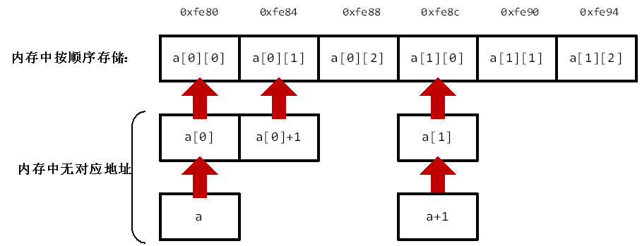

# 指针常用函数及问题
#### new，delete，free

#### malloc
用于分配变量所需的内存空间，并返回一个指向它的指针。若申请内存空间失败，则返回NULL。malloc函数仅一个参数size，为要申请的内存大小，以字节为单位。使用的时候一般要进行类型转换，举个例子：
```cpp
#include <stdlib.h>

p = (int *) malloc(4);  //申请了一个int型指针，分配了4字节的内存空间
```
#### 返回局部变量
若在函数内部定义了变量且函数返回值为该变量时，编译器一般会提示“function returns address of local variable”。

这是因为离开函数在其内部定义的局部变量会被注销，对应内存地址可能会被其他程序占用，因此函数可能会返回一个无效的地址，从而导致错误。

解决方法：
- 定义变量时使用static修饰。
- 使用malloc分配内存空间并使用free释放。
- 使用new分配内存空间并使用delete释放。
<br/><br/>

# 数组下标为负数
数组的下标不可为负数。
假设有数组a，a[-1]代表a[0]前一个地址的值。然而该值所处内存空间是未知的，如此取值甚至修改会带来不可预测的问题。

实际上，在数组名之外单独使用指针可以实现下标为负数：
```cpp
#include <stdio.h>
int main() {
    int a[3] = {1, 2, 3};
    int *p = &a[2];  
    printf("%d\n", p[0]);   //输出3，p[0]与*p等价，与a[2]等价
    printf("%d\n", p[-1]);  //输出2
    printf("%d\n", p[-2]);  //输出1
    return 0;
}
```
令p指向a[2]，则p[0]指向的就是a[2]，p[-1]即p[0]前一个地址的值，也就是a[1]，以此类推。
<br/><br/>


# 二级指针
```cpp
#include <iostream>
using namespace std;
 
void test(int *q){
    cout<<&q<<endl;    
}
 
int main(){
    int a = 10;
    int *p;
    p = &a;
    cout<<&p<<endl;  
    test(p);
    cout<<&p<<endl;        
    return 0;
}
```
在进入函数的时候，传入的参数是通过创建一个副本进行传入的。以上面的程序为例，在进入函数后系统另外创建了一个指针变量q，虽然q里面存的值与p一样，但q是一个新的变量，其地址与p是不一样的。

在使用函数处理链表等带有指针的复杂数据类型时，为了确保离开函数后对指针的更改依然有效，就需要用到二级指针了。

再看个例子：
```cpp
void my_malloc(char **s){  
	*s=(char*)malloc(100);  
}  
 
int main(){  
	char *p= NULL;  
	my_malloc(&p);
	//do something
	if(p)
		free(p);  
}  
```
如果不用二级指针，在函数中就是给一个副本指针s分配了空间，离开函数后副本指针s销毁，p从头到尾就没分配到空间，白忙活一场。
<br/><br/>

# 数组指针和指针数组
实际上，二级指针不能用于函数中二维数组的传参。这是因为二维数组在内存中和一维数组一样，仍然是顺序存储的：

也就是说，对于二维数组int a[3][3]，如果有int * p = a，则p[0]表示数组中的首个元素，即实际上的a[0][0]。同理，p[1]表示实际上的a[0][1]，函数中的a[2]表示实际上的a[0][2]……

二级指针是指向指针的指针，但数组名a是指向int的指针，强行传入肯定会出错。

<br/><br/>

# 函数指针

<br/><br/>

# 结构体指针
结构体指针常用于构建链表，下面的程序展示了如何实现一个简单的单向链表。其中，head_id为头指针，其内部成员n存储链表的节点个数。current_id为遍历或插入节点过程中当前指向的节点。对于任一节点，其成员n为数据域，存储的是该节点的数据，p为指针域，指向该节点的前一个节点。
```cpp
#include <stdio.h>
#include <stdlib.h>
 
struct student_info{
    int n;
    struct student_info *p;
};
 
typedef student_info id;
 
#define Allocate(x) x=(id*)malloc(sizeof(id))
 
 
int main(){
    id *head_id = NULL;
    id *current_id = NULL;
 
    Allocate(head_id);
    Allocate(current_id);
 
    head_id->p = NULL;
    head_id->n = 0;
    current_id->p = head_id;
 
    int num;
    while (scanf("%d", &num) != EOF){
        if (num == -1) break;
        head_id->n++;
        id * new_id = NULL;
        Allocate(new_id);
        new_id->n = num;
        new_id->p = current_id->p;
        current_id->p = new_id;
    }
 
    for (int i=0; i < head_id->n; i++){
        current_id = current_id->p;
        printf("%d ",current_id->n);
        //printf("%d ",current_id->p->n);
        //current_id = current_id->p;
    }
    return 0;
}
```
在结构体指针中访问其成员的两种方法：
```cpp
(*指针变量名).成员名
 
指针变量名->成员名
```
<br/><br/>

# 参考资料
[二级指针的作用详解_majianfei1023的专栏-CSDN博客](https://blog.csdn.net/majianfei1023/article/details/46629065)

[C 库函数 – malloc() | 菜鸟教程](https://www.runoob.com/cprogramming/c-function-malloc.html)

[结构体指针，C语言结构体指针详解](http://c.biancheng.net/view/246.html)

[二级指针与二维数组](https://blog.csdn.net/u010275850/article/details/49556399)
