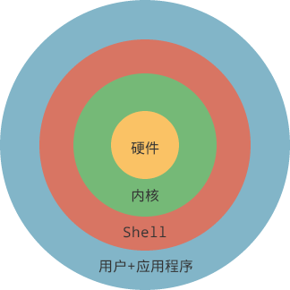

# <font color='ff0000'>若无特殊说明，以下大部分命令在Ubuntu 16.04TLS 系统下亲测可用</font>
<br/>

# Ubuntu系统简介
#### 历史
1983年，麻省理工学院人工智能实验室的Richard Matthew Stallman发布了他的GNU（“GNU is Not Unix”的递归缩写）工程的初始声明：完成一个名为 GNU 的自由、免费的类UNIX的操作系统，并在之后阐述了其对于自由软件的四大理念：有自由按照自己意愿运行该软件；有自由复制软件并赠与他人；有自由通过对源代码的完全控制而改进程序；有自由发布改进的版本从而帮助社区建设。之后，GNU在社区大量工程师的帮助下茁壮成长。

上世纪九十年代，GNU工程已取得了极大的进展，除了操作系统内核，其他一系列操作系统所需的应用、软件都已开发出来（实际上，GNU的内核Hurd一直在开发，但还不足以正式使用）。1991年，芬兰赫尔辛基大学的Linus Benedict Torvalds基于GNU工程开发出了Linux内核。之后，一个完整的操作系统GNU/Linux风靡全球，现在人们称呼的Linux操作系统，其实就是GNU/Linux（当然，下文将继续简称为Linux）。

2004年，Mark Shuttleworth创造了Ubuntu。Ubuntu基于Linux系统的发行版本Debian开发的，带有图形用户界面GNOME，这使得Ubuntu系统更易于使用，变得更为大众化。 

#### Shell
在计算机中，仅操作系统内核可以操纵计算机资源（CPU、内存、硬盘等）。出于安全性及复杂性的考虑，用户不能直接操纵内核，需要一个中间程序来处理用户命令，再转交给内核。在Linux系统下，这个程序称作Shell。


Shell是一种解释型的脚本编程语言，不仅可以用来对系统进行相应操作（类似与Windows下的CMD），还可与C、C++一样用来编程。
Shell语言的解释器也称为Shell，Linux（包括Ubuntu）默认解释器为Bash，位置为/bin/bash。

Ubuntu下Terminal中的命令行也是Shell，但相较于编程语言意义上的Shell，命令行中的Shell在功能及便捷性上相对就差一些。

要编写一个Shell脚本，按Shell语法写即可，写完使用按以下命令运行即可，脚本文件后缀名一般会设置为.sh，使用其他后缀名（甚至没有）亦可。

```bash
bash 脚本文件名
```
<br/><br/>

# 系统管理
#### 查看系统信息
查看内核/操作系统/CPU信息：uname -a 

查看操作系统版本（如Ubuntu 18.04LTS）：cat /etc/issue

查看本机网络配置：ifconfig（Windows下的cmd命令为ipconfig）

#### 内核管理
查看已安装内核：dpkg --get-selections | grep linux-image

删除旧的、不使用的内核：sudo apt-get remove 内核名

若不想让系统自动更新内核，可：sudo apt-mark hold 当前使用的内核名
<br/><br/>

# 路径管理
对于路径、文件中存在的空格，可通过转义字符“\ ”来表示。（注意转义字符后有一个空格）

#### pwd
查看当前路径

#### cd
进入下级目录：cd 目录名

回到上级目录：cd ..

回到根目录：cd /

回到当前用户的家目录（如/home/Admin）：cd ~

某目录下所有文件：目录名/*

#### ln
创建链接（即快捷方式）

例如，目录/mnt/c/Users/ZergWang/Desktop我常常访问，但从/home一路cd过去过于麻烦，可以：

```bash
ln -s /mnt/c/Users/ZergWang/Desktop ~/desktop
```
-s表示创建为软链接（符号链接），没有-s为硬链接。硬链接限制颇多，一般使用软链接。

第一个参数为目标路径，第二个参数为该快捷方式所处位置。

之后在~/下cd desktop即可。

删除链接：

rm -rf 链接名

注意链接名后面没有斜杠。
<br/><br/>

# 文件管理
#### 带权限的文件管理器
如果想在图形界面中进行文件管理而又不受权限影响，可以使用带权限的文件管理器：
```bash
sudo nautilus
```
#### 文件默认颜色
白色：普通文件（如txt，html之类的）

<font color='0000ff'>蓝色：目录</font>

<font color='1E90FF'>浅蓝色：链接</font>

<font color='ff0000'>红色：压缩包</font>

<font color='00ff00'>绿色：可执行文件</font>
#### find
用于查找指定文件
```bash
find 指定查找的路径  -name 要找的文件名
```
例如，在当前目录查找main.cpp文件：
```bash
find . -name "main.cpp"
```
文件名要在双引号中， “.”表示在当前目录下搜索
#### cp
复制文件到指定目录：cp 原路径 目标路径

目标路径必须存在，否则会报错。（执行过程中不会自动创建）

如果指定了一个目标路径的一个新文件名，可以顺便改名，例如把当前文件夹的file1复制到aaa文件夹中，并改名为file2：
```bash
cp file1 /aaa/file2
```
带参数：

-i 若目标文件已存在会询问是否覆盖，不带该参数则直接覆盖。

-r 递归复制，用于非空目录的复制。

-f 不经询问强制执行。

#### mv
移动文件到新目录，操作与cp类似。

也可以用于重命名文件：mv 旧名 新名

#### ls
查看查看当前目录下的文件：ls

查看当前目录下的文件（包括以.开头的隐藏文件）：ls -a

查看当前目录下文件详细信息：ls -l

#### touch
创建文件：touch 文件名

#### cat & more
用于将文件内容输出到指定位置。对于内容比较多的文件，使用more命令则更容易阅读。
cat命令：
```bash
# 输出到屏幕
cat 文件名

# 将文件1的内容输出到文件2
cat 文件1 > 文件2

#参数：
-n    输出时同时输出行号
-b    同上，但空行不编号
-s    遇到连续两行及以上空行时替换为一行空行。
```

more命令：
```bash
# 查看文件
more 文件名

# 查看界面的命令
Space    下一页
b        上一页
q        退出
Enter    下一行
=        输出当前行号
```

#### mkdir
创建文件夹（目录）：mkdir 目录名

-p为递归创建，假设要创建目录路径较深，且沿途目录均未创建，则-p可一同创建。

#### rm
删除文件：rm 文件名

删除空目录：rm -d 目录名

删除非空目录：rm -r 目录名

删除目录下全部内容，但不删该目录：rm -r 目录名/*

-f为强制执行，慎用。

清空回收站：sudo rm -rf ~/.local/share/Trash/*

<font color='ff0000'>奥义·删库之禁术：rm -rf /*</font>

#### diff
比较两个文件或目录的异同
```bash
diff 文件1 文件2
diff 目录1 目录2
```
#### 解压及压缩
zip压缩包的解压及压缩：
```bash
unzip 文件名
zip 压缩包文件名 原文件名
```
tar压缩包解压方式：
```bash
tar –xvf 文件名
```
tar.gz压缩包解压：
```bash
tar –xzvf 文件名
```
#### 跨系统的文件传输
在同一局域网下与Windows系统进行文件互传，可在Windows下安装FileZilla软件实现。然后在Ubuntu系统中安装ssh服务即可。
```bash
sudo apt-get install openssh-server
sudo service ssh start
```
#### 字符串搜索
使用grep命令
```bash
grep '要搜索的字符串'   目录  
```
若不加任何参数，则返回匹配字符所在文件名及所在行的全部信息。
参数：
-i：    不区分大小写
-n：    显示匹配字符所在行的行号
-s：    不显示错误信息及匹配不到内容的信息
-r：    递归搜索子目录
-v：    反向搜索，即搜索非指定字符串的内容
-o：    不显示匹配字符所在行的整行信息，仅显示匹配字符
<br/><br/>

# 进程管理
#### ps
查看当前运行的进程：ps r

查看所有进程：ps -e或ps -A

查找指定进程：ps -ef | grep 进程关键字

#### kill
（PID为进程的ID，使用ps命令可以查到）

终止进程（系统会逐步释放资源，终止进程，但也有可能终止失败）：kill PID

强制终止进程：kill -9 PID

#### 作业（即job）管理
终止当前终端运行的作业：Ctrl + c

终止当前终端运行的作业，但保留并挂起其对应进程：Ctrl + z

查看被挂起（也就是被Ctrl + z）的作业：jobs

（每行代表一个被挂起的作业，每行行首的数字为其作业号）

在前端恢复挂起的作业：fg 作业号

在后端恢复挂起的作业：bg 作业号
<br/><br/>

# 图形界面下与Terminal交互
打开Terminal：Ctrl +Alt + T

复制：Ctrl+Shift+ C

粘贴：Ctrl + Shift + V
<br/><br/>

# 其他Terminal命令
#### alias
```bash
alias
# 查看所有已设置的别名
alias 别名 = 命令
# 设置别名，例如alias nvi='nvidia -smi'
unalias 别名 
# 取消某个别名的设置
```
以上设置仅在当前终端有效，换终端或重启就失效了。若要永久生效，需要修改~/.bashrc文件。
#### perf
linux自带的性能分析工具。

分析指定PID的程序运行时堆栈调用情况，连续追踪t秒：
```bash
perf record -F 99 -p PID -g -- sleep t
```
数据存储在当前目录下的perf.data中
#### watch
自动反复执行某些命令，格式为：watch [参数] [命令]

参数有：

-n，后接数字，表示每隔多少秒执行一次（默认为2秒）

-d，高亮显示与上次执行命令时结果不同之处

-t，隐藏执行命令时的watch的标题

举个例子，每隔1秒查看一次显存占用情况，隐藏watch的标题并高亮显示变化部分：
```bash
watch -n 1 -t -d nvidia-smi
```
#### 注释
以“#”为开头的一行即为注释

#### 其他
密码更改：passwd

清屏：Ctrl+L或者clear
<br/><br/>


# 参考资料
[Shell脚本：Linux Shell脚本学习指南（超详细）](http://c.biancheng.net/shell/)

[About the GNU Operating System- GNU project - Free Software Foundation](http://www.gnu.org/gnu/gnu.html)

[Linux 命令大全 | 菜鸟教程](https://www.runoob.com/linux/linux-command-manual.html)
