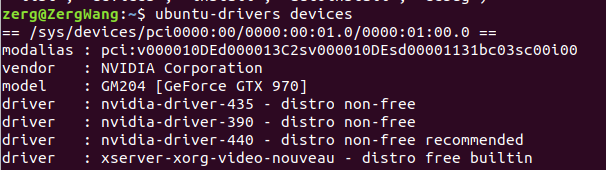
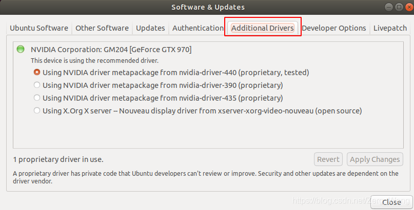
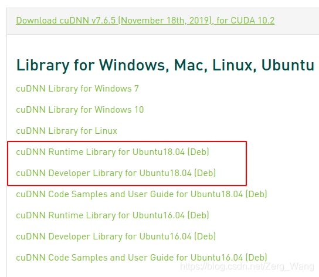
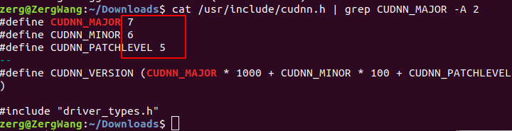
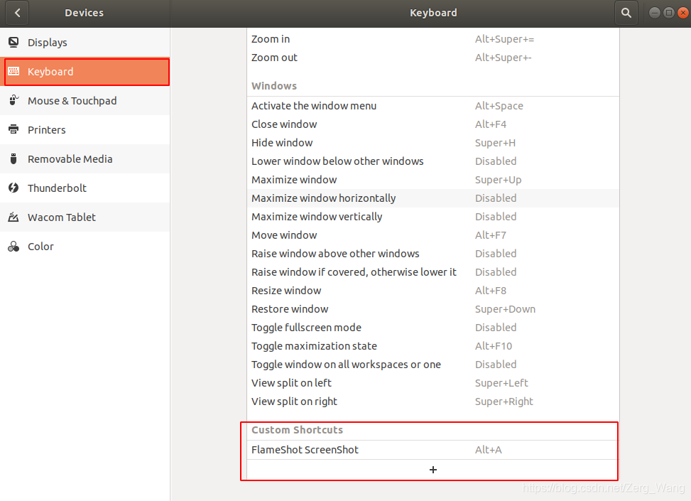
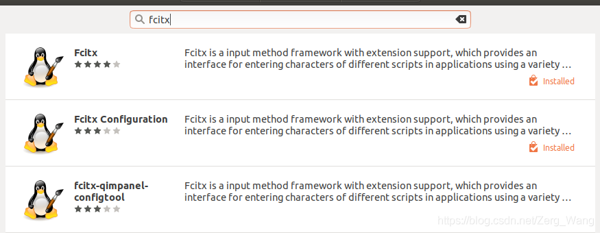
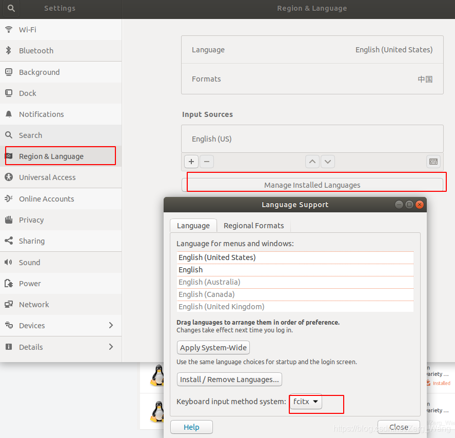
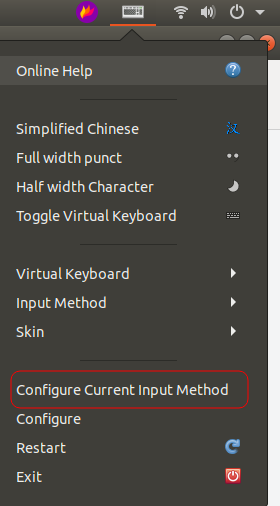
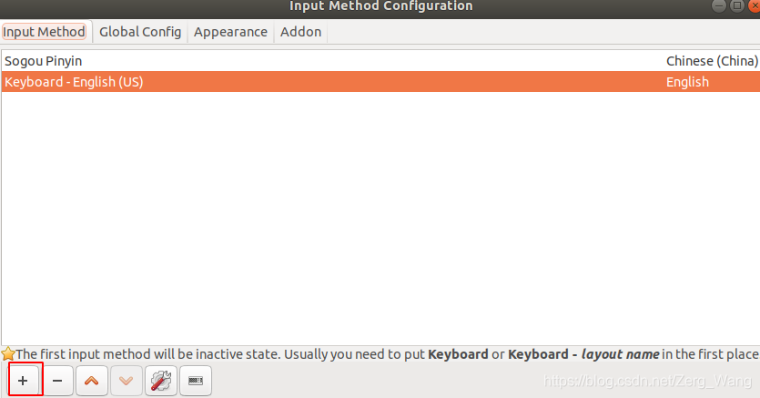

**<font color="ff0000">以下操作，若无特殊说明，均在Ubuntu 18.04LTS下亲测可用。</font>**
<br/>
# 软件安装与更新
#### 换源
Ubuntu默认使用的国外的软件安装源，在国内使用的话，软件的安装和更新会较慢，换源方式：

编辑/etc/apt/sources.list，源的地址都在该文件中，编辑前可对原有源进行备份。

删除原有的国外源，加入：（这里使用的是阿里的源）

注意：以下内容仅适用于Ubuntu 16.04LTS，该版本的代号为“Xenial Xerus”，与源中“xenial”相符合。
```bash
deb http://mirrors.aliyun.com/ubuntu/ xenial main
deb-src http://mirrors.aliyun.com/ubuntu/ xenial main
deb http://mirrors.aliyun.com/ubuntu/ xenial-updates main
deb-src http://mirrors.aliyun.com/ubuntu/ xenial-updates main
deb http://mirrors.aliyun.com/ubuntu/ xenial universe
deb-src http://mirrors.aliyun.com/ubuntu/ xenial universe
deb http://mirrors.aliyun.com/ubuntu/ xenial-updates universe
deb-src http://mirrors.aliyun.com/ubuntu/ xenial-updates universe
deb http://mirrors.aliyun.com/ubuntu/ xenial-security main
deb-src http://mirrors.aliyun.com/ubuntu/ xenial-security main
deb http://mirrors.aliyun.com/ubuntu/ xenial-security universe
deb-src http://mirrors.aliyun.com/ubuntu/ xenial-security universe
```
Ubuntu 18.04LTS（版本代号“Bionic Beaver”）的换源：（前面步骤相同，源内容为：）
```bash
deb http://mirrors.aliyun.com/ubuntu/ bionic main restricted universe multiverse
deb http://mirrors.aliyun.com/ubuntu/ bionic-security main restricted universe multiverse
deb http://mirrors.aliyun.com/ubuntu/ bionic-updates main restricted universe multiverse
deb http://mirrors.aliyun.com/ubuntu/ bionic-proposed main restricted universe multiverse
deb http://mirrors.aliyun.com/ubuntu/ bionic-backports main restricted universe multiverse
deb-src http://mirrors.aliyun.com/ubuntu/ bionic main restricted universe multiverse
deb-src http://mirrors.aliyun.com/ubuntu/ bionic-security main restricted universe multiverse
deb-src http://mirrors.aliyun.com/ubuntu/ bionic-updates main restricted universe multiverse
deb-src http://mirrors.aliyun.com/ubuntu/ bionic-proposed main restricted universe multiverse
deb-src http://mirrors.aliyun.com/ubuntu/ bionic-backports main restricted universe multiverse
```
#### update与upgrade
前者为更新软件源（相当于更新一下软件版本的列表），后者为更新当前已安装的包。

在更新软件前一般要update一下，确保软件更新到最新版本，然后复原损坏的软件包，尝试卸载出错的包，重新安装正确版本，最后upgrade，命令如下：
```bash
sudo apt-get update
sudo apt-get -f install
sudo apt-get upgrade
```
#### 安装包操作
后缀名为deb的，是Debian，Ubuntu等Linux发行版的软件安装包，安装方式：（先到安装包目录下）
```bash
dpkg -i 安装包文件名
```
若安装包为tar.gz或tar后缀名的，和zip一样进行解压缩：
```bash
# tar.gz
tar -xzvf 文件名
# tar
tar -xvf  文件名
# zip
unzip 文件名
```
#### 为软件设置快捷方式
以Pycharm为例：

在/usr/share/applications下新建文件pycharm.desktop，编辑：
```bash
[Desktop Entry] 
Version=1.0 
Type=Application
Name=Pycharm 
Icon=/home/zerg/Softwares/pycharm-community-2019.3.3/bin/pycharm.png 
Exec=sh /home/zerg/Softwares/pycharm-community-2019.3.3/bin/pycharm.sh
MimeType=application/x-py; 
Name[en_US]=pycharm
```
Icon为该快捷方式指定图标，Exec相当于该快捷方式指定的exe……

然后按下super键（也就是win键）搜索pycharm便能找到，然后添加到快捷启动栏。
<br/><br/>

# 显卡驱动及cuda安装
开始以下内容安装前，请确保gcc、g++已正确安装。

#### Nvidia显卡驱动

```bash
# 查看显卡相关信息
lshw -c video

# 查看驱动信息
ubuntu-drives devices
```



可以看到系统提供的的一些显卡驱动。注意，一般新装的Ubuntu18.04LTS系统会使用nouveau的特殊驱动，若要更换，可以自行从Nvidia官网下载，然后命令行安装，这里推荐更加简便的方法：

打开Software & Updates：



自行选择驱动下载安装，之后重启即可。

#### cuda安装
上Nvidia官网按指示下载安装对应的cuda包，安装完成后为cuda添加环境变量：

打开~/.bashrc，在末尾添加：
```bash
export PATH=/usr/local/cuda/bin:$PATH
export LD_LIBRARY_PATH=/usr/local/cuda/lib64:$LD_LIBRARY_PATH
```
注意：这里cuda目录名不一定就是“cuda”，比如我安装的是10.2版本的cuda，目录为cuda-10.2。

之后用命令刷新：
```bash
source  ~/.bashrc
```
可通过以下任意一个命令查看cuda版本：（后一个命令要在环境变量成功添加后才可使用）
```bash
nvidia-smi
nvcc -V
```
cuda安装时会顺便安装几个sample，我们可以用这些sample来检测cuda是否可以正常使用：

一般sample安装在~/下，执行以下命令：
```bash
cd ~/NVIDIA_CUDA-10.2_Samples/1_Utilities/deviceQuery
sudo make
./deviceQuery
```
最后有Result = PASS输出说明cuda可正常使用。

#### cudnn安装
注册Nvidia账号，根据cuda版本下载对应的cudnn：




之后按.deb格式的安装包安装即可。

老版本的cudnn.h一般会在/usr/local/cuda/include/cudnn.h，但我这个版本的cudnn安装在了/usr/include/cudnn.h，因此查看cudnn版本号的命令为：
```bash
cat /usr/include/cudnn.h | grep CUDNN_MAJOR -A 2
```


cudnn版本为7.6.5。
<br/><br/>

# 特殊软件安装
#### 画图软件
推荐Kolourpaint，和Windows下的画图差不多，胜在简单、方便。
```bash
sudo apt-get install kolourpaint4
```
#### 硬盘管理
推荐拥有图形界面的软件GParted，功能和Windows下的磁盘管理类似。安装：
```bash
sudo apt-get install gparted
```
最初安装的时候给“/”文件系统分配空间太小，后面不够用了，本来打算重装了（因为GParted不能操作已挂载的硬盘），其实可以通过Ubuntu18.04LTS的装机U盘，利用“Try Ubuntu”进入试用版系统，该系统自带GParted，此时便可以对系统硬盘进行操作。

#### 截图软件
先讲讲Ubuntu自带截图软件的快捷键：

PrintScreen键是全屏截图，Shift+PrintScreen是自选截图区域，截完之后的图默认保存在~/下。

这里要推荐一个特别好用的截图软件FlameShot，随时可截，当场编辑。软件安装：
```bash
sudo apt-get install flameshot
```
安装后打开键盘设置，在一众快捷键中拉到最下方为该软件配置快捷键：

首先点击“+”添加，在弹出的框中填入命令：
```bash
/usr/bin/flameshot gui
```
由于习惯了微信自带截图，我这里快捷键设成了Alt+A。



#### gcc、g++安装
```bash
sudo apt-get update
sudo apt install build-essential
```

#### 中文输入法设置
以搜狗输入法为例，首先安装如图两个软件：



然后从语言设置处将输入法设置为fcitx。



下载并安装搜狗输入法，重启后右上角：



之后点击左下角添加搜狗输入法即可。



