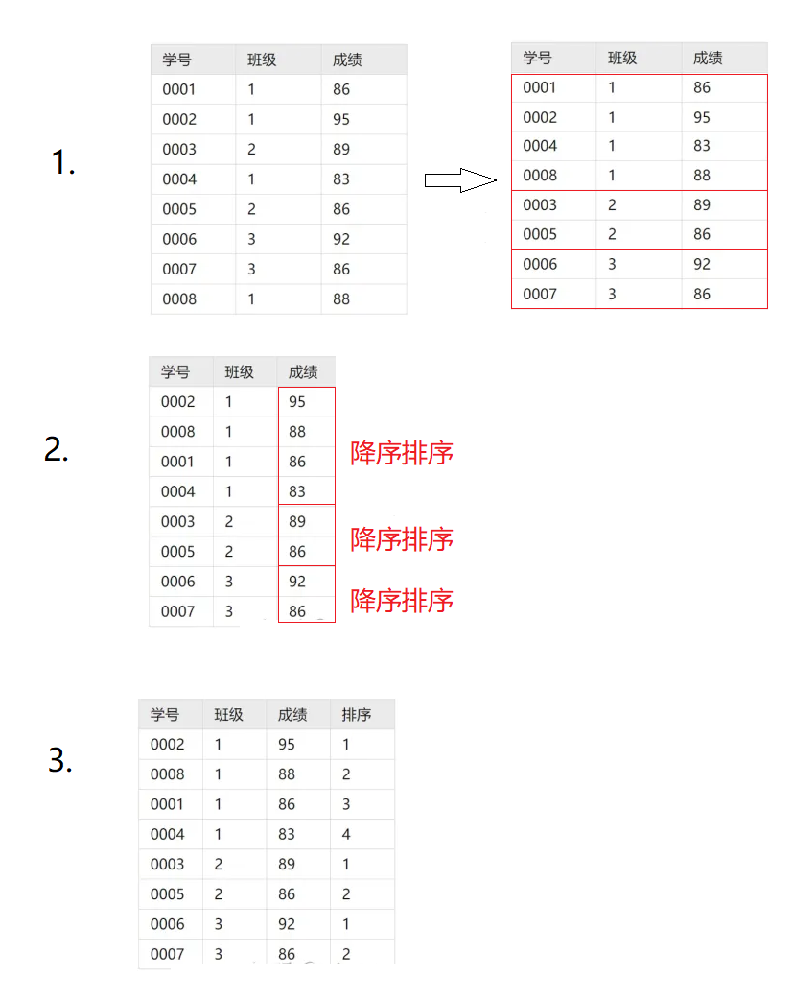

**<font color='ff0000'> 若无特殊说明，则以下SQL语法均适用于GBase 8s数据库，大部分适用于Oracle数据库。</font>**
<br/>


# select语法顺序与执行顺序
```sql
-- 语法顺序
select ... from ... join ... where ... group by ... having ... order by ... limit ...

-- 执行顺序
from -> join -> where -> group by -> having -> select -> distinct -> order by -> limit
```
<br/><br/>

# 查看库名、表名和视图
```sql
-- gbase写法，查看当前库中表名
info tables;

-- Oracle写法，查看当前库中表名
select table_name from user_tables;

--Oracle写法，查看当前库名
select name from v$database;
```
<br/>


# 集合操作
```sql
-- union：对两个select的结果进行并集操作，去除重复结果，并按默认规则排序
select 列表达式 from 表1 union select 列表达式 from 表2;

-- union all：对两个select的结果进行并集操作，不去重也不排序
select 列表达式 from 表1 union all select 列表达式 from 表2;

-- intersect：对两个select的结果进行交集操作（取两个select结果的共同部分）
select 列表达式 from 表1 intersect select 列表达式 from 表2;

-- except（minus）：对两个select的结果取差集（前一个select结果减去两select结果的相同部分）
select 列表达式 from 表1 except select 列表达式 from 表2;
-- 或者
select 列表达式 from 表1 minus select 列表达式 from 表2;
```
<br/>

# 别名
常用于涉及多表操作的select语句中，为表或列增加别名以简化sql语句。
```sql
-- 为表增加别名
select 列表达式 from 表名 as 别名;
-- 为列增加别名
select 列表达式 as 别名 from 表名;
```
在Oracle中，关键字“as”可省略。
<br/><br/>


# with as 
将子查询的结果放入语句级的临时表中（临时表在仅可在当前语句中使用，语句结束即销毁），从而简化查询，提高可读性。
```sql
-- 单个子查询
with 临时表名 as 子查询

-- 多个子查询
with 临时表1 as 子查询1, 
     临时表2 as 子查询2,
     临时表3 as 子查询3
```
<br/><br/>

# case when
```sql
case 
    when 判断条件1 then 列表达式1
    when 判断条件2 then 列表达式2
    when 判断条件3 then 列表达式3
    ... 
    else 列表达式4
end
```
case when整体可作为一个列表达式，或者一个值使用。
<br/><br/>

# join


join用于把多个表中的行结合起来。
首先在待结合的多个表中分别指定一个列，然后这些表对应列中值相等的合并为一行。指定列的列名可以互不相同。
```sql
select 列表达式 from 左表名 join 右表名 on 左表.列名 = 右表.列名
```
join语法中常用的有inner join、full join、left join和right join四种，区别见上表。

这里也举个例子，先建如下两张表，表A存储学生的姓名与学号。
| id | name |
| -- | ---- |
| 1  | wang |
| 2  | liu  |
| 3  | kai  |

表B存储学生的成绩。
| id | sum |
| -- | --- |
| 1  | 80  |
| 2  | 75  |
| 4  | 95  |
## inner join
将多张表对应列中值相等的合并为一行，若不相等或者值缺少，则整行舍弃。
执行如下sql语句：
```sql
select A.id, A.name, B.sum from A join B on A.id=B.id;
```
得到结果：
| id | name | sum | 
| -- | ---- | --- |
| 1  | wang | 80  |
| 2  | liu  | 75  |

在sql语法中“inner”可省略，直接写“join”即可。

## full join
将多张表中对应列中值相等的合并为一行，若不相等或者值缺少，行仍然保留。
```sql
select A.id, A.name, B.sum from A full join B on A.id=B.id;
```
得到结果：
| id | name | sum | 
| -- | ---- | --- |
| 1  | wang | 80  |
| 2  | liu  | 75  |
| 3  | kai  |     |
| 4  |      | 95  |

## left join
将多张表中对应列中值相等的合并为一行，若不相等或者值缺少，左表中对应行保留，右表中对应行舍弃。
```sql
select A.id, A.name, B.sum from A left join B on A.id=B.id;
```
得到结果：
| id | name | sum | 
| -- | ---- | --- |
| 1  | wang | 80  |
| 2  | liu  | 75  |
| 3  | kai  |     |

## right join
同理，合并时对应列中值不相等或者缺少，右表中对应行保留，左表中对应行舍弃。

## cross join
注意：cross join不同于上述任何一种join。cross join又称交叉连接，用于计算两张表的笛卡尔积：
```sql
select * from 表1 cross join 表2;
```
<br/><br/>

# pivot
将某列中的各个字段作为列名，形成多个新列。语法：
```sql
select * from 表名 pivot(
    列表达式 --作为新列的字段
    for 列名 in(列中字段1, 列中字段2, 列中字段3 ...) -- 字段1、2、3均作为新列的列名
);
```
举个例子：[LeetCode 1179](https://leetcode.com/problems/reformat-department-table/description/)：
```sql
select * from Department pivot(
    sum(revenue) for month in (
        'Jan' Jan_Revenue, 
        'Feb' Feb_Revenue, 
        'Mar' Mar_Revenue, 
        'Apr' Apr_Revenue, 
        'May' May_Revenue, 
        'Jun' Jun_Revenue, 
        'Jul' Jul_Revenue, 
        'Aug' Aug_Revenue, 
        'Sep' Sep_Revenue, 
        'Oct' Oct_Revenue, 
        'Nov' Nov_Revenue, 
        'Dec' Dec_Revenue
    )
);
```
<br/><br/>

# unpivot
将表中多个列（假设这几个列名为C1、C2、C3……）缩减为一个聚合列（假设聚合列列名为A，C1、C2、C3……与A中的值一一对应），而原先C1、C2、C3……列中对应的值也被整合到一个新列C中。语法如下：
```sql
unpivot (C for A in (
    C1 as 'C1对应的值', 
    C2 as 'C2对应的值',
    C3 as 'C3对应的值',
    ...
))
```

举个例子，[LeetCode 1795](https://leetcode.com/problems/rearrange-products-table/)：

输入：
| product_id | store1 | store2 | store3 |
| --- | --- | --- | --- |
| 0   | 95  | 100 | 105 |
| 1   | 70  | null| 80  |

输出：
| product_id | store  | price |
| --- | ------ | --- |
| 0   | store1 | 95  |
| 0   | store2 | 100 |
| 0   | store3 | 105 |
| 1   | store1 | 70  |
| 1   | store3 | 80  |
```sql
select 
    product_id, store, price 
from 
    Products 
unpivot (price for store in (
    store1 as 'store1',
    store2 as 'store2',
    store3 as 'store3'
));
```
<br/><br/>

# where
## 判断元素是否在集合中
使用in或not in关键字。
```sql
select 列表达式 from 表名 where 列表达式 in 集合或子查询;
```
其中，集合可通过以下形式定义：
```sql
(值1, 值2, 值3 ...)
```

## 判断元素是否为空
使用is NULL或is not NULL关键字。
```sql
select 列表达式 from 表名 where 列表达式 is NULL;
```
## like 模糊查询
适用于char、varchar等类型，一般用于where子句中，来搜索符合条件的字符串。同样，可以使用“not like”来避开符合条件的字符串。

使用like查询，可使用类似于正则表达式的特殊字符来匹配目标字符串。若不使用特殊字符，则like功能与“=”相同，进行全词匹配。
### 使用“%”来匹配0个或多个字符
```sql
-- 寻找以“Tom”开头的字符串
select * from Person where name like 'Tom%';
-- 寻找以“Jackson”结尾的字符串
select * from Person where name like '%Jackson';
-- 寻找含有“Van”的字符串
select * from Person where name like '%Van%';
```
### 使用“_”限制匹配的字符数量
每个“_”表示匹配一个任意字符。
```sql
-- 寻找以“Tom”开头，且后面还有任意4个字符的字符串
select * from Person where name like 'Tom____';

-- 寻找含一个“A”，且其前后各有一个字符的字符串
select * from Person where name like '_A_';
```

### 正则表达式匹配
使用以下函数：
regexp_like(列表达式，正则表达式)
```sql
-- 寻找以“BMW X”开头，后面跟着一个字符3、4或5的字符串，也就是匹配“BMW X3”、“BMW X4” 、“BMW X5”这三种字符串。
select * from Car where regexp_like(name, 'BMW X[3-5]');
```
<br/><br/>

# group by
## 基本用法
一般和聚合函数一起使用。
group by后接列表达式，将表中的每行按列表达式中的值进行分组。也就是说，对于每一行，它们列表达式的值相等的话会被分到同一组。
```sql
select 列表达式 from 表名 group by 列表达式;
```
假设有表T记录了学校中每个学生的成绩：
| grade | class | id | score |
| ----- | ----- | -- | ----- |
| 1     | 1     | 1  | 80    |
| 1     | 1     | 2  | 90    |
| 2     | 3     | 3  | 99    |
| 2     | 3     | 5  | 99    |
| ...   | ...   | ...| ...   |

若要显示每个班学生的平均成绩：
```sql
select grade, class, avg(score) from T group by grade, class;
```
得到结果：
| grade | class | score |
| ----- | ----- | ----- |
| 1     | 1     | 85    |
| 2     | 3     | 99    |
| ...   | ...   | ...   |

在group by的返回结果中，每组仅显示为一行，但每组是由原表中的多行构成的，因此需要从这多行数据中选择数据组成代表该组的那一行。此时一般使用聚合函数，对列表达式进行求和、求平均、计数等方式计算出一个值来代表这一组。

## group by显示指定行
对于group by后的每一组，如果需要原来的某一行的值来代表该组进行显示，可嵌套子查询来实现。举个例子，下表为用户登录网站的记录：
| id | time | action |
| -- | ---- | ------ |
| 1  | 2023-4-1  | Read |
| 1  | 2023-4-5  | Write|
| 2  | 2023-4-11 | Write|
| 3  | 2023-3-22 | Read |
| ...| ...       | ...  |

如果需要知道每个用户首次登录的时间，可通过group by及聚合函数直接实现：
```sql
select id, min(time) from t group by id;
```
但如果需要知道每个用户首次登录的时间，以及当时用户的行为，action列的选择受制于time列，因此无法对action列使用聚合函数。对此可使用子查询来获取action列对应的值：
```sql
select 
    t1.id, 
    min(t1.time),
    (select t0.action from t t0 where t0.id=t1.id order by t0.time limit 1) as action
from 
    t t1 
group by 
    t1.id;
```
<br/><br/>

# having
用法与where类似，后面接条件判断。但两者在select语句中的执行顺序不同。where过滤原始表或join运算后的表中不符合条件的行，having则在group by之后执行，用于过滤掉不符合条件的组。
<br/><br/>

# order by
给出列表达式，按列表达式的值大小进行升序排序。默认为升序排序。若要按降序排行，添加关键字“desc”。若存在多个排序条件，则继续在语句后面添加列表达式。
```sql
-- 降序
select 列表达式 from 表名 order by 列表达式 desc

-- 按列表达式1排序，若对应值相同，则按列表达式2排序
select 列表达式 from 表名 order by 列表达式1 desc, 列表达式2 asc,  ...
```
注意：order by无法对子查询使用。
<br/><br/>


# limit 与 offset
注意：limit与offset为MySQL特有语法。在limit语句中，查询结果索引从0开始。

limit与offset一般用于最后对查询结果的筛选。其中，limit有两种使用方式：
1. 单参数limit。假设要查询结果的前k条
```sql
select * from 表名 limit k;
```
2. 双参数limit。需要查询结果的第i条开始的连续j条：
```sql
select * from 表名 limit i, j;
```

offset只能与单参数limit搭配使用，可以起到与双参数limit同样的效果。假设要查第i条开始的连续j条：
```sql
select * from 表名 limit j offset i;
```
<br/><br/>


# 函数
## 列筛选函数
```sql
-- 查询全部列
select * from 表名;

-- 返回去重后的结果集
select distinct 列表达式 from 表名;

-- 跳过查询结果的前K行
select skip K 列表达式 from 表名;

-- 返回查询结果的前K行
select first K 列表达式 from 表名;
-- 等价于
select 列表达式 from 表名 where rownum <= K;
```

## 字符处理函数
```sql
-- 将多个列的内容合并，或者拓展某列的内容
concat(列表达式或常量, 列表达式或常量 ...)

-- 取字符串的字符长度
length(列表达式)
-- 取字符串的字节长度
lengthb(列表达式)

-- 转大写字母
upper(列表达式)

-- 转小写字母
lower(列表达式)

-- 取字符串从pos开始的连续len个字符（字符串首位坐标为1）
substr(列表达式, pos, len)

-- 返回子串在主串自第pos位后第k次出现的位置
-- 参数pos及k可省略，pos及结果按字符算位置
instr(主串, 子串, pos, k)
-- 同instr，pos及结果按字节算位置
instrb(主串, 子串, pos, k)
```

## 数值处理函数
```sql
-- 计算指定列中非NULL的行的数量
count(列名)

-- 如果参数为常数或“*”，则返回表的行数
count(常数)

-- 求指定列中值的和
sum(列表达式)

-- 求指定列平均值
avg(列表达式)

-- 求指定列中最大值
max(列表达式)

-- 求指定列中最小值
min(列表达式)

-- 求指定列对指定值取模后的结果
mod(列表达式, 值)

-- 对结果四舍五入至指定位小数，第二个参数默认为0，即不保留小数
round(列表达式, 值)
```
## 类型转换

### to_char
将数值或日期类型转换成指定格式的字符串。

对于数值类型，支持的格式有：（以下为部分例子）
| 语句 | 结果 | 备注 |
| ---  | ---  | --- |
| to_char(123.45, '999.9')  |  123.5   | 四舍五入至一位小数 |
| to_char(12.34, '99.999')  |  12.340  | 末尾补零 |
| to_char(1234.5, '9,999.9')|  1,234.5 |  |
| to_char(10.73, '$99.00')  |  $10.73  |  |
| to_char(21, '000099')     |  000021  | 补充前导零 |
| to_char(63, 'xx')         |  3f      | 十进制转十六进制 |

其中，“9”代表数值本身的占位符，若该占位符数比结果的实际位数多，则多出来的占位符一般以空格替代。“0”为0占位符，会在结果的指定位置补“0”。“x”专门用于进制转换。
<br/>

对于日期类型，支持的格式有：（以下为部分例子）
| 语句 | 结果 |
| ---  | ---  |
| to_char(date, 'yyyy-mm-dd HH24:MI:SS')  |  1919-08-10 11:45:14  |
| to_char(date, 'yyyy-mm-dd')  |  2023-04-01   |
| to_char(date, 'yyyy/mm/dd')  |  2023/04/01   |
| to_char(date, 'MON dd, yyyy')|  APR 01, 2023 |

其中yyyy、mm、dd等格式符可参考date类型的具体说明。
### to_date
将字符串按照指定的格式转为日期类型，格式参数与to_char函数一致。
```sql
to_date('2000-01-01', 'YYYY-MM-DD')
```
### to_number
将字符串转成数值
```sql
to_number(列表达式)
```
## 其他
### nvl
空值判断函数，如果列表达式A的结果非NULL，则返回A的值，否则返回B的值。
```sql
nvl(列表达式A, 列表达式B)
```
### listagg
将某一列中，多行的值聚合成一行，语法：
```sql
listagg(列名, 分隔符) within group (order by 列名) as 新列名
```
将指定列中同组的多个值将聚合到一行之中，排序后以指定分隔符隔开。举个例子：[LeetCode 1484](https://leetcode.com/problems/group-sold-products-by-the-date/)：

输入：
| sell_date  | product    |
| --         | --         |
| 2020-05-30 | Headphone  |
| 2020-06-01 | Pencil     |
| 2020-06-02 | Mask       |
| 2020-05-30 | Basketball |
| 2020-06-01 | Bible      |
| 2020-06-02 | Mask       |
| 2020-05-30 | T-Shirt    |

输出：
| sell_date  | num_sold | products                     |
| -- | -- | -- |
| 2020-05-30 | 3        | Basketball,Headphone,T-shirt |
| 2020-06-01 | 2        | Bible,Pencil                 |
| 2020-06-02 | 1        | Mask                         |

```sql
select 
    to_char(sell_date, 'YYYY-MM-DD') as sell_date,
    count(product) as num_sold,
    listagg(distinct product, ',') within group (order by product) as products
from 
    activities
group by 
    sell_date;
```
<br/><br/>


# 窗口函数（Window Function）
## 语法规则
窗口函数的语法主要由三部分组成：
```sql
窗口函数名(参数) over (
    partition by 列表达式
    order by 列表达式    
)
```
执行逻辑如下：

1. 将表中各行按parition子句中列表达式的值进行分组（不同于group by，窗口函数的分组不会减少行数）。若不需要分组，parition子句可省略

2. 对于每一组，单独执行order by子句（若不需要排序，该子句也可省略）。
   
3. 对排序后的每一组使用窗口函数，得到的结果作为新列加入表中

举个例子，生成每个学生在本班级内的成绩排名：
```sql
select 
    *, 
    rank() over (
        partition by 班级
        order by 成绩 desc
    ) as 排序
from
    表;
```


窗口函数原则上只能用于select子句中，其语句整体可视为列表达式。


窗口函数名用于指定要使用的窗口函数，下面将详细介绍各种窗口函数
## 专用窗口函数

- rank()
获得当前行的序号，若order by子句中指定的字段相等，则序号相同，且会占用后面行的位置。
- dense_rank()
功能和rank相似，相同字段的行，其序号也相同，但不会占用后面行的位置。
- row_number()
无视字段是否相等，直接按行输出序号。

举个例子：
| 成绩 | rank |  dense_rank | row_number |
| --- |  --- |  ---------- |  --------- |
| 99 | 1 | 1 | 1 |
| 87 | 2 | 2 | 2 |
| 87 | 2 | 2 | 3 |
| 87 | 2 | 2 | 4 |
| 74 | 5 | 3 | 5 |


- lead(列表达式, offset, default)
假设当前行是第i组的第j行，则lead函数用于获取第i组第j+offset行的列表达式的值。若j+offset超出当前组的范围，则返回default值。

- lag(列表达式, offset, default)
用法与lead相似，获取第i组第j-offset行的列表达式的值。

## 聚合函数作为窗口函数使用
聚合函数作为窗口函数使用时，假设当前行是第i组的第j行，该行的窗口函数的计算范围为：始于第i组第1行，结束于第i组第j行。举个例子，下表记录了1到3月每日的收入，现在按天统计每个月的累计收入：
| Month | Day | Income |
| ----- | --- | ------ |
| 1     |  1  |  15    |
| 1     |  5  |  17    |
| 1     |  23 |  22    |
| 2     |  8  |  35    |
| 2     |  9  |  11    |
| 2     |  27 |  7     |
| 3     |  14 |  28    |
| 3     |  19 |  9     |

执行SQL如下：
```sql
select 
    *, 
    sum(Income) over (
        partition by Month
        order by Day
    ) as Result 
from Table; 
```
结果如图：
| Month | Day | Income | Result |
| ----- | --- | ------ | ------ |
| 1     |  1  |  15    | 15     |
| 1     |  5  |  17    | 32     |
| 1     |  23 |  22    | 54     |
| 2     |  8  |  35    | 35     |
| 2     |  9  |  11    | 46     |
| 2     |  27 |  7     | 53     |
| 3     |  14 |  28    | 28     |
| 3     |  19 |  9     | 37     |
<br/><br/>


# 参考资料及部分图片出处
[SQL 教程 | 菜鸟教程](https://www.runoob.com/sql/sql-join.html)

[SQL中select的执行顺序](https://blog.csdn.net/weixin_43480466/article/details/122974596)

[(七)数据分析之窗口函数](https://zhuanlan.zhihu.com/p/351822793)