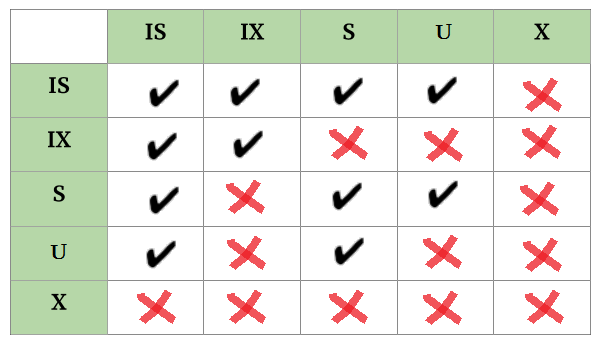
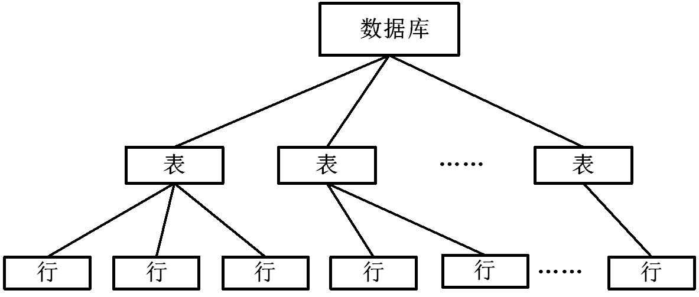

# 事务相关概念
## 事务（Transaction）
对数据库一系列操作的集合。

## 事务的特性（ACID）
原子性（Atomicity）：事务中的所有操作要么都执行完（然后全部提交），要么一个都不执行（全部回滚）。事务中的操作不可部分执行，更不可分割。

一致性（Consistency）：事务运行结果不改变数据库中的数据一致性。例如“转账”事务，转账前后两个账户的余额总计是不变的。

隔离性（Isolation）：事务并发运行过程中，一个事务不能被其他事务或操作干扰。同时执行的事务之间不能互相影响。

持久性（Durability）：指事务运行完毕并成功提交后，其对数据库的所有操作结果应永久保留。以后运行的其他事务、操作甚至系统故障、意外情况等均不会影响该事务的运行结果，除非其他事务或操作更新相关数据。

## 调度（Schedule）
指事务的执行顺序。多个事务依次执行称为事务的串行调度（Serial Schedule）；多个事务同时执行称为事务的并发调度（Concurrent Schedule）。多个事务并发调度的执行结果与它们串行调度的执行结果一致，则这个并发调度被称为“可串行化调度”（Serializable Schedule）。

## 冲突（Conflict）
如果事务调度中的两个操作交换执行顺序会改变它们所属的事务运行结果，则这两个操作冲突。

共有如下两种冲突情况：（1）同一事务的任何两个操作之间都是冲突的，无论这两个操作的数据对象是否相同，无论这两个操作是读还是写；（2）不同事务对同一数据对象，只要有任一操作涉及到写就一定冲突。
  

# 封锁
## 相关概念
### 谁来上锁？     

事务。（或者说，系统根据事务的需求来上锁）

### 锁谁？

数据对象，可以是单行记录、数据页、索引、表甚至整个数据库。

### 为啥要锁？

避免其他事务访问数据对象产生数据不一致性错误。

### 锁了会怎样？

数据对象被上锁后其他事务或操作就无法对该对象读或写，直到锁被释放。

### 锁多久？        

由事务决定。一般事务结束后会释放掉。

## 封锁粒度
封锁粒度即锁的对象或锁的作用范围。封锁粒度从高到低可分为数据库锁（Database-Level Lock）、表级锁（Table-Level Lock）、页级锁（Page Lock）、行级锁（Row Lock）以及索引（Index Key）等。

一般来说锁的粒度越高，事务执行效率更高，但并发性越低。假如某事务要处理数据库中的某些表，直接对整个数据库上锁无疑是最方便高效的方式，但这样其他事务对该数据库以及其中的所有表、行等均无法操作。如果该事务仅对它要操作的那些表逐一上锁，虽然效率较低，且需要同时管理多个锁，但其他事务可以并发处理同数据库中的其他表。

数据库软件一般支持不同粒度的锁并存。

## 锁的类型
### 共享锁（Shared Lock）
简称S锁、读锁。事务A对某数据对象加了S锁，则事务A只能对该对象进行读操作。其他事务对于被上了S锁的对象只能上S、IS或U锁，而不能上X或IX锁。

### 排他锁（Exclusive Lock）
简称X锁、写锁。在任一数据对象上，X锁均无法与其他任何锁共存。若某事务对数据对象加了X锁，则除该事务外任何事务无法对该数据对象进行读写操作。

### 提升锁（Update Lock）
简称U锁。U锁是一种过渡锁。若事务A对某对象有修改意图，则先加上U锁。等到真正开始更新操作时再将U锁提升为X锁。被加了U锁的对象只能被别的事务加S或IS锁。

实际上，对U锁的灵活使用可有效减少死锁的发生。假设事务A和B先后对同一数据进行读取，然后A、B又先后有改写该数据的需要。假设A先申请写锁，发现数据上有B的读锁，则A要等待B释放掉读锁后才能上写锁。如果此时B也要改写该数据，则双方互相等待对方释放读锁，死锁的情况就发生了。如果在改写数据时A先加上的是U锁，此时B再来改写数据，也要上U锁，但由于U锁不能共存，因此B的改写申请失败，无需等待A的读锁释放。而A只要等待B释放掉读锁即可改写数据。

### 意向锁（Intent Lock）
简称I锁。

首先我们考虑以下这种情况：事务A在表1中上了一个行锁，此时事务B要对整个表1进行修改，此时B就要看表1是否上了锁，或者遍历表中所有的行，当表1没上锁或者表1中所有行都没上锁时B才能给表1上锁然后操作。但是遍历表中所有行效率太低。因此，A在上行锁之前先申请给该行所属的表1的I锁，上了I锁后再上行锁。当B看到表1上有意向锁就知道表被占用了，就不用再通过遍历表这种低效的方式找锁了。

意向锁一般与S锁或X锁连用，即意向共享锁（Intent Shared Lock，IS锁）和意向排他锁（Intent Exclusive Lock，IX锁）。若某对象上存在IS锁或IX锁，说明该对象的下层某数据对象被加了S锁或X锁。同理，若某对象被加了S锁或X锁，则该对象的上级对象也要对应加上IS锁或IX锁。

下图展现了对于同一数据对象锁的共存情况。

## 多粒度树

 如图，可以将不同粒度的上锁对象视为树型结构，从上到下分别是数据库、表、行。

上锁时可以仅针对某个节点单独加锁，同时这也意味着该节点下的所有子节点被加了相同的锁，且自该节点往上的所有祖节点被加上意向锁。

另外，为了减少冲突，加锁时应自上而下逐层加锁；解锁时应自下而上逐层解锁。

## 显示封锁与隐式封锁
**显式封锁**：直接加到数据对象上的封锁

**隐式封锁**：该数据对象没有独立加锁，但其某个祖节点加上了锁。

因此，在处理冲突时，系统不仅要检查显式封锁，还要检查隐式封锁。

## 封锁产生的问题
### 活锁（Live Lock）
某事务一直在等待某个数据对象解锁而一直无法执行的情况称为活锁。例如事务A要对对象1上锁，但事务B提前上了锁，A只能等B解锁。但在B解锁后事务C、D、E......一直轮流使用对象1，不断上锁解锁，导致A一直无法给对象1上锁。

### 死锁（Dead Lock）
系统中两个及以上的事务都在互相等待另一事务释放锁，导致这多个事务一直无法执行的状态。例如，事务A对对象1上锁，事务B对对象2上锁，但A也需要对2上锁，由于2被B占用，A只能等待，接着B要对对象1上锁，同样也要等待，就这样事务A、B互相等待对方解锁，导致两个事务一直无法执行。
  

# 并行操作产生的问题
## 脏读（Dirty Read）
当读取对象时不检查对象上是否存在X锁，可能导致脏读。

假设事务A读取并更新了某对象，之后未提交其操作且回滚。在A更新后回滚前，事务B不检查对象上存在的X锁，直接读取该对象。但由于A的更新被回滚，B读到的是一个无意义的值。

## 脏写（Dirty Write）
假设事务A读取并更新了某对象，之后未提交其操作且回滚。在A更新后回滚前事务B同样更新了该对象，但由于事务A的回滚，导致该对象无论被更新成了什么值都被还原到A更新前的状态，事务B白忙活。

无论何种隔离级别，修改对象的时候X锁一般都会加，因此脏写一般不会发生。

## 不可重复读（Non-repeatable Read）
当读取对象不加S锁时可能发生不可重复读。

假设事务A先读取了某对象。由于对象上没有S锁，事务B之后更新了该对象，再然后事务A又读取了一次该对象。A两次读取同一对象但得到的结果不同，这种情况即为“不可重复读”。

## 幻读（Phantom Read）
和不可重复读类似，假设事务A按一定规则select出了10条数据，然后事务B插入或删除了符合同样规则的5条数据，再然后A按同样规则select，得到了15条或者5条数据（反正不是10条），这种情况即为“幻读”。
  

# 隔离级别
为了避免以上并发可能产生的问题，数据库系统设计了不同的隔离级别。以下将以GBase软件中的隔离级别为例逐一介绍。

## 脏读（Dirty Read）
**在其他数据库软件中对应的是“读未提交（Read Uncommitted）”隔离级别（顾名思义，即允许读取到未提交事务修改的数据）。**
该隔离级别最低，并发性最高。

在该隔离级别下，所有的读取操作（例如select查询）均不会对相应数据对象加任何锁，读取前也不检查读取对象是否被上锁。因此，数据对象被修改时，其他事务并不检查上面是否有X锁就直接读，脏读的情况可能会发生。数据在被读取时，由于不上S锁，其他事务能直接上X锁并修改，幻读和不可重复读也无法避免。

## 提交读（Committed Read）
**在别的数据库软件中称为“读已提交（Read Committed）”。**
该隔离级别并发性较高，是使用最广泛的一种隔离级别。

在该隔离级别下，读取操作会对数据对象尝试加S锁（但不会真正加上S锁）来检测对象是否正被修改。假设数据对象正在被事务A修改，对象上会存在X锁。此时事务B要读取该对象，会尝试加S锁，但由于X锁存在，尝试加锁会失败，B会进行等待，如果等待超时则报错退出，从而避免脏读的问题。

如果数据对象上本身无X锁，事务B仅读取对象而不加S锁。因此幻读和不可重复读的问题无法避免。

## 最后提交读（Last Committed Read）
在该隔离级别下，读取操作不检查数据对象上有没有锁，直接通过逻辑日志读取该数据对象最后一次提交的值。当然，读取全过程也不上任何锁，因此最后提交读能避免脏读，但不能避免幻读和不可重复读。

相比提交读，最后提交读不检查锁，也不需要锁等待，并发性相对更高。此外，在提交读下会出现因死锁产生的锁等待情况，但在最后提交读下由于读取不检查锁，可直接避免此种情况。

## 游标读（Cursor Stability）
游标读基于游标来实现。在该隔离级别下，假设读取时游标检索到某个数据对象1，就会切实地加上S锁，当读取完1到下一个对象2时，对象1上的S锁会被及时地释放掉。由于读取操作切实地加上了S锁，脏读、幻读、不可重复读均可避免。

## 可重复读（Repeatable Read）
**在别的数据库软件中称为“可串行化（Serializable）”。**
该隔离级别并发性最低。

该隔离级别下，读取操作将踏踏实实地对相应数据对象加上S锁，直到整个事务结束才释放锁（而不是按数据对象逐个读逐个释放），从而完全避免脏读、幻读、不可重复读等问题。

## 其他
除了以上五种GBase系统中的隔离级别，在其他数据库系统中还有一种与GBase不同的“可重复读（Repeatable read）”。该隔离级别的并发性比可串行化高，在该隔离级别下可避免脏读和不可重复读，但无法避免幻读。

下面将上文提到的各隔离级别按并发性从高到低排序（括号中的是非GBase系统中的隔离级别）：

脏读（读未提交） -->  最后提交读  -->  提交读（读提交） -->  游标读  -->  可重复读（可串行化）
  

# 参考资料与部分图片出处
《数据库原理和实践教程》 袁晓洁 孙国荣

[All about locking in SQL Server](https://www.sqlshack.com/locking-sql-server/)

[mysql数据库意向锁意义 - 简书](https://www.jianshu.com/p/e937830bc2de)

[数据库—封锁的粒度_Ge_zi327的博客-CSDN博客_封锁粒度](https://blog.csdn.net/Ge_zi327/article/details/78946235)

[Multiple Granularity Locking in DBMS - GeeksforGeeks](https://www.geeksforgeeks.org/multiple-granularity-locking-in-dbms/)
