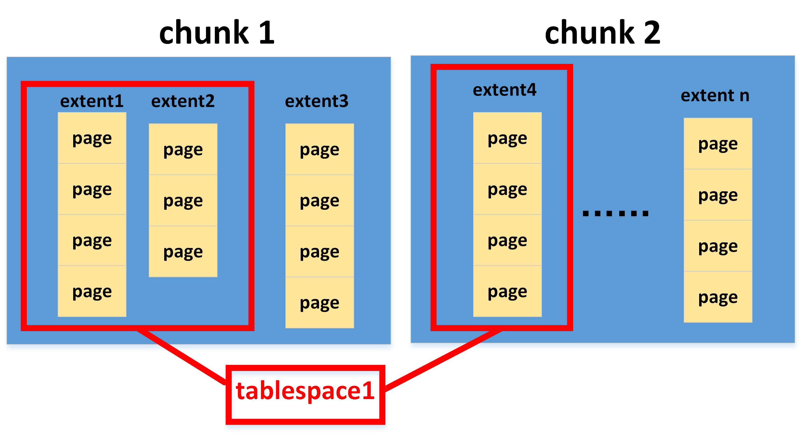

**以GBase系统为例**

# 物理存储单元
#### page
最基本的物理存储单元，系统进行一次I/O操作的最小单元为一个page。也就是说，即使仅修改了某个page中的某一个记录，系统也要对这整个page进行I/O操作。

#### chunk
一个chunk为存储数据的一块连续磁盘空间。一个chunk可以是一块raw device（例如没有文件系统或操作系统的磁盘）或UNIX文件。每个chunk中包含多个page。
  

# 逻辑存储单元
#### extent
在同一个chunk中，多个连续的page组成一个extent。单个extent从属于某个表或索引，也就是说，单个extent存储了某个表（索引）或某个表（索引）的一部分。

#### tablespace
一个表或索引占用的空间称为一个tablespace。一个tablespace可包含多个extent。这多个extent可能分布在不同的chunk中。

#### dbspace
 一至多个chunk组成一个dbspace。tablespace可与表或索引一一对应，但dbspace与整个数据库却无对应关系。一个数据库可以只在一个dbspace下，也可分布在多个dbspace中。单个dbspace中可能存储有来自不同数据库的数据。每个数据库中会有多个表或索引，因此单个表或索引的数据可能分布在多个dbspace中。
  

# 参考资料
《数据库原理和实践教程》 袁晓洁 孙国荣
