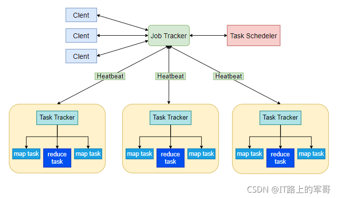

# MapReduce简介

MapReduce主要由四个部分组成，分别是：Client、JobTracker、TaskTracker以及Task。

### Client
用户编写的MapReduce程序通过Client提交到JobTracker端 用户可通过Client提供的一些接口查看作业运行状态。

### JobTracker
负责资源监控和作业调度。 JobTracker 监控所有TaskTracker与Job的健康状况，一旦发现失败，就将相应的任务转移到其他节点 JobTracker 会跟踪任务的执行进度、资源使用量等信息，并将这些信息告诉任务调度器（TaskScheduler），而调度器会在资源出现空闲时，选择合适的任务去使用这些资源。

### TaskTracker 
周期性地通过“心跳”将本节点上资源的使用情况和任务的运行进度汇报给JobTracker，同时接收JobTracker 发送过来的命令并执行相应的操作（如启动新任务、杀死任务等） TaskTracker 使用“slot”等量划分本节点上的资源量（CPU、内存等）。一个Task 获取到一个slot 后才有机会运行
