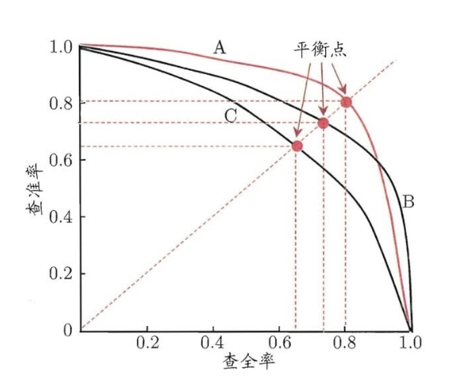
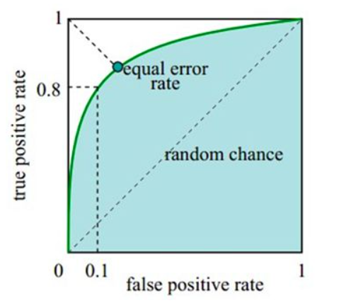
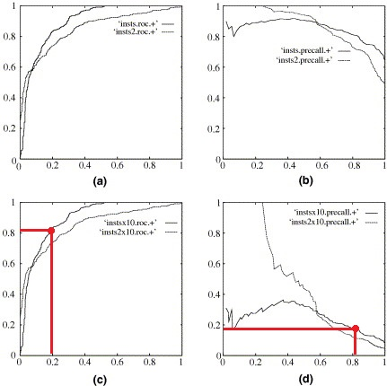
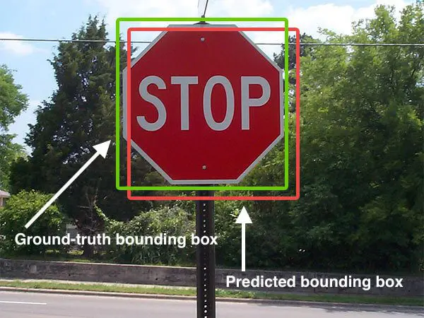
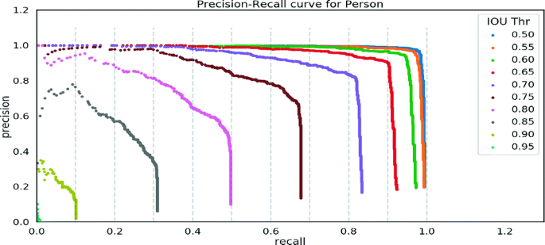
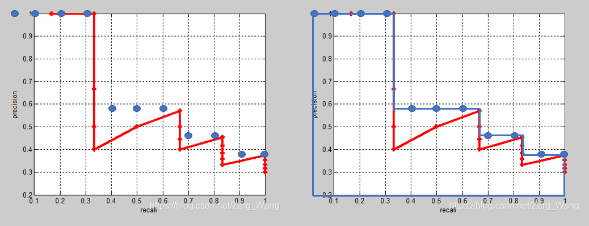
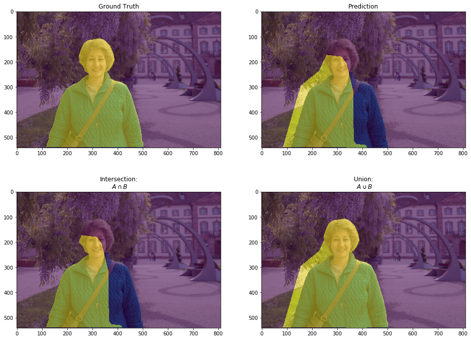

# 简介
本文主要探讨应用于计算机视觉的深度学习模型的评判指标。在计算机视觉中，深度学习任务主要分成目标检测、语义分割及简单的分类这三类。本文也主要针对这三种任务下的评判指标进行探讨。更为复杂的图像文字识别、实例分割等任务此处暂不讨论。

<br/><br/>

# 分类任务中的指标

## Confusion Matrix（混淆矩阵）

以简单的二分类任务为例（例如判断图像中物体是否为人），模型给出的结果只能是以下四种之一：

1. 图中实际是人，模型也识别为人。这种情况称为“真正例”（True Positive），简写为TP；

2. 图中实际是人，但模型认为其不是人（或未识别），这种情况称为“假负例”（False Negative），简称FN；

3. 图中不是人，但模型识别为人。这种情况为“假正例”（False Positive），简写FP。

4. 图中不是人，模型也认为其不是人（或未识别），这种情况称为“真负例”（True Negative），简称TN。

如何记忆和区分以上四种情况呢？先看第一个字母：如果模型预测结果是正确的，字母就是T，否则为F。

再看第二个字母：如果模型做出了正面的预测（也就是说，模型“积极”地作出分类，而不是“消极罢工”，不进行预测），无论是否正确，字母都为P，否则为N。

推广到N分类任务上，模型预测结果可用一张表T来表示：

|  | 1 | 2| ... | N |
|-- | -- | --|  --| --|
| 1 |
| 2 |
|...|
|N|
 
横坐标为模型预测的类别，纵坐标为实际的类别，则```T[i][j]```的值就表示实际为第i类物体，但模型预测为第j类的情况数。

在这种情况下，假设我们要查看模型对第k类物体的预测情况，则有：

$TP_k = T[k][k]$

$FP_k = \sum_{i=1, i\neq k}^n T[i][k]$

$FN_k = \sum_{j=1, j\neq k}^n T[k][j]$

假设模型一共有$M$个的预测结果，则：
$TN_k = M - TP_k - FP_k - FN_k$

根据上述结果，可引申出以下几个更为直观的评判标准：

### Accuracy
模型预测正确的情况占所有情况的比例，该值越高，说明模型的预测结果越接近实际。

$Accuracy = \frac{TN+TP}{TN+TP+FN+FP}$

### Precision
又称为查准率。Precision即模型做出正面预测的所有结果中正确的比例，该值越高，说明模型的预测结果互相之间越一致。

$Precision = \frac{TP}{TP+FP}$

### Recall
又称为查全率，召回率，true positive rate(TPR)。指模型对某类样本的所有预测情况中，模型能正确识别出该类样本的比例：

$Recall = \frac{TP}{TP+FN}$

### Precision与Recall的特点
Precision高、Recall低的模型的特点为：轻易不出手，出手就必杀。如果用这种模型识别图像中的人，它可能会漏检很多实际为人的图片，但是一旦该模型认定某张图中是人，则基本不会出错。对于一些要求精确定位的任务（例如判断一群鹿里面有没有马，如果我的Recall很高，就会经常“指鹿为马”，而Precision高的话，即使我无法找出全部的马，但可以精确识别出一匹就可以完成任务了）

Precision低、Recall高的模型的特点为：宁可错杀一千，不可放过一个。这样的模型可能会把很多非人图像识别为人，但它一般能保证把所有含人的图像找出来。对于一些安全防范类的任务（例如识别某些物品是否为危险品）会要求有较高的Recall。（即使识别冤枉了也不能放过一个）。

## Top 1 Accuracy & Top 5 Accuracy
在分类任务中，当测试集中的某个样本输入模型后，模型会生成该样本在所有类别上的概率（得分），如果得分最高的5个类别中，存在该样本的实际类别，那么认为模型对该样本的预测正确。则Top 5 Accuracy就等于预测正确的样本数除以所有样本数。

同理，在Top 1 Accuracy下，只有当得分最高的类别是样本实际类别时，才认为模型的预测正确，在这种情况下预测正确的样本数除以所有样本数等于Top 1 Accuracy。

## F1 Score
综合了Recall和Precision的一个指标，其值等于两者的调和平均数。

$F1 = \frac{2\ Precision\ Recall}{Precision\ +\ Recall}$


## PRC（Precision Recall Curve）
由于模型对样本的预测结果呈现为该样本在所有类别上的概率（得分），因此一般需要一个名为“置信度”（Confidence Threshold）的超参数来帮助决策。以“判断图像中物体是否为人”这个二分类任务为例，如果模型对某样本在“人”这个分类上的预测得分高于置信度，则说明模型作出积极的预测，否则说明模型作出消极预测。

不同的置信度下，模型的TP、FP、FN、TN都会不一样，一般来说，置信度越高，Precision也越高，但Recall会降低。我们可以Recall为横轴，Precision为纵轴，一种置信度下模型的表现结果为图中一个点，通过多个置信度对应的点即可得到PRC。



PRC还可同时用于比较多个模型之间的性能差异。若某个模型的曲线明显包住另一个模型的曲线，说明前者更优（例如图中A优于C）。对于相互交汇的曲线，可以通过该曲线与坐标轴围成的面积（AUC，Area Under Curve）来评判其性能。此外，还可以引入BEP（平衡点）来衡量模型优劣。平衡点是图中Recall与Precision相等时取的点，显然平衡点越往右上走，模型越好。

## ROC（Receiver Operating Characteristic）
ROC曲线也用于衡量一个二分类模型的性能，其横坐标为FPR=FP/(FP+TN)，纵坐标为TPR（也就是Recall）。按上面的例子，从公式可知横坐标为：所有样本不为人的情况中，模型误识别为人的比例；纵坐标为：所有样本为人的情况中，模型正确识别为人的比例；在设置不同的置信度后，可在图中得到多个点，连点即可得到该ROC曲线。理想的模型自然是TPR=1，FPR=0（即图最左上角）。

在ROC中，也可使用曲线下方的面积大小（AUC，Area Under Curve）来评判模型性能。



在样本数量足够大的情况下，图中沿对角线的虚线是完全随机预测样本的模型（该模型预测任何样本的得分都是一个[0,1]范围内的随机数）的表现。下面简单证明一下：

假设共有$n$个正样本（实际为人的样本），$m$个负样本（实际不为人的样本），则有：$n = TP + FN, \ m = FP + TN$

假设有$k$个样本的得分超过置信度，则有：$k = TP+FP$

由于模型对任何样本都是完全随机赋分，因此可以认为这$k$个样本是模型完全随机抽样出来的。那这$k$个样本的分布与所有样本的分布一致，也就是说：

$\frac{TP}{K} = \frac{n}{n+m} , \ \frac{FP}{K} = \frac{m}{n+m} $

那么：

$TPR = \frac{TP}{TP+FN} = \frac{\frac{kn}{n+m}}{n} = \frac{k}{n+m}$
$FPR = \frac{FP}{FP+TN} = \frac{\frac{km}{n+m}}{m} = \frac{k}{n+m}$

## ROC与PRC的异同
同一模型得到的这两种曲线，上面的点是可以一一对应的。对于不同模型而言，若模型A在ROC上的表现比模型B好，则在PRC上的表现也会比B好。

然而，在样本分布不均的情况下，ROC曲线可能会掩盖模型的缺陷。在负样本极多的数据集下，PRC要比ROC更直观地反映出模型的优劣。



图a和图c是ROC，图b和图d是PRC，其中a、b对应的是正常数据集，c、d对应的是负样本（即不为人的样本）远多于正样本的数据集。

作个简单的假设，假设正样本100个，负样本是正样本的15倍，根据红点对应值进行计算。红点对应的Recall值约为0.8，FPR约为0.2，看起来模型还不错。但根据以上数据，TP为100x0.8=80，FP=1500x0.2=300，则$Precision=\frac{80}{80+300} \approx 0.21$，从Precision的值可以看出，这不算一个合格的模型了。

<br/><br/>


# 目标检测中的指标
## IOU（Intersection over Union，交并比）

如图，红色框为模型给出的预测（Predicted bounding box），绿色框为实际目标（Ground-truth bounding box），则IOU的值为两框相交的面积除以两框相并后的面积。

## Confusion Matrix（混淆矩阵）
有了IOU，目标检测任务也可计算出混淆矩阵。例如对于“告示牌”这一类，我们为IOU设置一个阈值（假设为0.5）。那么，对于“告示牌”这一类，我们可计算出其对应的：
- TP：模型给出预测（出现红框）且IOU>=0.5，则TP+1；
- FP：模型给出预测（出现红框）且IOU<0.5，则FP+1；
- FN：没有红框但有绿框，FN+1；

## PRC（Precision Recall Curve）
目标检测任务也可采用不同的置信度来生成PRC。与此同时，采用不同的IOU阈值可画出多条PRC曲线，方便进行模型评估：



## AP（Average Precision，平均精确度）
简单来说，AP的值等于PRC曲线与坐标轴围成的面积大小。由于积分比较难计算，一般进行如图的平滑处理。首先在0、0.1、0.2、0.3 ... 0.9、1处各取一个点，一共取得11个点。在每个点处，我们取其右侧最大的Precision值，AP就等于这些点与原PRC曲线形成的多个矩形面积之和（即图中蓝色线包裹的面积）。



## MAP（Mean Average Precision）
MAP等于在所有类别上计算出的AP的平均值。
<br/><br/>

# 语义分割中的指标
在语义分割中，图片中的每个像素会被标记成一个类别，假设一共有$K+1$类，第0类为背景，$P_{ij}$表示实际为i类却被分为j类的像素数量，假设所有样本的像素总数为$N$：
$\sum_{i=0}^K\sum_{j=0}^k P_{ij} = N$

## Pixel Accuracy（PA，像素精度）

正确分类的像素占整张图片所有像素的比例。即：

$PA = \frac{\sum_{i=0}^kP_{ii}}{N}$

## Mean Pixel Accuracy（MPA，平均像素精度）

先计算每种类别下正确分类的像素比例，再对该结果求平均：

$MPA = \frac{1}{k+1}\sum_{i=0}^k\frac{p_{ii}}{\sum_{j=0}^kp_{ij}}$

## IOU、MIOU、FW IOU


目标检测的IOU是基于识别框的面积去计算，语义分割的IOU是基于像素数量去计算。

对于某个样本的某个类别的语义分割结果，其$IOU = \frac{intersection}{union} = \frac{p_{ii}}{ \sum_{j=0}^k p_{ji} + \sum_{j=0}^k p_{ij}- p_{ii}}$

MIOU（Mean IOU）等于在所有类别上计算出的IOU的平均值。


然而，语义分割中有一个类别比较特殊：背景。如果数据集样本中的背景普遍过大，模型即使将大部分像素直接预测为背景，也会得到不错的IOU结果。对此可使用FW IOU评估模型。

FW IOU其实是带权重分配的MIOU，该权重是通过每种类别的像素出现频率来确定的。

假设模型对第$i$种类别的IOU结果为$IOU_i$，则有：

$FWIOU = \sum_{i=0}^k(IOU_i\times \frac{\sum_{j=0}^kp_{ij}}{N})$

<br/><br/>

# 参考资料与部分图片出处

[Evaluating image segmentation models.](https://www.jeremyjordan.me/evaluating-image-segmentation-models/)

[Intersection over Union (IoU) for object detection](https://pyimagesearch.com/2016/11/07/intersection-over-union-iou-for-object-detection/)

[Vision Connect: A Smartphone Based Object Detection for Visually Impaired People](https://link.springer.com/chapter/10.1007/978-3-030-37218-7_92)

[An introduction to ROC analysis](https://www.sciencedirect.com/science/article/pii/S016786550500303X)

[A Review on Deep Learning Techniques Applied to Semantic Segmentation](https://arxiv.org/pdf/1704.06857.pdf)

《机器学习》周志华