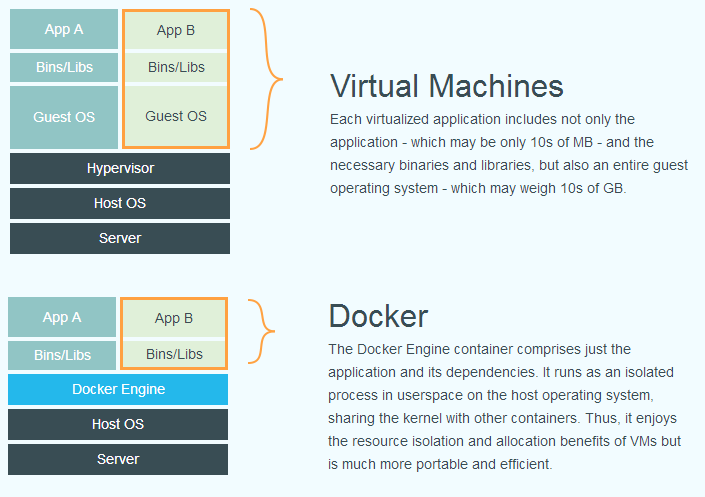
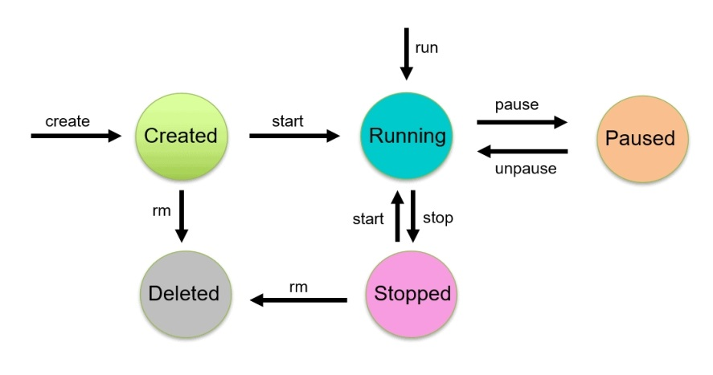
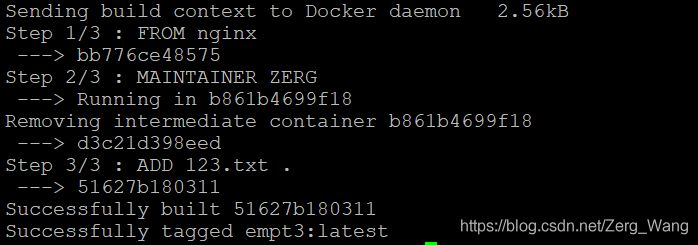

# 什么是Docker
## Docker介绍
简单来说，Docker可视为一种特殊的“虚拟机”，它将用户应用程序与该程序的依赖项打包在一起，当用户要运行其程序时，Docker就会生成一个与外界隔离的容器，将用户的程序置于其中运行，从而帮助程序跨平台、跨系统运行。

Docker生成的“容器”与虚拟机类似，但比虚拟机效率更高、使用更为方便。如果要使用虚拟机来运行用户程序，则需要完整配置应用，依赖项，必要的二进制库，以及一个完整的虚拟机操作系统。但如果使用Docker容器，则可以直接在原始主机的操作系统上运行，无需额外配置。容器还会对用户程序的进程进行隔离，令程序进程接触到的各种资源都是虚拟的，从而实现与底层系统的隔离，不受环境影响。





Docker为CS（Client-Server）架构，通过Docker Daemon以及Docker Client与用户交互。Docker Daemon是Docker的守护进程，运行在宿主机上，用户通过Docker Client的命令行工具与Docker Daemon通信，Daemon接受用户命令，对宿主机执行相应操作并返回结果。

## 名词解释
### 镜像（Image）
镜像中包括了用户程序以及其依赖的库，镜像只读，用于创建容器。镜像相当于模板，与容器的关系类似于类与对象。镜像可存储于宿主机中，也可存储于仓库（Registry）中。镜像的创建主要有以下三种形式：通过拉取他人现成镜像、从无到有创建或基于现有镜像创建。

### 容器（Container）
容器基于某个镜像生成，是实例化的镜像。用户程序就在容器中运行。可通过Docker Client操作容器（如启动或停止等命令）。

### 仓库（Registry）
存放镜像的地方。用户可从官方维护的仓库Docker Hub中获取镜像（需要注册Docker账号），也可以搭建自己的私人Registry（相当于一个存储镜像的网盘）并从中获得镜像。

### Dockerfile
Dockerfile是一种用来自定义镜像的特殊文本文件，其内容由多条指令构成。docker会逐条执行Dockerfile中的命令来构建镜像。


<br/><br/>

# Docker命令
以下命令直接在Linux Shell或Windows的cmd中执行。
## 仓库管理
以下命令还可指定远程仓库服务器，若不指定则默认为Docker Hub。
```shell
# 登陆到远程仓库
docker login -u 用户名 -p 密码

# 登出
docker logout
```
## 镜像管理
每个镜像的完整名包括了镜像本身的名字和其版本号，两者用冒号隔开。如果在使用以下命令时不指定版本号，则默认会对最新版本的镜像进行操作。
```shell
#从仓库中拉取镜像
docker pull 镜像名:版本号  

#将本地镜像推送到仓库中
docker push 镜像名:版本号  

#查看本地存在的镜像
docker images 

#删除指定镜像（若存在依赖该镜像的容器则无法删除）
docker rmi 镜像名:版本号   

#根据Dockerfile创建镜像，文件路径指创建镜像需要用到的其他文件的位置
docker build -t 镜像名:版本号 -f Dockerfile路径 文件路径

#若要使用当前目录下的Dockerfile和文件创建镜像，则可省略“-f”参数
docker build . -t 镜像名:版本号

#查看指定镜像的详细信息
docker history 镜像名:版本号  

#标记镜像，将其归入某个仓库。仓库名一般为当前登入的仓库的用户名（在push镜像前必须先标记该镜像，否则push会失败）
docker tag 镜像名:版本号  仓库名/镜像名
```
## 容器管理
每个容器会分配一个独一无二的容器ID，操作容器时可通过容器ID指定。在生成容器时也可为容器分配名字，通过该名字也可操作容器。

容器有created、running、paused、stopped、deleted五种状态，可通过不同的命令切换其状态：



### 创建/运行容器
```shell
#创建容器，执行指定命令（可省略），并运行容器
docker run 镜像名:版本号 命令

#仅创建容器
docker create 镜像名:版本号 
```
以上两个命令均有以下常用参数：
```shell
-p  宿主机端口:容器端口   #端口映射，通过宿主机端口来访问容器中程序使用的端口 

-d    #后台运行

--name 容器名  #为容器指定名字

-e 变量名=变量值    #为容器内环境设置环境变量
```

### 其他命令
```shell
#查看本地正在运行的容器
docker ps 

#查看本地存在的所有容器
docker ps -a

#启动某容器
docker start 容器ID

#在运行中的容器中执行命令
docker exec 容器ID 命令

#重启某容器
docker restart 容器ID

#停止某容器
docker stop 容器ID

#批量停止容器
docker stop $(docker ps -a -q)

#删除某容器
docker rm 容器ID

#杀掉一个正在运行的容器
docker kill 容器ID

#暂停容器中所有的进程
docker pause 容器ID

#恢复容器中所有的进程
docker unpause 容器ID
```
## 其他
```shell
#查看docker版本
docker version

#查看docker系统信息
docker info
```

<br/><br/>

# Dockerfile编写
## Dockerfile简介
Dockerfile的文件名应为“dockerfile”或“Dockerfile”，无任何后缀名。其他文件名docker无法识别为标准的Dockerfile。

Dockerfile一般由多条指令构成，下面将按指令的编写顺序（当然也是执行顺序）进行介绍。

另外，Dockerfile与Python一样，将“#”开头语句视为注释信息

## FROM
用于指明要构造的镜像是否基于某个已有镜像：
```shell
FROM 镜像名:版本号
```
这个基础镜像可以是本地已有的，也可以是仓库中已有的。Docker在构造镜像时，若依赖的基础镜像不在本地，会自动pull过来。

如果不依赖任何已有镜像构造，则：
```shell
FROM scratch
```
## MAINTAINER
用来声明镜像作者及其联系方式，可省略。
```shell
MAINTAINER 作者名 联系方式
```

## WORKDIR
在容器内设置一个工作目录，之后Dockerfile中的镜像操作指令均会在该目录下执行：
```shell
WORKDIR path
```
## COPY
在使用```docker build```指令时会指令非Dockerfile文件的位置，```COPY```指令用于将这些文件复制到指定目录中（一般是复制到```WORKDIR```指定的工作目录里）。

```shell
COPY 文件名 path
```
## ADD
和```COPY```指令类似，但在复制tar等压缩包时还会顺手帮你解压。该指令还可对链接进行操作，先下载链接对应的文件再进行复制。
```shell
ADD 文件名 path
```

## ENV
为基于该镜像的容器设置环境变量，容器内任何程序均可调用。

```shell
ENV key value
ENV key1=value1, key2=value2
```

## RUN
镜像构建过程中执行的命令，一般用此类命令为容器内的容器安装依赖项。
```shell
RUN 命令
```
RUN的指令格式有两种，一种为Shell格式（与Linux命令一致），另一种为Exec格式，后面的```CMD```与```ENTRYPOINT```也都支持这两种格式的命令。

Shell格式举例：
```shell
RUN apt-get install python3

CMD echo "Hello world"
```
Exec格式：
```shell
RUN ["executable", "param1", "param2", ...]

# 举例：
RUN ["apt-get", "install", "python3"]

CMD ["/bin/echo", "Hello world"]
```
## CMD
```CMD```指令并不会在构建镜像时执行，该指令仅在基于该镜像的容器启动时执行。

Dockerfile中可编写多条```CMD```指令，但只有最后一条实际生效。另外，若使用```docker run```启动容器时指定了命令，则```CMD```指令会被忽略。
## ENTRYPOINT
与CMD功能一样，Dockerfile中多条```ENTRYPOINT```存在的话只会执行最后一条。与```CMD```不同的是，ENTRYPOINT命令不会被```docker run```顶替。

<br/><br/>

# 举例： 用Docker封装Python程序
## 准备
将a.py与其依赖项requirements.txt打包成镜像，其中a.py的内容如下：
```py
import numpy as np
a = np.array([1,2,3])
print(np.sum(a))
```

requirements.txt内容如下：
```
numpy
```

编写Dockerfile：
```shell
FROM python:slim
WORKDIR /app
COPY . /app
RUN pip install -r requirements.txt
CMD python a.py
```
将上述三个文件放在同一目录下，在该目录下执行以下命令来构建镜像，镜像名为myapp：
```shell
docker build -t myapp .
```
然后生成并运行容器，可以看到Python程序运行的结果：
```shell
@ZergWang ➜ /workspaces/docker-test (main) $ docker run myapp
6
```


<br/><br/>

# Docker-compose
如果需要同时使用多个Docker容器，且这些容器内的程序需要相互调用，考虑到容器本身是一个封闭环境，跨容器调用会非常麻烦，那有什么办法可以解决上述问题呢？

将多个容器内需要用到的程序统统打包到同一个镜像中确实是一个办法，但这样太过臃肿，也不利于各个程序的调式。对此，可以使用Docker官方的Docker-compose功能来编排多个容器的服务与互动。

每个Dockerfile指明了如何制作一种镜像。Docker-compose通过一个名为“docker-compose.yaml”的文件来组织多个镜像并调配容器之间的互动。

举个例子，我的Python聊天程序已使用Docker打包成镜像，但是现在想调用Redis数据库来存储聊天记录，因此需要聊天程序的镜像和Redis的镜像，则docker-compose.yaml可以按下面所示编写：
```yaml
version: '3'
services:
  redis-server:
    image: redis:latest
    ports:
      - "6379:6379"
  app:
    build: .
    image: mybot
    ports:
      - "7860:7860"
    environment:
      - OPENROUTER_API_KEY=${OPENROUTER_API_KEY}
      - REDIS_HOST=redis-server
      - REDIS_PORT=6379
```
该配置文件services部分定义了docker-compose由两个容器构成，这两个容器分别基于最新版Redis镜像和本人聊天程序所用的镜像mybot，配置文件分别为这两个容器映射了端口，方便程序内的互相调用。


docker-compose.yaml编写完毕后，使用以下指令构建与运行：
```shell
# 构建
docker-compose build 

# 运行容器
docker-compose up
```


<br/><br/>


# Docker文件系统
在Docker中，镜像以“搭积木”的形式层层构建。简单来说，在使用Dockerfile构建镜像的过程中，通过```FROM```语句指定“地基”后，之后的每条指令会对应生成一个Read-only layer，搭建在“地基”或上一条指令生成的layer上。如下图所示，这些layer（也可称为“缓存”）都有其特定的ID。



layer实际上是可复用的。在构建镜像的过程中，若某条指令与之前某个生成过layer的指令一样，且它们下面的“地基”和layer也完全一样，则该layer可直接拿来复用。（除了在构建镜像时，从仓库pull镜像时也会复用本地的layer）

虽然layer复用能提高镜像构建效率，但就像上文所述，复用的条件也比较苛刻。若构建镜像时某一条指令找不到对应layer，则后面的构建都不会再复用了（因为“地基”或下层的layer不同了）。


当容器运行时，实际上是在layer垒成的镜像上多加了一个Read-Write layer。容器中各种文件读写操作都是在这个新加的layer上进行，若容器被删除，该容器所做的所有读写都将被重置，这个新加的Read-Write layer也会被删除。

<br/><br/>


# 参考资料
[Docker 命令大全](https://www.runoob.com/docker/docker-command-manual.html)

[Docker Dockerfile](https://www.runoob.com/docker/docker-dockerfile.html)