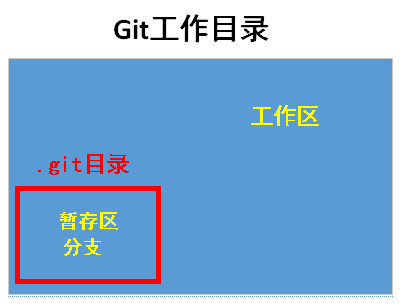

# 简介
Git，目前使用最为广泛的分布式版本控制系统，由Linux之父Linus Benedict Torvalds开发。

所谓的分布式版本控制系统，其实是一种管理我们代码的软件。试想，在开发过程中，我们的代码可能会经过多次迭代，版本一多，自然混乱；对于一些用不上但又不敢直接删除的的早期代码，新建文件保存或打上注释标记又太麻烦……此外，在团队协作中每个人的改动、进度的同步也是难以处理的事情。而以Git为代表的这类代码管理软件则为解决以上问题，提高工作效率而诞生。

Git作为分布式版本控制系统，与集中式版本控制器自然是有区别的。先说集中式，其工作方式较为简单，也符合我们的逻辑：用户从服务器取出文件，更改后再向服务器提交，服务器则记录文件的每次更改，并自动保留旧版本，简单易懂。对于团队，集中式还可以进行权限管理，保证文件安全。然而缺点也显而易见：需要互联网才能工作，以及文件全部存放于服务器，有代码丢失的风险。

而分布式版本控制系统则更为灵活，团队中每个人都有一个完整的版本库，降低了代码丢失的风险。每个人若是各自有更改，则相互推送其更改即可，但为了方便推送，中央服务器一般还是需要的。此外，git的分支管理的功能也极为强大，后面会提到。
<br/><br/>

# 安装与设置
Git在Linux、Mac OS、Windows上均可安装使用，本人演示于Ubuntu上。安装的话，直接：
```bash
sudo apt-get install git
```
安装后，首先要设置自己的用户名与邮箱（说是注册，其实更像是对自己仓库的一种标记）
```bash
git config --global user.email "YouEmail@example.com"
git config --global user.name  "YourName"
```
之后，选择一个空目录作为代码仓库（即Git的工作目录）并在该目录下初始化：
```bash
git init 
```
设置后会在该目录下生成.git目录，存放Git用于跟踪管理该仓库的文件。
#### config相关设置
每台计算机中的git都会有三个配置文件，分别是：
- 针对仓库的设置文件（即local设置），文件路径：仓库路径/.git/config，此设置仅对该仓库生效。
- 针对全局的设置文件（即global设置），文件路径：~/.gitconfig （Linux系统） 或者 C:/Users/用户名/.gitconfig （Windows系统），此设置对该计算机中指定用户下所有仓库生效。
- 针对系统的设置文件（即system设置），文件路径：/etc/.gitconfig （Linux下） 或者 安装目录/etc/gitconfig （Windows系统）。此设置对该计算机中所有用户的所有仓库生效。

在以上三个配置文件都存在的情况下，优先级： local > global > system。
要想查看或修改相应设置，可在 git config命令中加入参数，部分参数如下所示：
```bash
--local 或 --global 或 --system   # 指定配置文件
--get                             # 获取某项设置的信息
--add                             # 添加一项设置
-l                                # 查看指定配置文件中全部设置
```
例如，前面设置用户名和邮箱使用了--global关键字，就是对全局的用户名和邮箱进行了更改。
<br/><br/>

# 文件管理
#### Git工作原理
Git工作目录中的文件会存放在三个区：工作区（Workspace，即工作目录内非.git目录下的文件）、暂存区（Index）和分支（Branch）。暂存区和分支在.git目录中，每当工作区的文件被跟踪后，这些文件就会被放入暂存区，commit后暂存区内容会整体作为一个版本被并入分支，暂存区也会被清空。仓库在创建时会自动创建一个名为master的分支，若对分支没有修改，则所有的commit都在该分支下，分支的具体作用在后面会提到。

#### 仓库状态（status）
```bash
git status
```
使用以上命令查看仓库状态，从而告知用户哪些文件未被跟踪，哪些文件被修改，删除或新增。
如果只想关注哪些文件被修改，而忽略掉那些新增的文件：
```bash
git status -uno
```

对于工作区中新增的文件，在其add前使用git status，会被告知这些文件“Untracked files”。这说明git检测到新文件，但不会去追踪其更改。在add这些文件后使用git status，git会告知用户“Changes to be committed”，说明文件已被跟踪， 但还未提交。如果这些被add的文件在提交前又被更改过（此时git status告知“Changes not staged for commit”），则在提交前要再add一次，否则文件会以之前add时的内容提交上去。因此，add命令相当于是要求git“跟踪最新版本的文件”。

#### 文件跟踪（add）
在工作区中进行了代码文件的创建、修改或删除，那如何让git去跟踪文件的变化呢？使用以下命令即可：
```bash
git add 文件名
```
若要批量跟踪文件：
```bash
git add 文件1 文件2  文件3

git add .       add当前目录下所有新增、被修改的文件

git add 路径     add指定目录下新增、被修改的文件
 
git add -u      add所有被删除、被修改的文件
 
git add -A      add所有新增、被删除、被修改的文件
```
#### 提交（commit）
这里所谓的“提交”，相当于将所有被add的文件整合为一个“节点”（或版本），类似于Windows的系统还原点，可通过这些“节点”来找回代码的早期版本，commit命令为：
```bash
git commit -m "Describe this commit"
```
引号内的内容是对于该节点的说明，可以写写本次更改内容简介，也可以单纯记录为第几次更改，但要简明且能与其他的commit区分开。

git commit 部分可选参数：
```bash
--amend         本次提交覆盖掉上次提交
--reset-author  本次提交将重置用户名
--allow-empty   允许本次提交和上次提交相比无任何改动
```

#### 文件对比（diff）
对于被修改的文件，在add前可通过以下命令查看更改前后的内容差别：
```bash
git diff 文件名
```
以上命令将以行为单位对更改内容进行说明。查看完毕后单击“q”退出对比界面。
如果文件被add了，则diff命令就无效了。
#### 文件清理（clean）
用于删除工作目录下从来没有被add的文件和目录。以下参数可连用，如-xdf这样。
```bash
git clean -n    显示将要删除的文件，而不会真正删除
git clean -d    连文件带目录一起删
git clean -x    连.gitignore中的未被add的文件一起删
git clean -f    强制运行
```
#### 撤销修改
分为以下三种情况：

**情况一：工作区中的文件被误修改但还未add**
```bash
git checkout -- 文件名
```
系统将首先去暂存区查找，若文件是add后被修改的，则将文件还原为刚被add后的版本。若文件未被add但被修改，则暂存区中是没有该文件的早期版本的，系统会将文件直接还原为上次commit后的状态。

若要撤销全部文件的修改，可：
```bash
git checkout .
```

**情况二：文件被误修改且已经add了**
```bash
git reset HEAD 文件名
```
该命令会将指定文件在暂存区的内容清空（即回到提交上个版本时的状态，因此使用这条命令的前提是该仓库至少commit过一次 ）， 然后再运行git checkout的命令将工作区内文件的更改撤销即可。

**情况三：文件被误修改且add，而且还commit了**

直接进行版本回退，相关内容在后面会提到。
<br/>

#### 文件删除
如果要将某个已经提交到版本库中的文件在下个版本中删除，步骤如下：
1. 在工作区中手动删除它。
2. 使用命令确认操作并刷新暂存区：（实际上也可以使用add刷新，效果一样）
```bash
git rm 文件名
```
3. commit提交。
<br/><br/>


# 日志与版本控制
#### 查看日志（log）
```bash
git log 
```
从日志中可以看到当前分支每次commit的时间、更改者、commit的描述，commit ID（每个commit的唯一标识）。
log中所显示的“HEAD”表示当前版本（节点），上一次commit的版本以“HEAD\^”表示，上上个版本用“HEAD\^\^”表示，以此类推，若“\^”太多，例如上100个版本，可用“HEAD~100”表示。

git log后同时进入一个类似vim的编辑模式，可按vim语法进行搜索、查找、跳转，只是不能更改内容。

#### 版本回退
举个例子，回退到上一个版本：
```bash
git reset --hard HEAD^
```
此时工作目录中所有文件、内容以及目录结构都回到了上次commit时的状态，无关文件也被删除了。
若要回到之前版本的同时要保留当前工作区、暂存区的内容，可以：
```bash
git reset --soft HEAD^
```
此时工作目录中的情况为：回到对应版本提交完的状态，当前工作区、暂存区中的内容视为在此基础上的修改。

通过commit ID也可以指定版本来进行回退，命令与上面的相似。commit ID虽然长，但可以只输入前面几位，系统会自动去查找。若版本过多，尤其是多方协作的情况下为防止重复还是建议尽量写全。

回到了早期版本后通过git log发现，该版本之后的commit都没有被记录（说明log日志也被还原了），其实较新的版本仍然存在，通过commit ID可以重回较新版本。如果不慎忘记较新版本的commit ID（毕竟当前log中没有记载），还可以：
```bash
git reflog
```
系统会记录用户每次版本更迭的操作命令，通过该命令可查找到对应版本的commit ID。
<br/><br/>

# 分支（branch）
#### 简介
使用以下命令可查看分支信息：
```bash
git branch
```
其中前面有“*”的表示当前分支。

分支的概念可以用“树枝”来理解，每个分支相当于一根树枝，每个提交（commit）相当于该树枝上随着时间而长出来的一个个节点，随着提交次数的增多该树枝也就越长（zhǎng）越长（cháng）……

前文提过，在创建仓库（可以视为一棵树）时，会一并创建默认分支master（相当于最原始的树枝，或者说，树干）和一个指针HEAD。master也是一个指针，指向master分支的最新节点，HEAD指向用户当前工作的节点（该节点可能不在master分支上）。

Git允许我们以任意节点开始，创建新的分支（相当于在当前树枝的某节点处长出一节新枝），该节点即为新分支的初始节点。新创建的分支也会有一个指针指向该分支的最新节点。

如图，展示了一个有三个分支的仓库（master、branch 1、branch 2），其中branch 1创建后提交了两次（长了两个节点），branch 2创建后提交了一次。当然，此图是为了形象，实际上应该是：

#### 分支创建与更换
```bash
git branch 新的分支名
git checkout 新的分支名
```
以上两条命令分别是创建新分支和切换到某分支（即把HEAD指针指向某分支的最新节点）

以上两条命令可合并为：
```bash
git checkout -b 新的分支名
```
刚创建新分支后，工作区内容不会变化，但如果在新分支下做了修改并commit了，再切换回原分支，则工作区中的内容也回瞬间被还原回原分支的样子。
#### 分支合并
将当前分支与指定分支合并：
```bash
git merge 分支名
```
合并结果有如下两种：

1. 被合并的分支的相应内容会进入当前分支，假如说B1、B2分支源于同一节点B，B处有文件f，我在B1、B2分支分别新建了文件f1、f2，则合并后的分支有f、f1、f2三个文件。
2. 合并失败。假如B1、B2分支并无新建文件，而是分别将文件f中的内容修改为“Here is B1”和“Here is B2”，会有合并冲突，此时要将两处分支的文件修改一致并提交后方能正常合并。

使用git log --graph可以查看分支合并图，查看完毕输入q退出。

分支合并时默认使用Fast Forward模式，这种模式下合并后如果分支被删除，则分支相关信息也会被一并抹除，若不使用Fast Forward模式，则合并的同时会commit一次，将待删除的分支信息一并保存下来，之后无论删不删除该分支，都可以git log --graph查看其信息。
```bash
git merge --no-ff -m "合并信息" 分支名
```
#### 分支删除
```bash
git branch -d 分支名
```
如果要删除未经合并的分支，使用以上命令，系统会提示该分支is not fully merged，要想删除则：
```bash
git branch -D 分支名
```

#### Rebase
该命令可对某分支上的连续多个commit进行移动或合并，主要有以下两个用途：
- 将某分支上的连续多个commit合并成一个commit。

- 将某分支上的连续多个commit复制到另一分支上。
  
##### 合并多个commit
假设待合并commit中，第一个commit的前一个commit的ID为A。待合并commit中，最后一个commit的ID为B，
```
git rebase -i A B
```
B可以省略，当没有B时，默认为该分支最后一次commit的ID。

**注意：合并后仅会存在A本身以及之前的commit，再加上一个合并的commit。也就是说，如果不将最新的commit一起合并，则合并后原来最新的commit会消失。**

举个例子，假设当前分支上有如下4次commit：


现在要将第2、3、4次commit合并成一个commit，则：
```
git rebase -i  1c897a1 fe85718
```
此时会弹出如下提示：


而我们只需对红色框的部分进行编辑。要对三个提交进行操作，常用命令：
- pick，简写为p，保留此commit。
- squash，简写为s，将此commit与前一commit合并。（将多个commit要合并为一个的话，必须是以待合并commit中的第一个为基础进行合并。因此待合并commit中的第一项（即 **4e7891f** ）无法squash）。
- drop，简写为d，丢弃此commit。

对此，将 **21d96a6** 和 **fe85718** 合并到 **4e7891f** 上：
```
pick 4e7891f 2
s 21d96a6 3
s fe85718 4
```
保存退出后，会弹出新的提示信息，此处可以重新编辑三次commit的信息：
```
# This is a combination of 3 commits.
# This is the 1st commit message:

2

# This is the commit message #2:

3

# This is the commit message #3:

4
```
这些信息最终会被整合到一个commit中。

合并完后看一下log：


如果仅合并第2、3次commit，则合并后仅存在第一次commit以及2、3合二为一的commit，共两个commit，第4次commit会消失。
##### 复制多个commit至另一分支

```
git rebase --onto 目标分支名 commitID_1  commitID_2
```
将当前分支上，从commitID_1之后的commit（不包括该commit），一直到commitID_2之间的所有commit复制到目标分支上去。

举个例子，假设现在有master和m2这两个分支，它们的commit情况如下图所示：


若将m2分支上从C到D的commit复制到Master分支上，则首先将分支切换到m2，然后：（为了叙述方便，下面的commitID直接拿对应字母替代）
```bash
git rebase --onto master B D
```
执行完后切回到master分支，查看日志发现并没有找到复制过来的commit，这是因为当前的master分支上HEAD指向的节点仍然在F处，因此还要执行：
```bash
git reset --hard D
```
<br/><br/>

# 其他
#### CRLF与LF转换
config中用**core.autocrlf**和**core.safecrlf**来控制仓库中文本文件的换行方式：

**core.autocrlf**可设置为：
- true：在add或commit时会将文本文件从CRLF转为LF。在pull时会将LF转为CRLF。

- input：仅在add或commit时会将文本文件从CRLF转为LF。

- false：啥都不干。

**core.safecrlf**可设置为：
- true：在add或commit时检查文本文件，如果其中有混用了CRLF和LF的文件则报错。

- warn：如果有混用了CRLF和LF的文件报warning，不会阻止add或commit行为。

- false：啥都不干。

注意：当**core.autocrlf**设置为false时**core.safecrlf**失效。


#### stash操作
若有突发情况，需要在其他分支或版本工作，又不想通过commit来保存当前工作区、暂存区内容，可以通过以下命令暂时保存当前的工作现场：
```bash
git stash
```
使用stash可以保存多个工作“现场”，通过以下命令查看：
```bash
git stash list
```
完成突发工作后，将现场还原：
```bash
git stash pop
```
此时使用git stash list会发现列表中没有了该现场的信息（因为已经被还原了），若还原后仍需要在list保存这些信息，可以：
```bash
git stash apply
```
#### 标签
对于所有commit（或者说，节点），单纯通过描述信息或者commitID来寻找、区分过麻烦，而标签功能能令我们赋予这些节点一个别名。
```bash
git tag 标签名
```
该命令默认为最新提交的commit打上标签，若要指定commit：
```bash
git tag 标签名 commitID
```
可通过”git tag“查看所有标签，可通过”git show 标签名“来通过标签查看版本信息。

若要在打标签的同时加上描述信息，可：
```bash
git tag -a 标签名 -m 描述信息 commitID
```
一个commit可以有多个标签，标签名要互不相同。可以删除标签：
```bbash
git tag -d 标签名
```

#### 忽略特殊文件
代码编译运行或者在文件操作时可能会在同目录下产生一些临时文件，这些文件并无使用git来跟踪的必要，但在add或commit的时候不得不一并操作，其实可以在工作区的根目录下创建文件并编辑.gitignore来自定义忽略的规则即可，每一行写一个规则，可使用通配符，符合规则的文件名在git操作中被自动忽略。例如，我要忽略掉文件名中含有cache或者后缀名为.ini的文件：
```bash
*.ini
cache
```
.gitignore作为工作区中的文件，本身也会被git跟踪，然而.gitignore在被跟踪、识别前，其内部的规则就已经在起作用了。
#### git status无法正常显示中文
```bash
git config --global core.quotepath false
```
#### git diff查看txt时无法正常显示中文
txt对中文的保存格式有误，设置为utf-8即可。
<br/><br/>

# 参考资料
[Git教程 - 廖雪峰的官方网站](https://www.liaoxuefeng.com/wiki/896043488029600)
[【Git】rebase 用法小结](https://www.jianshu.com/p/4a8f4af4e803)


