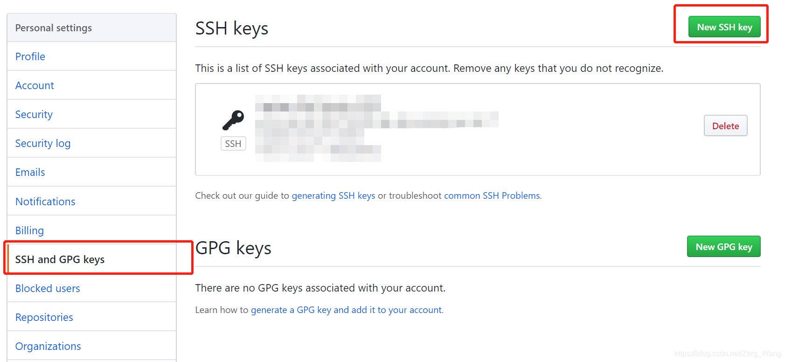

# 使用Github作为远程仓库
例如，本地有一个仓库，暂且设其名字为“Documents”，现在想将该仓库推送到Github上，具体步骤为：

## 设置SSH密钥
在当前用户主目录下（即C:/Users/用户名/，若是Linux系统则在/home/用户名）下查看是否有.ssh目录，若没有说明在本机上还未创建SSH密钥，创建方法：（以cmd命令为例）
```bash
ssh-keygen -t rsa -C "zergwang@example.com"
```
引号内填入自己的邮箱名。创建时若无过高的保密需要，可以不用设置密码。

创建完毕，在主目录下会有一个.ssh的目录，存储着本机的私钥和公钥。

之后打开Github，在设置中添加公钥：

title随便写，key项就将.ssh目录下id_rsa.pub打开，内容复制进去即可。

## 在Github创建对应仓库并与本地关联
本地要推送的仓库为“Documents”，则可以在Github中创建对应的一个仓库（名字一不一样其实无所谓）

之后，在本地仓库的工作目录中：
```bash
git remote add origin https://github.com/用户名/Documents.git
```
其中，后面的网址要对应为自己的Github账号以及对应的远程库。假如远程库名为“Documents”，则地址如同以上示例代码，为“Documents.git”。
<br/><br/>

# push
即“推送”。推送会将本地指定分支所有未推送过的commit一并推送至远程指定分支。
```bash
git push 远程主机名 本地分支名:远程分支名
```
主机名一般为“origin”，若本地分支和远程分支名字一样，可简化为：
```bash
git push 远程主机名 分支名
```
实际上分支名也可省略，默认推送本地当前分支。

可选参数有：
```bash
-u         # 关联远程主机，以后push时连主机名都省了，直接“git push”
--force    # 远程版本与当前要推送版本不符，强行推送并覆盖远程版本
```
<br/><br/>


# clone
将远程仓库上的内容复制到本地：
```bash
git clone git@github.com:用户名/仓库名.git
# ssh协议
git clone https://github.com/用户名/仓库名.git
# https协议
```
可选参数
```bash
-b 分支名  # 仅clone指定分支
```
<br/><br/>

# pull & fetch

更新远程仓库到本地：
```bash
git pull 远程主机名 远程仓库分支名
```
如果本地的当前分支有修改未被add或commit，则更新会中止。

若要放弃本地的更改，强制更新，则：
```bash
git fetch --all
git reset --hard 远程主机名/远程分支名
git pull
```
<br/><br/>

# 其他操作
## 查看远程库信息
```bash
git remote -v
```
可以看到返回两条信息：
```bash
origin  https://github.com/用户名/XXXX.git (fetch)
origin  https://github.com/用户名/XXXX.git (push)
```
以上信息说明了远程仓库的克隆地址以及推送地址，若无推送权限，则无第二行信息。

## 标签推送
推送某个标签到远程：
```bash
git push origin 标签名
```
或者将所有未推送标签推送出去：
```bash
git push origin --tags
```
删除远程仓库中的标签：（先在本地删除，再同步远程仓库的）
```bash
git tag -d 标签名
git push origin :refs/tags/标签名
```
## 推送冲突解决
对于同一仓库的同一分支，在多人协作时会由于多人推送的版本冲突而导致当前的推送失败。对此，需要先将他人推送后的版本抓取下来，在本地解决冲突后再推送：
```bash
git pull
```
当然，在pull之前，先要建立当前分支与远程分支的连接：
```bash
git branch --set-upstream-to=origin/远程分支名 本地分支名
```
一般这两个分支名是一样的。
## push/pull/clone报错
平时push/pull/clone正常，但突然某一天报错：
```
kex_exchange_identification: Connection closed by remote host
Connection closed by XX.XXX.XXX.XXX port XX
fatal: Could not read from remote repository.
```
试着关闭VPN或系统代理，重新push/pull/clone。
<br/><br/>

# 参考资料
[Git Community Book 中文版 -- rebase](http://gitbook.liuhui998.com/4_2.html)

[廖雪峰的官方网站 -- 添加远程库](https://www.liaoxuefeng.com/wiki/896043488029600/898732864121440)

