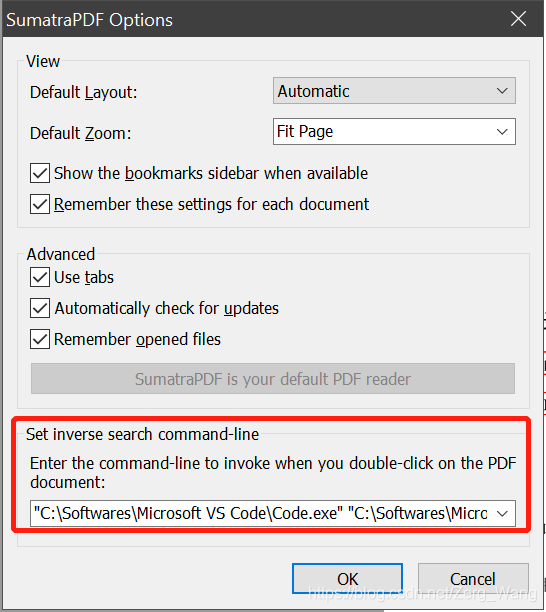

# 基本概念
#### TeX
由计算机科学家Donald E. Knuth发明的排版软件，也代指该系统使用的标记语言，这种标记语言将控制命令和文本结合起来。文本是内容主体，控制命令用于实现排版的效果。

#### LaTeX
Leslie Lamport开发的基于plain TeX格式的排版系统。plain TeX是Donald E. Knuth为方便用户，自己基于原始TeX定义的格式。

LaTeX 实际上是一个工具，它将用户按照它的格式编写的文档解释成TeX软件能理解的形式并交付给TeX软件处理，再将最终结果返回给用户。

#### pdfTeX
TeX生成的文件是dvi格式，但作为文档pdf格式更为常用，因此推出了pdfTeX，直接输出 pdf 格式文档。

#### pdfLaTeX
pdfLaTeX与pdfTex的关系和TeX与LaTeX的关系相似。pdfLaTeX主要工作是将 LaTeX 格式的文档进行解释并交付给pdfTeX软件处理。

#### XeTeX
TeX的排版不支持中日韩等文字，只支持 ASCII 字符。因此推出了XeTeX，该软件直接支持 Unicode 字符。一般使用XeTeX时，会用UTF-8编码。

#### XeLaTeX
与XeTeX的关系同上。

#### 发行版
发行版就是在原来的TeX、pdfTeX等软件的基础上，加入文档类、模板、字体文件、辅助程序等等，做成了一个排版软件及各类辅助软件的合集。比较常用的发行版有TeX Live、CTeX、MiKTeX等。
<br/><br/>


# 软件安装与配置
本人系统为win10，使用的发行版为Tex Live，编辑器Visual Studio Code，PDF阅读器使用SumatraPDF。
Tex Live安装：本人版本为texlive2019，除了安装位置，其他全部默认即可，之后为VS Code安装插件LaTeX Workshop，为该插件写好配置文件。建议新建一个文件夹，作为LaTeX的专用workspace，其中保存有相关的配置文件。
在以上文件夹下建立子文件夹.vscode（前面的点不可忽略），在该文件夹下建立settings.json，编辑内容如下：
```
{
    "latex-workshop.latex.recipes": [{
        "name": "xelatex",
        "tools": [
            "xelatex"
        ]
    },
    {
        "name": "xe->bib->xe->xe",
        "tools": [
            "xelatex",
            "bibtex",
            "xelatex",
            "xelatex"
        ] 
    },  
    {
        "name": "pdflatex",
        "tools": [
            "pdflatex"
        ]
    }],
 
    "latex-workshop.latex.tools": [{
        "name": "xelatex",
        "command": "xelatex",
        "args": [
            "-synctex=1",
            "-interaction=nonstopmode",
            "-file-line-error",
            "%DOCFILE%"
        ]
    },
    {
        "name": "pdflatex",
        "command": "pdflatex",
        "args": [
            "-synctex=1",
            "-interaction=nonstopmode",
            "-file-line-error",
            "%DOCFILE%"
        ]
    }, {
        "name": "bibtex",
        "command": "bibtex",
        "args": [
            "%DOCFILE%"
        ]
    }],
 
    "latex-workshop.view.pdf.viewer": "external",
 
    "latex-workshop.view.pdf.external.viewer.args": ["%PDF%"],
    "latex-workshop.view.pdf.external.viewer.command":
        "C:/Softwares/SumatraPDF/SumatraPDF.exe",
 
    "latex-workshop.view.pdf.external.synctex.command":
        "C:/Softwares/SumatraPDF/SumatraPDF.exe",
 
    "latex-workshop.view.pdf.external.synctex.args": [
        "-forward-search",
        "%TEX%",
        "%LINE%",
        "%PDF%"
    ],
}
```
除了SumatraPDF软件的路径，其他照抄即可。以上设置优先使用XeLaTeX编译代码，以便支持汉字排版。

最后，打开SumatraPDF的Settings中的Options界面：



在这一栏输入：
```
"C:\Softwares\Microsoft VS Code\Code.exe" "C:\Softwares\Microsoft VS Code\resources\app\out\cli.js" -g "%f":"%l"
```
前面这两个路径根据自己VS Code实际安装位置进行更改。
<br/><br/>

# 使用方法
在工作区中新建后缀名为tex的文件，在VS Code中编辑该文件，即为LaTeX的源码，编辑好后每一次保存，软件就会自动编译，生成对应的PDF，若要在PDF中预览，可点击VS Code右上角”View LaTeX PDF file“按钮，或使用快捷键Ctrl + Alt + V即可在SumatraPDF中预览文档。

正向搜索：选中tex文件中的源码，按正向搜索的快捷键Ctrl + Alt + J，对应的内容即可在PDF中显示。

反向搜索：在预览PDF中，双击相应内容，对应源码会在VS Code中高亮显示。
<br/><br/>

# 参考文章
[使用VSCode编写LaTeX](https://zhuanlan.zhihu.com/p/38178015)

[一份其实很短的 LaTeX 入门文档](
https://liam.page/2014/09/08/latex-introduction/)
