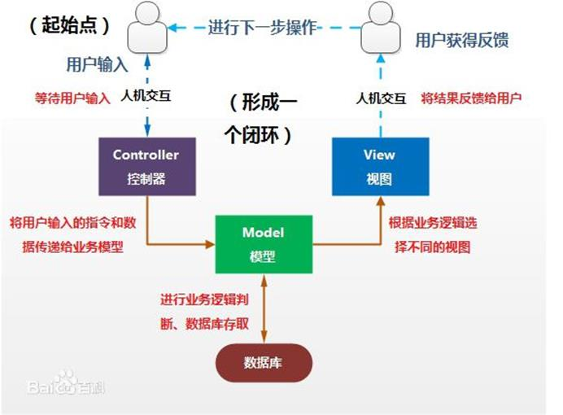

# 软件设计模式
软件设计模式（Design Pattern，或称软件设计典范）是一套被反复使用、多数人知晓的、经过分类编目的、代码设计经验的总结。使用设计模式是为了可重用代码、让代码更容易被他人理解、保证代码可靠性、程序的重用性。设计模式代表了最佳的实践，通常被有经验的面向对象的软件开发人员所采用。设计模式是软件开发人员在软件开发过程中面临的一般问题的解决方案。这些解决方案是众多软件开发人员经过相当长的一段时间的试验和错误总结出来的。（摘自菜鸟教程）

下面简要介绍几个主流的软件设计模式。
<br/><br/>

# 单例模式
一个类只能创建唯一的对象。

类的构造和析构函数是private，不允许外部调用；拷贝构造、移动拷贝构造、赋值构造、移动赋值构造均被禁用。类中声明一个private的静态指针来保证只能创建出一个对象，同时也提供一个public的成员函数用于获取静态指针。

单例模式又分为懒汉式和饿汉式。

懒汉式线程不安全，单例需要手动调用getSingle函数来创建，相比饿汉式更节省内存空间。
```cpp
class Single {
private:
    Single() = default;
    Single(const Single &) = delete; //禁用拷贝构造
    Single(Single &&) = delete;      //禁用移动拷贝构造
    Single & operator=(const Single &) = delete; //禁用赋值运算符
    Single & operator=(Single &&) = delete; //禁用移动赋值运算符
    static Single * istance;
public:
    static Single * getSingle() {
        if (istance == nullptr) {
            istance = new Single();
        }
        return istance;
    }
    static void freeSingle() {
        if (istance != nullptr) {
            delete istance;
        }
    }
};

Single* Single::istance = nullptr; //记得要初始化
```
饿汉式线程安全。在程序最开始处类的静态指针就创建了该单例。相比懒汉式代码有以下不同：
```cpp
static Single * getSingle() {
    return istance; //无需在此处创建单例，因此直接返回指针
}

Single* Single::istance = new Single(); 
```

# 工厂模式
在工厂模式中，产品类的声明专注于描述产品的特性，不负责产品的创建（因此不声明构造函数）。产品对象的创建完全交给专门的工厂类负责，从而实现“对象的创建和对象的表示分离”这一设计原则。

## 简单工厂模式
假设我要生产两种品牌的杯子A和B，对此我们定义基类Cup，以及派生类A和B。然后定义工厂类，工厂类中有专门的成员函数负责创建杯子对象：
```cpp
class SimpleFactory {
public:
    Cup* createCup(char type) {
        switch (name) {
            case 'A':
                return new A;
            case 'B':
                return new B;
            default:
                cout << "无此类型的杯子" << endl;
        }
        return nullptr;
    }
};
```
## 抽象工厂模式
假设现在多了一种品牌的杯子需要生产，如果使用简单工厂模式，就需要修改工厂类的switch语句，不符合开闭原则。另外，假设这些品牌拓展产品线，开始生产笔，这样一来工厂类会变得非常冗杂，对此可使用抽象工厂模式。首先声明一个抽象基类作为抽象工厂，然后按照品牌创建派生类：工厂类A、工厂类B和工厂类C。
```cpp
class Cup {};
class CupA : public Cup {};
class CupB : public Cup {};

class Pen {};
class PenA : public Pen {};
class PenB : public Pen {};

class AbstractFactory {
public:
    virtual Cup* createCup() = 0; // 专门用于创建杯子
    virtual Pen* createPen() = 0; // 专门用于创建笔
};

class FactoryA : public AbstractFactory {
public:
    Cup* createCup() { return new CupA; }
    Pen* createPen() { return new PenA; }
};

class FactoryB : public AbstractFactory {
public:
    Cup* createCup() { return new CupB; }
    Pen* createPen() { return new PenB; }
};

int main() {
    AbstractFactory * factoryA = new FactoryA;
    AbstractFactory * factoryB = new FactoryB;
    Cup * c1 = factoryA->createCup();
    Pen * p1 = factoryB->createPen();
}
```

# 观察者模式

# MVC
全名Model View Controller，是模型（model）－视图（view）－控制器（controller）的缩写。

该模式将业务逻辑、数据与界面显示分离开来组织代码，将众多的业务逻辑聚集到一个部件里面，在需要改进和个性化定制界面及用户交互的同时，不需要重新编写业务逻辑，达到减少编码的时间。

以下详解三部分各自的功能。

**View** 指用户看到并与之交互的界面。比如由html元素组成的网页界面或者软件的客户端界面。一个应用程序可能有多个界面，对应不同的用户需求，在视图中其实并没有任何的数据处理，它仅仅是用于与用户交互，得到用户的输入并传给控制器或者输出信息。

**Model** 指模型，表示业务规则。在MVC的三个部件中，模型拥有最多的处理任务。被模型返回的数据是中立的，模型与数据格式无关，这样一个模型能为多个视图提供数据，由于应用于模型的代码只需写一次就可以被多个视图重用，所以减少了代码的重复性。

**Controller** 指控制器，接受用户的输入并调用模型和视图去完成任务。控制器本身不输出任何东西和做任何处理。它只是接收请求并决定调用哪个模型构件去处理请求，然后再确定用哪个视图来显示返回的数据。

下图说明了三者之间的调用关系：

例如，我们在C#下编写一个简单的用户管理程序：

Main就相当于我们的View，我们在此编写与用户的交互命令，如：
```c#
UserController uc = new UserController();
 
Console.WriteLine("---------用户信息管理系统--------");
 
while(true)
{
    Console.WriteLine("请按指示输入命令：增加-1 修改-2 删除-3 查看-4");
    string command = Console.ReadLine();
    switch (command)
    {
        case "1":
            uc.Add();
            break;
        ...
    }
}
```
当然，在Main开头，我们会实例化一个UserController对象。

在类UserController中，我们编写实现用户相应需求的方法：
```c#
class UserController
{
    List<User> userList = new List<User>();
    public void Add()
    {
        ... 
    }
    public void Remove()
    {
        ... 
    }    
    ...
}
```
然而，这些方法是指向User中的方法，在UserController这一层，正如上文所说，是根据View返回的用户指令，决定调用什么方法去实现，真正修改数据的方法，在User中：
```c#
class User
{
    private string name;
    private int age;
    public string Name { get; set;}
    public int Age { get; set;}
    public User(string name, int age)
    {
        //构造方法
        ...
    }

}
```
<br/><br/>
