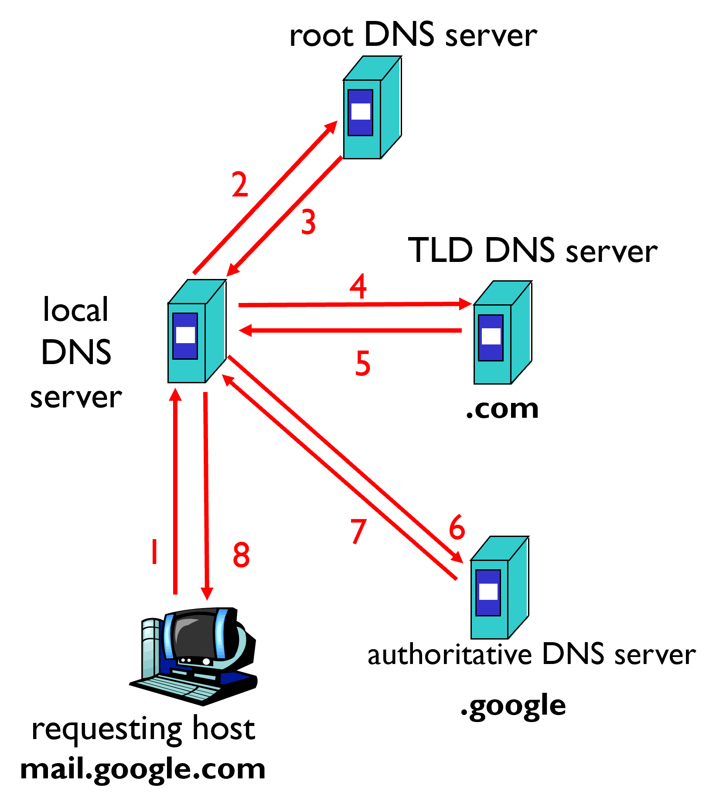
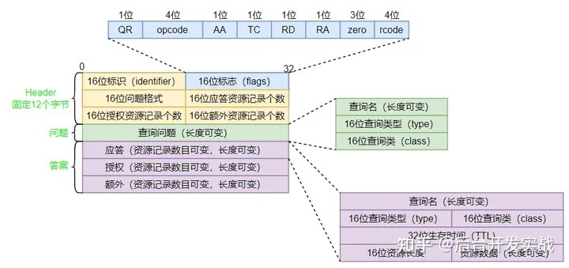

# DNS协议简介

DNS是一种负责将域名（domain name）与其IP地址对应起来的应用层协议。用户在访问网站时，在浏览器中输入的是该网站的域名（例如mail.google.com），浏览器通过DNS协议，查询到该域名对应的实际IP地址，进而与该网站的服务器建立连接。

<br/><br/>


# 域名解析过程

## 第一步：查缓存
实际上不是每次域名访问都会用到DNS协议。若用户之前访问过某域名，则该域名对应的IP会记录到浏览器或系统的缓存中，若没有该缓存，才会开始第二步。

## 第二步：找本地域名服务器

若用户自己的设备中没有域名的IP地址，则需要向本地域名服务器（local name server，也叫default name server，默认域名服务器）以recursive的形式发送查找请求。本地域名服务器一般由互联网服务提供商（简称ISP，在国内可以理解为移动联通电信这几家公司）提供，为该公司某一片区下的所有用户提供DNS服务。如果该本地域名服务器中有IP地址的缓存，则直接引用返回给用户即可（对应到图中第1和第8步），否则要进行第三步。


## 第三步：分层查询
根据网站的域名，本地域名服务器将以iterative的形式进行分层查询。以mail.google.com为例，从后到前，用“.”分开，分别为顶级域名、二级域名、三级域名。
### 顶级域名
例子中的.com就是顶级域名，一般顶级域名分为通用顶级域名（包括.com，还有.net、.edu、.gov、.org等）以及国家顶级域名（例如中国的.cn，日本的.jp，美国的.us）。简单来说，每个顶级域名对应着一台或多台顶级域名服务器（Top-level domain (TLD) server）。

对于IPV4协议，全世界目前有13台根域名服务器（Root name server），这些服务器均记录了所有的顶级域名服务器的IP地址。这13台服务器的IP、名字等信息也是长期固定并记录在几乎所有电子设备中。因此，本地域名服务器可以直接询问根域名服务器，拿到.com的顶级域名服务器地址。该过程对应图中的第2、3步。

### 二级域名
.google为二级域名，大家熟知的，如.baidu、.zhihu等，都是同属在.com顶级域名下的二级域名。当本地域名服务器拿到.com的顶级域名服务器IP地址后，便会问.com服务器查询.google的IP地址。该过程对应图中的第4、5步。

### 三级域名
.com顶级域名服务器返回了.google的IP地址，该地址实际上是.google对应的权威域名服务器（Authoritative DNS servers）的IP地址。一般来说，二级域名和顶级域名共同称为一个主域（domain），例如google.com即为一个主域。在该主域下的三级甚至是四级、五级域名，无论是mail.google.com还是play.google.com都是该主域的子域。

每个主域由其对应的权威域名服务器统筹管理，主域旗下的所有三级及以上域名的DNS服务均由该权威域名服务器提供。此时，本地域名服务器访问到google.com的权威域名服务器，一般就能直接拿到mail.google.com的IP地址了，该过程对应图中的第6到8步。

<br/><br/>

# DNS记录
在查询到网站的IP后，本地域名服务器会缓存该数据，以便下次访问网站时直接调用。这些被缓存的数据称为资源记录（resource record，简称RR）。每条记录可简单分为以下四部分：name、value、type、ttl。
## ttl
即“Time To Live”，表示该条记录的有效时间。如果该记录处于有效时间内，则服务器可直接返回给用户使用。否则就要重新执行一次DNS解析，来更新该条记录。

## type
type决定了该条记录的类型，不同类型的记录，其name和value也不同。
### A
A型记录是最常见的，name为主机名（hostname，在这里可以简单理解为域名），value为该主机名对应的IPV4地址。
### AAAA
name为主机名，value为对应的IPV6地址。
### NS
name为主域，value为该主域对应的权威域名服务器的主机名。
### CNAME
name为主机名，value为该主机名的别名。某个网站可能有多个主机名，任意一个均能用于访问该网站，则这多个主机名可以互为别名。

### PTR
name为IP地址，value为对应的域名。由于域名从左到右越来越宽泛，为了与之匹配以及方便进行DNS反向查询（通过IP地址查域名），该IP地址需要倒过来写，且要加上特定后缀。举个例子，假如原IP为114.51.41.91，则name为：
```
91.41.51.114.in-addr.arpa. 
```
### MX
mail exchanger，name为主域，value为该主域中邮件服务器的主机名。

<br/><br/>

# DNS报文格式
DNS协议采用 client/server 模式，client发出查询请求，DNS服务器响应请求，查询和响应的报文格式一致。报文由header、问题区域（questions）、应答资源(answers)、授权资源(authority)、额外资源(additional info)五部分构成，后三者一般统称为答案区域。



## 报文header
报文的header固定为12个字节，由六个部分构成，每个部分均为2字节（16位）。其中identifier为该报文的标识，查询报文和其对应的响应报文的identifier保持一致。flags则用于描述该报文的性质，例如QR是查询/响应的标志位，1为响应，0为查询。接下来四个部分与报文非header的四个部分一一对应，用于记载对应记录的个数。

## 问题区域
问题区域的每条问题一般由三部分构成：查询名（一般为域名，若进行反向查询则为IP地址）、查询类型（与资源记录的类型一致，例如A为IPV4地址）、查询类（一般为“IN”，即Internet数据）。

## 答案区域
应答资源包含多条资源记录；授权资源包含了一些权威域名服务器的记录；额外资源包含一些可能有帮助的记录。


<br/><br/>

# 参考资料及部分图片出处

[一文带你读懂DNS协议](https://zhuanlan.zhihu.com/p/607293323)

[DNS是什么？一文彻底搞懂DNS的原理机制](https://zhuanlan.zhihu.com/p/643176575)