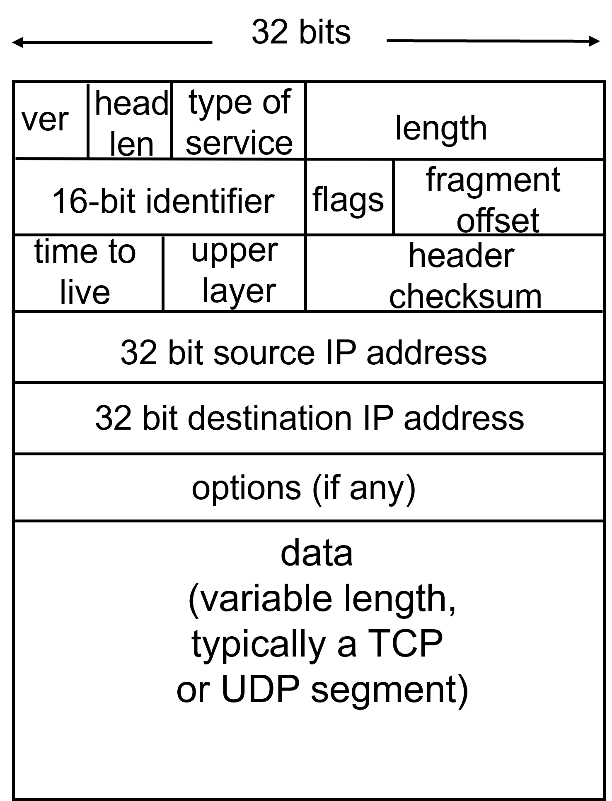
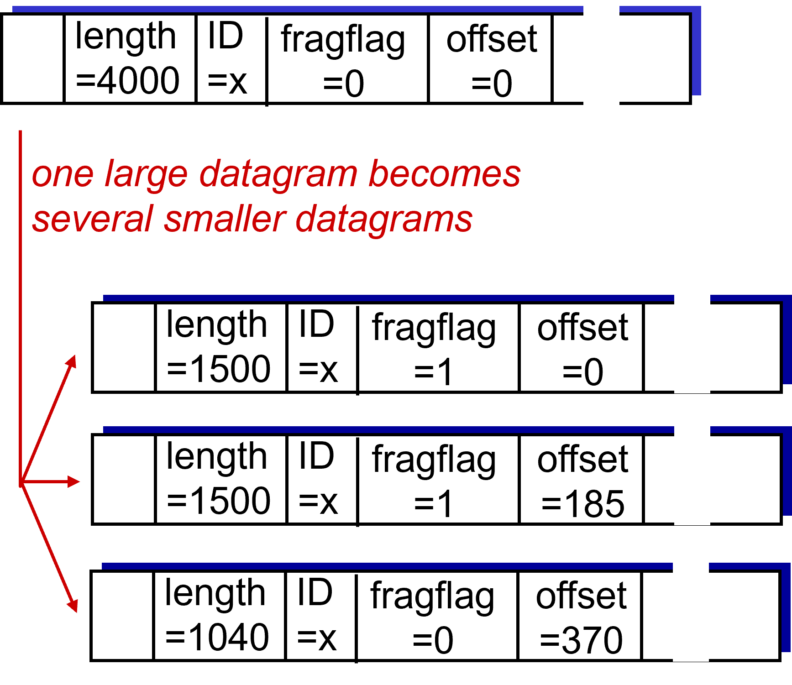

# IP

# IP报文格式

IP报文一般称为datagram，和TCP报文类似，同样分为header和data两部分。如下图所示，前面6行构成header部分，每行4字节。因此header最小为20字节（此时第6行为空），最大为60字节。

## ver
占用4bit，表明该报文的版本（是IPV4还是IPV6）

## head len
占用4bit，表明header的大小，单位为“4字节”。也就是说，假设head len的值为“1111”，转成十进制为15，表明header的大小为15乘以4字节等于60字节。

## type of service
占用8bit，定义该报文需要的服务类型（如传送的优先级、是否要求低延迟、是否要求可靠性等等）。

## length
占用16bit，表明该报文的总体长度（包括header和数据），单位为字节。IP报文最长可为2^16=65536字节。

## identifier，flags，offset
这三个字段一般一起使用，用于IP报文切片与重组。IP报文在网络上传输时，各类传输媒介都受到MTU（Maximum Transmission Unit，最大传输单元，一般为1500字节）的限制，转发的每份数据最大不能超过其MTU值。然而，前文提到的length字段表明，IP报文最大可达65536字节，因此IP报文在传输时可能会被切成多个fragment来传输。

ID（identifier）用于标识各个fragment原来属于哪个报文。原datagram的ID和切片后的各个fragment datagram的ID保持一致。

flags占用3bit，用于标识datagram的分片情况。flags第一位为保留位，暂时没用；第二位标识该datagram能否被分片；第三位用于fragment datagram。如果该fragment datagram是属于原datagram的最后一部分，则设为1。

offset占用13bit，用于fragment datagram。offset以“8字节”为单位，表示该fragment datagram在原datagram的位置。

下面举个例子，方便理解：

如图，假设原datagram总共4000字节，其中header占20字节，数据3980字节，MTR=1500。则分片后的情况为：

fragment 1共1500字节，header同样为20字节，数据1480字节。flags只显示第三位，因此为1。由于是第一个分片，offset为0。

fragment 2共1500字节，header20字节，数据1480字节。由于fragment 2的header是额外生成的，所以header的20字节不算在原报文中，因此offset为$1480/8=185$。

fragment 3共1040字节，header20字节，数据1020字节（$3980-1480-1480=1020$）。fragment 3的header同样不算在原报文中，因此offset为$1480*2/8=370$。

## time to live
占用8bit，简称为TTL，实际上该值用于标识该报文在网络中被router转发的最大次数。网络中各种router可能构成环路，为了防止IP报文在这些环路中反复转发，影响网络正常通信，每个报文都被设置了TTL，每经过一个router，TTL减一。当TTL减到0，报文就会被直接丢弃。
## upper layer
只用8bit，标识了该报文上层所使用的协议。
## header checksum
占用16bit，为header部分作校验和。
## IP address

### IP地址分类

A类地址以“0”开头，接下来7位用于表示subnet，剩下的表示host。

B类地址以“10”开头，接下来14位表示subnet，剩下的表示host。

C类地址以“110”开头，接下来21位表示subnet，剩下的表示host。

D类地址一般用于多点广播（multicast），不指向特定的网络。D类地址以“1110”开头。

E类地址为将来使用保留，以“1111”开头。

  

# DHCP协议

  

# NAT
即Network Address Translation。本地网络（LAN）

# ICMP
即Internet Control Message Protocol。该协议用于在网络中传输控制消息，反馈通信过程中可能发生的各种问题，方便网络管理者对所发生的问题作出诊断并采取措施。

ICMP属于网络层协议，但在IP协议“之上”。换句话说，IP报文会携带ICMP报文内容来进行传输。