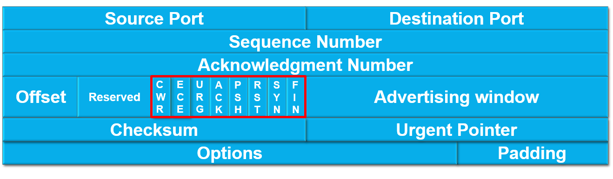

# TCP协议简介

全程Transmission Control Protocol，即传输控制协议。

### 建立连接：三次握手
客户端与服务器建立连接，需要“三次握手”：

### 断开连接：四次挥手

由于TCP协议采用全双工通信，因此要断开连接，需要在两个信道各执行一次请求与应答：

# TCP报文格式

TCP报文分为header部分和数据部分，数据部分的具体格式与网络上层所用协议相关。header部分最短为20字节，最长可到60字节。

## Port
记录来源端口号和目标端口号，均为16bit，端口号范围为0到65535。

## Sequence Number（序列号）

## Acknowledgment Number（确认号）
一般简称为ACK，

## Offset与Reserved
Offset共4bit，用于描述该header的大小，单位为“4字节”。举个例子，假如Offset为“0110”，110十进制下为6，则表示header大小为6乘以4字节等于24字节。

Reserved共4bit，为保留位，目前暂时没有用处，用于未来TCP协议拓展时可在此新增功能。
## 控制位（红色框框）
每个控制位占1bit，共8bit。

## Advertising Window

## Checksum

## Urgent Pointer

## Options与Padding
Options为可选字段，无固定长度，用于在header中传输一些额外的控制信息，可使TCP协议更灵活。Padding为填充位，由于Offset
  

# ICMP  
