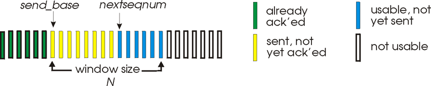

# 简介
在网络上将信息从一方传递给另一方，应如何保证信息及时、完整地送达呢？作为信息的发送者或接受者，底层网络设施无法掌控，因此需要在网络的上层中设计出一套模型（或者说，协议）来保证可靠的信息传输。

考虑到网络情况的复杂性（信息经过大量的路由转发，通过各种有线或无线的物理媒介，极有可能会出岔子），信息在传输过程中主要会面对信息丢失和信息出错的风险。为解决这两个问题，RDT（Reliable Data Transfer）模型应运而生。本文将基于传输层的TCP协议解释RDT模型。
  

# RDT模型
## RDT 1.0
首先，我们提出RDT模型的1.0版本：假设传输信息的媒介是可靠的（以上两种问题不存在），发送方（以下简称S）将封装好的packet直接给媒介，接收方（以下简称R）则直接从媒介中接收packet即可。

## RDT 2.0：解决信息出错问题
### 信息校验
来到2.0版本，我们考虑解决信息出错的问题。对此，可以将传输的packet分为数据区和校验区，数据区为原来要传输的信息，校验区用于校验传输过程中是否出错。最简单的可以用校验和（checksum）。举个例子，假如数据区为2、3、5三个数字，则校验区为2+3+5=10。因此，S发送的packet的实际内容为2、3、5、10。R收到该packet后将数据区的内容相加后与校验区对比，即可知道packet是否无误。此外，也可使用哈希校验（如MD5算法）等方法来实现该功能。

### ACK与NAK
R收到了packet，如果发现出错，需要通知S重新传输。所以，packet还需要额外的控制区，来描述该packet的特性。例如，可在控制区中设一个NAK和一个ACK的flag，若数据出错，则R发一个将NAK flag设为1的packet给S，让S重新发送packet即可。若数据正常，则R发一个将ACK flag设为1的packet给S，让S继续后续的传输。

## RDT 2.1：解决ACK/NAK出错问题
如果S发的packet出错，R回复的含NAK的packet也出错了，那S是重发还是不重发呢？如果重发，R可能会接受到重复的packet。

对此，可为packet加入序列号（sequence number），只要R没有正常回复ACK，S就都会重发packet。R可通过序列号找到重复的packet，直接丢弃即可。

## RDT 2.2：ACK改进
对于R来说，其回复的packet可以去掉NAK flag并加入确认号（acknowledgement number），用于对其收到的某个特定packet回复ACK。每次S收到S发送的packet，R回复自己收到的最后一个完好的packet对应的ACK即可（此种回复称为cumulative ACK）。

例如，S发送了packet 1后，R回复ACK 1，这说明packet 1没问题，S收到了R的回复后继续发出packet 2。但传输过程中packet 2内容出错，R收到错误的packet 2后就只能回复最后一个完好的packet（也就是packet 1）对应的ACK。又一次收到ACK 1的S就知道自己的packet 2出问题了，重发即可。

整体模型可用如下图表示：

## RDT 3.0：解决丢包问题
如果一方发送的packet在传输过程中失踪了，则另一方可以设置一个合理的等待时间，若该时间段内既定的packet没到，则可以采取措施。

例如，S发出packet后会同时开始计时。若既定时间内没收到R对当前packet的ACK回复，则S重传packet，并重置计时器。而对于此次超时，可能有三种情况：
- 若是packet丢失，R也能顺利收到重传的packet；
- 若是ACK丢失，R会收到重复的packet，但通过序列号R也能保证丢弃重复packet；
- 若ACK延迟到达，S收到延迟的ACK后直接发送下一个packet即可，无需额外处理，反正R会通过序列号丢弃掉重复的packet。

  

# 流水线式改进
S每次发新的packet，都要在R对上一个packet回复ACK后才能进行，这其实效率比较低。对此，可以将收发packet的逻辑改成流水线式（pipelined），S可连续发多个packet而无需等待R方确认。

## Go-Back-N模型
### 简介

Go-Back-N又称滑动窗口协议，所有待发的packet可以排成一列，然后用一个滑动窗口来管理S对这些packet的行为。其中，窗口大小（Window Size）指S在收到任何R的ACK前，最多能连续发送的packet个数。窗口大小应根据流量控制策略进行合理设置。窗口过小，影响传输效率；窗口过大，容易超出R的接收能力或造成网络拥堵。

### Sender的发送规则
如图所示，每个绿色长条表示一个S已经发送且被ACK的packet，黄色长条表示S发送了但还未收到ACK的packet。蓝色表示S未发但是可以接着连续发送的packet。白色长条表示没发也暂时不能发的packet。

初始阶段，窗口在最左侧，窗口内均为蓝条，窗口右侧均为白条。

接下来，S开始连续发送packet（此时窗口不动，窗口内从左到右蓝条依次变黄条），并为最左端的黄条（send_base）开启一个计时器。如果在既定时间内，S收到了任意黄条对应的ACK，则窗口右移（收到第K个黄条对应的ACK，窗口就右移K位），同时会为新的最左端黄条重置计时器。在Go-Back-N模型下，S是否重发仅取决于计时器是否超时，而不是重复的ACK回复（S会忽略重复的ACK以及绿条对应的ACK）。如果超时，则从最左端黄条开始依次重发所有黄条，并重置最左端黄条重置计时器。

### Receiver的回复规则
对于R来说，Go-Back-N模型下与RDT 3.0一致，每次收到S的packet后只需进行cumulative ACK即可。

R可能接收到连续的packet，例如S发送了packet1到4号，其中packet 3出错，则R仍按照上述策略，回复ACK 1、ACK 2、ACK 2、ACK 2即可。S收到了ACK 1和2后就会右移窗口并忽略重复的ACK，但迟迟未收到ACK 3，超时后就会从packet 3开始重发。

下面放张图，算是个例子帮助理解。

## Selective Repeat模型
### 简介
Selective Repeat同样使用窗口来管理S和R，但与Go-Back-N严格按顺序ACK packet然后逐步滑动窗口的做法不同。Selective Repeat模型下，窗口中的各个packet是相对独立的。R会为每个成功接受的packet回复该packet对应的ACK，而不是会单独针对某个

### Sender的发送规则
如上图所示，每种颜色对应的packet与Go-Back-N一致。初始阶段窗口情况、窗口大小的概念也与Go-Back-N一致。

接下来，S开始连续发送packet（此时窗口不动，窗口内从左到右蓝条依次变黄条），并为每一个黄条分别设一个计时器。如果某个黄条在其计时器的既定时间内收到了该黄条对应的ACK才会变绿，否则重发该黄条本身，并重置该黄条的计时器。

S方的窗口仅在最左端的黄条变绿时才会右移，且窗口每次右移可能会跨过多个绿条，直到窗口最左侧为黄条。

### Receiver的回复规则
Selective Repeat对R也使用窗口来管理。如图所示，图上下两部分的窗口以及各个颜色条是一一对应的。在Selective Repeat中，R方对于收到的每个packet仅需回复该packet对应的ACK即可。例如，R收到了packet 1、2、5、8，则回复ACK 1、2、5、8即可。结合图来看，红条表示已收到图上半部分S对应发送的packet并针对该packet回复了ACK。蓝条表示还没收到S发送的packet。

R方的窗口仅在窗口最右侧的蓝条变红后才会向右移动，且窗口每次右移可能会跨过多个红条，直到窗口最左侧为蓝条。对于R来说，窗口大小衡量着R方的接收能力。窗口越大，对R的内存需求就越大，因为窗口内R接收到的packet都是缺少头部数据的（窗口内最左侧必定是蓝条），这样不连续的数据无法直接提交给上层协议使用，因此需要记录在内存中。

对于窗口外左侧的红条，R一般也需要留出一部分资源作处理，因为这些红条仅表示R针对接收的packet作了ACK回复，并将该红条移出了窗口。但该ACK回复可能会出错或丢失。如果出现差错，S会重发该红条对应的packet，R在收到这些重复的packet后需要丢弃并针对该packet回复ACK。

## 窗口最大尺寸
假设需要n个bit来表示packet序列号，当n为2时，packet的序列号仅能为0、1、2、3。如果需要传输的packet多于4个（假设需要传9个packet），则packet序列号需要重复使用：0、1、2、3、0、1、2、3、0。

### Go-Back-N：$2^n-1$
假设将Go-Back-N的窗口大小设置为$2^n$（也就是4），S发送packet 0、1、2、3后，R顺利接收，并依次回复ACK 0、1、2、3，接下来可能会产生如下情况：
- 情况1：S顺利收到ACK回复，然后发送后面4个packet（编号仍为0、1、2、3）
- 情况2：ACK回复丢失，S在超时后重传原来的4个packet

无论是情况1还是情况2，R都会再次收到编号为0、1、2、3的4个packet。但R不知道这4个packet是前4个还是后4个。

如果窗口大小设置为$2^n-1$（也就是3），情况1下，S继续发送的packet编号为3、0、1；情况2下重发的packet编号为0、1、2。通过packet编号，R即可知道是重发的还是后续的packet。

### Selective Repeat：$2^{n-1}$
假设将Go-Back-N的窗口大小设置为$2^{n-1}+1$（也就是3），S发送packet 0、1、2后，R顺利接收，并依次回复ACK 0、1、2，接下来可能会产生如下情况：
- 情况1：S顺利收到ACK回复，然后发送后面3个packet（编号仍为3、0、1）
- 情况2：部分ACK回复丢失（假设丢失ACK 0和ACK 1），S在超时后重传packet 0和packet 1。

无论是情况1还是情况2，R都会再次收到编号为0、1的2个packet。但R不知道这2个packet是重传的还是后续的。

如果窗口大小设置为$2^{n-1}$（也就是2）。情况1下，S继续发送的packet编号为2、3；情况2下重发的packet编号为0、1。通过packet编号，R即可知道是重发的还是后续的packet。
  

# 参考资料
[Go-Back-N与Selective repeat动画演示](https://www2.tkn.tu-berlin.de/teaching/rn/animations/gbn_sr/)

[GBN和SR的窗口最大尺寸](https://zhuanlan.zhihu.com/p/450499911)