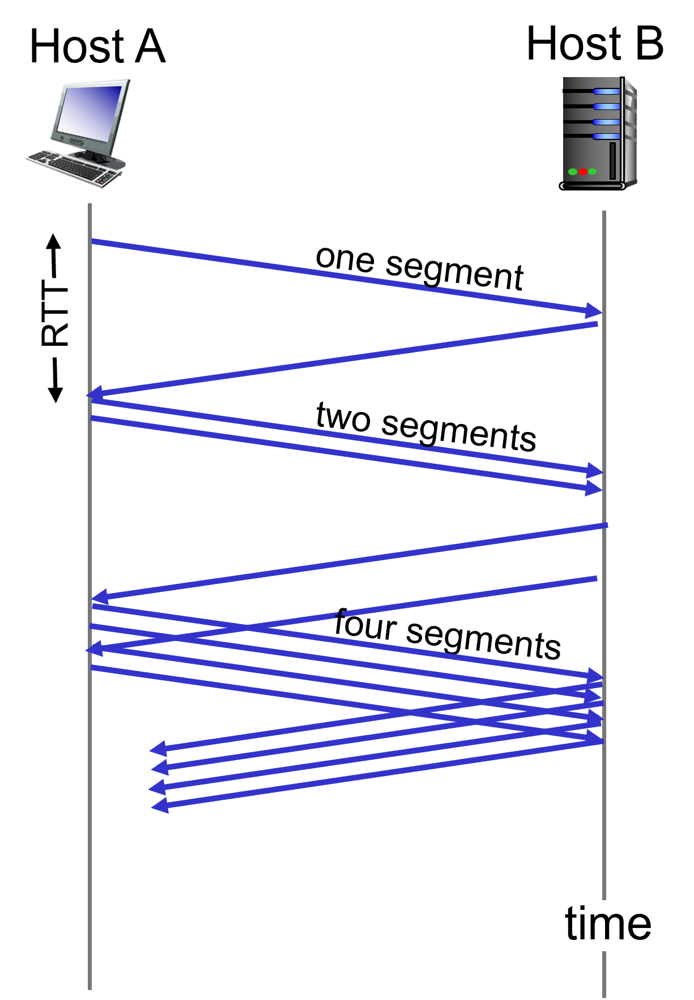
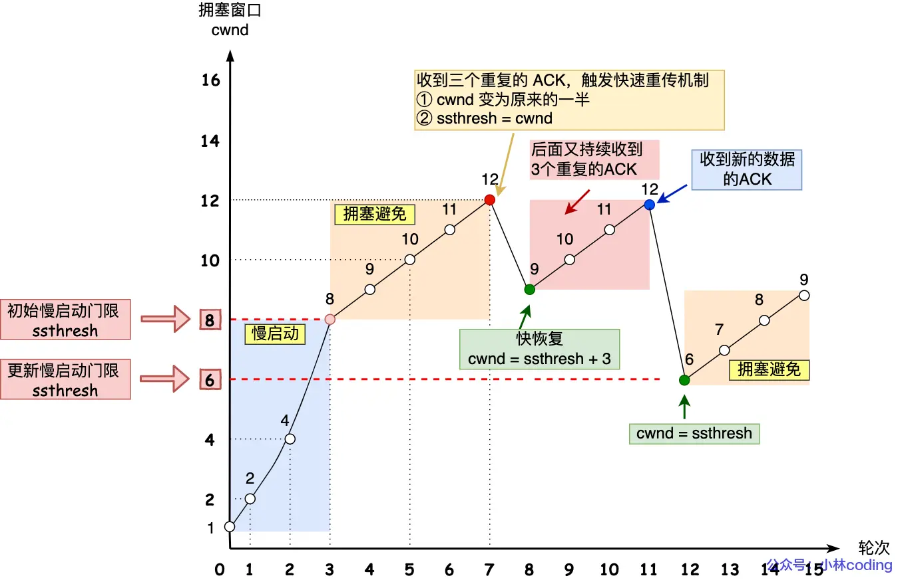
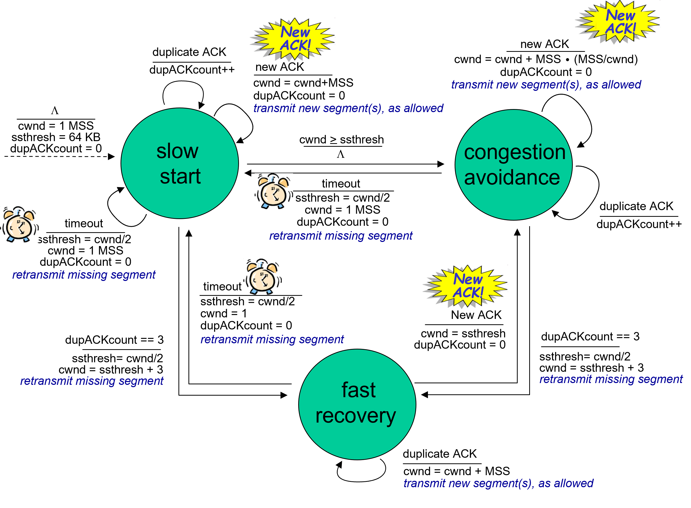
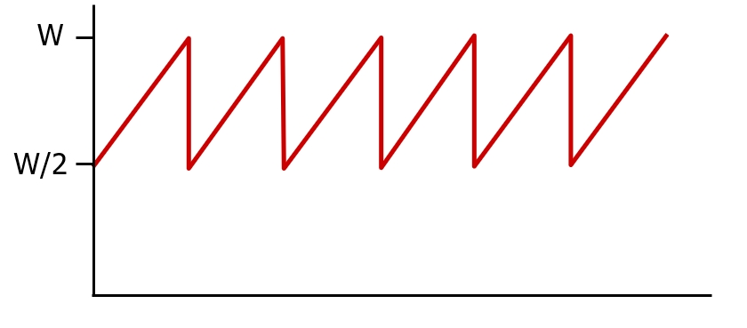
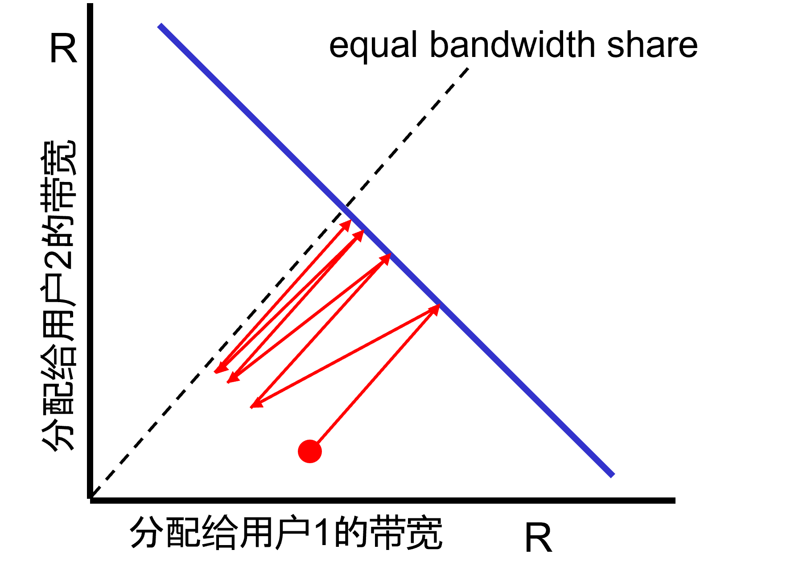

# Congest Control简介

在TCP传输中，sender过快过多地发送segment，不仅可能超出receiver的接收能力，更有可能阻塞网络，影响同路由下其他终端的正常通信，因此，TCP协议不仅许需要Flow Control，也需要Congest Control。

TCP传输的双方都通过窗口来管理segment的收发，且窗口大小一般也决定着收发能力。对此，Congest Control最简单的思路就是，发生网络拥塞时，降低sender方的窗口大小，将其窗口大小降低到不超过某个特定的值即可。假设这个值为CWND。

假设sender的窗口大小为SWND，receiver的窗口大小为RWND，考虑到Flow Control和Congest Control，我们有：
```cpp
SWND = min(CWDN, RWDN)
```

由于网络状态是时刻变化的，拥塞可能产生也可能消失，CWND的值也需要随之动态变化。那如何检测网络拥塞？CWND具体应如何设置并变化（当网络拥塞消失后如何恢复双方的通信能力）？下面会介展开说明Congest Control的技术细节。以下将sender简称为S，receiver简称为R。

<br/><br/>

# Slow Start
即“慢启动”。通信双方三次握手建立连接后，会将CWDN初始化为1。每当S收到一个ACK，CWDN就会加1。Slow Start在通信初期增长比较缓慢，但如果双方正常通信，CWDN的大小会在每轮通信中增长一倍（也就是一次RTT的时间内增长一倍）。



如图所示，一开始S一次只能发送一个segment，收到R的回复后，CWND增大为2，可以一次发送两个segment。R会为这两个segment回复两个ACK，CWND就增大到四个segment......

# Congestion Avoidance
即“拥塞避免”。CWND不会无限增长下去，当其值超出一个阈值（ssthresh）后，拥塞控制机制就从Slow Start（指数增长）转变为Congestion Avoidance（线性增长）。每收到一个ACK，CWND仅增长1/CWND。换句话说，CWDN的大小会在每轮通信中增长1（也就是一次RTT的时间内增长1）。

举个例子，假如现在处于Congestion Avoidance阶段，当前CWND为8，则此轮通信S可以发送8个segment，一个RTT时间后收到8个ACK，CWND就增长1，下一轮通信S就能发送9个segment，以此类推......

# 拥塞发生
当出现segment丢失需要重传时，一般预示着拥塞发生了。重传有超时重传和快速重传两种机制，拥塞控制对这两种重传机制有不同的操作：
## 超时重传：回到Slow Start阶段
在任何阶段发生超时重传，S会重发segment，并将ssthresh设为当前CWND值的一半，然后将CWND初始化为1，并重新回到Slow Start阶段。
## 快速重传：执行Fast Recovery
当S收到正常回复的ACK后，又收到连续三个相同ACK时，会触发快速重传机制（Fast Retransmit）。实际上拥塞控制机制会认为快速重传被触发时的网络情况并不算差，毕竟还能收到后续的多个相同ACK。此时，S同样会重发segment，CWND被设置为原来的一半，ssthresh被设置为与减半后的CWND相同，然后进入Fast Recovery阶段。

在Fast Recovery阶段，S每收到一个重复ACK，其CWND会加1。一旦S收到了新的ACK回复，则CWND重新设置为ssthresh，并进入Congestion Avoidance阶段。如果在Fast Recovery阶段中出现了超时重传，则遵循上述拥塞控制对超时重传情况的操作。

下图描绘了各个阶段CWND的变化情况。值得注意的是，不同系统对拥塞控制机制有不同的实现。例如，有些系统会在进入Fast Recovery状态后将CWND增加3，有些则不会。



下图总结了拥塞控制机制下多个状态之间的切换规则以及各个状态下的操作流程。

<br/><br/>

# 其他
## 吞吐率（throughput）分析
忽略Slow Start阶段，假设某个TCP连接反复处于拥塞和Congestion Avoidance两个阶段，则其CWND的变化情况会如下图所示。其CWND的平均值为$\frac{3}{4}W$，平均吞吐率为$\frac{3W}{4RTT}$


## TCP Fairness
实际上，TCP的拥塞机制是一个比较“公平”的设置。假设有多个用户通过同一网络使用TCP连接，从公平角度出发，这多个用户应该平均分配网络的带宽。但是首先，网络带宽难以确定，用户数量也一直变动，因此不能通过计算来静态地给每个用户分配带宽。而TCP的拥塞机制无需掌握上述信息，即可在用户通信过程中动态调节每个用户所占用的带宽，直到相同。



首先假设网络中有两个用户，网络的总带宽为R（该值用户不可见）。如图可知，带宽的分配必须在蓝线的左下角。

假设一开始对两位用户的带宽分配为红点所对应的坐标，此时分配给用户1的带宽是多于用户2的。然后，两位用户的CWND进入Congestion Avoidance状态，开始线性增长，如图红线所示。当红线触及蓝线时，网络带宽耗尽，会发生拥塞，此时两位用户的CWND都被减半。由于减半前用户1所占带宽比用户2多，所以减半操作对用户1的影响更大，减半后两位用户所占带宽更加接近了。之后重复上述过程，直到双方所占带宽相等（即达到图中虚线位置）。

<br/><br/>

# 参考资料
[小林coding：图解网络](https://xiaolincoding.com/network/)