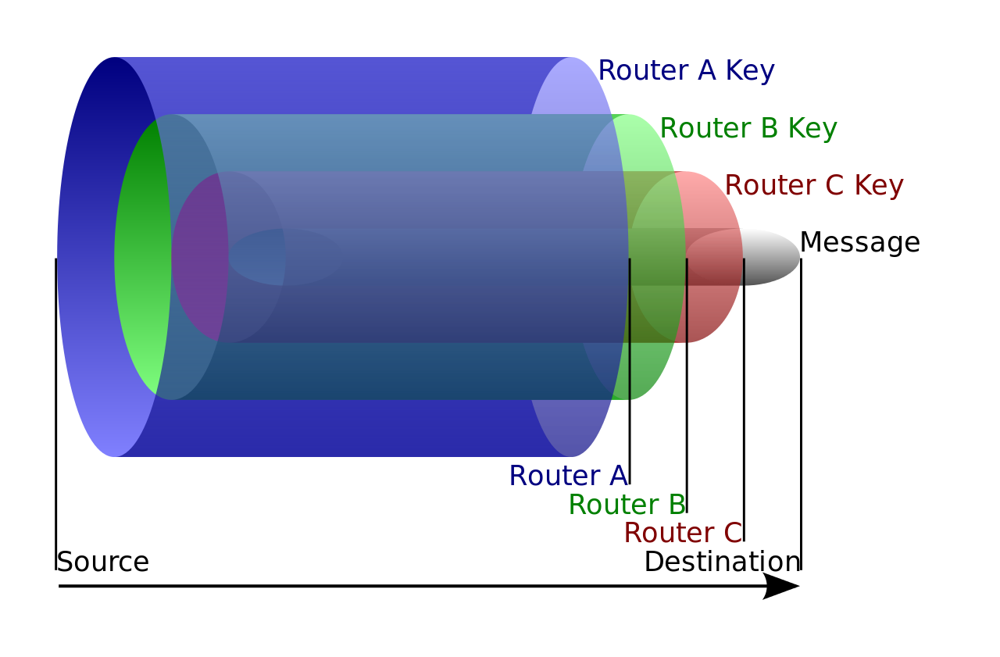
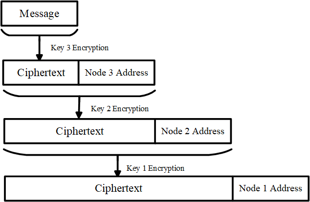

# 洋葱路由
## 简介
当前广泛使用的HTTPS技术已经可以保证通信的保密性，但无法保证匿名性。通信双方传输的具体信息无法被第三者获知。但是，若第三者或黑客获取了TLS握手消息，其中Server Name Indication字段仍会暴露通信双方的身份。而洋葱路由(Onion Routing)是一种匿名通信技术，该技术通过对称加密通信内容来保证保密性，并令消息通过多个自有的洋葱网络节点让第三方无法获知通信双方的真实身份，从而保证匿名性。

洋葱路由技术发明于90年代中期，一开始是用于保护美国情报安全。之后该技术被计算机科学家 Roger Dingledine和Nick Mathewson实现，两人于2002年发起了The Onion Routing Project（Tor Project），之后该技术逐渐普及。

如图所示，在通信过程中，消息在每个洋葱路由器上被不同的密钥层层加密，如果要获取消息本身，就需要像剥洋葱一样，对密文逐层解密。这就是洋葱路由的名字由来。

## 通信过程
使用洋葱路由技术进行通信的具体过程如下图所示：

### Step 1：节点选择
当客户端需要访问指定服务器时，他首先要从目录节点（directory node）中选择多个节点来构成本次访问的路由路径（该路径一般称为“chain”或者“circuit”）。这些节点是分布在世界各地的服务器，由Tor Project的志愿者维护。
### Step 2：准备阶段
假设为本次访问选择了三个节点（实际上的circuit可能由上百个节点构成）。这三个节点对应了三把密钥，每个节点只能知道自身对应的密钥，而客户端可以获知所有的密钥信息。客户端需要逐一使用这三把密钥对消息进行加密，加密过程如下图所示：

从最远端节点对应的密钥开始加密，加密后再附上明文的节点地址。下文将解释此做法的目的。

三层加密后，密文就相当于一个包裹了三层“皮”的洋葱。加密完成后，客户端将密文发送给第一个节点（Node 1），进入了洋葱路由网络。

### Step 3：节点跳转
每一个节点只知道自身对应的密钥。因此，当Node 1收到来自客户端的密文后，使用自身对应的密钥（Key 1）进行解密。通过上图可知，解密后会得到明文的Node 2的地址，但消息本身仍是加密的状态。因此Node 1将该密文发送给Node 2。

同理，Node 2也只知道Key 2。Node 2收到Node 1传来的密文后同样使用Key 2进行解密，发现了明文的Node 3地址和加密状态的消息，接着发送给Node 3。

Node 3收到后使用Key 3进行解密，解密后得到明文（“洋葱”的所有外皮均被剥开，露出了“明文”）。于是Node 3将明文（如果此处使用HTTPS等加密协议，则仍然是密文）发送给目标路由器，此时视为该消息离开了洋葱路由网络。
### Step 4：消息回传

服务器将回复客户端的消息发送给Node 3。Node 3使用Key 3加密该消息后回传给Node 2；Node 2使用Key 2加密后传给Node 1；Node 1使用Key 1加密后回传给客户端。由于客户端知道所有密钥信息，因此依次使用Key 1、2、3解密消息后得到明文。

## 对洋葱路由匿名性的分析

黑客可能会在通信的任何环节窃听，根据通信环节的不同可以分成以下三种：
1. 在客户端与Input Node（Node 1）之间窃听。在这种情况下，黑客只能拿到一个被三重加密的消息和Input Node的地址，无法获知客户端的身份。

2. 在中间节点窃听。黑客获得的消息仍然是加密的，最多知道获知中间节点及其对应circuit的上下游节点。考虑到各个节点可能同时在为洋葱路由网络中的多个circuit服务，当前节点可能同时作为其他circuit的Input Node或Output Node，这一组上下游节点也可能同时服务其他circuit。因此，即便获知当前消息对应的circuit中的一组上下游关系，也难以推断出当前circuit的其他部分（从而难以追溯客户端与目标服务器）。

3. 在Output Node（Node 3）与目标服务器之间窃听。在黑客的视角下，是两台服务器在正常通信，无法获知任何有关客户端的信息。

综上所述，无论通信中任意环节的窃听，洋葱路由技术都能保证客户端的匿名性。

## 洋葱路由的限制性
### 通信质量受限于节点
诚然，客户端访问目标服务器之前需要通过洋葱路由网络的多个节点，速度肯定不如直接访问。另外，由世界各地志愿者维护的各个节点服务器质量肯定不如商业ISP的服务器，所以通信质量普遍不高。

### 恶意志愿者可能会破坏匿名性
恶意志愿者设置的节点可能会令消息在传输过程中离开洋葱路由网络，失去保护的消息可能会被破解从而导致客户端身份的暴露。
### 复杂流量分析可能会破坏匿名性
如果黑客同时在多个节点处窃听并进行流量分析（消息进出洋葱路由网络的时间、频率等信息），则客户端的活动模式可能会被分析并记录，从而猜测处客户端的身份。

### Exit node易遭受攻击
根据前文所述，Exit Node和目标服务器之间传输的消息并不会藉由洋葱路由技术加密。也就是说，如果这段通信没有使用加密协议（如HTTPS），则黑客还是能获知通信内容，从而获知客户端的具体信息。

  

# Tor 
2004年，Roger Dingledine、Nick Mathewson、Paul Syverson三人发表论文《Tor: The Second-Generation Onion Router》，在原来Onion Routing的基础上，提出了第二代Onion Routing的技术：Tor。相比前代，Tor有更加详细、规范的实现细节和技术标准：

- 规范化的通信流程：Tor详细制定通信时stream创建及关闭的规则，节点的选择流程，加密算法的选择（Diffie-Hellman）、各个节点的密钥的协商步骤、circuit的创建等。

- 规范化的消息格式：Tor网络中通信的消息被称为“cell”，每个cell都固定为512字节。cell分成control cell和relay cell两种。stream创建关闭、各个节点的密钥协商、错误控制都通过前者实现，后者用于传输data。

- 通信加密：Tor规定了客户端与各个节点通信时必须使用TLS加密，解决了上文所述Exit node易遭受攻击的问题。

- 拥塞控制：Tor基于TCP传输运行，因此Tor可以利用TCP的拥塞控制机制。此外，作者还额外制定了Circuit-level throttling和Stream-level throttling两个不同层级的拥塞控制机制。

- 数据完整性检验：为了兼顾效率与成本，Tor仅在每个通信stream的边缘检查数据的完整性。节点之间通过SHA-1算法生成摘要并对此进行验证来确保数据完整性。

  

# 参考资料和部分图片出处
[Onion Routing](https://www.geeksforgeeks.org/onion-routing/)

[Onion routing: Definition, mechanism, and key features](https://nordvpn.com/zh/blog/onion-routing/)

[Onion Routing](https://en.wikipedia.org/wiki/Onion_routing)

[Tor: The second-generation onion router](https://svn-archive.torproject.org/svn/projects/design-paper/tor-design.pdf)