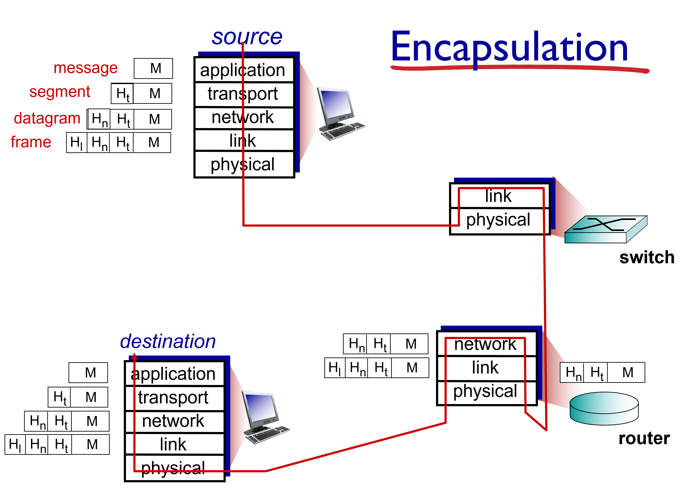

# 为何分层
计算机网络是一个非常庞杂的系统，其中涉及到众多应用程序和协议、各种类型的终端系统、各类多媒体文件、各种交换机、路由器、无线发射器等基础设施。面对如此庞杂的系统，建立一个分层模型有助于将计算机网络中的各类任务拆解开来，每层负责某类特定的任务，各层之间相互协作，相互依赖，这不仅有助于从业人员通过层级关系理解整个计算机网络的任务，也有助于整个系统的升级与维护。

目前普遍采用国际标准化组织（ISO）推出的ISO/OSI七层模型。自顶向下分别为应用层、表示层、会话层、传输层、网络层、数据链路层、物理层。此外，TCP/IP协议簇下的四层模型、五层模型等也被广泛接纳。
  

# TCP/IP五层模型
本文从TCP/IP协议簇下的五层模型入手，来阐述各层之间的功能与关系。

| 层 |  相关协议 |
| -- | -- |
|应用层（application）  | HTTP、FTP、SMTP|
|传输层（transport）|  TCP、UDP |
|网络层 （network）| IP、ARP、ICMP |
|数据链路层（link） | Ethernet、802.11、PPP|
|物理层（Physical）|  Bluetooth、802.11|

上层协议不care下层采用什么协议发送它的数据，它只负责调用下层协议即可。下层协议同样也不care上层是什么协议在调用它，也不care给它的是什么数据。下层协议收到上层协议的数据时，一般都会加上一个该协议需要的header，这一过程称为封装（Encapsulation）。

## 应用层
应用层负责提供直接面向用户的网络应用和协议和服务，如文件传输（FTP）、超文本传输（HTTP）及邮件服务（SMTP）等。应用层协议是应用与应用之间的直接对接（一般来说负责两个进程之间的通信，即使这两个进程在同一终端上，都需要应用层协议来对接）

根据ISO/OSI七层模型，应用层下面还可多拆分出表示层（presentation）及会话层（session）。其中，表示层用于管理数据包的表示方式。通信双方可能采用不同的数据表示方式，为了防止互相之间传送的数据包无法被对方理解，表示层负责数据语法转换、语法表示、数据加密、数据压缩等功能。会话层则为应用提供建立和维护会话的功能，具体有消息同步（例如视频通话时提供保证音画同步）、检查点（例如文件断点续传）等功能。

应用层收发的数据包，被成为报文（message）。

## 传输层

传输层负责将应用层需要的信息从一个应用传输到另一个应用。传输层收发的数据一般被称为segment。

传输层的协议直接与另一终端的传输层对接（一般负责两个端口之间的通信）。

## 网络层

网络层收发的数据，称为datagram。网络层的协议一般要负责实现datagram具体的发送机制。实际上，这一套机制是非常复杂的，需要多个网络层协议相互配合来实现。例如IP协议负责datagram的分片、组装与转发，ICMP负责传输过程中的错误控制，DHCP负责每个终端的IP地址分配等等……网络层协议不仅要与另一终端的网络层对接，还要与传输过程中不同的路由器对接，来保障两个终端之间的通信。

## 数据链路层
数据链路层收发的数据包，称为frame。数据链路层负责将frame从一个MAC地址发送到另一个MAC地址。相比于物理层，数据链路层还需要保证数据完整无误地传输，因此该层的协议还有校验、重转等机制。

## 物理层
负责传输二进制的比特流。在物理层的协议看来，它只需要负责将二进制比特流从一个节点传输到另一个节点即可。面对不同的传输媒介（有线/无线）以及不同的收发节点，需要不同的物理层协议来实现传输。例如Bluetooth协议负责无线状态下蓝牙设备的收发，USB协议负责USB接口下数据的传输等等。
  

# 参考资料
《Computer Networking: A Top-Down Approach(Global Edition, 8th Edition)》 by James F. Kurose and Keith W. Ross