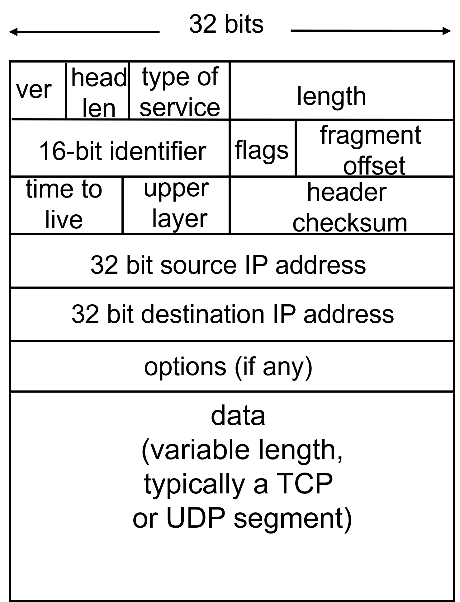
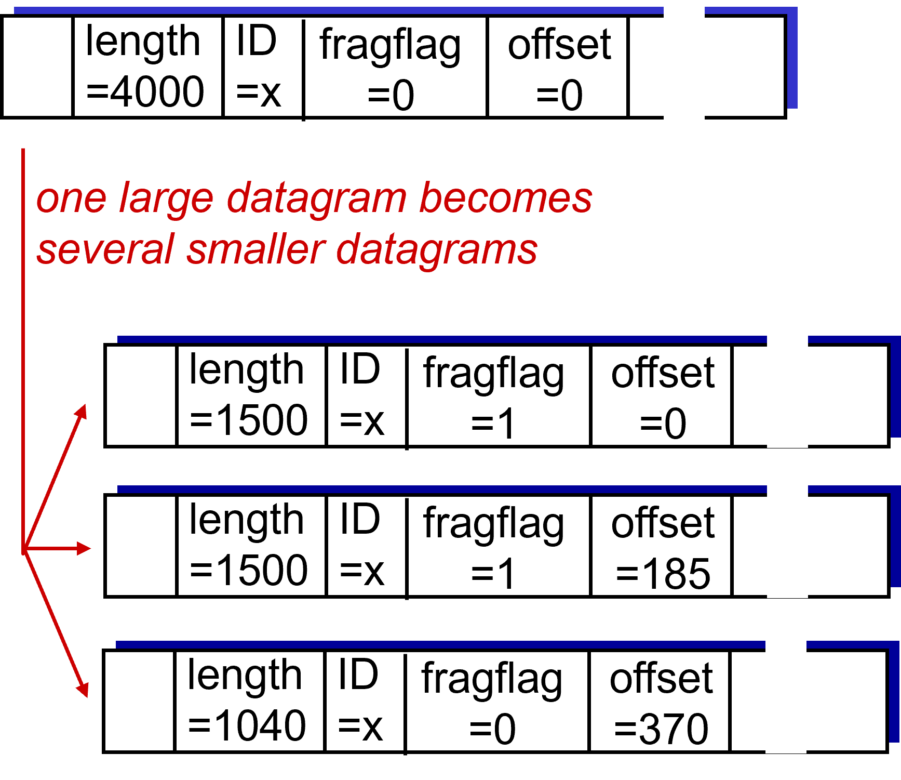
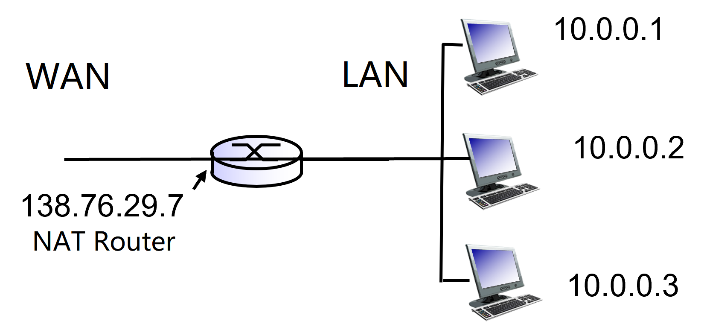
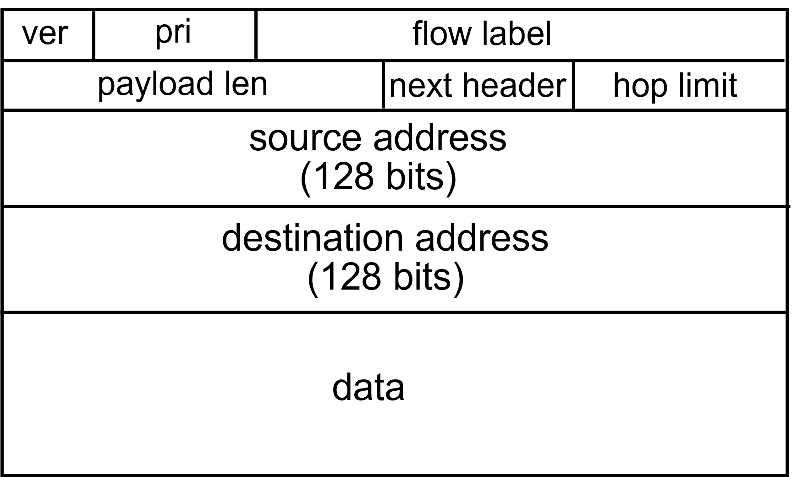
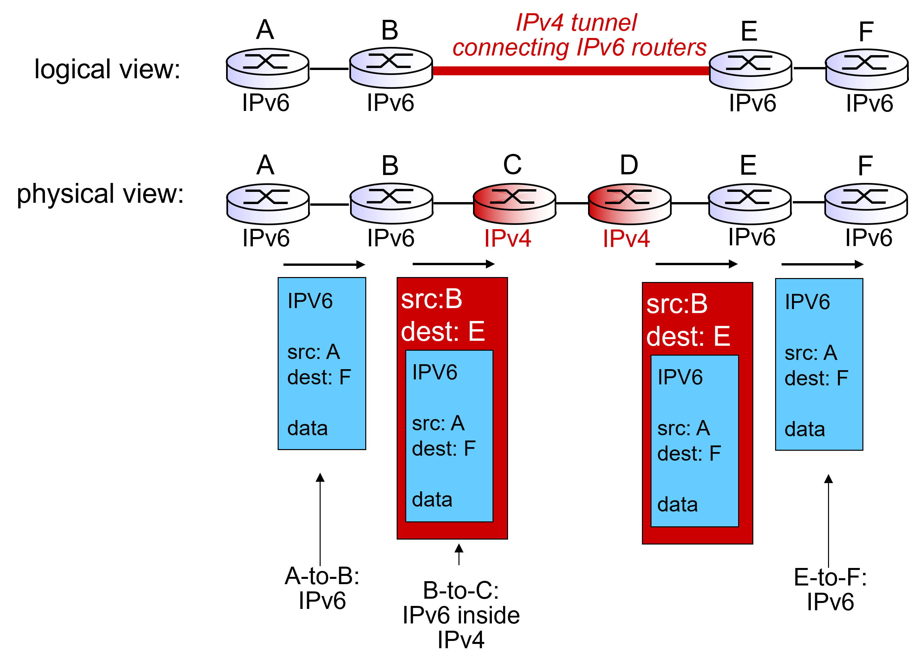

# IP报文格式

IP报文一般称为datagram，和TCP报文类似，同样分为header和data两部分。如下图所示，前面6行构成header部分，每行4字节。因此header最小为20字节（此时第6行为空），最大为60字节。

## ver
占用4bit，表明该报文的版本（是IPV4还是IPV6）

## head len
占用4bit，表明header的大小，单位为“4字节”。也就是说，假设head len的值为“1111”，转成十进制为15，表明header的大小为15乘以4字节等于60字节。

## type of service
占用8bit，定义该报文需要的服务类型（如传送的优先级、是否要求低延迟、是否要求可靠性等等）。

## length
占用16bit，表明该报文的总体长度（包括header和数据），单位为字节。IP报文最长可为2^16=65536字节。

## identifier，flags，offset
这三个字段一般一起使用，用于IP报文切片与重组。IP报文在网络上传输时，各类传输媒介都受到MTU（Maximum Transmission Unit，最大传输单元，一般为1500字节）的限制，转发的每份数据最大不能超过其MTU值。然而，前文提到的length字段表明，IP报文最大可达65536字节，因此IP报文在传输时可能会被切成多个fragment来传输。

ID（identifier）用于标识各个fragment原来属于哪个报文。原datagram的ID和切片后的各个fragment datagram的ID保持一致。

flags占用3bit，用于标识datagram的分片情况。flags第一位为保留位，暂时没用；第二位标识该datagram能否被分片；第三位用于fragment datagram。如果该fragment datagram是属于原datagram的最后一部分，则设为0。

offset占用13bit，用于fragment datagram。offset以“8字节”为单位，表示该fragment datagram在原datagram的位置。

下面举个例子，方便理解：

如图，假设原datagram总共4000字节，其中header占20字节，数据3980字节，MTR=1500。则分片后的情况为：

fragment 1共1500字节，header同样为20字节，数据1480字节。flags只显示第三位，因此为1。由于是第一个分片，offset为0。

fragment 2共1500字节，header20字节，数据1480字节。由于fragment 2的header是额外生成的，所以header的20字节不算在原报文中，因此offset为$1480/8=185$。

fragment 3共1040字节，header20字节，数据1020字节（$3980-1480-1480=1020$）。fragment 3的header同样不算在原报文中，因此offset为$1480*2/8=370$。

## time to live
占用8bit，简称为TTL，实际上该值用于标识该报文在网络中被router转发的最大次数。网络中各种router可能构成环路，为了防止IP报文在这些环路中反复转发，影响网络正常通信，每个报文都被设置了TTL，每经过一个router，TTL减一。当TTL减到0，报文就会被直接丢弃。
## upper layer
只用8bit，标识了该报文上层所使用的协议。
## header checksum
占用16bit，为header部分作校验和。

  

# 如何榨干IP地址
## IP地址构成与分类
我们所称的“互联网”是由多个更小型的网络组合而成。而IP地址不仅可用于标识终端，也可用于标识该终端所属的网络。IP地址一般分为前后两个部分，前面的若干位用于标识网络，后面剩下的用于标识该网络中的各个终端（host）。

根据国际标准，IP地址也被分为A到E总共五类：

A类地址以“0”开头，前8位用于表示网络，剩下的表示host。

B类地址以“10”开头，前16位用于表示网络，剩下的表示host。

C类地址以“110”开头，前24位表示网络，剩下的表示host。

D类地址一般用于多点广播（multicast），不指向特定的网络。D类地址以“1110”开头。

E类地址为将来使用保留，以“1111”开头。

假设需要为某公司组建网络，公司大概有200台设备，那申请一个C类地址即可。IP地址的前24位表示该公司的网络，最后的8位表示host，可以标识最多2^8-2=254台设备。（每个网络下都有两个特殊的IP地址，地址host部分全为0为网络号，全为1的为广播地址，有特殊用途，无法分配给普通终端）

## 子网划分 
如果公司设备达到了300台，显然C类地址不够用了，但B类地址最后16位用于表示host，最多可标识2^16大约6万多台设备，显然比较浪费。这种情况下，可以使用CIDR（subnet Classless InterDomain Routing）技术对IP地址进行进一步细分。

CIDR令IP地址后面接上斜杠和一个数字，例如：114.5.14.1/23，意思就是这个114.5.14.1这个地址的前23位表示网络，剩下的9位表示host。这样一来，ISP可以申请一个B类地址，然后用CIDR将这个B类地址拆成多个子网络，提供给不同的用户即可。

## Router转发规则
网络通过router连接。每个router有多个接口（interface），连接着不同的网络。当一个IP报文抵达router时，router如何知道该报文应该通过哪个接口发出呢？对此，每个router会维护一张Forwarding Table，如下图所示：
| Subnet Number | Subnet Mask | Next Hop |
| -- | -- | -- |
| 128.96.34.0   | 255.255.255.128 | Interface 0 |
| 128.96.34.128 | 255.255.255.128 | Interface 1 |

Subnet Number（子网号，按本人理解也可以叫作网络号）一般为该子网下的第一个IP地址。换句话说，就是该子网下host部分全为0的那个IP地址。例如上面的114.5.14.1/23，该IP二进制为01110010.00000101.00001110.00000001，后面9位表示host，则前面23位不变，后面9位全置0就是子网号。

Subnet Mask（子网掩码）也为32位，它的网络部分全为1，host部分全为0。例如，C类地址前24位表示网络，则所有C类地址的子网掩码都是11111111.11111111.11111111.00000000（前面24个1，后面8个0）

当一个IP报文来到router，router会将该报文的destination IP地址逐个与Forwarding Table中的子网掩码按位与运算，如果运算结果与该子网掩码对应的子网号一致，则说明该报文属于该子网，直接按表中对应的接口发送即可。

## NAT
子网划分让IP地址能更灵活地被分配。但万一IP地址还是不够用，或者我希望为了统一与外界的通信，需要多个设备共用一个IP地址，此时可以使用NAT（Network Address Translation）技术。

如图，假设现在唯一可使用的IP地址为138.76.29.7（该IP称为公有IP），该地址分配给NAT router。NAT router及其内部的所有host共同构成一个本地网络（LAN）。LAN里面的IP称为私有IP，想怎么设就怎么设。无论LAN里面怎么变，在外部网络看来，它们唯一通信的对象就仅仅是138.76.29.7。

通信时，如何区分LAN中的各个host？公有IP只有一个，无法与内部的多个host一一对应。实际上，我们用不同的端口号来与LAN中的host对应。通信时，NAT router维护一张translation table，将公有IP的各个端口分配给LAN中host的各个端口即可。

| WAN Address | LAN Address|
| -- | -- | 
| 138.76.29.7:114 | 10.0.0.1:514 |
| 138.76.29.7:115 | 10.0.0.2:514 |
| 138.76.29.7:116 | 10.0.0.3:514 |
| ...| ...|

通信时，假如10.0.0.1需要与WAN通信，发出的IP报文在经过NAT router时，source IP会根据translation table改成对应的WAN Address。WAN传入的IP报文，经过NAT router时，destination IP也会根据上表改成对应的LAN Address。
  

# DHCP协议
当一台设备连接到某个网络中时，它需要一个IP作为它在该网络中的地址。这个IP地址可以直接手动设置，也可以通过DHCP协议来自动分配。

IP地址的分配一般通过DHCP server进行（一般家庭用路由器就有这个功能）。地址分配流程如下：

第一步，client（新连入网络的设备）发送DHCP discover报文，源地址为0.0.0.0（还没被分配地址，只能填0），目标地址为255.255.255.255（client不知道DHCP server的地址，因此只能使用广播地址，让该网络中的所有host都能收到）

第二步，server回复DHCP offer报文。源地址为server本身的IP，目标地址为255.255.255.255（client还没被分配IP，所以server也只能广播）。该报文提供了可用的IP地址给client。

第三步，client回复DHCP request报文。源地址0.0.0.0（还没被分配地址），目标地址为server地址或者广播地址均可。该报文用于告知server是否接受分配的IP。

第四步，server回复DHCP ACK报文。源地址和目标地址与第二步一致。告知client分配成功。之后分配的IP正式生效。

实际上，第一、二步可以省略。Client可以发送DHCP request，向server申请一个由client指定的IP，如果该IP未被使用，则分配成功，server回复DHCP ACK后开始生效。若不成功，则需要重新走上面的四步流程。

DHCP server不仅可以分配IP，还能为网络中的host提供子网号等、DNS server的地址等信息。
  

# ICMP
即Internet Control Message Protocol。该协议用于在网络中传输控制消息，反馈通信过程中可能发生的各种问题，方便网络管理者对所发生的问题作出诊断并采取措施。

ICMP属于网络层协议，但在IP协议“之上”。换句话说，在传输时，ICMP报文处于IP报文的data部分。

通信时发生问题才会产生ICMP报文。例如，A向C发送IP报文，该报文抵达router B，此时router B发现无法发送给C（TTL为0或者找不到C的地址），则B会发送ICMP报文，告知A遇到的问题。

遇到的问题类型不同，生成的ICMP报文格式也不同。一般ICMP报文都有Type(问题类型)、Code（错误代码）、CheckSum以及data这几部分。
  

# IPV6
IPV4的升级版，此版本下的IP地址统一由128bit构成

## header
IPV6的header固定为40字节，前两行每行32bit，IP adress每行128bit。

ver字段长度4bit，标识版本号。pri字段8bit，与IPV4的type of server类似，定义该报文的类型、优先级等。flow label长度20bit，可以简单理解为序列号。

payload len长度16bit，表示数据部分的长度。next header长度为8bit，有时候拓展header或者上层协议的一些数据会紧跟在header后面。如果是上述情况，next header字段用于描述这些紧跟在header后面的数据的类型。hop limit长度8bit，类似IPV4的TTL字段。

相较于IPV4，IPV6将IP地址从32位拓展到128位，且取消了报文的分片与组装，大大提高传输效率。此外，option字段被移除出header部分（在IPV6中，option内容放在拓展header中传输），让header的长度固定。

## Tunneling
在网络传输过程中，有些router仅支持IPV4，无法识别IPV6报文。在这种情况下，需要使用tunneling技术传输IPV6报文。

简单来说，就是支持IPV6的router（新式router）在将报文传给仅支持IPV4的router（旧式router）时，在IPV6报文外封装一层IPV4报文，原来的IPV6报文作为IPV4报文的data部分进行传输。当新式router收到从旧式router处传来的报文时，再解除封装。

  

# 参考资料及部分图片出处
[小林coding：图解网络](https://xiaolincoding.com/network/)