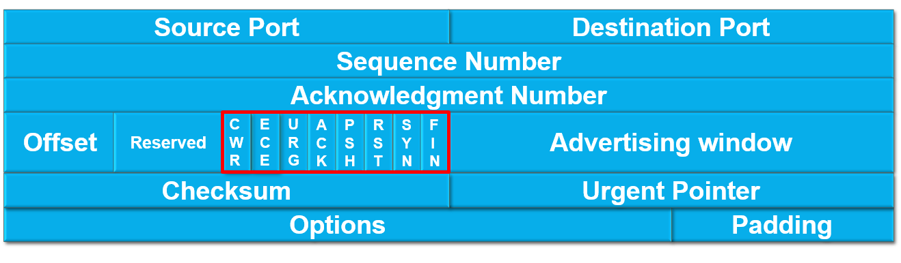
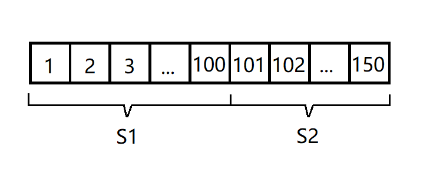
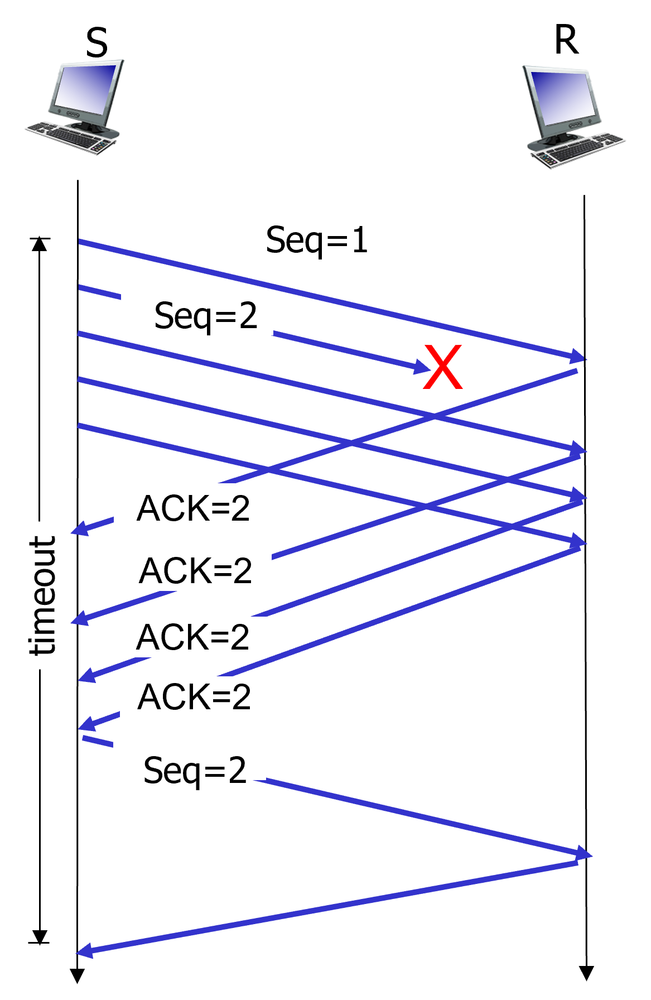
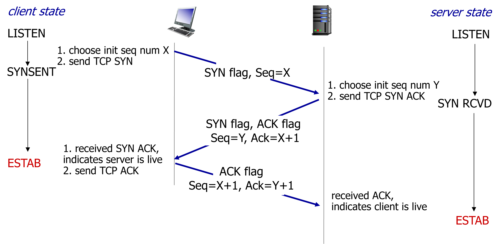
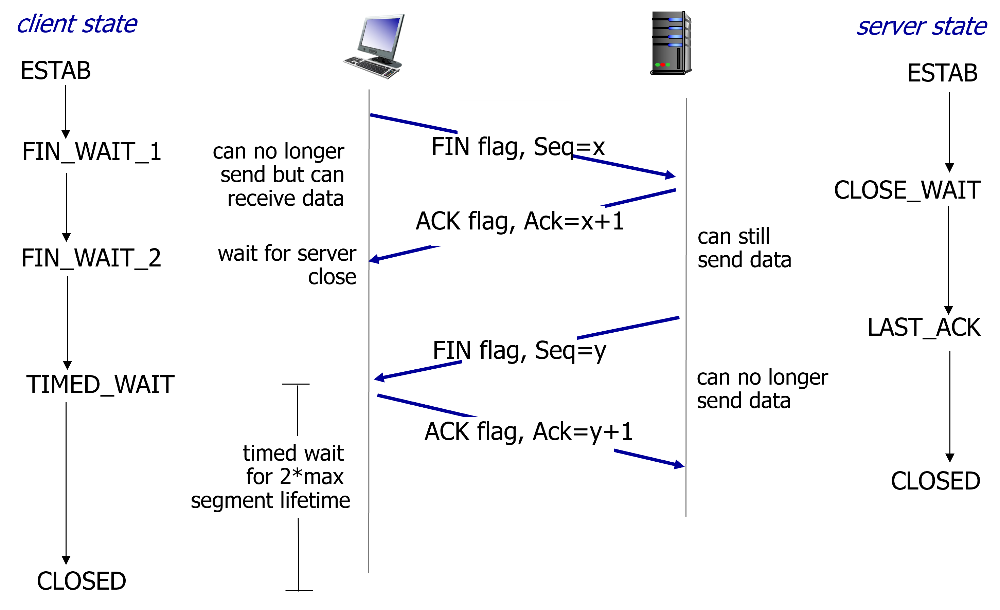

# TCP协议简介

全程Transmission Control Protocol，即传输控制协议。

TCP有如下特点：
- 面向连接：使用TCP协议，传输前需要建立连接，传输后需要终止连接，且全程为一对一传输。
- 可靠：能处理丢包、传输出错的问题。
- 字节流：一次可传输多份数据，传输的数据按字节分出先后顺序，需要接收方按顺序处理。

一般而言，应用层需要传输的数据都比较大，在使用TCP协议来传输时会将数据分成多个部分依次传输，因此一般每份TCP报文中承载的数据都是不完整的，这也是为何TCP报文被称为报文段（segment）。

# TCP报文格式
每份segment被分为header部分和数据部分，数据部分承载应用层的数据，最短为0（也就是没有数据部分，只有header）。header部分为下图的六行构成，其中前5行每行4字节。第6行为可选项，最短为0，最长40字节。因此整个header最短为20字节，最长可到60字节。

## Port
记录来源端口号和目标端口号，均为16bit，端口号范围为0到65535。

## Sequence Number（序列号）
用于标记各个segment，从而区分数据的先后顺序。

在一次完整的TCP传输中，数据可能被分成多个segment进行传输，每个segment的序列号，就由该segment承载的这部分数据的首个字节，在完整数据中的位置决定。

如图，假设一共要传输150字节的数据，分成了两个Segment，第1个segment含100字节的数据，其序列号为1；第2个segment含50字节数据，序列号为101。如果还有第3个segment，则其序列号应为151。

有人可能会问，为啥不直接每个segment序列号+1，岂不是更简单方便？实际上，在传输过程中接收方不可能总是按顺序接收segment，有可能第2个比第1个先行抵达。在这种情况下，接收方通过segment的序列号可以知道当前收到的segment前面还有多少字节的数据，从而可以提前留出空位，方便数据的拼接与处理。
## Acknowledgment Number（确认号）

接收方收到了segment后，会回复一个segment给发送方，这个回复的segment中的确认号一般为期望下一个收到的segment的序列号。继续沿用上面的例子，接收方收到了第一个segment后，回复的segment的确认号为101。接收方收到第二个segment后，回复的segment的确认号应为151。

除了最初建立连接和最后断开连接的几个特殊segment，一般来说双方（假设为A和B）发送的每个segment都会有设置好的序列号和确认号。A发送的segment的序列号用于声明该segment在发送给B的所有segment中的位置（顺序），同时确认号用于告知B其下一个期望收到的segment的序列号，反之亦然。
## Offset与Reserved
Offset共4bit，用于描述该header的大小，单位为“4字节”。举个例子，假如Offset的值为6，则表示header大小为6乘以4字节等于24字节。

Reserved共4bit，为保留位，目前暂时没有用处，未来TCP协议拓展新功能时可使用此位置来实现。
## 控制位（红色框框）
简单来说每个控制位是一个1bit的flag，当某个flag设为1，表示报文具有该flag对应某种特征。目前一共有8个控制位，下面介绍几个常用控制位的具体含义：
- URG：表示TCP报文的数据部分有紧急数据，需要接收方优先处理。header中的Urgent Pointer部分会指出这些紧急数据在数据部分中的位置。
- ACK：表示当前报文为应答报文。一般来说，除了期望建立连接的SYN报文，其余报文都是应答报文。
- PSH：希望接收方应尽快将当前segment交给应用层。
- RST：表示 TCP 连接中出现异常必须强制断开连接。
- SYN：表示期望与对方建立连接，并为序列号设定初始值。
- FIN：表示希望断开连接。当发送完含FIN的报文后，除了回复报文，发送方将不再发送任何TCP报文。

## Advertising Window
用于TCP Flow Control机制，后文会详细讲解。
## Checksum
校验和，用于检验传输的数据是否完整无误。在TCP报文发出前，会根据报文计算出校验和并填充到Checksum中。校验和的计算方法根据不同的RFC标准也略有不同，这里不作赘述。
## Options与Padding
Options为可选字段，无固定长度（最小为0，最大为40字节），用于在header中传输一些额外的控制信息，可使TCP协议更灵活。Padding则为填充位，由于描述header大小的Offset的单位为4字节，Padding就需要将header的长度补充到4字节的倍数。
  

# TCP中实际使用的RDT模型
TCP实际采用的RDT模型实际上比较复杂，发送方的行为机制与Go-Back-N比较类似，但在一些细节上不同。例如，通信双方采用的序列号和确认号都是通过segment的字节数确定，而不是简单的按segment的数量累加。接收方的行为机制与Selective Repeat类似，在收到乱序的segment时不会丢弃，而是缓存下来等待缺失的segment。因此，接收方也需要维持一个窗口来管理这些segment，但在回复上，还是采用cumulative ACK机制。

实际上，RFC对TCP如何实现RDT并没有非常具体的规定，下面将介绍普遍采用的一些RDT机制。下文将发送方简称为S，接受方简称为R。
## 超时重传
S在发送segment的同时，会启用一个计时器，若在既定时间内没有收到R回复的ACK，则会重传segment。那这个“既定时间”（准确来说，这个时间称为Retransmission Timeout，简称RTO）具体应该如何确定？

首先我们要计算一个segment正常来回所用的时间（也就是Round-Trip Time，简称RTT）。考虑到网络波动，每次传输的RTT不是一成不变的。对此，一般对最新采样的RTT和历史估算的RTT计算exponential weighted moving average来估算当前的RTT：

$RTT_{estimate} = (1-\alpha)RTT_{old\_estimate} + \alpha RTT_{sample}$，在Linux中$\alpha=0.125$。

RTO要比最新估算的RTT略长，这个略长的时间就是网络波动可能造成的延迟。该延迟的计算与RTT类似，也是通过计算最新采样的延迟与历史估算的延迟的exponential weighted moving average得出：

$RTT_{dev} = (1-\beta)RTT_{old\_dev} + \beta(RTT_{sample}-RTT_{estimate})$，在Linux中$\beta=0.25$。

最后我们得到：

$RTO = RTT_{estiamte} + \sigma RTT_{dev}$，一般$\sigma=4$

## 快速重传
当S在正常收到某个ACK后，又连续收到三个相同的ACK。这个时候就需要重传该ACK对应segment，而无需等待计时器超时再重传。

举个例子，假设每个segment为1字节，S发送了5个segment，序列号分别为1、2、3、4，5，其中segment 2丢失。R之后的回复的segment的确认号分别为2、2、2，2。正常来说，S收到的第一个确认号为2的segment是对segment 1的回应。但之后又连续收到了3个相同的ACK，这就说明大概率segment 2丢了。

考虑到网络波动，segment 2有可能会延迟到达，这就会让S连续收到多个确认号为2的回复。但要是连续收到3个相同ACK，说明segment 2后面的三个包都抵达R了，但segment 2还没抵达R，那就说明大概率丢包了，所以S直接重传即可。

## Flow Control
S和R都要各自维持一个窗口，但这个窗口大小不是一成不变的。在实际传输中，一般要求S的窗口不能比R的窗口大，否则S发送的segmetn将淹没R，造成网络拥堵与资源浪费。因此，R在回复S的segment中，会通过Advertising Window字段来告知S方，自己剩余窗口大小（也就是还能接受多少字节的segment），S收到该segment后会动态调整自己的窗口大小，来匹配R的接收能力。

## SACK方法
即Selective Acknowledgment（选择性确认），该方法是一种可选的优化手段。R可以在回复报文的Options字段中告知S自己实际收到了哪些segment，这样如果重传机制触发，S就只需要重传R没收到的部分即可，从而降低网络负载。

按照上面快速重传的例子，不启用SACK的情况下，S遵循Go-Back-N模型，要重传序号为2到5的这4个segment。如果启用了SACK，R在收到segment 5后，在回复的报文中就可告知S自己收到了segment 3、4、5，这样一来S就只需要重传segment 2。

## 延迟应答（Delayed ACK）
该方法同样是一种可选的优化手段。当R接收到期望的segment后（假设为segment K），R不会立即回复ACK，而是等待一小段时间。假如在等待时间内，又收到了新的segment K+1，则R会直接回复ACK K+1，从而节省带宽。如果等待时间内无新的segment进来，则R会正常回复。如果一开始就收到了乱序的segment，或者在等待过程中收到了乱序的segment，则会立即以cumulative ACK的方式回复。

延迟应答一般最多仅为两个segment合并成一个ACK进行回复。简单来说，就是一段时间内凑够两个人立即发车（不会等第三个人），要是这段时间内就只来了一个，到点了也得发，不能再等。

  

# TCP连接机制
## 建立连接：三次握手
在实际进行通信之前，双方需要通过3-way handshake（三次握手）来建立连接。下面将通信双方称呼为client与server。

### 第一次握手：SYN
client发起TCP连接，向server发送SYN segment。client为该segment随机生成一个序列号（假设为X），并设置SYN flag。该segment不携带数据，仅有header部分。
### 第二次握手：SYN ACK
server一直监听某个端口，这时候收到client发来的segment，之后准备回复SYN ACK segment。server同样为该segment随机生成一个序列号（假设为Y），将确认号设为X+1，并设置SYN和ACK flag。该segment同样不携带数据，仅有header部分。
### 第三次握手：ACK
client收到server的回复报文后，发送ACK segment。该segment序列号设为X+1，确认号设为Y+1，并设置ACK flag。该segment可以携带数据，双方之后正式建立连接，可以开始正常TCP通信。

## 三次握手的意义与作用

### 检验通信双方的收发能力
第一次握手，server收到SYN segment后，知道自己有接收能力。

第二次握手，client收到SYN ACK segment后知道自己有接收能力，同时也知道自己之前发出去的SYN segment被正常接收，说明自己的发送能力没问题，且client --> server的信道是正常的。

第三次握手，server收到client的ACK segment，知道自己之前发出去的SYN ACK segment被正常接收，说明自己的发送能力没问题，且server --> client的信道是正常的。

### 保证双方都能初始化segment序列号
正常的三次握手，能保证双方都初始化序列号且让对方对该序列号的segment作出应答。如果仅通过“两次握手”建立连接，server通过SYN ACK segment初始化其序列号后client就不会有应答了，无法保证序列号被可靠地初始化了。

那有人可能会问，这序列号为啥一定要初始化，甚至还要随机化初始该序列号？

首先，如果每次通信不随机初始化序列号，黑客就很容易通过序列号来冒充segment进行攻击；

其次，随机化的初始序列号可以保证不被之前的历史通信干扰。假设双方不初始化序列号。当双方三次握手后client仅发出了一个segment，之后由于某种原因双方重新三次握手建立连接。但此时，之前发出的segment延迟抵达了server。server并不知道该segment是上一次三次握手后的segment还是本次三次握手后的segment（因为在不初始化序列号的情况下，双方正常通信的第一个segment序号都是恒定的），这会导致数据混乱。

### 保证通信不被历史握手影响
假设通信双方仅通过“两次握手”建立连接，所有client发送的无效的SYN segment都会让server建立TCP连接，白白浪费资源。但在三次握手的情况下，即使server回应了无效的SYN segment，client也不会进行第三次握手，从而避免server单方面建立了TCP连接。

无效的SYN segment可能是由于client发送时延迟抵达了（严重延迟，以至于client通过重发的SYN segment与server建立连接了，这个无效的SYN segment才抵达server）。

## 断开连接：四次挥手
由于TCP协议采用全双工通信，因此要断开连接，需要在两个信道各执行一次请求与应答。

### 第一次挥手
假设client希望断开连接，则client主动发起四次挥手，client会发送FIN segment，该segment中设置了FIN flag。

当client发送FIN segment后，client就无法再向server发送任何数据了。首先要注意，如果client之前发送的一些segment没有收到相应的回应，在发了FIN segment之后依然有可能重传这些segment。其次要注意，client在发了FIN之后，只是不发新数据了，FIN ACK这种segment还是会发的。再次，client只是关闭了发送能力，其仍可以从server处接收数据。
### 第二次挥手
server收到了FIN segment后，回复一个FIN ACK segment，该segment中设置了ACK flag，且该segment的确认号要比FIN segment的序列号大1。

### 第三次挥手
当server这边该发的数据都发完了，就会开始第三次挥手。同理，server向client发送FIN segment，该segment中设置了FIN flag。

同理，发完FIN segment后，server也法再向client发送任何数据了。
### 第四次挥手
client收到了FIN segment后，回复一个FIN ACK segment，该segment中设置了ACK flag，且该segment的确认号要比FIN segment的序列号大1。

主动发起四次挥手的一方（即上文中的client）在第四次挥手后，会等待2倍的报文最大生存时间（Maximum Segment Lifetime）后才完全进入关闭状态。原因有以下两点。

一是为了防止历史数据影响下一次双方的正常通信。假设在第二次挥手后，server向client发送了一些数据，万一这些数据延迟抵达，直到双方通信关闭又重新三次挥手开启后才抵达client，可能会影响到数据传输。因此client需要等待足够久的时间，保证这些“流浪”的segment都被路由丢弃了才进入关闭状态。

二是为了留够足够的时间让server接收第四次挥手的ACK segment。因为该segment有可能丢失，这种情况下server会重发第三次挥手的FIN segment，client在这段时间内就可以重新进行第四次挥手，让双方都得以正常关闭通信。

