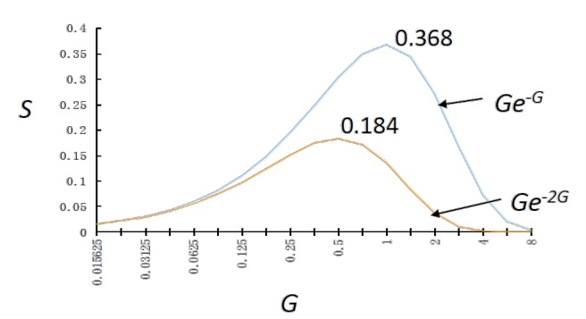

# 无线通信简介
##  无线通信流程

如图，信源首先将要发送的信息给到Transmitter（发射机）中，发射机将信息转换为模拟信号发射出去，这些信号在信道中传播（例如在某个无线电频段上传播），Receiver（接收机）持续侦测某个信道，收到了这些信息，它再经过一系列转换后得到原始信息，转送给信息接收方。

上述过程中涉及到了数字信号与模拟信号的相互转换。这个过程在Transmitter、Receiver或者Transceiver(无线电收发两用机)中进行。

### Transmitter
Transmitter由Encoder（编码器）和Modulator（调制器）构成。其中编码器用于选择最佳的传输信号的形式，以方便传播与接收，而调制器就是根据编码器确定的信号样式把待传输的原始信号调制成对应形式的模拟信号。

在这里，我们将待传输的原始信号称为基带信号（baseband signal），或者称为modulating signal。基带信号一般是频率较低的信号，但在信道上传输的一般为高频信号。这时我们就需要一个初始高频信号（在这里称为载波（carrier signal）），我们通过调制载波，得到一个已调制信号（modulated signal）。modulated signal并不是规律的正弦波，它的幅度或频率等特性会随着时间变化，这个变化与原基带信号随时间的变化一致，这样一来接收方接收到该modulated signal后，可通过解调还原回原来的基带信号。

### Receiver
Receiver由Demodulator（解调器）和Decoder（解码器）构成。把在信道中传输的模拟信号还原成原始信号。

既能编码又能解码的机器称为Codec(编解码器)，而既能调制信号又能解调信号的机器称为Modem(调制解调器)。

### 为何要调制信号

或者说，为什么要把低频的原始信号调制到高频信号？主要有以下几个原因：

1. 由于$\lambda = c / f$，频率越高，波长越短。发射的信号波长越短，所需要的天线尺寸也就越小。

2. 高频信号一般穿透力更强，更易定向与接收。

3. 频率越高，单位时间内的信号就能容纳更多的信息。换句话说，拓展信号的带宽，信道容量更大。

4. 在高频传输信号可以减小或避免频道间的干扰。

5. 多个低频信号可以调制到不同频率的高频信号，从而实现同时传输

## 无线电调制方式
一般有AM、FM、PM三种调制方式。

### 调幅（amplitude modulation，简称AM）
modulated signal的幅度与基带信号随时间的变化一致。

假设基带信号可以表示成一个关于时间的函数$m(t)$，对于载波$c(t) = A_c \cos 2\pi f_c t$，经过AM调制后得到的modulated signal为：$u(t) = A_c[1+m(t)]cos 2\pi f_c t$

上图展示了三种信号的图像，这里引入包络（envelope）的概念。信号图像中各个峰值组合成的曲线（即图中虚线）即为该信号的包络。可以看到，AM调制后的modulated signal，其包络与基带信号几乎一致。

### 调频（frequency modulation，简称FM）

modulated signal的频率与基带信号随时间的变化一致。对于基带信号$m(t)$及载波$c(t) = A_c \cos 2\pi f_c t$，经过FM调制后得到的modulated signal为$u(t) = A_c cos (2\pi f_c t + 2\pi k_f \int_0^t m(\tau)d\tau)$，其中$k_f$为频率偏移常数。

### 调相（phase modulatio，简称PM）

modulated signal的相位与基带信号随时间的变化一致。同理，对于基带信号$m(t)$及载波$c(t) = A_c \cos 2\pi f_c t$，经过PM调制后得到的modulated signal为：$u(t) = A_c cos (2\pi f_c t + k_p m(t))$，其中$k_p$为相位偏移常数。

如图为某种基带信号和载波经过调频和调相后的图像。

## 无线通信方式

Simplex（单工通信）：单向通信，一方只能给另一方发送信息，反过来不行。一般用于数据采集系统，如气象数据站、计算机和打印机的通信等

Half-duplex（半双工通信）：双向通信，但同一时间只能是一方给另一方发送信息，如对讲机系统。

Full-duplex（全双工通信）：双向通信，且双方都能同时收发信息。

  

# 无线传输优化

## 多路复用（Multiplexing）
简单来说，多路复用技术就是研究如何榨干单一信道的通信能力，让它能同时发送多个用户的信息。

### 频分复用（Frequency Division Multiplexing Access，FDMA）
对于某个频段的信道，将该信道细分成多个子信道，每个子信道对应着一个更细分的频段，每个用户的信号都在其对应频段的子信道中传输。为了防止相互干扰，相邻的子信道其对应频段并不相邻，两频段中间还隔着一定的频段。

### 时分复用（Time Division Multiplexing Access，TDMA）
对于某个频段的信道，将该信道的服务时间切成多个时间段（slot），当有用户使用该信道时，会分配到某个时间段去使用，在这个时间段中，该用户独享整个信道。同理，为了防止某些用户可能产生的延迟从而导致多用户同时使用信道，时间段在划分时中间会留出一小段空白的时间。

TDMA类似于会议室预约，预约了某个时间段的用户可独享整个会议室。

### 码分多址（Code Division Multiple Access，CDMA）

假设有一群人在聊天，中国人在用汉语聊，日本人在用日语聊，美国人在用英语聊，虽然整个地方非常嘈杂，但是每个人都能自动从嘈杂的背景音中识别出自己能听得懂的那种语言。

另外我们知道，一个正交二维向量蕴含了两种信息，通过对X轴投影得到一种，通过对Y轴投影得到另一种。

实际上，码分多址通过与上述两种概念类似的技术，实现了在单一信道中同时传递多个用户的信号。码分多址技术将多个用户的信号调制成一个多维正交向量（即“嘈杂的背景音”），每个用户对应的信号要通过将该多维正交向量向该用户对应的坐标轴进行投影才能得到（实际上每个用户使用自己的PN code（每个用户的“母语系统”）来从信道中解调出自己需要的信息）。

### 正交频分多址（Orthogonal Frequency Division Multiple Access，OFDMA）
正交频分多址结合了以上多种技术，将信道通过频率、时间以及Code进行多维度的细分，细分后的信道的每一块被称为资源单元（Resource Unit），每个用户被调配使用其中若干个资源单元。

如图表示以上四种多路复用技术，不同颜色表示不同的用户。

## 载波聚合（Carrier Aggregation）
载波聚合就是在划分的载波资源带内，将空闲的载波段或在不影响别的数据进行通信的载波资源拿来，用于特定的数据传输，以满足单用户对峰值速率和系统容量提升的需求。在LTE系统内，我们可以将2~5个20MHz的载波段进行聚合，最大实现100MHz的载波带宽。当然实际使用中具体使用多少个载波段进行聚合，还要根据用户数据传输的实际需求进行调整。

## MIMO

简单来说就是发射方使用多个天线，接收方也使用多个天线，来提高信号传输的效率和稳定性。

  

# 无线传输协议
## Aloha协议
### 简介
上世纪70年代开发出的一种数据链路层的协议，一开始用于夏威夷各群岛间计算机网络的单信道无线通信。

最初的Aloha协议非常简单，发送方有packet发送需求时，无需任何顾虑直接将packet发送到信道。如果在一定时间内没有收到ACK回复，说明可能信道被占用（毕竟就一个信道），单发送方不会立刻重发（避免信道的持续占用），而是会等待一个随机的时间长度后再重发。

### 吞吐量与延迟分析
#### 变量设置
每个packet的传输时间$X$：等于packet长度除以传输速率，在这里一般视为单位时间；
负载$G$：每$X$个时间单位平均尝试发送packet的次数；
吞吐量$S$：每$X$个时间单位平均成功发送的packet数量；
平均等待时间$B$：当传输失败后，发送方启动下次传输前平均需要等待的时间；
单向传输的平均延迟$t_{prop}$；

#### 吞吐量分析
在$2X$时间段内平均会发送$2G$次传输，则发生$k$次传输的概率$P$服从泊松分布，即：$P = \frac{(2G)^k}{k!}e^{-2G}$

当一个在$t_0$时间点发送的packet能成功传输，说明从$t_0-X$一直到$t_0+X$这段长达$2X$的时间内都没有别的packet在传输。在$k=0$的情况下，可计算出吞吐量$S=GP =Ge^{-2G}$

通过以下$G$与$S$的函数图像可知，当$G=0.5$时达到最大吞吐量$1/2e$。

#### 延迟分析
若要成功发送一次packet，平均需要尝试传输的次数等于$G/S=e^{2G}$

也就是说，在成功发送一个packet之前，平均需要$e^{2G}-1$次失败的传输

一次成功的传输只需耗费$X+t_prop$的时间，但一次失败的传输需要耗费$X+B+2t_{prop}$（$t_{prop}$乘以2是因为发送时的延迟加上对方回传的ACK的延迟）。

成功发送一个packet平均需要的时间$E = X + t_{prop}+ (e^{2G}-1)(X+2t_{prop}+B)$

## 时隙Aloha协议（Slotted Aloha）
将发送时间离散化为一个个等长的时间片（time slot），终端只能在某个时间片开始时发送，而不是像纯Aloha协议一样，想啥时候发就啥时候发。

时隙Aloha协议的吞吐量为$S = GP = Ge^{-G}$，当$G=1$时有最大$S = 1/e$

## CSMA
即载波监听多路访问协议（Carrier Sense Multiple Access）。

CSMA系列的协议用于以太网的单信道无线通信。CSMA是其中一个较早版本的协议。

CSMA协议简单来说，就是当用户要传输信息时，首先需要监听信道，若信道空闲才发送。CSMA减少了多个用户传输时冲突发生的次数，但是并不能完全杜绝冲突。

## CSMA/CD
带有Collision Detection的升级版CSMA。简单来说就是某用户等到信道空闲时才传输，一边传输一边监听信道，如果发现有冲突，则冲突的双方都停止发送，并等待一段时间后重新监听信道，再决定是否发送。
## CSMA/CA
带有Collision Avoidance的升级版CSMA。
  

# 功率信号/能量信号

# 参考资料与部分图片出处

[FDMA 和 OFDMA 的区别是什么？](https://www.zhihu.com/question/27837545/answer/1632122352)

[MIMO是什么？](https://zhuanlan.zhihu.com/p/41520064)

[载波聚合是怎么实现的，原理是什么？](https://www.zhihu.com/question/531660040/answer/2474499998)

[还不懂什么是 CSMA/CD 协议 ? 看这篇文章就够了](https://blog.csdn.net/weixin_43941364/article/details/105639195)