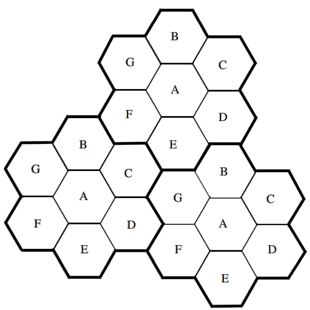
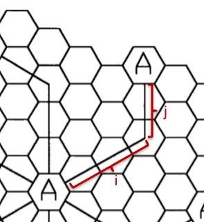
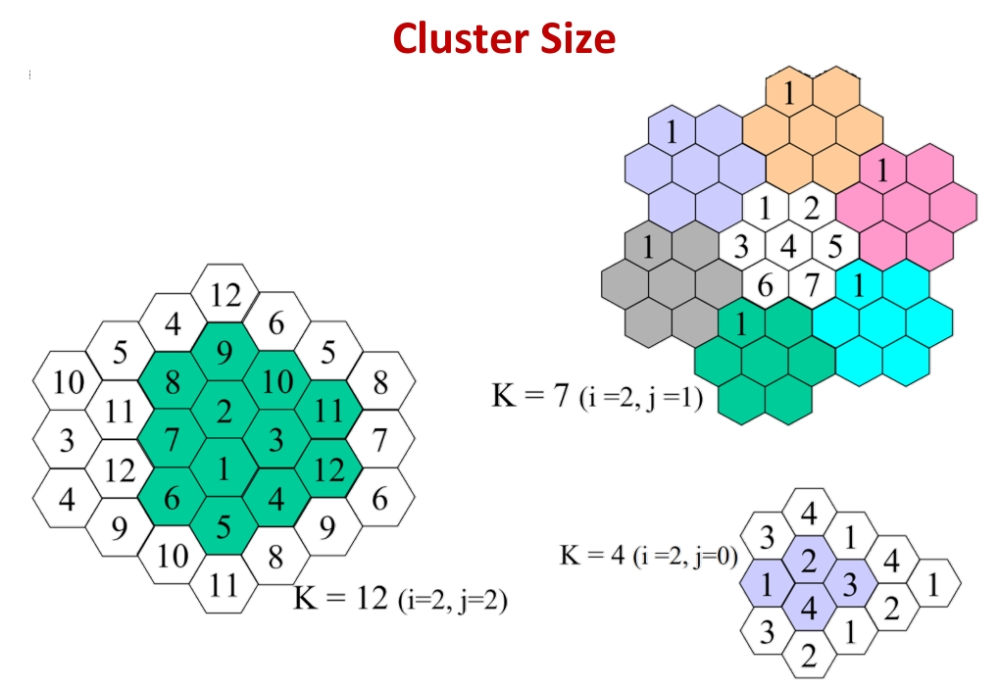
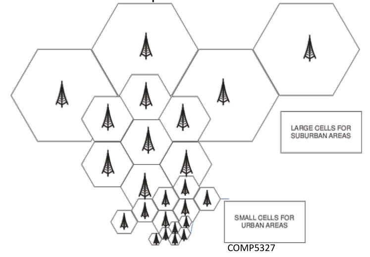
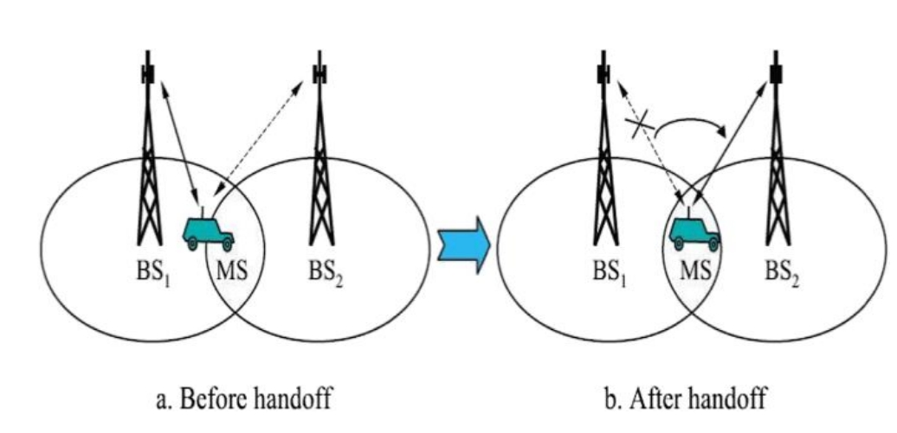

# 蜂窝网络简介
为了解决早期移动电话信道短缺以及同信道干扰的问题，提出了Cellular Network：

如图，区域被分成多若干个六边形，每个六边形称为“cell”。加粗黑线框起来的区域称为“cluster”，如图所示七个cell组成一个cluster。每个cluster的size即该cluster中cell的个数。

假设该区域总信道数量为$S$，cluster size为$N$，则每个cell会被分配$k=S/N$个信道。如图，相同字母的cell使用的信道完全一样，相邻cell使用的信道完全不一样，这样避免了同区域下信道复用产生的干扰问题。

## cell距离与cluster size的关系

如图，使用类似曼哈顿距离的形式来定义两个cell之间的距离。如果使用相同信道的最近的两个cell的距离为$(i,j)$，则cluster size为$N = i^2+ij+j^2$。

cluster size一般可取4、7、12，一般size越小，使用相同信道的cell的距离就越近。

## cell splitting

cell大小实际上也可变动。例如，郊区通话用户少，则cell可设得更大一些，城市用户多，cell设得更小一些

## handoffs

当用户在cell之间移动时，可以采用如下方式实现无缝切换信道：

当用户进入MS范围中，就与BS2 cell连接。当该连接建立后，才切断与BS1的连接。

## 用户归属地查询

当用户A call 用户B时，Cellular Network如何确定用户B在哪个cell里面呢？这主要是通过HLR （Home Location Register）和 VLR（Visitor Location Register）实现。

首先，每个用户的手机号都会有归属地，假如用户B的手机号是上海移动的归属地，则上海移动公司会保存该手机号的所有信息。也就是说，上海移动公司的HLR中记录了所有号码归属地为上海移动的手机号信息。

当用户B在某地开机后，其手机会向当地的Cellular Network注册，当地网络会经过层层查询，找到用户B手机号的归属地，然后当地Cellular Network会告知上海移动公司用户B目前所在地（也就是VLR信息）。

当用户A call B时，A经过层层查询同样先会找到上海移动公司，上海移动公司则将用户B的VLR告知A，A就能联系到B了。

  

# 1小时36分